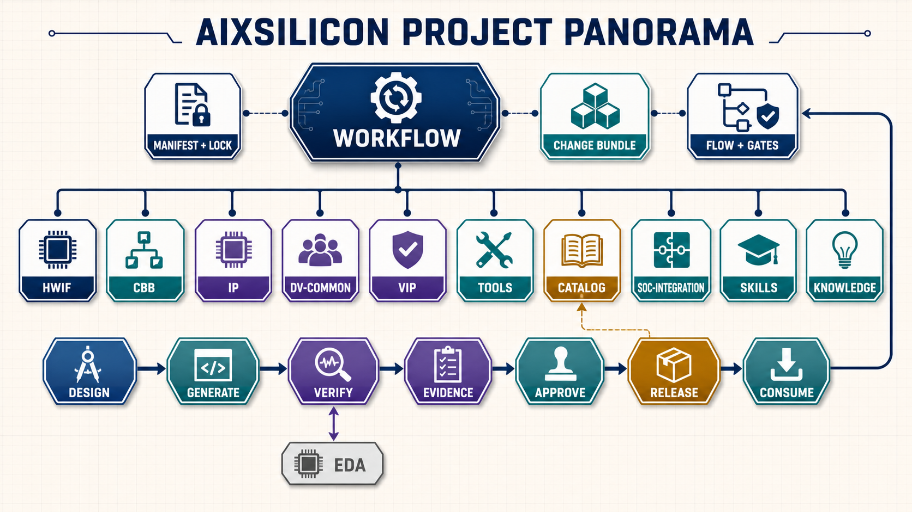

# AIXSILICON Workflow

`aixsilicon_workflow` 是 AIXSILICON 硬件工程资产体系的 **多仓工作区控制面**。它不是新的源码汇总仓、镜像仓或最终 SoC 工程仓，而是统一解决以下六类问题：

1. 按清单把多个 Git 仓库下载到固定目录；
2. 让每个子仓保持独立 Git 历史、分支、PR、Tag 和 Release；
3. 用 Manifest 与 Lockfile 描述“需要哪些仓库”和“本次实际用了哪个提交”；
4. 自动生成 FuseSoC libraries、工具配置与开发态本地覆盖；
5. 执行跨仓依赖检查、影响分析、联合验证与发布协调；
6. 为 Skill Suite 提供统一、可发现、可复现、可留证的执行环境。

> 统一材料入口见 [`docs/index.md`](docs/index.md)，跨仓路线图、统一任务台账与里程碑进度分别见 [`docs/roadmap.md`](docs/roadmap.md)、[`docs/todo.md`](docs/todo.md) 和 [`docs/progress.md`](docs/progress.md)。本文档覆盖框架结构、安装、快速开始与核心概念。
> 优化后的目标架构见 [`docs/architecture/target-design.md`](docs/architecture/target-design.md)；当前运行配置仍遵循已接受的 v1 契约，待 ADR-0007/0008 审核后迁移。

> **Skill 集中管理**：`aix` CLI 的 canonical 源码/测试/脚本由私有 skill `aixsilicon-workspace-management` 统一管理；本仓库通过 [`bootstrap.py`](bootstrap.py)（纯标准库引导器）下载 skill repo 并把 skills 物化到 `/.roo/skills/`（git 忽略）后运行。首次使用：`uv sync` + `uv run python bootstrap.py --ensure`，之后 `uv run aix <cmd>` 或 `uv run python bootstrap.py aix <cmd>`。



全景图将项目分为控制面、十个平级资产仓和工程交付闭环：Workflow 通过 Manifest/Lock、Change Bundle 与 Flow/Gates 组织协作；EDA 只作为验证阶段的外部 Provider；Evidence 经人工审批后进入 Release 与 Catalog，并由消费反馈驱动下一轮工作。图中的连线用于解释职责和生命周期，不代替 [`manifests/default.yaml`](manifests/default.yaml)、[`ownership-map.yaml`](ownership-map.yaml) 或 [`workflows/`](workflows/) 中的精确依赖、所有权与执行定义。

## 推荐技术形态

> **Manifest 驱动的多仓工作区 + 独立 Git Clone + 统一 Python CLI + FuseSoC 聚合配置 + Change Bundle + GitHub Actions 协调层**

默认不采用 Git Submodule。子仓统一克隆到 `repos/`，而 `repos/` 被父仓 `.gitignore` 完整忽略；父仓只版本化 Manifest、Lockfile、Schema、流程定义、公共 CI、脚本和文档。

## 仓库生态

| 逻辑 ID | 仓库 | 定位 | 开放性 |
|---|---|---|---|
| hwif | [`aixsilicon_hwif_repo`](https://github.com/boyangwang1991-design/aixsilicon_hwif_repo) | 接口语义契约与 HDL 多视图 | 开源 |
| cbb | [`aixsilicon_cbb_repo`](https://github.com/boyangwang1991-design/aixsilicon_cbb_repo) | 可参数化公共逻辑构件与 PPA 实现 | 开源 |
| ip | [`aixsilicon_ip_repo`](https://github.com/boyangwang1991-design/aixsilicon_ip_repo) | 可独立集成和发布的完整 IP | 开源 |
| dv-common | [`aixsilicon_dv_common`](https://github.com/boyangwang1991-design/aixsilicon_dv_common) | 协议无关验证公共底座 | 开源 |
| vip | [`aixsilicon_vip_repo`](https://github.com/boyangwang1991-design/aixsilicon_vip_repo) | 协议与系统验证组件 | 开源 |
| tools | [`aixsilicon_tool_repo`](https://github.com/boyangwang1991-design/aixsilicon_tool_repo) | 确定性生成、检查、转换、打包工具（私有；交付件随公开资产仓开源） | **私有** |
| catalog | [`aixsilicon_catalog_repo`](https://github.com/boyangwang1991-design/aixsilicon_catalog_repo) | 已发布资产索引、兼容矩阵和成熟度 | 开源 |
| soc-integration | [`aixsilicon_soc_integration`](https://github.com/boyangwang1991-design/aixsilicon_soc_integration) | 通用 SoC 集成 Schema、模板、规则 | 开源 |
| skills | [`aixsilicon_skill_repo`](https://github.com/boyangwang1991-design/aixsilicon_skill_repo) | AI 辅助研发 Skill Suite（私有） | **私有** |
| knowledge | [`aixsilicon_chipknowledge`](https://github.com/boyangwang1991-design/aixsilicon_chipknowledge) | 芯片研发知识库（方法论/术语/参考索引） | 开源 |

> 仓库布局与分支策略见 [`manifests/default.yaml`](manifests/default.yaml)；工作区环境引导（uv/git/仓库清单/skills 物化）由私有 skill `workspace-bootstrap` 统一管理。

## 治理与命名规范（V0.2）

跨仓契约统一决议见 ADR 与配套规范（2026-08-13）：

- **VLNV 统一 `aixsilicon:*`**（[`ADR-0003`](docs/adr/0003-unified-vlnv-namespace.md)）；CLI 二进制名保持 `aix`；
- **单一 CLI 入口 + 插件组 `aixsilicon.commands`**（[`ADR-0004`](docs/adr/0004-cli-entry-and-plugin-registry.md)）：`aix tool` 由 `aixsilicon_tool_repo` 插件提供，未安装时显式 `OPTIONAL_UNAVAILABLE`；
- **跨仓边界映射**（[`ADR-0005`](docs/adr/0005-cross-repo-boundary-map.md)）、**工具归属与迁移**（[`ADR-0006`](docs/adr/0006-tool-ownership-and-migration.md)）；
- **Schema、仓库与工具归属**：[`docs/workflow/ownership.md`](docs/workflow/ownership.md)；
- **成熟度、Gate 与发布**：[`docs/workflow/release.md`](docs/workflow/release.md)；
- 历史综合优化依据：[`docs/reference/cross-repo-optimization-plan.md`](docs/reference/cross-repo-optimization-plan.md)（不维护当前状态）。

## 快速开始

### 前置条件

- Python 3.11+
- Git 2.30+
- 可选的 [FuseSoC](https://fusesoc.readthedocs.io/)（用于构建设计依赖）

### 安装 CLI

```bash
# 使用可编辑安装以在开发过程中生效
python -m pip install -e ".[dev]"

# 或直接使用模块入口
python -m aixworkflow --help
```

### 初始化工作区并按 Profile 同步

```bash
# 初始化（首次执行自动创建 repos/ 与本地状态目录）
aix wf init --profile ip-dev

# 同步全部所需仓库（clone / fetch / checkout）
aix wf sync

# 只同步某个仓库
aix wf sync --repo hwif

# 切换到 SoC 集成 Profile 并重新同步
aix wf sync --profile soc-integration

# 按正式 Lockfile 重建
aix wf sync --lock locks/releases/aix-bundle-1.0.0.lock.yaml
```

### 查看状态与诊断

```bash
aix wf status          # 汇总各仓状态（branch / HEAD / baseline / dirty / remote）
aix wf status --dirty  # 只显示 dirty 的仓库
aix wf doctor          # 环境与依赖诊断
aix wf graph           # 输出依赖图
aix wf diff --against locks/baseline.lock.yaml
```

### 生成解析锁

```bash
aix wf lock --output .aix/local.lock.yaml
```

### 单仓 Git 操作

```bash
aix repo status vip
aix repo branch vip feature/apb-wait-state
aix repo commit vip -m "feat(apb): support wait-state coverage"
aix repo push vip
aix repo shell vip
```

`aix repo` 只是安全的路径定位和检查包装；commit 只作用于指定子仓，父 Workflow Repo 不会因子仓 commit 产生待提交内容。

## 目录结构

```text
aixsilicon_workflow/
├── manifests/            # 各 Profile 工作区清单
├── locks/                # baseline 与 release 锁文件
├── overrides/            # 本地覆盖（local.yaml 被忽略）
├── schemas/              # Manifest/Lock/Bundle/Flow/Profile/Evidence JSON Schema
├── workflows/            # 跨仓 Flow 定义
├── changesets/           # Change Bundle 目录
├── policies/             # 依赖/兼容/分支/发布/证据/安全策略
├── toolchains/           # 工具链 Profile 与容器定义
├── templates/            # 元数据、Bundle、Release、PR 模板
├── src/aixworkflow/      # aix Python CLI
├── tests/                # 单元 / 集成 / fixtures / golden
├── docs/                 # 文档与 ADR
├── .github/              # Reusable workflows 与 actions
│
├── repos/                # 运行时克隆的独立 Git 仓（完整忽略）
├── build/                # 统一构建输出（完整忽略）
├── reports/              # 本地报告（完整忽略）
├── cache/                # 下载与 EDA 缓存（完整忽略）
└── .aix/                 # 本地状态与生成配置（完整忽略）
```

## 核心概念

| 对象 | 回答的问题 |
|---|---|
| [Workspace Manifest](docs/workflow/manifest.md) | 当前工作区需要克隆哪些 Git 仓库，放在哪里，使用何种开发分支或版本策略 |
| Workspace Lockfile | 本次实际解析到了哪些 Git SHA、VLNV、工具版本和生成器版本 |
| Local Override | 开发者本地临时替换（VIP 依赖未合入的 HWIF 分支等） |
| Change Bundle | 本次跨仓变更由哪些分支/PR 组成，验证和合并顺序是什么 |
| Flow | 每条流程的输入、Stage、Gate 和输出（DAG） |
| Evidence | 任何结论如何被版本、工具、日志和报告重建 |

## 质量 Gate（G0～G7）

| Gate | 名称 | 内容 |
|---|---|---|
| G0 | Repository Hygiene | Schema 通过、路径无逃逸、无子仓源码、无 Secret/大文件 |
| G1 | Workspace Resolution | required 仓可访问、remote 一致、SHA 可达 |
| G2 | Dependency Integrity | DAG 无环、VLNV 无冲突、Catalog 一致 |
| G3 | Contract Compatibility | HWIF Schema、Profile 兼容、无禁用行为 |
| G4 | Build and Unit | Lint、编译、Unit Test、生成物可复现 |
| G5 | Cross-repo Qualification | 代表性联合测试、影响分析无缺失 |
| G6 | Evidence Completeness | Run Manifest、Log、Report、Hash 完整 |
| G7 | Release Readiness | SemVer、CHANGELOG、SBOM、clean、批准完成 |

## 文档

- [统一文档中心](docs/index.md)
- [架构文档](docs/architecture/README.md)
- [Workflow 契约与实施材料](docs/workflow/README.md)
- [Getting Started](docs/getting-started.md)
- [Manifest 设计](docs/workflow/manifest.md)
- [跨仓协作与 Change Bundle](docs/workflow/collaboration.md)
- [发布与基线治理](docs/workflow/release.md)
- [故障处理](docs/workflow/troubleshooting.md)
- [架构决策记录 ADR](docs/adr/README.md)
- [路线图](docs/roadmap.md) / [进度台账](docs/progress.md)
- [历史与设计参考](docs/reference/README.md)

## 许可证

Apache-2.0，详见 [`LICENSE`](LICENSE)。
