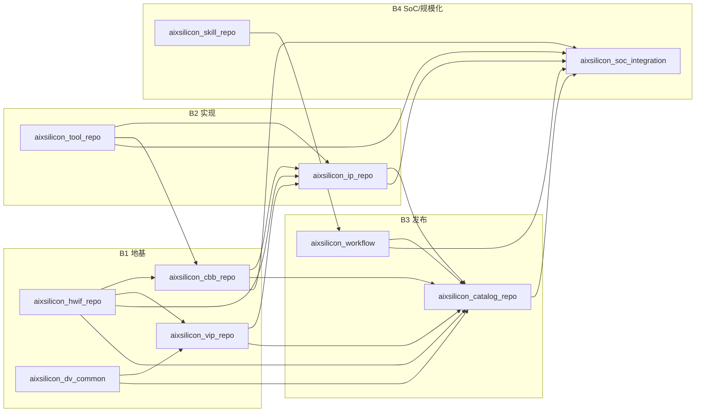

# AIXSILICON Build Todolist — Workflow 与各 Repos 建设顺序

> 依据：[`plan.md`](plan.md)（含 §35 V0.2 治理决议）、[`docs/plans/cross-repo-optimization-plan.md`](docs/plans/cross-repo-optimization-plan.md)、
> [`todo.md`](todo.md)、[`docs/maturity-model.md`](docs/maturity-model.md)、[`docs/schema-ownership.md`](docs/schema-ownership.md)。
> 本文件回答：**当前各仓到什么状态、按什么依赖顺序继续建设、每阶段出口是什么。**

---

## 1. 建设目标与原则

> **Manifest 定义工作区 → Lockfile 冻结版本 → 独立 Git 仓承载资产 → FuseSoC 构建设计依赖 → Workflow 执行跨仓 Gate → Skill 辅助 → Evidence 证明 → Catalog 发布。**

- **依赖优先**：先建被依赖方（HWIF/DV-Common → CBB/VIP → IP → SoC），Tool/Catalog 平行服务，Workflow 全程为控制面；
- **先穿刺后铺量**：每个仓先打通一条端到端链路（APB），再扩充内容；
- **契约先行**：VLNV 统一 `aixsilicon:*`、Schema 所有权、成熟度映射在动工前冻结（已落地，见 §2）；
- **公共流程不依赖私有 Skill**：`aixsilicon_skill_repo` 只是能力增强层。

## 2. 现状基线（2026-08-13）

| 仓 | 状态 | 已建成 | 主要缺口 |
|---|---|---|---|
| `aixsilicon_workflow` | 控制面可用 | 治理 ADR、标准 action、release/bundle、CI、FuseSoC 索引、51 测试 | runner 委托 `aix tool` 的真实 provider 接入 |
| `aixsilicon_hwif_repo` | 57 接口族建成 | L0–L6 接口 + 工具链 + 测试 | Techlib binding、Skill/SoCGen 消费闭环 |
| `aixsilicon_cbb_repo` | 骨架+清单 | registry（~330 项登记） | P0 15 种子构件实现与验证（当前多 planned） |
| `aixsilicon_ip_repo` | 建仓 | ipkg/registry、uart 0.1.0、plan.md | 首个 APB 寄存器 IP 内容与发布 |
| `aixsilicon_dv_common` | P0 底座完成 | types/utils/runtime/ral 骨架、12 单测+smoke | P1 RAL/CSR 正式行为、APB 穿刺、Candidate |
| `aixsilicon_vip_repo` | 规划为主 | 目录/文档骨架 | APB V3、Clock/Reset/Memory/Interrupt、AXI4-Lite |
| `aixsilicon_tool_repo` | P0 五包骨架 | aix-tool-core（Result/插件）、schema、hwif-gen/reg-tool/core-tool | 五包真实实现、`aix tool` 插件接入 workflow |
| `aixsilicon_catalog_repo` | 骨架 | 资产条目 Schema + 首批条目 | 随各仓 release 持续填充 |
| `aixsilicon_soc_integration` | 骨架 | 通用 SoC 配置 Schema + Golden | 地址/中断/CRG 检查接入、完整 Schema 集 |
| `aixsilicon_skill_repo` | canonical 已落地 | ip-development-suite（21 子 skill、G0-G5、canonical 模型、UVM 1.2、8 eval） | 套件自校验/Eval 全链路、与 workflow/tool 契约对齐、CBB/SoC suite |

## 3. 建设顺序总览（依赖驱动）

**并行轨道**：`aixsilicon_workflow`（贯穿全程，随 provider 就绪接入）；`aixsilicon_skill_repo`（私有，与 B2/B3 并行沉淀契约）。

---

## 4. 分阶段 Build TODO

状态：`[x]` 已完成 · `[-]` 进行中 · `[ ]` 待办。出口条件即“可进入下一阶段”。

### B0 基线冻结（已完成，2026-08-13）

- [x] 治理 ADR-0003～0006（VLNV 统一 `aixsilicon:*`、CLI 插件组、幽灵仓收敛、Tool 归属）
- [x] 成熟度统一映射（[`docs/maturity-model.md`](docs/maturity-model.md)）、Schema 所有权注册表（[`docs/schema-ownership.md`](docs/schema-ownership.md)）
- [x] workflow 标准 action、release/bundle、统一退出码、CI 真实化、FuseSoC 索引优化、51 测试
- [x] tool/catalog/soc-integration/skill/ip 骨架仓最小落地

**出口**：跨仓契约单一事实源化；`make check` 与 pre-commit 全绿。

### B1 地基仓内容（当前阶段）

| 仓 | TODO | 优先级 | 出口 |
|---|---|---|---|
| `aixsilicon_hwif_repo` | [ ] Techlib binding（`aixsilicon_techlib_repo` 待建前以抽象接口承接）；[ ] 完成 2 个真实消费者（CBB+VIP）编译依赖；[ ] 统一 `aixsilicon:interface:*` 命名迁移 | P0 | 至少 CBB+VIP 各 1 依赖其 core 并通过编译 |
| `aixsilicon_dv_common` | [-] P1 RAL base/CSR sequence 正式行为；[ ] PeakRDL RAL 接入；[ ] APB 寄存器 IP 示例；[ ] 首个 Candidate + Catalog 接入；[ ] CI 三段接入 | P0 | `apb_csr_ip` 示例可运行并输出 result/manifest |
| `aixsilicon_cbb_repo` | [ ] P0 15 种子构件（FIFO/Arbiter/Slice/Sync 等）从 planned → verified；[ ] `cbb.yaml` SSOT + 验证 harness；[ ] 3 个示范闭环（仲裁器/ReadyValid 链/FIFO 存储映射） | P0 | 至少 10 个构件达 E2/E3，Catalog 可检索 |

### B2 实现与验证仓

| 仓 | TODO | 优先级 | 出口 |
|---|---|---|---|
| `aixsilicon_vip_repo` | [ ] APB VIP 达 V3 Qualified；[ ] Clock/Reset/Memory/Interrupt 达 V2；[ ] AXI4-Lite/AXI-Stream beta；[ ] 双仿真器矩阵 + cocotb 交叉验证 | P0 | 主干 VIP 可被真实 IP 复用，Catalog 显示能力/兼容 |
| `aixsilicon_ip_repo` | [ ] 首个 APB 寄存器 IP（SystemRDL/RAL/RTL）发布为 `aixsilicon:ip:*`；[ ] registry/ipkg 对齐统一契约；[ ] G0–G5 门禁产物 | P0 | `aixsilicon:ip:apb_csr` 可在 Catalog 查询并经 `aix release` 资格验证 |
| `aixsilicon_tool_repo` | [ ] `aix-hwif-gen`/`aix-reg-tool`/`aix-core-tool` 真实实现；[ ] `aixsilicon.commands` 插件可被 workflow 的 `aix tool` 调用；[ ] Golden Test + 工具版本锁 | P0 | `aix wf run ip-verification` 的 `tool.*` 阶段由真实 provider 执行 |

**并行**：`aixsilicon_workflow` 把 `aix tool` 委托从 fallback 切换为真实 provider，并接入 `aixtool` 版本锁。

### B3 发布与发现

| 仓 | TODO | 优先级 | 出口 |
|---|---|---|---|
| `aixsilicon_catalog_repo` | [ ] 条目随各仓 release 自动/受控更新；[ ] 兼容矩阵与成熟度映射落地 | P1 | 覆盖 IP/CBB/VIP/HWIF/DV-Common 至少各 1 个 `qualified` |
| `aixsilicon_workflow` | [ ] `aix release publish` 端到端（Tag/SBOM/Catalog PR 编排）；[ ] baseline 升级 + Bundle Release；[ ] reusable workflows 固定 Tag v0.1 上线 | P1 | IP 候选经人工批准发布并更新 Catalog |
| `aixsilicon_skill_repo` | [ ] Context Pack/Change Plan/Skill Result 契约；[ ] IP Golden Path 端到端；[ ] Author/Verifier 双 Agent | P1 | 一个真实 IP 变更经 Skill 受控完成 |

### B4 SoC 与规模化

| 仓 | TODO | 优先级 | 出口 |
|---|---|---|---|
| `aixsilicon_soc_integration` | [ ] 完整 Schema 集（address/irq/crg/power/connect）；[ ] 配合 tool 的 Address/IRQ/CRG Checker 接入；[ ] 最小 SoC Golden | P1 | SoC YAML 可通过地址/中断/连接检查 |
| `aixsilicon_workflow` | [ ] `soc-*` flow 动作接入（`tool.socgen`/`tool.connect`）；[ ] blue/red-zone 双环境；[ ] Nightly 兼容矩阵 | P2 | SoC 项目可锁定资产基线并重建结果 |
| `aixsilicon_cbb_repo` | [ ] AXI/协议构件、PPA 表征、Selector | P2 | 30–50 个 E4 资产，多项目复用 |
| 待建仓 | [ ] `aixsilicon_techlib_repo`（P1）/ `aixsilicon_sw_repo`（P1）/ `aixsilicon_reference_soc_repo`（P2）/ `aixsilicon_model_repo`（按需） | P1/P2 | 按需建仓前先登记于 schema-ownership 仓库注册表 |

---

## 5. 关键依赖与风险

| 依赖 | 说明 |
|---|---|
| hwif 必须先于 cbb/vip/ip | 接口契约是设计与验证的共同地基 |
| dv-common 先于 vip/ip 验证 | 通用验证机制避免重复实现 |
| tool 的 `aix-reg-tool` 先于 APB 完整穿刺 | SystemRDL/RAL/RTL 多视图需确定性生成器 |
| catalog 随各仓 release 填充 | 不是一次建完，而是持续索引 |
| workflow 的 `aix tool` 接入依赖 tool_repo 插件 | 接入后 `tool.*` 阶段才从 blocked 变为真实执行 |
| 私有 Skill 不阻塞公共流程 | 公共 CI/构建/发布在无 Skill 时仍可运行 |

## 6. 近期第一步（下一轮执行建议）

1. **tool_repo**：实现 `aix-reg-tool`（SystemRDL→RTL/RAL/Header）与 `aix-hwif-gen`，让 `aix tool` 在 workflow 中真实可用；
2. **ip_repo + dv_common + vip_repo**：协作完成 APB 寄存器 IP 的完整仿真穿刺（替换当前编排级）；
3. **cbb_repo**：P0 15 种子构件首批 verified；
4. **catalog_repo**：将上述发布资产登记为 `qualified`；
5. **workflow**：把 `aix wf run ip-verification`/`apb-register-ip` 的 `tool.*`/`eda.*` 阶段全部转真实执行。
