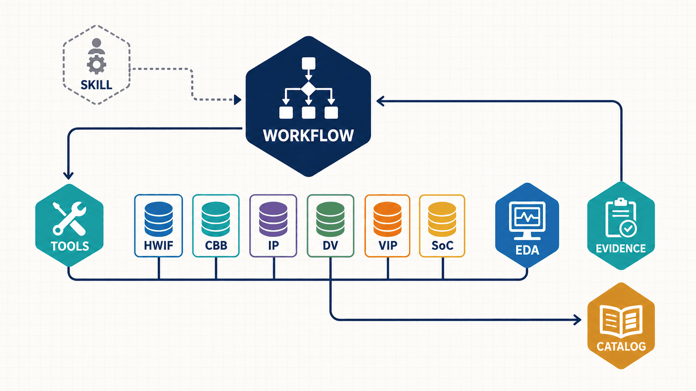
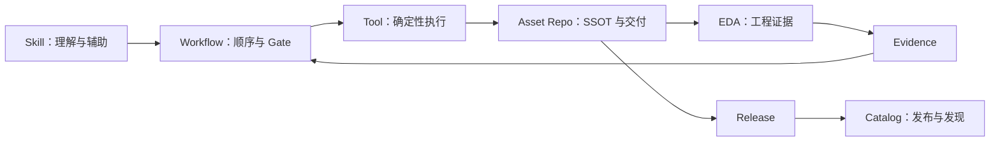

# 系统总体模型

本页只回答三个问题：Workflow 为什么存在、各层如何协作、哪些边界不可突破。仓库逐项职责见 [`repos.md`](repos.md)，执行流程见 [`workflows.md`](workflows.md)。

## 1. 定位

`aixsilicon_workflow` 是 Manifest 驱动的多仓工作区控制面，不是源码汇总仓、镜像仓或最终 SoC 工程仓。

它统一解决：

- 哪些仓库组成某个开发场景；
- 实际使用了哪些 Git SHA、工具和环境；
- 跨仓任务按什么顺序执行、什么算通过；
- 跨仓 PR 如何联合验证和按依赖合并；
- 发布结论如何通过 Evidence 重建。

资产源码、接口事实、验证组件和产品配置继续保存在各自 Owner 仓。

## 2. 责任链



概念图把六类资产仓画在同一公共能力总线上，强调它们是独立 Git/Owner，而不是单体仓或固定串行依赖。图中的总线只表示 Workflow/Tool/EDA 对资产的共同作用；精确仓间依赖仍以下方责任链、[`repos.md`](repos.md) 和 Manifest 为准。



| 角色 | 决定什么 | 不能决定什么 |
|---|---|---|
| Skill | 需求理解、内容辅助、流程建议 | 兼容性、Gate 或 Signoff 事实 |
| Workflow | 阶段顺序、前置条件、Gate、重试和证据出口 | 领域生成算法和资产事实 |
| Tool | 相同输入得到可复核输出的生成/检查 | 任务优先级和人工批准 |
| Asset Repo | 接口、RTL、验证组件、配置和正式交付 | 跨仓基线和发布编排 |
| Catalog | 已发布资产、版本、成熟度和兼容关系 | 开发工作区布局 |
| EDA Provider | 仿真、综合、PPA 等工程结果 | 资产 Owner 和版本策略 |

## 3. 六层架构

| 层 | 职责 | 规范源 | 输出 |
|---|---|---|---|
| L0 工作区 | clone、sync、status、缓存 | 物化 skill `/.roo/skills/aixsilicon-workspace-management/src/aixworkflow/workspace.py`（canonical 在私有 skill repo） | 一致的 `repos/` 工作区 |
| L1 配置 | Manifest、Profile、Lock、Override | `manifests/`、`locks/`、`schemas/` | 可解析基线 |
| L2 资产发现 | FuseSoC、VLNV、Catalog | generated index、catalog | 可构建资产集合 |
| L3 流程编排 | Flow DAG、Action、write_scope | `workflows/*.yaml`、runner | 标准执行序列 |
| L4 质量证据 | G0～G7、报告、Hash、RTM、SBOM | Evidence Schema/Policy | 可审计结论 |
| L5 协作发布 | PR、Change Bundle、Release Train | `changesets/`、release policy | 多仓合并与发布记录 |

层级关系是单向约束：上层消费下层的稳定契约，不反向复制下层事实。

## 4. 核心对象

| 对象 | 唯一问题 | 当前载体 |
|---|---|---|
| Workspace Manifest | 期望克隆哪些仓、放在哪里 | `manifests/*.yaml` |
| Profile | 哪个开发场景启用哪些仓 | Manifest v1 `include_groups`；目标为显式仓集 |
| Lockfile | 本次实际解析到的仓库和工具版本 | `locks/*.yaml` |
| Local Override | 本地临时替换 | ignored `overrides/local.yaml` |
| Flow | 输入、Stage、Gate 和输出 | `workflows/*.yaml` |
| Action Contract | 稳定动作名称和输入输出契约 | runner registry；目标增加 provider metadata |
| Change Bundle | 跨仓 PR、验证和合并顺序 | `changesets/*.yaml` |
| Evidence | 结论如何被重建 | Run Manifest + Evidence Index |
| Catalog Entry | 哪个资产版本可以被正式消费 | catalog repo |

Manifest、Lock、Catalog 和 Change Bundle 回答不同问题，禁止相互替代。

## 5. 控制面与数据面

```text
控制面：Manifest / Lock / Flow / Gate / Policy / Change Bundle / Release
数据面：HWIF / CBB / IP / DV Common / VIP / SoC 配置 / EDA 结果
```

Workflow 只能通过注册 Action 读写数据面，并受 `write_scope` 和 [`ownership-map.yaml`](../../ownership-map.yaml) 约束。Flow YAML 不允许携带任意 Shell。

## 6. 公共与私有边界

| 默认公共 | 默认私有/受控 |
|---|---|
| Workflow、Catalog、通用 SoC Integration | **Tools（确定性生成/检查能力）**、商业芯片项目仓 |
| HWIF、CBB、公共 IP、DV Common、VIP | **Skill 核心方法和 Agent 编排** |
| 通用 Schema、Flow、Evidence 契约 | Foundry/PDK/Memory 适配 |
| Generic/FPGA 可复用基础能力 | 商业 EDA License、内部路径、客户数据 |

Tools 与 Skill 均为私有能力仓：Tools 提供跨仓确定性生成/检查能力，Skill 提供 AI 研发方法辅助；两者**不直接开源源码**。Tools/Skill 生成的**交付件**（HWIF/CBB/IP/DV Common/VIP 契约与资产、Catalog 条目、生成 RTL/Header/Core、文档）写入各自公开资产仓，随资产仓一并开源。公共确定性流程必须在缺少私有 Skill/Tools 源码访问时仍能按已发布契约运行；私有能力缺失应显式报告 `OPTIONAL_UNAVAILABLE`，不能静默改变最低验证结果。

## 7. 架构不变量

- 每个事实域只有一个 Owner；
- 派生视图由 Tool 生成，不人工双维护；
- 正式结论绑定固定 SHA、工具版本和 Evidence；
- 未知依赖扩大测试范围，不静默缩小；
- 自动化不得绕过资产仓 Review 或发布人工批准；
- `repos/`、构建产物、凭据和私有适配不进入 Workflow Git 历史。

目标优化不改变这些不变量，只改进 Profile、依赖类型和 Action 可执行性，详见 [`target-design.md`](target-design.md)。
