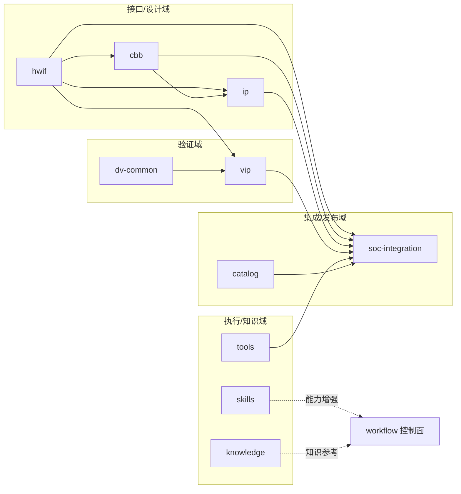
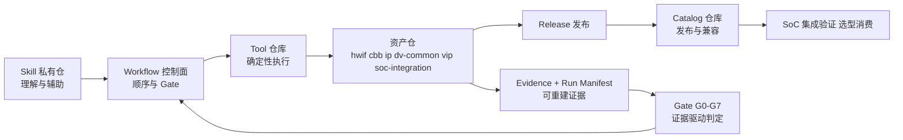
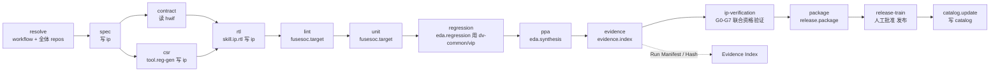
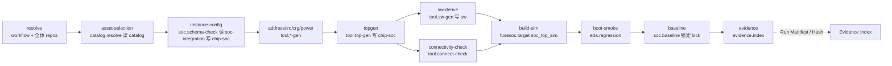
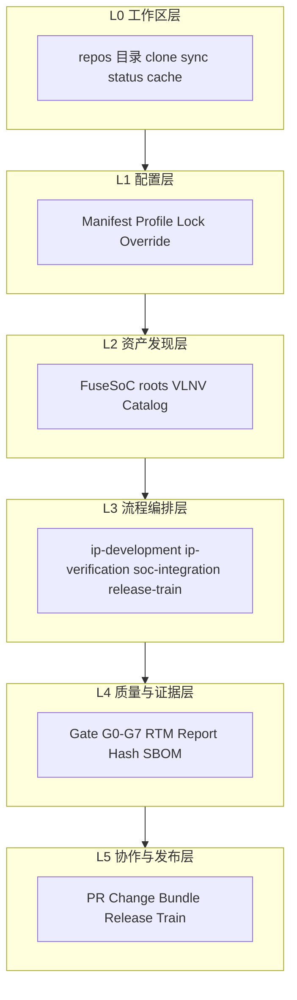

# 关系框图（relationship-diagram）

> 本页用 5 张 Mermaid 图把整个 workflow / repo 体系可视化：仓库依赖 DAG、责任链数据流、两条主线链路、L0–L5 分层。
> 阅读约定：图中节点标签保持简单（不含圆括号/引号，保证 Mermaid 可渲染）；详细说明见 [`repos.md`](repos.md) 与 [`workflows.md`](workflows.md)。

---

## 1. 图 1：仓库依赖 DAG（10 仓，depends_on）

> 依据 [`manifests/default.yaml`](../../manifests/default.yaml) 的 `depends_on`。按四域分组着色示意；skills / knowledge 在主 DAG 之外。

| 读法 | 要点 |
|---|---|
| 底座 | hwif 被 cbb / ip / vip / soc-integration 依赖，是接口语义的单一来源 |
| 验证供给 | dv-common + vip 为 ip 与 soc-integration 提供验证能力 |
| 聚合终点 | soc-integration 聚合 hwif / cbb / ip / catalog / tools |
| 执行/知识 | tools 通过 workflow 编排作用于各资产仓；skills、knowledge 以能力/知识增强协作 |

---

## 2. 图 2：责任链数据流（Skill → Workflow → Tool → Asset → Catalog → EDA）

> 完整责任链：**Skill 决定“如何理解与辅助”→ Workflow 决定“顺序与 Gate”→ Tool 负责“确定性执行”→ 资产仓保存 SSOT/交付 → Catalog 发布合格资产 → EDA 提供工程证据**。

| 环节 | 归属 | 回答的问题 |
|---|---|---|
| Skill | `aixsilicon_skill_repo`（私有） | 如何理解需求、生成/解释、选择流程 |
| Workflow | `aixsilicon_workflow` | 先跑什么、后跑什么、什么算通过 |
| Tool | `aixsilicon_tool_repo`（T1） | 如何确定性生成/检查 |
| 资产仓 | hwif/cbb/ip/dv-common/vip/soc-integration | 事实、源码、正式交付（SSOT） |
| Catalog | `aixsilicon_catalog_repo` | 已发布资产、版本、兼容性、成熟度 |
| EDA | EDA Provider | 仿真/综合/PPA 工程证据 |

---

## 3. 图 3：主线一 IP 设计验证链路（stage → repo 读写 → gate → evidence → catalog）

> 入口 `ip-development` → `ip-verification` → `release-train`。括号内为该阶段主要读写的 repo。

| Gate | 卡点 |
|---|---|
| G0–G4 | spec/contract/csr/rtl/lint/unit 阶段卫生、解析、依赖、契约、构建单测 |
| G6 | evidence 汇总完整性 |
| G5、G7 | 在 `ip-verification`（跨仓资格）与 `release-train`（发布就绪）卡住 |

---

## 4. 图 4：主线二 SoC 集成验证链路（stage → repo 读写 → gate → evidence）

> 入口 `soc-integration`，消费 Catalog 已发布资产；`chip-<project>-soc` 为私有项目仓。

| Gate | 卡点 |
|---|---|
| G0–G2 | 配置卫生、workspace 解析、依赖完整性 |
| G3 | SoC 契约/连接兼容 |
| G4–G6 | 构建仿真、boot smoke、evidence 与基线完整性 |

---

## 5. 图 5：L0–L5 分层图（六层 + 资产仓/流程映射）

| 层 | 内容 | 主要输出 | 相关仓/文件 |
|---|---|---|---|
| L0 工作区层 | 目录、clone、sync、状态 | 本地一致工作区 | `repos/`、`src/aixworkflow/workspace.py` |
| L1 配置层 | Manifest/Profile/Lock/Override | 可解析依赖基线 | `manifests/`、`locks/`、`overrides/` |
| L2 资产发现层 | FuseSoC roots、VLNV、Catalog | 可构建资产图 | `fusesoc.conf`、catalog 仓 |
| L3 流程编排层 | develop/verify/integrate/release | 标准化任务 DAG | `workflows/*.yaml` |
| L4 质量与证据层 | Gate/RTM/报告/Hash/SBOM | 结构化判定证据 | `evidence-index.schema.json` |
| L5 协作与发布层 | PR/Change Bundle/Release Train | 可审计多仓协作 | `changesets/`、`release.py` |

---

## 6. 如何对照阅读

| 图中节点 | 详细说明 |
|---|---|
| 仓库节点 | [`repos.md`](repos.md) §1（每仓一份材料） |
| 依赖关系 | [`repos.md`](repos.md) §2（依赖推导/数据流/边界） |
| 主线一/二链路 | [`workflows.md`](workflows.md) §2 / §3 |
| 责任链与分层 | [`overview.md`](overview.md) §3 / §4 |
| 各仓计划/待办 | [`repo-plans/`](repo-plans/README.md) |
