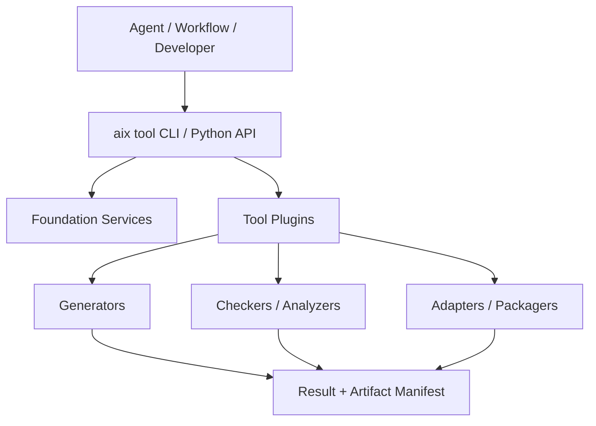

# tools — AIXSILICON Tool Repository 规划与待办

> 来源：repos/aixsilicon_tool_repo/tool_repo_plan.md + todo.md（完整剪切至 docs/architecture/repo-plans 统一管理）
> 迁移日期：2026-08-13
> 仓库实现现状见 docs/architecture/repos.md §1.6

---

## 一、tool_repo_plan.md 完整原文

# AIXSILICON Tool Repository 完整规划

> 仓库名称：`aixsilicon_tool_repo`
> 文档状态：规划基线 V0.1
> 日期：2026-08-13
> 定位：面向AI辅助芯片研发的确定性工具平台
> 服务范围：IP设计验证、CBB设计验证、SoC集成

---

## 1. 建设结论

`aixsilicon_tool_repo`应建设为一个开源的“芯片研发确定性工具Monorepo”，统一承载可重复执行、可测试、可版本化、可被Agent与Workflow调用的生成、校验、转换、分析和打包能力。

它不是脚本汇总仓，也不是EDA Flow仓，更不是AI Skill仓。核心分工为：

> **Agent理解目标并提出变更，Skill提供专业方法，Workflow决定执行顺序和Gate，Tool执行确定性生成与检查，资产仓保存SSOT与交付，EDA提供工程判定，Catalog发布合格资产。**

推荐形态：

- 一个Git Monorepo；
- 多个独立Python Package；
- 统一`aix tool`命令入口；
- Python API、CLI和插件API三种调用方式；
- 所有工具输出结构化Result和Artifact Manifest；
- 支持FuseSoC Generator与PeakRDL插件；
- 每个工具独立SemVer、兼容性、Owner与成熟度；
- 公共工具开源，内部EDA/PDK/服务器配置通过私有Adapter或Overlay接入；
- 不依赖私有`aixsilicon_skill_repo`也能独立运行。

一期重点不是追求工具数量，而是打通三条主线：

1. APB寄存器IP：Schema → SystemRDL → RTL/RAL/Header/Doc → FuseSoC → 检查与打包；
2. FIFO/Arbiter CBB：参数Schema → 测试矩阵 → Formal/Simulation → PPA Sweep → Profile推荐；
3. PIC/最小SoC：SoC YAML → 地址/中断/CRG检查 → Top/Core/软件视图生成 → Connectivity → Evidence。

---

## 2. 为什么必须独立建设Tool Repo

在AI辅助开发体系中，最容易出现四类工程问题：

1. Agent针对同一任务反复生成不同脚本；
2. 确定性逻辑散落在Skill、IP、VIP和Workflow仓中；
3. 输入输出没有Schema，脚本只能由作者本人使用；
4. AI同时维护多个派生视图，造成RTL、RAL、Header和文档不一致。

独立Tool Repo的价值是把稳定能力从AI自由生成中抽离出来：

| 场景 | 不推荐 | 推荐 |
|---|---|---|
| CSR | AI分别手写RTL、RAL、Header | SystemRDL + 确定性Exporter |
| HWIF | AI维护struct/interface/flat三份定义 | YAML Contract + 多视图生成器 |
| FuseSoC | 每个Agent自由手写`.core` | Core Schema + Core Generator/Checker |
| SoC Top | AI拼接实例和端口 | SoC YAML + SoCGen |
| 地址/中断 | AI手工编号和检查 | Address/IRQ工具 |
| CBB参数验证 | Agent随意选几组参数 | Parameter Matrix工具 |
| PPA | 人工复制日志到Excel | Sweep + Report Normalizer |
| Release | AI复制目录并编写Manifest | Package Tool按策略打包 |

Tool使AI的工作从“自由手写工程细节”转变为：

```text
理解需求 → 选择正确工具 → 构造合法输入 → 调用工具 → 解释结构化结果
```

---

## 3. 仓库边界

### 3.1 本仓库负责

- YAML/JSON/SystemRDL/FuseSoC等输入的Schema校验；
- HWIF多视图生成；
- CSR多视图生成与一致性检查；
- FuseSoC Core生成、规范化和静态检查；
- SoC地址、中断、Clock/Reset、Power、连接配置生成与检查；
- IP/CBB/DV项目骨架的确定性初始化；
- 参数组合生成、回归矩阵和PPA Sweep辅助；
- EDA报告结构化解析；
- RTM、Evidence和Release Manifest生成；
- SBOM、许可证和交付包检查；
- 第三方开源工具与商业EDA的适配接口；
- Agent和Workflow可调用的稳定API；
- 工具自测、Golden Test和兼容性测试。

### 3.2 本仓库明确不负责

- 不保存IP、CBB、VIP或SoC项目事实；
- 不保存某个IP的SystemRDL、接口Contract或RTL；
- 不保存SoC地址、中断和实例配置；
- 不承担端到端流程编排和质量决策；
- 不保存Prompt、Agent策略或核心专业Skill；
- 不承载UVM公共基类、VIP Agent或协议Checker；
- 不包含EDA二进制、License、账号、Token、内部服务器地址；
- 不包含Foundry PDK、Memory Compiler输出或受NDA约束模型；
- 不把复杂语义塞入FuseSoC Generator参数绕过SSOT；
- 不根据AI猜测补齐缺失事实；
- 不静默改写用户维护的SSOT。

### 3.3 与其他仓库的边界

| 仓库 | 保存什么 | Tool Repo如何协作 |
|---|---|---|
| `aixsilicon_hwif_repo` | 接口YAML Contract与正式生成视图 | 提供HWIF Generator/Checker |
| `aixsilicon_cbb_repo` | CBB需求、参数、RTL、属性、测试、PPA数据 | 提供参数矩阵、PPA和打包工具 |
| `aixsilicon_ip_repo` | IP规格、SystemRDL、RTL、验证和文档 | 提供CSR/Core/DV/Release工具 |
| `aixsilicon_vip_repo` | 协议VIP与Coverage | 提供骨架、元数据和报告工具 |
| `aixsilicon_dv_common_repo` | 协议无关验证组件 | 消费统一Result Schema，不由Tool替代 |
| `aixsilicon_soc_integration_repo` | 通用SoC Schema、规则和模板 | Tool实现对应生成器与Checker |
| `chip_<project>_soc_repo` | 具体芯片SoC SSOT与生成交付 | Tool读取SSOT并输出到项目授权目录 |
| `aixsilicon_workflow` | DAG、Gate、Lock、Evidence与协作 | 按固定版本调用Tool |
| `aixsilicon_skill_repo` | 私有Skill、专业知识和AI策略 | Skill调用Tool，不复制Tool逻辑 |
| `aixsilicon_catalog_repo` | 发布资产索引与兼容矩阵 | Tool校验和生成Catalog变更草案 |

### 3.4 Tool、Workflow和Skill判断规则

遇到新能力时用以下标准归类：

| 问题 | 是 | 否 |
|---|---|---|
| 相同输入是否应产生语义相同的输出？ | 倾向Tool | 倾向Skill/分析活动 |
| 能否定义严格输入输出Schema？ | 倾向Tool | 先保留在Skill或实验区 |
| 是否负责步骤顺序、重试和Gate？ | Workflow | Tool |
| 是否需要大模型理解和专业判断？ | Skill/Agent | Tool |
| 是否保存设计事实或源码？ | 资产仓 | Tool |
| 是否只是一次性迁移脚本？ | `experiments/`或项目仓 | 不进入稳定Tool包 |

一个能力进入正式Tool前必须满足：输入契约明确、输出契约明确、错误码稳定、幂等策略明确、单元测试充分、Golden Case存在、Owner明确。

---

## 4. 总体架构



建议划分五层：

| 层级 | 责任 | 典型内容 |
|---|---|---|
| T0 Foundation | 所有工具共享的稳定底座 | Config、Schema、Result、Logging、Hash |
| T1 Domain Model | 领域中间表示 | HWIF IR、CSR IR、SoC IR、Asset IR |
| T2 Tool Engine | 确定性生成和分析 | Generator、Checker、Normalizer |
| T3 Adapter | 外部系统适配 | FuseSoC、PeakRDL、EDA、Git、Catalog |
| T4 Interface | 对Agent/Workflow开放 | CLI、Python API、Plugin、JSON Result |

依赖必须单向：

```text
Interface → Tool Engine → Domain Model → Foundation
                       ↘ Adapter
```

单个工具不能反向依赖Workflow或私有Skill。

---

## 5. 技术选型

### 5.1 主语言

一期建议以Python 3.11+为主：

- 芯片工具链生态较完整；
- 易于集成FuseSoC、PeakRDL、YAML、JSON Schema和EDA日志；
- 适合快速构建Agent可调用CLI和插件；
- 易于测试和发布Wheel。

性能敏感模块后续可使用Rust/C++实现，但必须保留相同的结构化CLI/API契约，不能让调用方感知内部语言差异。

### 5.2 配置与Schema

- 人工维护的事实优先YAML；
- Schema统一使用JSON Schema Draft 2020-12；
- 工具内部使用强类型模型；
- 机器输出默认JSON，必要时同时输出YAML/Markdown；
- Schema必须具有稳定`$id`、版本和迁移策略。

JSON Schema提供结构、约束和类型验证标准，Draft 2020-12可作为首版基线：[JSON Schema Specification](https://json-schema.org/specification)。

### 5.3 包与插件

- 使用`pyproject.toml`管理Python Package；
- 每个工具包可独立构建Wheel；
- 使用标准Entry Points发现插件；
- CLI薄封装调用同一Python API；
- 禁止CLI和API实现两套业务逻辑。

Python Entry Points是标准的组件发现机制，适合让Workflow或私有Adapter扩展工具能力：[Python Entry Points Specification](https://packaging.python.org/specifications/entry-points/)。

### 5.4 外部工具

- FuseSoC：Core、fileset、target、依赖和Generator入口；
- PeakRDL/SystemRDL：CSR事实编译和多视图输出；
- EDA：通过Adapter执行和解析，不内置商业工具；
- Git：仅做版本信息采集和安全检查，发布编排归Workflow。

FuseSoC Generator用于构建过程中按参数生成Core，适合注册确定性生成器，但不应成为复杂设计语义的事实源：[FuseSoC Generators](https://fusesoc.readthedocs.io/en/stable/user/build_system/generators.html)。PeakRDL支持自定义Exporter插件，工具实现和CLI描述层应分离：[PeakRDL Exporter Plugin](https://peakrdl.readthedocs.io/en/latest/for-devs/exporter-plugin.html)。

---

## 6. 推荐仓库结构

```text
aixsilicon_tool_repo/
├── README.md
├── AGENTS.md
├── aix.repo.yaml
├── LICENSE
├── CHANGELOG.md
├── SECURITY.md
├── CONTRIBUTING.md
├── CODEOWNERS
├── pyproject.toml
├── uv.lock / approved-lock
├── .pre-commit-config.yaml
│
├── packages/
│   ├── aix-tool-core/
│   ├── aix-schema/
│   ├── aix-hwif-gen/
│   ├── aix-reg-tool/
│   ├── aix-core-tool/
│   ├── aix-project-init/
│   ├── aix-param-matrix/
│   ├── aix-dv-gen/
│   ├── aix-socgen/
│   ├── aix-connect-check/
│   ├── aix-ppa-bench/
│   ├── aix-report/
│   ├── aix-rtm/
│   ├── aix-package/
│   └── aix-catalog-tool/
│
├── plugins/
│   ├── peakrdl/
│   ├── fusesoc/
│   ├── eda-open/
│   └── examples/
├── schemas/
│   ├── tool/
│   ├── result/
│   ├── artifact/
│   ├── report/
│   └── migrations/
├── adapters/
│   ├── base/
│   ├── verilator/
│   ├── yosys/
│   ├── iverilog/
│   └── mock-commercial/
├── templates/
│   ├── ip/
│   ├── cbb/
│   ├── vip/
│   ├── soc/
│   └── release/
├── examples/
│   ├── apb-register-ip/
│   ├── async-fifo-cbb/
│   └── pic-mini-soc/
├── tests/
│   ├── unit/
│   ├── contract/
│   ├── integration/
│   ├── golden/
│   ├── reproducibility/
│   └── security/
├── docs/
│   ├── architecture.md
│   ├── tool-authoring.md
│   ├── plugin-api.md
│   ├── result-contract.md
│   ├── compatibility.md
│   └── adr/
├── scripts/                  # 仅仓库维护脚本，不是产品工具
└── .github/workflows/
```

### 6.1 为什么使用Monorepo

- 工具共享Foundation、Schema和Result Contract；
- 可以一次验证跨工具流水线；
- 方便统一安全、文档和贡献规范；
- 早期工具数量较多但团队有限；
- 避免十几个小仓库重复搭建CI。

每个Package仍保持独立版本和发布记录。未来只有满足以下条件才拆仓：

- 依赖或许可证明显不同；
- 发布频率与主仓严重冲突；
- 维护团队完全独立；
- 工具体积或语言栈导致Monorepo成本过高。

---

## 7. T0 Foundation：`aix-tool-core`

这是所有工具的最小公共运行底座，不包含任何具体硬件协议知识。

### 7.1 核心组件

| 组件 | 责任 |
|---|---|
| Config Loader | 加载YAML/JSON、include、变量和Profile |
| Schema Registry | 按`$id`解析和缓存Schema |
| Path Resolver | 安全解析workspace/repo/input/output路径 |
| Tool Context | Run ID、repo、lock、tool profile和环境摘要 |
| Result Model | PASS/FAIL/ERROR/SKIP/WARN统一结构 |
| Diagnostic | 错误码、位置、严重级别、修复提示 |
| Artifact Manager | Artifact路径、类型、Hash和来源 |
| Logger | 人读日志与结构化事件双输出 |
| Process Runner | 安全执行外部命令、超时和资源限制 |
| Plugin Registry | Entry Point发现和版本检查 |
| Cache API | 内容寻址缓存，不改变结果语义 |
| Provenance | 输入、版本、命令摘要和输出Hash |

### 7.2 统一Result Contract

```yaml
schema_version: aix.tool-result/v1
tool:
  id: aix.hwif.generate
  version: 1.2.0
run:
  id: RUN-2026-00813-001
  mode: check
status: fail
exit_code: 20
summary:
  errors: 1
  warnings: 2
diagnostics:
  - code: HWIF-E-PORT-001
    severity: error
    message: signal width expression references undefined parameter
    source:
      file: interfaces/axi/contract.yaml
      path: $.channels.aw.signals.awid.width
artifacts:
  - type: generated-preview
    path: reports/hwif/diff.patch
    sha256: ...
```

### 7.3 状态语义

| 状态 | 含义 | Workflow处理 |
|---|---|---|
| `pass` | 所有强制规则通过 | 继续 |
| `pass_with_warnings` | 通过但有非阻断问题 | 按Policy处理 |
| `fail` | 输入或工程不满足规则 | Gate失败 |
| `error` | 工具、环境或依赖故障 | 与设计失败区分，可重试 |
| `skip` | 条件不适用且有明确原因 | 记录原因 |

工具不得仅用日志文本表达结果。

### 7.4 退出码建议

| 范围 | 类型 |
|---|---|
| 0 | 成功 |
| 10～19 | 输入/Schema错误 |
| 20～29 | 设计或规则检查失败 |
| 30～39 | 外部工具/环境错误 |
| 40～49 | 文件、权限和安全错误 |
| 50～59 | 兼容性和版本错误 |
| 60～69 | 内部错误 |

---

## 8. `aix-schema`：Schema与迁移工具

### 8.1 职责

- 校验YAML/JSON实例；
- 校验Schema自身；
- 解析`$ref`与组织Schema Registry；
- 输出精确到YAML路径的诊断；
- 支持Schema版本识别；
- 执行显式版本迁移；
- 比较Schema变化的兼容性；
- 生成基础Markdown字段说明；
- 为Agent提供可查询的字段约束。

### 8.2 命令

```bash
aix tool schema validate --schema aix.hwif/v1 input.yaml
aix tool schema lint schemas/hwif.schema.json
aix tool schema diff old.schema.json new.schema.json
aix tool schema migrate --from v1 --to v2 input.yaml --out migrated.yaml
aix tool schema explain aix.soc/v1 --path $.interrupts[*].trigger
```

### 8.3 关键原则

- 迁移必须显式指定版本，不自动猜测；
- 不认识的字段默认报错，扩展字段通过命名空间允许；
- Schema只验证结构和部分约束，跨对象语义由领域Checker负责；
- Migration输出新文件或Patch，默认不覆盖源文件；
- Breaking Schema变化必须升级major版本。

---

## 9. `aix-hwif-gen`：接口多视图生成

### 9.1 输入与输出

输入：`aixsilicon_hwif_repo`中的YAML Interface Contract。

输出：

- SystemVerilog package/typedef/packed struct；
- SystemVerilog interface/modport；
- Flattened port declaration与wrapper；
- 参数和Capability定义；
- 接口Markdown文档；
- 可选IP-XACT派生视图；
- binding metadata；
- 生成Manifest和Hash。

### 9.2 功能

- Contract Schema与语义校验；
- signal、channel、direction、role检查；
- width表达式解析；
- clock/reset/power domain属性；
- optional signal和Profile处理；
- 命名映射；
- DIRECT/ADAPTER_REQUIRED/INCOMPATIBLE兼容判定；
- 已生成文件漂移检查；
- 接口版本兼容性分析。

### 9.3 命令

```bash
aix tool hwif validate interfaces/apb/contract.yaml
aix tool hwif generate interfaces/apb/contract.yaml --views pkg,interface,flat,doc
aix tool hwif compatibility producer.yaml consumer.yaml
aix tool hwif drift-check interfaces/apb/
```

### 9.4 不负责

- 不生成协议Checker、SVA和Coverage；这些归VIP；
- 不生成Bridge/CDC/位宽转换RTL；这些归CBB；
- 不决定SoC实例之间如何连接；这些由SoC配置决定。

---

## 10. `aix-reg-tool`：CSR自动化

### 10.1 事实源

SystemRDL是CSR事实源，Tool提供PeakRDL的组织级封装、扩展Exporter和一致性Gate。PeakRDL以SystemRDL为中心，并可生成Verilog、C抽象等多种输出：[PeakRDL Introduction](https://peakrdl.readthedocs.io/)。

### 10.2 输出视图

- CSR RTL；
- UVM RAL；
- C/C++ Header；
- Rust/其他软件视图，按需；
- Markdown/HTML寄存器文档；
- Reset value表；
- Field access policy；
- Address block metadata；
- FuseSoC fileset片段；
- 生成Manifest。

### 10.3 检查能力

- 地址重叠、对齐和步长；
- field overlap；
- reset value与位宽；
- access policy组合；
- side effect语义；
- external register/memory；
- nested regfile/addrmap；
- unsupported construct显式报错；
- 软件兼容性变化；
- RTL/RAL/Header/Doc生成漂移。

PeakRDL官方提醒Exporter不一定支持全部SystemRDL特性，但必须对不支持构造清晰报错；Tool Repo应维护“支持特性矩阵”而不是静默降级：[SystemRDL Gotchas](https://peakrdl.readthedocs.io/en/latest/for-devs/rdl_gotchas.html)。

### 10.4 命令

```bash
aix tool reg validate regs/pic.rdl
aix tool reg generate regs/pic.rdl --profile standard
aix tool reg compatibility old.rdl new.rdl
aix tool reg drift-check --manifest generated/manifest.yaml
```

---

## 11. `aix-core-tool`：FuseSoC Core工具

### 11.1 职责

- 从资产Metadata生成`.core`草案；
- CAPI2 Schema和组织规范校验；
- fileset、target、parameter和dependency检查；
- 检查路径存在性、重复文件和错误file type；
- 检查VLNV命名和SemVer；
- 计算依赖闭包；
- 检查未声明的跨仓相对路径；
- 生成Graph和可读摘要；
- 检查Generator声明与输入Schema；
- 规范化排序但不随意改写人工注释。

### 11.2 命令

```bash
aix tool core init metadata/ip.yaml --out ip.core
aix tool core lint ip.core
aix tool core graph aix:ip:pic:1.0.0 --format json
aix tool core closure aix:ip:pic:1.0.0
aix tool core diff old.core new.core
```

### 11.3 约束

- FuseSoC负责硬件依赖和构建入口，不承载接口语义；
- Tool不得扫描目录后猜测全部fileset，必须由Metadata或明确规则驱动；
- 正式Core文件变更需在资产仓Review；
- Generator输出必须落到构建目录，不能污染SSOT目录；
- 同一VLNV多来源时必须报冲突，不依赖搜索路径静默遮蔽。

---

## 12. `aix-project-init`：工程骨架初始化

### 12.1 支持类型

- IP；
- CBB；
- VIP；
- HWIF family；
- SoC integration project；
- Tool plugin。

### 12.2 输出

- 标准目录；
- `aix.asset.yaml`或`aix.repo.yaml`；
- FuseSoC Core骨架；
- 文档模板；
- 测试目录；
- Gate配置；
- CODEOWNERS片段；
- AGENTS局部规则模板；
- TODO与TBD清单。

### 12.3 原则

- 只生成骨架，不生成未经确认的功能事实；
- 输入缺失时保留`TBD`；
- `--dry-run`默认展示文件树和Patch；
- 已存在文件默认不覆盖；
- 模板版本进入生成Manifest；
- 资产内容生成仍由对应Skill/Agent和领域工具完成。

---

## 13. `aix-param-matrix`：参数空间工具

该工具是CBB Workflow的关键基础设施。

### 13.1 输入

```yaml
parameters:
  data_width:
    type: integer
    allowed: [8, 16, 32, 64, 128]
  depth:
    type: integer
    allowed: [2, 4, 8, 16, 32, 64, 128, 256]
  fall_through:
    type: boolean
constraints:
  - if: {fall_through: true}
    then: {depth: {min: 2}}
```

### 13.2 策略

- 默认值；
- 最小/最大边界；
- 每个参数单变量变化；
- Pairwise；
- 约束满足随机组合；
- 用户指定关键Profile；
- 历史问题回归点；
- PPA Sweep子集。

### 13.3 输出

- 参数组合清单；
- 覆盖说明；
- 非法组合清单；
- FuseSoC parameter sets；
- Regression testlist；
- PPA Sweep plan；
- 可复现随机种子。

工具不能声称有限组合“覆盖了全部参数空间”；必须明确生成策略、覆盖维度和未覆盖范围。

---

## 14. `aix-dv-gen`：验证派生工具

### 14.1 定位

只生成可由Schema确定的验证资产，不替代UVM Verification Skill，也不把VIP/DV Common复制进项目。

### 14.2 可生成内容

- RAL接入配置；
- VIP binding配置；
- testlist骨架；
- simulator filelist/target片段；
- CSR基础Sequence实例化；
- Clock/Reset/Memory配置；
- Requirement/Test ID绑定表；
- Coverage waiver模板；
- Regression manifest；
- Result adapter配置。

### 14.3 不应确定性生成的内容

- 复杂Reference Model算法；
- IP专用Scoreboard策略；
- 功能场景Testplan；
- 负向测试的完整意图；
- Coverage目标合理性；
- Bug根因分析。

这些内容需要Verification Skill、领域专家和Review。

---

## 15. `aix-socgen`：SoC集成生成器

### 15.1 输入事实域

SoC配置不应塞进一个超大YAML，建议按事实域拆分：

```text
soc.yaml
instances.yaml
parameters.yaml
address-map.yaml
interrupts.yaml
clock-reset.yaml
power-domains.yaml
interconnect.yaml
safety.yaml
debug.yaml
```

Schema和通用规则归`aixsilicon_soc_integration_repo`，具体文件归私有SoC项目仓。

### 15.2 生成能力

- IP实例化；
- 参数绑定；
- 顶层端口与连接；
- FuseSoC Top Core；
- 地址译码配置；
- 总线互联配置；
- IRQ/PIC连接和编号；
- Clock/Reset连接；
- Power/Isolation/Retention抽象连接；
- CSR全局地址表；
- 软件Header、Device Tree和BSP元数据；
- Connectivity assertion绑定；
- 集成文档和图数据；
- 生成Manifest。

### 15.3 禁止行为

- 禁止静默截位或扩位；
- 禁止未声明的常量绑定；
- 禁止丢弃optional signal而不留记录；
- 禁止改变中断pulse/level语义；
- 禁止跨时钟/复位/电源域直接连接；
- 禁止地址自动重排后不更新SSOT；
- 禁止直接手改生成Top并把修改当事实；
- 禁止从RTL反向猜测完整SoC配置。

### 15.4 生成策略

```text
Parse → Normalize → Resolve → Validate → Build IR → Generate → Self-check → Manifest
```

每个阶段都有独立结构化结果；Generator只有在所有强制Checker通过后才输出正式文件。

---

## 16. `aix-connect-check`：集成检查器

### 16.1 检查域

| 域 | 检查内容 |
|---|---|
| Interface | producer/consumer、Profile、Capability、位宽 |
| Address | overlap、alignment、hole、decode、权限 |
| Interrupt | source唯一、trigger、polarity、target、CDC |
| Clock | source、频率关系、gating、domain |
| Reset | polarity、sync/async、assert/deassert、dependency |
| Power | domain、isolation、retention、always-on关系 |
| Safety | safety event、diagnostic path、fault containment |
| Debug/Test | JTAG/DMI/DFT连接和可达性 |
| Tie-off | 允许的常量、原因和影响 |

### 16.2 输出

- `connectivity-result.json`；
- 端点到端点连接表；
- 未连接/多驱动/方向错误列表；
- `ADAPTER_REQUIRED`列表；
- 推荐CBB VLNV，但不自动替用户选择不兼容适配；
- 图数据；
- SVA binding输入；
- 人读Markdown报告。

### 16.3 分层检查

- Schema check：字段是否合法；
- Semantic check：配置是否自洽；
- Contract check：接口是否兼容；
- Structural check：生成RTL是否与配置一致；
- Evidence check：问题是否有waiver或修复记录。

---

## 17. SoC专用子工具

`aix-socgen`内部可拆成稳定插件，避免形成巨型单体：

| 插件 | 输入 | 输出 |
|---|---|---|
| `aix-address` | instances + address map | resolved map、decoder config、软件视图 |
| `aix-irq` | interrupt source/target | IRQ map、PIC配置、Header |
| `aix-crg` | clock/reset关系 | CRG连接、约束元数据、CDC/RDC输入 |
| `aix-power` | power domain | isolation/retention连接元数据 |
| `aix-interconnect` | initiator/target/QoS | NoC/Bus配置与route表 |
| `aix-topgen` | resolved SoC IR | Top RTL与FuseSoC Core |
| `aix-sw-view` | CSR/address/IRQ | Header、DTS、BSP metadata |
| `aix-doc-view` | resolved SoC IR | 表格、Mermaid/DrawIO数据、集成文档 |

这些插件共享SoC IR，不能各自重新读取YAML并形成不同解释。

---

## 18. `aix-ppa-bench`：PPA表征工具

### 18.1 定位

统一CBB/IP的参数化综合、PPA采集、归一化和比较入口。它不替代综合工具，也不直接给出“最佳实现”的主观结论。

### 18.2 输入

- Asset VLNV和Git SHA；
- parameter set；
- top/target；
- clock/constraint profile；
- technology profile；
- synthesis adapter；
- activity/power profile；
- repetitions和seed；
- baseline ID。

### 18.3 输出

- area、timing、power、latency、throughput；
- 工具版本和约束摘要；
- warning/unmapped cell/latch等健康指标；
- 参数与PPA结果数据集；
- baseline delta；
- Pareto frontier数据；
- 原始报告Artifact引用；
- 数据有效性标记。

### 18.4 PPA可比性规则

只有以下条件兼容时才能直接比较：

- 相同或声明兼容的工艺/库；
- 相同PVT角；
- 相同时钟与IO约束口径；
- 相同综合工具主版本和策略；
- 相同层级与黑盒策略；
- 相同功耗活动率定义；
- 无严重unmapped、unconstrained或latch问题。

不满足时输出`NOT_COMPARABLE`，不能为了生成图表强行归一化。

### 18.5 CBB Profile推荐

工具可按显式规则计算：

- `area_opt`候选；
- `performance_opt`候选；
- `low_power`候选；
- Pareto候选；
- 不满足硬约束的淘汰项。

最终Profile是否发布由CBB Owner和Workflow Gate决定。

---

## 19. `aix-report`：EDA报告归一化

### 19.1 统一对象

- Lint；
- Compile/Elaboration；
- Simulation/Regression；
- Coverage；
- Formal；
- CDC/RDC；
- Synthesis；
- STA；
- Power；
- FPGA实现；
- 软件Boot/Smoke。

### 19.2 Adapter Contract

```yaml
adapter:
  id: aix.report.synthesis.generic
  version: 1.0.0
input:
  tool: yosys
  tool_version: ...
  files: [...]
output:
  schema: aix.eda-result/synthesis/v1
```

### 19.3 解析原则

- 优先消费工具原生JSON/XML/数据库导出；
- 只有无结构化接口时才解析文本；
- 文本Parser绑定工具版本范围；
- 未知格式必须报`UNSUPPORTED_FORMAT`，不能猜；
- 原始报告必须保留Hash和Artifact引用；
- 解析结果与原报告可交叉定位；
- PASS/FAIL由Policy与结构化指标判断，不依赖简单关键字。

---

## 20. `aix-rtm`：需求追踪与证据工具

### 20.1 输入

- ORDR/LRS/HLD/LLD Requirement ID；
- Design element ID；
- Interface/CSR ID；
- Testplan/Testcase/Coverage ID；
- Gate Result；
- Review和Waiver。

### 20.2 能力

- ID格式和唯一性检查；
- requirement → design → verification → evidence关联；
- orphan、dangling和duplicate link检查；
- 双向RTM表生成；
- Gate与Requirement覆盖汇总；
- 变更影响查询；
- Release Evidence Index生成。

### 20.3 限制

Tool只能验证“链接存在且结构合法”，不能仅凭链接判断需求已经充分验证。Coverage adequacy和验证充分性仍需Verification/Verifier Agent与人工评审。

---

## 21. `aix-package`：交付与发布打包

### 21.1 打包对象

- IP Release；
- CBB Release；
- VIP/HWIF/DV Common Release；
- Tool Package；
- Workspace Bundle；
- SoC项目里程碑包。

### 21.2 功能

- 按Release Manifest收集文件；
- 检查必需交付件；
- 拒绝未声明文件和敏感文件；
- 生成Hash清单；
- 生成SBOM；
- 汇总许可证；
- 校验VLNV/SemVer/Tag一致；
- 生成交付目录与压缩包；
- 生成Catalog entry草案；
- 生成Release Notes基础数据；
- 支持签名接口，但密钥由外部安全系统持有。

### 21.3 不负责

- 不直接决定发布；
- 不默认执行Git Tag、Push或GitHub Release；
- 不自动批准许可证例外；
- 不把私有Skill或内部配置打入开源Release；
- 不从dirty tree生成正式包。

正式发布动作由Workflow经人工批准后调用。

---

## 22. `aix-catalog-tool`：Catalog检查与更新草案

### 22.1 功能

- 校验Catalog条目Schema；
- 检查VLNV/Package ID唯一性；
- 检查Tag、SHA、Release Manifest一致性；
- 验证依赖版本和兼容矩阵；
- 检查成熟度升级所需Evidence；
- 生成Catalog Update Patch/PR材料；
- 查询某Profile的兼容资产候选；
- 检查deprecated/yanked状态。

### 22.2 边界

Catalog是发布事实源，Tool只产生经过验证的变更草案。Workflow负责PR、Review和Merge，Agent可解释差异但不能无证据提升成熟度。

---

## 23. 统一CLI设计

### 23.1 顶层形式

```bash
aix tool <domain> <command> [options]
```

主要命令域：

```text
schema / hwif / reg / core / project / params / dv
soc / connect / ppa / report / rtm / package / catalog
```

### 23.2 通用参数

```text
--input / --output
--profile
--config
--workspace
--format json|yaml|text
--result-file
--artifact-dir
--dry-run
--check
--strict
--offline
--no-color
--log-level
```

### 23.3 CLI契约

- 交互式友好输出走stdout；
- 日志和诊断走stderr或事件文件；
- `--format json`必须只有机器JSON，不混入进度文本；
- 所有写操作支持`--dry-run`或`--check`；
- 输出目录必须显式或由Tool Context提供；
- 默认不覆盖SSOT；
- 命令必须支持无TTY的CI运行；
- 相同主版本CLI参数保持向后兼容；
- deprecated参数至少保留一个minor窗口。

---

## 24. Python API与插件API

### 24.1 Python API

```python
from aix_tool_core import ToolContext
from aix_hwif_gen import generate_hwif

result = generate_hwif(
    contract="interfaces/apb/contract.yaml",
    views=["package", "interface", "flat"],
    output_dir="build/hwif",
    context=ToolContext.from_environment(),
)
```

API返回Result对象，不通过全局状态传递结果。

### 24.2 插件接口

建议Entry Point组：

```toml
[project.entry-points."aix.tools"]
hwif = "aix_hwif_gen.plugin:plugin"

[project.entry-points."aix.report_adapters"]
yosys = "aix_report_yosys:YosysAdapter"

[project.entry-points."aix.soc_generators"]
irq = "aix_socgen_irq:IRQGenerator"
```

### 24.3 插件Manifest

```yaml
plugin:
  id: aix.report.vcs
  version: 1.1.0
  api_version: aix.plugin/report-adapter/v1
  supports:
    tool: vcs
    versions: ['2025.*', '2026.*']
  input_schema: aix.raw-report/v1
  output_schema: aix.eda-result/simulation/v1
```

私有插件可以安装到运行环境中，由标准Entry Point发现；公共Repo不引用其源码路径。

---

## 25. Agent-Native接口

Tool Repo必须同时方便人和Agent使用。

### 25.1 Agent需要的能力

- `capabilities`：查询工具、版本、输入输出Schema；
- `explain`：解释字段、规则和错误码；
- `plan`：返回将读取和写入的文件；
- `dry-run`：返回Patch/Preview；
- `execute`：执行确定性动作；
- `result`：获取结构化结果；
- `artifacts`：列出输出和Hash；
- `version`：输出可锁定版本。

### 25.2 命令示例

```bash
aix tool capabilities --format json
aix tool hwif explain --rule HWIF-E-PORT-001 --format json
aix tool soc plan --config soc.yaml --format json
aix tool reg generate regs/pic.rdl --dry-run --result-file result.json
```

### 25.3 AI安全约束

- Agent只能通过允许的Tool ID调用；
- Tool在执行前报告读写集合；
- 写路径受Workflow Ownership Map限制；
- Tool不得执行输入YAML中的任意Shell；
- 不能把Prompt或自然语言直接拼进命令；
- Agent不得根据warning文本自行改为pass；
- Tool输出中的建议与判定分字段表达；
- 所有生成必须记录Tool版本、输入Hash和模板版本。

---

## 26. FuseSoC Generator集成

### 26.1 推荐用途

- 参数化生成wrapper；
- 生成CSR RTL和fileset；
- 根据已验证配置生成SoC局部Core；
- 生成测试参数实例；
- 生成构建目录内的派生Core。

### 26.2 不推荐用途

- 在Generator参数中重新描述完整SoC；
- 下载未锁定外部依赖；
- 修改源码仓SSOT；
- 运行长时间回归或EDA Signoff；
- 执行发布；
- 调用大模型生成RTL。

### 26.3 Generator Contract

每个Generator必须：

- 有输入Schema；
- 固定工具版本；
- 输出到FuseSoC工作目录；
- 生成新的合法Core；
- 记录输入Hash和输出文件；
- 无网络或显式声明网络需求；
- 相同输入产生语义等价输出；
- 被独立CLI测试覆盖。

---

## 27. Workflow集成

Workflow通过Tool Registry解析工具，而不是在Flow中硬编码仓库脚本路径。

```yaml
stage:
  id: generate-csr
  uses: tool
  tool: aix.reg.generate
  version: '>=1.3,<2.0'
  with:
    input: regs/pic.rdl
    profile: standard
  outputs:
    result: reports/csr/result.json
    artifacts: build/generated/csr
```

### 27.1 Tool Lock

Workspace Lock至少记录：

```yaml
tools:
  aix-reg-tool:
    version: 1.3.2
    source: wheel
    sha256: ...
  aix-socgen:
    version: 0.8.0
    git_commit: ...
  peakrdl:
    version: ...
```

### 27.2 Gate关系

Tool输出事实和指标，Workflow/Policy决定是否通过。例如：

```text
aix-report解析出unconstrained_paths=2
→ Tool结果为成功解析
→ Timing Policy判定Gate FAIL
```

不能让Parser混淆“解析成功”和“设计通过”。

---

## 28. 三条主Workflow的工具映射

### 28.1 IP设计验证

| 阶段 | 主要工具 |
|---|---|
| 项目初始化 | `aix-project-init` |
| 规格/Metadata | `aix-schema`、`aix-rtm` |
| HWIF | `aix-hwif-gen` |
| CSR | `aix-reg-tool` |
| FuseSoC | `aix-core-tool` |
| DV派生 | `aix-dv-gen` |
| EDA结果 | `aix-report` |
| PPA | `aix-ppa-bench` |
| 发布 | `aix-package`、`aix-catalog-tool` |

### 28.2 CBB设计验证

| 阶段 | 主要工具 |
|---|---|
| 项目初始化 | `aix-project-init` |
| 参数契约 | `aix-schema`、`aix-param-matrix` |
| 接口 | `aix-hwif-gen` |
| FuseSoC | `aix-core-tool` |
| 参数回归 | `aix-param-matrix`、`aix-report` |
| Formal/CDC | EDA Adapter + `aix-report` |
| PPA Sweep | `aix-ppa-bench` |
| 选型/发布 | `aix-ppa-bench`、`aix-package`、Catalog Tool |

### 28.3 SoC集成

| 阶段 | 主要工具 |
|---|---|
| 配置校验 | `aix-schema` |
| 资产解析 | `aix-catalog-tool`、`aix-core-tool` |
| 地址/中断/CRG | SoC专用插件 |
| Top生成 | `aix-socgen` |
| 连接检查 | `aix-connect-check` |
| 软件视图 | `aix-reg-tool`、`aix-sw-view` |
| 编译/Boot/EDA | Adapter + `aix-report` |
| RTM/Evidence | `aix-rtm` |
| 基线打包 | `aix-package` |

---

## 29. Tool成熟度模型

| 状态 | 含义 | 可用范围 |
|---|---|---|
| `experimental` | API和结果可能变化 | 试验，不进入正式Gate |
| `preview` | 主流程可用，覆盖有限 | 试点项目，可设非阻断Gate |
| `qualified` | 契约稳定、多场景验证 | 正式Workflow |
| `production` | 多项目长期使用、运维完善 | Release/Signoff支撑 |
| `deprecated` | 已有替代，等待迁移 | 只维护安全和关键Bug |
| `retired` | 不再支持 | Catalog保留历史信息 |

从Preview升级Qualified至少需要：

- API/CLI/Schema冻结；
- Unit/Contract/Golden/Integration Test通过；
- 两种以上真实资产验证；
- 错误和异常路径覆盖；
- 文档和示例完整；
- Reproducibility通过；
- Owner与维护SLA明确；
- 许可证与SBOM通过。

---

## 30. 版本治理

### 30.1 独立版本

每个Package独立SemVer，不强制整个Monorepo统一版本。

### 30.2 Breaking Change

以下通常需要major升级：

- 删除或重命名CLI参数；
- 修改Python API签名；
- 修改Result/Artifact Schema不兼容字段；
- 改变相同输入的关键生成语义；
- 改变错误码含义；
- 修改插件API；
- 移除已支持的输入构造。

### 30.3 输出格式版本

Tool版本和输出Schema版本分离：

```yaml
tool_version: 2.3.1
result_schema: aix.tool-result/v1
artifact_schema: aix.artifact-manifest/v1
```

这样工具minor升级不必强制所有消费者迁移。

### 30.4 Deprecated策略

- 至少一个minor版本警告；
- 提供替代命令；
- 能自动迁移时提供Migration Tool；
- Release Notes列出影响；
- Workflow禁止长期使用已过期接口。

---

## 31. 测试体系

### 31.1 测试层次

| 类型 | 目标 |
|---|---|
| Unit | 单函数和领域规则 |
| Schema | 合法/非法实例和错误定位 |
| Contract | CLI、API、Plugin、Result稳定性 |
| Golden | 输入对应输出文件内容 |
| Metamorphic | 输入等价变换后语义保持 |
| Property-based | 参数和边界组合 |
| Integration | FuseSoC、PeakRDL、EDA Adapter |
| Reproducibility | 两次执行Hash/语义一致 |
| Migration | 旧版本输入迁移 |
| Security | 路径逃逸、命令注入、恶意模板 |
| Performance | 大型SoC和寄存器规模 |

### 31.2 Golden Test策略

- Golden必须小而可读；
- 生成器升级后不得盲目批量接受新Golden；
- CI展示语义Diff；
- 非确定字段如时间戳不得进入关键内容；
- 路径和环境差异需要规范化；
- Golden更新必须由领域Owner Review。

### 31.3 真实穿刺

| 场景 | 验证的工具链 |
|---|---|
| APB寄存器IP | Schema、HWIF、CSR、Core、DV、RTM、Package |
| Async FIFO | 参数矩阵、Formal/CDC报告、PPA、Catalog |
| PIC最小SoC | SoCGen、Address、IRQ、CRG、Connect、SW View |

---

## 32. CI/CD

### 32.1 PR CI

- Formatting、typing和Unit Test；
- Schema meta-validation；
- 受影响Package Contract Test；
- Golden Diff；
- CLI help/API文档检查；
- 许可证与依赖扫描；
- 安全测试；
- 示例Smoke；
- Package build。

### 32.2 Nightly

- 全工具Integration Test；
- FuseSoC/PeakRDL支持矩阵；
- 开源EDA Adapter矩阵；
- 大规模SoC性能测试；
- Reproducibility；
- Mutation Test；
- Flaky检测；
- 依赖升级兼容性。

### 32.3 Release

- 受保护Tag触发；
- SemVer/CHANGELOG检查；
- 全量Contract和Golden Test；
- Wheel/Container构建；
- SBOM和许可证；
- Artifact Hash与签名接口；
- 发布到批准Package Registry；
- 更新`aixsilicon_catalog_repo`草案；
- 生成Release Evidence。

### 32.4 发布单元

仅发布变更的Package及其必要下游。Foundation或Plugin API变更时，必须运行全部受影响工具契约测试。

---

## 33. 开源与私有扩展策略

### 33.1 开源主仓包含

- 统一CLI、API和Result Contract；
- 所有通用生成器和Checker；
- 开源EDA Adapter；
- Mock Commercial Adapter；
- 公共Schema、模板、示例和文档；
- Tool Authoring SDK。

### 33.2 私有Overlay包含

- 商业EDA真实Adapter；
- 内部Runner、Queue和License接入；
- Foundry/PDK映射；
- Memory compiler适配；
- 内部编码/Signoff规则插件；
- 客户或项目专用Packager；
- 敏感报告Parser。

### 33.3 接入要求

私有插件必须实现同一公开Plugin API和Result Schema。公共Workflow可以声明能力需求：

```yaml
requires:
  capability: eda.cdc
  provider: any-qualified
```

不应在公共Flow中硬编码某个内部脚本绝对路径。

---

## 34. 安全设计

### 34.1 路径安全

- 所有输入输出解析为规范路径；
- 写入必须位于允许的workspace/repo/output root；
- 拒绝`..`逃逸和危险symlink；
- 解压包检查Zip Slip；
- 默认不跟随外部符号链接；
- 删除只针对工具登记的Artifact。

### 34.2 命令安全

- Process Runner使用参数数组，不拼接Shell字符串；
- 用户数据不作为Shell代码；
- 外部命令有allowlist；
- timeout、CPU、memory和文件大小受限；
- 环境变量按白名单传入；
- 日志自动脱敏；
- 禁止运行下载内容中的Hook。

### 34.3 模板安全

- 模板引擎使用受限表达式；
- 禁止模板执行任意Python；
- 模板版本锁定；
- 输出文件清单预先声明；
- 生成前后检查Hash和ownership。

### 34.4 供应链

- 依赖Lock和Hash；
- Package生成SBOM；
- Release Artifact签名；
- 插件来源allowlist；
- 第三方许可证审核；
- 安全问题通过`SECURITY.md`处理。

---

## 35. 性能与可扩展性

### 35.1 规模目标

一期建议验证：

- 10万级寄存器field的解析与文档生成；
- 1000个IP实例的SoC配置解析；
- 10万条连接边的Connectivity检查；
- 1000组CBB参数组合的计划生成；
- 大批量EDA报告的增量解析。

这些是工具容量测试目标，不代表单颗实际芯片必须达到该规模。

### 35.2 优化原则

- IR只构建一次，多Exporter共享；
- 使用内容Hash缓存；
- 增量计算必须有全量校验基线；
- 并行只用于无共享写入的任务；
- 输出顺序固定；
- 大文件流式处理；
- 性能优化不能牺牲错误可解释性。

---

## 36. 文档要求

每个工具Package至少提供：

- 一句话定位；
- 支持和不支持范围；
- 输入/输出Schema；
- CLI Reference；
- Python API；
- 错误码；
- 最小示例；
- 完整示例；
- 版本兼容矩阵；
- 迁移指南；
- 性能边界；
- Troubleshooting；
- Agent调用示例；
- 安全注意事项。

文档中的命令必须在CI中执行，防止示例失效。

---

## 37. 工具开发规范

### 37.1 新工具准入流程

```text
问题定义
→ 判断Tool/Workflow/Skill归属
→ ADR与输入输出Schema
→ Experimental Package
→ Unit/Golden/Contract Test
→ 两个真实场景PoC
→ Preview
→ Workflow非阻断接入
→ Qualified
```

### 37.2 禁止模式

- `utils.py`无限增长；
- 工具调用工具CLI而不调用API；
- 通过当前工作目录猜项目；
- 把异常吞掉后返回0；
- 在日志中输出Secret；
- 将时间戳写入所有生成文件导致无意义Diff；
- 自动格式化整个仓库；
- 把缺失字段自动填默认而不记录；
- 扫描全部文件并“智能猜测”SSOT；
- 把某个项目特例硬编码到通用工具。

### 37.3 Code Review重点

- 契约是否比实现先确定；
- 行为是否真正确定性；
- 错误是否可定位和可修复；
- 写入范围是否最小；
- 是否存在项目耦合；
- Golden变化是否合理；
- 是否提供迁移路径；
- Agent能否安全调用；
- 失败是否产生完整Evidence。

---

## 38. 实施路线图

### 阶段0：边界和Foundation，2～3周

交付：

- Tool/Workflow/Skill/Asset边界ADR；
- Monorepo骨架；
- `aix-tool-core`；
- Result、Diagnostic、Artifact Schema V1；
- Package与Plugin规范；
- CI基础和安全基线；
- AGENTS.md与Tool Authoring Guide。

出口：示例Tool能被CLI、Python API和Workflow三种方式调用，并输出统一Result。

### 阶段1：IP最小闭环，6～8周

交付：

- `aix-schema`；
- `aix-hwif-gen`基础版；
- `aix-reg-tool`基础版；
- `aix-core-tool`；
- `aix-project-init`；
- `aix-dv-gen`最小能力；
- APB寄存器IP Golden Example。

出口：从HWIF/SystemRDL/Metadata确定性生成IP多视图，并可用FuseSoC完成Smoke。

### 阶段2：CBB闭环，6～8周

交付：

- `aix-param-matrix`；
- EDA Result Schema；
- 开源Simulation/Formal/Synthesis Adapter；
- `aix-report`；
- `aix-ppa-bench`基础版；
- Async FIFO或Arbiter穿刺。

出口：CBB可以完成参数矩阵验证、报告归一化和PPA Sweep。

### 阶段3：SoC集成闭环，8～10周

交付：

- SoC IR；
- Address/IRQ/CRG插件；
- `aix-socgen`基础版；
- `aix-connect-check`；
- Top Core和软件视图生成；
- PIC最小SoC穿刺。

出口：SoC YAML可生成Top并通过地址、中断、接口和连接检查。

### 阶段4：Evidence与发布，4～6周

交付：

- `aix-rtm`；
- `aix-package`；
- `aix-catalog-tool`；
- SBOM/许可证/Hash；
- Release Evidence；
- Workflow Release Gate接入。

出口：IP、CBB和Tool自身可形成完整可审计Release。

### 阶段5：规模化与私有Adapter，持续

交付：

- 商业EDA私有插件；
- PDK/Memory私有适配；
- 大规模性能优化；
- blue-zone/red-zone Profile；
- AIXSILICON项目座舱接入；
- 社区贡献与插件认证。

---

## 39. 人力建议

推荐核心团队4～6人：

| 角色 | 人数 | 重点 |
|---|---:|---|
| Tool架构/Owner | 1 | 边界、API、Schema、版本治理 |
| Python工具工程师 | 2 | Foundation、Generator、Checker |
| RTL/FuseSoC/CSR工程师 | 1 | HWIF、Core、PeakRDL、IP穿刺 |
| SoC集成工程师 | 1 | SoC IR、Address/IRQ/CRG、TopGen |
| DV/PPA工程师 | 1 | Report、参数验证、PPA和Gate |

Skill、Workflow、CBB、IP和SoC Owner以评审与穿刺方式参与，不建议Tool团队独自定义所有领域语义。

精简团队3人时，一期只做Foundation + IP闭环，不应同时承诺完整SoCGen和PPA平台。

---

## 40. P0/P1/P2工具优先级

### P0：必须先做

1. `aix-tool-core`
2. `aix-schema`
3. `aix-project-init`
4. `aix-hwif-gen`
5. `aix-reg-tool`
6. `aix-core-tool`
7. `aix-report`最小Result Adapter
8. `aix-package`最小Manifest能力

### P1：形成三条主线

1. `aix-param-matrix`
2. `aix-ppa-bench`
3. `aix-dv-gen`
4. `aix-socgen`
5. `aix-connect-check`
6. Address/IRQ/CRG插件
7. `aix-rtm`
8. `aix-catalog-tool`

### P2：规模化

1. Power/Safety/Interconnect插件
2. 商业EDA私有Adapter SDK
3. 多语言软件视图
4. IP-XACT交换视图
5. 大规模增量分析
6. Plugin认证与社区市场
7. AIXSILICON SaaS API

---

## 41. 首批TODO List

### 0～2周

- [ ] 冻结Tool Repo边界和ADR；
- [ ] 初始化Monorepo、License、AGENTS.md、CODEOWNERS；
- [ ] 定义Package命名和独立SemVer策略；
- [ ] 定义Tool Plugin API V1；
- [ ] 定义Result/Diagnostic/Artifact Schema V1；
- [ ] 定义错误码命名规范；
- [ ] 定义读写路径和安全模型；
- [ ] 建立`aix-tool-core`骨架；
- [ ] 建立CI和Package构建；
- [ ] 建立三个Golden Example目录。

### 2～6周

- [ ] 完成`aix-schema validate/lint/explain`；
- [ ] 完成`aix-project-init`的IP/CBB模板；
- [ ] 完成HWIF Contract基础IR；
- [ ] 生成package/interface/flat三类视图；
- [ ] 完成SystemRDL支持特性矩阵；
- [ ] 接入PeakRDL基础Exporter；
- [ ] 完成FuseSoC Core Lint；
- [ ] 完成统一JSON Result输出；
- [ ] 完成路径逃逸和命令注入测试；
- [ ] 接入`aixsilicon_workflow` Tool Registry。

### 6～12周

- [ ] 打通APB寄存器IP完整工具链；
- [ ] 完成生成漂移检查；
- [ ] 完成参数Schema和Matrix生成；
- [ ] 完成Simulation/Synthesis开源Adapter；
- [ ] 完成基础PPA数据Schema；
- [ ] 完成Async FIFO参数/PPA穿刺；
- [ ] 完成Release Manifest和Hash打包；
- [ ] 发布首批P0 Package Preview版本；
- [ ] 建立Tool兼容矩阵；
- [ ] 建立固定场景回归基线。

### 3～6个月

- [ ] 定义SoC IR；
- [ ] 完成Address/IRQ/CRG Checker；
- [ ] 完成Top/Core基础生成；
- [ ] 完成Connectivity检查；
- [ ] 完成软件Header/DTS基础视图；
- [ ] 完成PIC最小SoC穿刺；
- [ ] 完成RTM/Evidence工具；
- [ ] 完成Catalog Update Patch；
- [ ] 发布Qualified P0工具；
- [ ] 定义商业EDA私有Adapter接入规范。

---

## 42. 一期验收标准

一期验收必须满足：

1. 所有P0工具通过统一CLI和Python API调用；
2. Agent可查询每个工具的Capability、Schema和错误解释；
3. 所有写操作支持dry-run并受路径白名单保护；
4. Result、Diagnostic和Artifact完全结构化；
5. 同一输入和工具版本生成语义一致的输出；
6. HWIF可生成package/interface/flat视图并完成drift-check；
7. SystemRDL可生成RTL/RAL/Header/Doc且不支持构造明确报错；
8. FuseSoC Core可生成、Lint并解析依赖闭包；
9. APB寄存器IP可完成端到端Smoke；
10. Async FIFO可生成参数矩阵并形成至少一套PPA基线；
11. PIC最小SoC可通过地址、中断和Connectivity检查；
12. Tool自身Release包含Wheel、SBOM、Hash、CHANGELOG和Evidence；
13. 开源基础流程不依赖私有Skill或私有EDA插件；
14. 商业EDA通过统一Adapter Contract接入；
15. Workflow可通过Lockfile精确锁定Tool版本。

---

## 43. 主要风险与控制

| 风险 | 表现 | 控制 |
|---|---|---|
| 万能脚本仓 | 任何脚本都提交 | 新工具准入Gate与ADR |
| 与Workflow重叠 | 工具内部写流程DAG | Tool只执行单一确定性能力 |
| 与Skill重叠 | Tool引入LLM判断 | AI逻辑留在私有Skill |
| 双SSOT | Tool保存项目配置 | 工具无状态，输入来自资产仓 |
| 巨型SoCGen | 子域各自解释YAML | 统一SoC IR，多插件共享 |
| 生成漂移 | 人工修改派生文件 | Manifest + drift-check |
| Golden滥更新 | 错误输出被批量接受 | 领域Owner审查语义Diff |
| Parser脆弱 | EDA版本变更导致误判 | 版本范围、未知格式失败 |
| PPA误比较 | 不同约束数据同图比较 | Comparable Gate |
| AI越权写入 | Agent调用Tool污染其他仓 | Ownership Map + dry-run |
| 开源泄密 | 内部路径/PDK进入主仓 | 私有Adapter与Secret扫描 |
| 插件供应链 | 未审计插件执行代码 | allowlist、签名、隔离环境 |
| 版本地狱 | 多Package依赖冲突 | API层次、Lock、兼容矩阵 |

---

## 44. 结合芯片研发流程的完整Tool地图

本仓面向数字IP、CBB和SoC前端设计验证，并向综合/PPA、FPGA原型、软件协同和交付延伸。物理设计、模拟设计、版图、DFT Signoff等专业引擎不在本仓自研范围内，但应预留Adapter和Result Schema。

工具处置统一分为四类：

| 标记 | 含义 | Repo中保存什么 |
|---|---|---|
| `SELF` | AIXSILICON自研 | 完整实现、Schema、测试、文档 |
| `WRAP` | 封装成熟开源工具 | Adapter、Profile、Result Parser、兼容测试 |
| `EXTERNAL` | 商业EDA或外部平台 | 抽象接口、配置Schema、Mock、结果Schema |
| `DEFER` | 当前不值得建设 | 只记录需求和候选，不进入P0/P1 |

### 44.1 需求、规格与项目初始化

| Tool ID | 能力 | 处置 | 优先级 | 说明 |
|---|---|---:|---:|---|
| `aix.spec.validate` | ORDR/LRS/HLD/LLD Metadata、ID、状态和TBD检查 | SELF | P0 | 不检查自然语言“写得好不好” |
| `aix.trace.validate` | Requirement/Design/Test/Evidence链接完整性 | SELF | P0 | 基于`aix-rtm` |
| `aix.asset.init` | IP/CBB/VIP/SoC工程骨架初始化 | SELF | P0 | 基于版本化模板 |
| `aix.asset.metadata` | Asset ID、VLNV、Owner、生命周期检查 | SELF | P0 | Catalog前置条件 |
| `aix.doc.build` | Markdown、表格、Mermaid、寄存器文档聚合 | WRAP | P1 | 封装mdBook/Sphinx等，不自研渲染器 |
| `aix.doc.linkcheck` | 文档链接、ID、生成引用检查 | SELF/WRAP | P1 | 结构化错误输出 |
| `aix.diagram.data` | 从SSOT生成架构/连接图数据 | SELF | P1 | 输出Mermaid/DrawIO数据，不以图片反推事实 |
| `aix.change.impact` | 规格变更影响资产和Gate | SELF | P1 | 与Workflow影响分析共享模型 |

不建议将自然语言规格生成器放在Tool Repo；它属于私有Skill。Tool只校验规格Metadata、ID、Schema和派生关系。

### 44.2 IP/CBB资产发现与依赖管理

| Tool ID | 能力 | 处置 | 优先级 |
|---|---|---:|---:|
| `aix.catalog.query` | 按类型、接口、成熟度和Profile搜索资产 | SELF | P0 |
| `aix.catalog.validate` | Catalog条目、Tag、SHA、Evidence一致性 | SELF | P0 |
| `aix.core.lint` | FuseSoC Core规范检查 | SELF + WRAP FuseSoC | P0 |
| `aix.core.graph` | VLNV依赖闭包和冲突图 | WRAP FuseSoC | P0 |
| `aix.core.generate` | Metadata到`.core`草案 | SELF | P0 |
| `aix.license.scan` | 文件许可证和第三方依赖检查 | WRAP | P1 |
| `aix.vendor.lock` | 外部代码来源、版本、Patch和Hash记录 | SELF/WRAP | P1 |
| `aix.asset.compatibility` | HWIF/Tool/Profile/版本兼容性 | SELF | P1 |

已经确定FuseSoC作为主硬件包管理与构建入口，因此Bender只作为Lockfile和源集导出设计的参考，不再并行建立第二套依赖事实源。Bender可以解析Git/本地依赖、锁定精确版本并向下游导出有序源集，这些能力值得借鉴：[PULP Bender](https://github.com/pulp-platform/bender)。

### 44.3 架构、接口与数据模型

| Tool ID | 能力 | 处置 | 优先级 |
|---|---|---:|---:|
| `aix.hwif.validate` | HWIF Contract结构和语义 | SELF | P0 |
| `aix.hwif.generate` | package/interface/flat/doc多视图 | SELF | P0 |
| `aix.hwif.compatibility` | DIRECT/ADAPTER_REQUIRED/INCOMPATIBLE | SELF | P0 |
| `aix.hwif.diff` | 接口SemVer影响分析 | SELF | P1 |
| `aix.arch.graph` | IP/CBB/接口/时钟/复位架构图模型 | SELF | P1 |
| `aix.config.space` | 架构参数约束与合法配置空间 | SELF | P1 |
| `aix.ir.inspect` | 查询HWIF/CSR/SoC IR | SELF | P1 |
| `aix.ipxact.export` | 可选IP-XACT交换视图 | WRAP/SELF exporter | P2 |
| `aix.ipxact.import-check` | 第三方IP-XACT导入和差异报告 | WRAP | P2 |

IP-XACT不取代YAML SSOT。Kactus2支持IEEE 1685-2014/2022，可作为图形化IP打包与SoC集成、IP-XACT互操作性的参考：[Kactus2](https://github.com/kactus2/kactus2dev)。Arm Socrates体现了IP Catalog、IP配置和规则驱动SoC装配的工业化形态，也适合作为集成能力参考，但不作为AIXSILICON数据格式：[Arm Socrates](https://developer.arm.com/documentation/101399/latest/The-Socrates-IP-Tooling-platform/About-Socrates)。

### 44.4 CSR与软硬件接口

| Tool ID | 能力 | 处置 | 优先级 |
|---|---|---:|---:|
| `aix.reg.validate` | SystemRDL及组织规则 | WRAP PeakRDL + SELF规则 | P0 |
| `aix.reg.rtl` | CSR RTL生成 | WRAP/扩展PeakRDL | P0 |
| `aix.reg.ral` | UVM RAL生成 | WRAP/扩展PeakRDL | P0 |
| `aix.reg.cheader` | C/C++ Header生成 | WRAP/扩展PeakRDL | P0 |
| `aix.reg.doc` | Markdown/HTML文档 | WRAP/扩展PeakRDL | P0 |
| `aix.reg.diff` | Firmware breaking change分析 | SELF/参考PeakRDL插件 | P1 |
| `aix.reg.test` | CSR基础测试向量和Sequence配置 | SELF | P1 |
| `aix.reg.ipxact` | IP-XACT导入/导出交换视图 | WRAP PeakRDL | P2 |

PeakRDL已经是以SystemRDL为中心的开源CSR工具链，并支持自定义Importer/Exporter，优先扩展而不是重写Compiler：[PeakRDL](https://peakrdl.readthedocs.io/)。OpenTitan `regtool/reggen`可参考其RTL、文档、Header、DV/FPV多视图组织方式，但不采用其HJSON作为新事实源：[OpenTitan Regtool](https://opentitan.org/book/util/reggen/index.html)。

### 44.5 RTL编码、语法与静态质量

| Tool ID | 能力 | 处置 | 优先级 |
|---|---|---:|---:|
| `aix.rtl.format` | SystemVerilog格式化 | WRAP Verible | P0 |
| `aix.rtl.style` | 单文件风格Lint | WRAP Verible | P0 |
| `aix.rtl.compile-lint` | Elaborated设计Lint | WRAP Verilator/商业EDA | P0 |
| `aix.rtl.parse` | 预处理、解析、Elaboration和AST/UHDM | WRAP Surelog/UHDM | P1 |
| `aix.rtl.metrics` | LOC、层级、寄存器、组合深度等指标 | SELF on IR | P1 |
| `aix.rtl.rule` | AIXSILICON组织级结构规则 | SELF on IR | P1 |
| `aix.rtl.diff-semantic` | 语义层变更摘要 | SELF/WRAP frontend | P2 |
| `aix.rtl.waiver` | Lint/CDC等Waiver Schema与过期检查 | SELF | P0 |
| `aix.generated.drift` | 派生RTL与SSOT漂移检查 | SELF | P0 |

Verible包含SystemVerilog parser、style linter、formatter和language server，适合格式与风格层封装：[Verible](https://github.com/chipsalliance/verible)。需要完整预处理和Elaboration语义时，参考Surelog及UHDM；Surelog目标是SystemVerilog 2017前端，UHDM提供可供工具消费的统一硬件数据模型：[Surelog](https://github.com/chipsalliance/Surelog)、[UHDM](https://github.com/chipsalliance/UHDM)。

不要只叫一个模糊的`lint`。至少区分：Style Lint、Compile/Elaboration Lint、Structural RTL Check、CDC/RDC、Low-Power Check和Signoff Lint。

### 44.6 CBB专用设计与验证工具

| Tool ID | 能力 | 处置 | 优先级 |
|---|---|---:|---:|
| `aix.params.validate` | 参数类型、范围、依赖和非法组合 | SELF | P0 |
| `aix.params.matrix` | Boundary/Pairwise/随机/Profile组合 | SELF | P0 |
| `aix.cbb.harness` | 参数实例与验证Harness生成 | SELF | P1 |
| `aix.cbb.property-bind` | SVA/形式属性绑定配置 | SELF | P1 |
| `aix.cbb.impl-profile` | area/perf/power实现Profile检查 | SELF | P1 |
| `aix.cbb.equivalence` | 多实现或优化前后等价流程 | WRAP EQY/商业LEC | P1 |
| `aix.cbb.mutation` | 测试环境Mutation评分 | WRAP MCY/自研编排 | P2 |
| `aix.cbb.ppa-sweep` | 参数/实现/工艺PPA表征 | SELF + EDA Adapter | P1 |
| `aix.cbb.pareto` | 约束过滤和Pareto候选 | SELF | P1 |

EQY用于Yosys体系下的等价性验证，适合CBB重构和多实现交叉检查：[EQY](https://yosyshq.readthedocs.io/projects/eqy/en/latest/quickstart.html)。YosysHQ工具体系中的MCY可参考Mutation Coverage实现，但不作为一期硬依赖：[YosysHQ Tools](https://yosyshq.readthedocs.io/en/latest/tools.html)。

### 44.7 功能验证与回归

| Tool ID | 能力 | 处置 | 优先级 |
|---|---|---:|---:|
| `aix.dv.init` | UVM/IP验证骨架确定性初始化 | SELF/参考uvmdvgen | P0 |
| `aix.dv.testlist` | Test/seed/reseed/tag/testplan映射 | SELF | P0 |
| `aix.dv.vip-bind` | VIP与HWIF绑定配置 | SELF | P0 |
| `aix.dv.ral-bind` | RAL与总线Adapter配置 | SELF | P0 |
| `aix.dv.run-manifest` | Test运行输入和版本固化 | SELF | P0 |
| `aix.dv.result` | 仿真结果归一化 | SELF + Adapter | P0 |
| `aix.dv.coverage` | Coverage合并和统一Schema | WRAP外部工具 | P1 |
| `aix.dv.plan-check` | Requirement/Test/Coverage链接检查 | SELF | P1 |
| `aix.dv.seed` | seed管理、重跑和最小复现 | SELF | P1 |
| `aix.dv.flaky` | Flaky检测与统计 | SELF | P2 |
| `aix.dv.failure-signature` | 确定性Signature抽取 | SELF | P1 |
| `aix.dv.cross-model` | UVM与独立模型结果对比 | SELF Adapter | P1 |

OpenTitan `uvmdvgen`可参考UVM工程骨架，DVSim可参考多EDA Flow、Smoke/Nightly/Regression和报告机制；但AIXSILICON的Workflow已经负责总体调度，因此不建议把DVSim整套再嵌套为第二个总编排器。[OpenTitan DV setup](https://opentitan.org/book/doc/getting_started/setup_dv.html)、[DVSim](https://opentitan.org/book/util/dvsim/index.html)。

Verilator适合开源Compile Lint、快速仿真和Coverage基线，其官方说明同时支持SystemVerilog、Lint和C++/SystemC模型生成：[Verilator](https://www.veripool.org/verilator/)。cocotb适合作为独立Python交叉验证模型或轻量测试入口，不替代当前以UVM为主的VIP/DV Common体系：[cocotb](https://www.cocotb.org/)。

### 44.8 Assertion、Formal与等价验证

| Tool ID | 能力 | 处置 | 优先级 |
|---|---|---:|---:|
| `aix.formal.harness` | Formal Harness和Clock/Reset约束骨架 | SELF | P1 |
| `aix.formal.bind` | Property module和接口绑定 | SELF | P1 |
| `aix.formal.plan` | prove/cover/assume任务矩阵 | SELF | P1 |
| `aix.formal.run` | 开源/商业Formal统一Adapter | WRAP/EXTERNAL | P1 |
| `aix.formal.result` | proof depth、pass/fail/inconclusive归一化 | SELF Adapter | P1 |
| `aix.formal.vacuity` | Vacuity和约束健康检查入口 | EXTERNAL/WRAP | P2 |
| `aix.equiv.run` | RTL-to-RTL/RTL-to-netlist等价入口 | WRAP/EXTERNAL | P1 |

SymbiYosys可执行bounded/unbounded safety、cover和liveness等Yosys形式流程，适合作为开源Adapter的基础：[SymbiYosys](https://symbiyosys.readthedocs.io/)。复杂SystemVerilog、UVM相关、低功耗或Signoff等价性仍需商业EDA接口。

### 44.9 CDC、RDC、Clock/Reset和低功耗

| Tool ID | 能力 | 处置 | 优先级 |
|---|---|---:|---:|
| `aix.clock.intent` | Clock source、频率关系和domain SSOT检查 | SELF | P0 |
| `aix.reset.intent` | Reset关系、polarity、sync/async和时序检查 | SELF | P0 |
| `aix.cdc.intent-compile` | 从HWIF/SoC SSOT生成CDC约束输入 | SELF | P1 |
| `aix.rdc.intent-compile` | 从Reset SSOT生成RDC约束输入 | SELF | P1 |
| `aix.cdc.result` | CDC结果归一化和Waiver关联 | EXTERNAL Adapter | P1 |
| `aix.rdc.result` | RDC结果归一化和Waiver关联 | EXTERNAL Adapter | P1 |
| `aix.sync.recognize` | 认证Synchronizer/CBB模式识别 | SELF + frontend | P1 |
| `aix.power.intent` | domain/isolation/retention语义检查 | SELF | P1 |
| `aix.upf.crosscheck` | SoC Power SSOT与UPF一致性 | SELF/EXTERNAL parser | P2 |
| `aix.lowpower.result` | Power-aware检查结果归一化 | EXTERNAL Adapter | P2 |

不建议一期自研CDC/RDC Signoff引擎。商业工具已经覆盖结构、功能、形式、UPF和大容量分析；例如Synopsys VC SpyGlass CDC/RDC提供结构与功能CDC、约束和UPF相关分析，适合定义Adapter能力基线：[VC SpyGlass CDC](https://www.synopsys.com/verification/static-and-formal-verification/vc-spyglass/vc-spyglass-cdc.html)、[VC SpyGlass RDC](https://www.synopsys.com/verification/static-and-formal-verification/vc-spyglass/vc-spyglass-rdc.html)。AIXSILICON的价值应集中在Intent SSOT、约束派生、Waiver治理、结果归一化和跨仓追踪。

### 44.10 综合、STA与PPA

| Tool ID | 能力 | 处置 | 优先级 |
|---|---|---:|---:|
| `aix.constraint.validate` | Clock、IO、exception、unconstrained检查 | SELF + Adapter | P1 |
| `aix.synth.run` | 综合统一入口 | WRAP Yosys / EXTERNAL商业EDA | P1 |
| `aix.synth.result` | cell/area/latch/unmapped/QoR归一化 | SELF Adapter | P1 |
| `aix.sta.run` | STA统一入口 | WRAP OpenSTA / EXTERNAL | P1 |
| `aix.sta.result` | WNS/TNS/path group/constraint健康度 | SELF Adapter | P1 |
| `aix.power.result` | power、activity、coverage和假设 | EXTERNAL Adapter | P1 |
| `aix.ppa.sweep` | 参数/实现/Profile设计空间探索 | SELF | P1 |
| `aix.ppa.compare` | Comparable Gate和baseline delta | SELF | P1 |
| `aix.ppa.pareto` | Pareto frontier和硬约束过滤 | SELF | P1 |
| `aix.qor.health` | 结果是否可用于PPA判断 | SELF | P0/P1 |

Yosys适合作为开源综合基线；OpenSTA可读取Verilog netlist、Liberty、SDC、SDF和SPEF，适合作为STA Adapter参考：[OpenSTA](https://github.com/the-openroad-project/opensta)。OpenROAD提供独立P&R应用和完整RTL-to-GDS Flow，可用于开源物理相关PPA探索，但不能替代目标工艺的商业Signoff：[OpenROAD](https://openroad.readthedocs.io/)。

### 44.11 SoC集成与系统生成

| Tool ID | 能力 | 处置 | 优先级 |
|---|---|---:|---:|
| `aix.soc.validate` | 多事实域SoC YAML校验 | SELF | P0 |
| `aix.soc.resolve` | Catalog、版本和参数解析为SoC IR | SELF | P0 |
| `aix.address.resolve` | 地址分配、对齐、overlap、权限 | SELF | P0 |
| `aix.irq.resolve` | IRQ ID、trigger、target和Safety属性 | SELF | P0 |
| `aix.crg.resolve` | Clock/Reset树和关系 | SELF | P1 |
| `aix.power.resolve` | Power domain和跨域适配需求 | SELF | P1 |
| `aix.interconnect.resolve` | initiator/target/route/QoS配置 | SELF | P1 |
| `aix.connect.check` | 接口/地址/IRQ/CRG/Power连接检查 | SELF | P0 |
| `aix.top.generate` | Top RTL和FuseSoC Top Core | SELF | P1 |
| `aix.integration.assert` | Connectivity Assertion绑定 | SELF | P1 |
| `aix.soc.doc` | 地址、中断、连接和架构文档 | SELF | P1 |
| `aix.soc.diff` | 两个SoC Baseline语义Diff | SELF | P2 |

OpenTitan的`topgen/ipgen/tlgen`值得参考“配置→生成→autogen禁止手改→多交付件”的机制，其工具索引明确覆盖Top、Register、IP模板和Crossbar生成：[OpenTitan Tooling](https://opentitan.org/book/util/index.html)。但AIXSILICON要抽象出通用AMBA/自定义接口、YAML SSOT和FuseSoC，不继承OpenTitan的TL-UL/HJSON项目约束。

LiteX可参考FPGA SoC Builder、常用Bus/Core和多平台原型构建方式，适合作为Reference SoC/FPGA插件参考，而不是ASIC SoC SSOT：[LiteX](https://github.com/enjoy-digital/litex)。Kactus2和Arm Socrates则分别代表开源IP-XACT工具和商业规则驱动IP装配思路。

### 44.12 软件协同、Boot与FPGA原型

| Tool ID | 能力 | 处置 | 优先级 |
|---|---|---:|---:|
| `aix.sw.header` | CSR/地址/IRQ C Header | SELF/PeakRDL | P0 |
| `aix.sw.dts` | Device Tree生成 | SELF | P1 |
| `aix.sw.linker` | Memory map到Linker Script | SELF | P1 |
| `aix.sw.bsp-metadata` | BSP/HAL配置元数据 | SELF | P1 |
| `aix.sw.hw-crosscheck` | HW/软件视图Hash与版本一致性 | SELF | P1 |
| `aix.boot.image` | Boot Image构建接口 | WRAP项目工具 | P2 |
| `aix.fpga.target` | FuseSoC/厂商FPGA target生成 | SELF/WRAP | P2 |
| `aix.fpga.result` | utilization/timing/bitstream元数据 | WRAP/EXTERNAL | P2 |
| `aix.emulation.adapter` | Emulator/原型平台接口 | EXTERNAL | P2 |

软件视图必须与CSR/SoC SSOT同源，不允许软件仓手工维护第二份地址和中断事实。

### 44.13 DFT、功能安全、网络安全

| Tool ID | 能力 | 处置 | 优先级 |
|---|---|---:|---:|
| `aix.dft.intent` | Scan/MBIST/JTAG需求和连接Metadata | SELF | P2 |
| `aix.dft.result` | DFT/ATPG结果归一化 | EXTERNAL Adapter | P2 |
| `aix.fusa.mechanism-map` | Safety Requirement到Mechanism/Diagnostic | SELF | P1 |
| `aix.fusa.fault-campaign` | Fault列表、注入任务和结果索引 | SELF + EXTERNAL | P1/P2 |
| `aix.fusa.metric-result` | SPFM/LFM/诊断覆盖结构化结果 | EXTERNAL Adapter | P2 |
| `aix.sec.asset-map` | 安全资产、边界和接口Metadata检查 | SELF | P2 |
| `aix.sec.connect-check` | 安全域、访问路径和Default Slave规则 | SELF | P1/P2 |
| `aix.sec.formal-result` | 安全属性Formal结果归一化 | EXTERNAL Adapter | P2 |

这些工具只做确定性数据、连接、Campaign和结果处理。FMEA、威胁分析、Safety Concept等专业判断仍归私有FUSA/Security Skill与人工评审。商业Fault Analysis平台仅通过Adapter接入；例如VC SpyGlass Fault Analysis提供RTL/网表层故障分析和ISO 26262指标相关能力，可作为Result Schema能力参考：[VC SpyGlass Fault Analysis](https://www.synopsys.com/verification/static-and-formal-verification/vc-spyglass/vc-spyglass-fault-analysis.html)。

### 44.14 Release、开源治理与供应链

| Tool ID | 能力 | 处置 | 优先级 |
|---|---|---:|---:|
| `aix.release.validate` | Release交付件、版本、clean/lock检查 | SELF | P0 |
| `aix.release.package` | Manifest驱动打包和Hash | SELF | P0 |
| `aix.release.sbom` | SPDX/CycloneDX SBOM | WRAP Syft/SPDX工具 | P1 |
| `aix.license.reuse` | 文件版权和License标识 | WRAP REUSE | P1 |
| `aix.release.sign` | 外部签名系统接口 | EXTERNAL | P1 |
| `aix.catalog.patch` | Catalog更新草案 | SELF | P0 |
| `aix.provenance.collect` | Git/Tool/Input/Artifact追溯 | SELF | P0 |
| `aix.secret.scan` | Secret和敏感路径扫描 | WRAP批准工具 | P0 |

REUSE可检查文件级许可证合规并生成SBOM，适合开源仓治理：[REUSE/SPDX tools](https://spdx.dev/tools/open-source-tools/)。Syft可从文件系统、归档和容器生成SPDX/CycloneDX等SBOM，适合作为Release Adapter：[Syft](https://github.com/anchore/syft)。

### 44.15 暂时不值得自研的引擎

以下能力对芯片研发重要，但不应进入AIXSILICON自研Tool Engine：

- SystemVerilog完整编译器和仿真器；
- UVM仿真内核；
- SAT/SMT/Formal求解器；
- CDC/RDC Signoff引擎；
- Logic Synthesis、STA、Power Signoff引擎；
- P&R、CTS、Extraction、DRC/LVS；
- ATPG、Fault Simulator和Memory Compiler；
- Emulator/FPGA厂商实现引擎；
- 波形数据库和大型Debug GUI；
- 通用Git托管、CI调度器和制品库。

对这些能力，Tool Repo只维护统一Adapter、Capability、Tool Profile、Result Schema、Mock和兼容性测试。

---

## 45. 现有工具与项目参考矩阵

### 45.1 核心参考清单

| 现有工具/项目 | 可参考能力 | AIXSILICON采用方式 | 不直接照搬的部分 |
|---|---|---|---|
| FuseSoC/Edalize | VLNV、Core、fileset、target、依赖、Generator | 主构建与依赖入口；Tool提供Core检查/生成 | 不承载接口/SoC语义 |
| Bender | Git依赖、Lockfile、有序源集导出 | 参考Lock和source export设计 | 不再建立并行包管理事实源 |
| PeakRDL/SystemRDL | CSR编译、Exporter/Importer、多视图 | 直接扩展与封装 | 不另造SystemRDL Compiler |
| OpenTitan regtool | RTL/Header/Doc/DV/FPV寄存器交付 | 参考交付分层和规则 | 不采用HJSON SSOT |
| OpenTitan topgen/ipgen | Top/IP模板、autogen治理 | 参考SoCGen模块化和生成物管理 | 去除TL-UL和项目绑定 |
| OpenTitan uvmdvgen | UVM工程骨架 | 参考DV初始化模板 | 公共组件改为依赖VIP/DV Common |
| DVSim | 多EDA Flow、回归、结果和报告 | 参考testlist/结果/目标语义 | 总调度仍由AIX Workflow负责 |
| Verible | SV格式、风格Lint、Parser、LSP | 直接封装 | 不用于完整Elaboration规则 |
| Surelog/UHDM | SV预处理、解析、Elaboration、统一数据模型 | 作为RTL语义前端候选 | 需做版本/性能/兼容PoC |
| Verilator | Compile Lint、快速仿真、Coverage、JSON | 开源基础Adapter | 不视为商业UVM/Signoff替代 |
| cocotb | Python协同仿真、独立模型 | 交叉验证和轻量测试 | 不替代主UVM体系 |
| SymbiYosys | 开源Formal任务驱动 | Formal Adapter基础 | 复杂SVA/大规模Signoff用商业工具 |
| EQY | 等价性检查 | CBB/RTL重构PoC | 目标工艺Signoff仍需商业LEC |
| MCY | Mutation Coverage | Verification质量P2参考 | 一期不设硬依赖 |
| Yosys | 开源综合与Netlist变换 | PPA/Synth开源基线 | 不替代目标工艺综合Signoff |
| OpenSTA | 开源STA | STA Adapter和约束健康基线 | 不替代PrimeTime/Tempus级Signoff |
| OpenROAD | RTL-to-GDS和PPA探索 | 开源物理探索/教学/回归 | 不作为先进工艺最终Signoff |
| Kactus2 | IP-XACT打包与SoC图形化 | 交换格式与GUI参考 | IP-XACT不取代YAML SSOT |
| Arm Socrates | IP Catalog、配置、规则驱动装配 | 工业级SoC Integration能力参考 | 商业产品，不成为开源依赖 |
| LiteX | FPGA SoC Builder和Core生态 | Reference SoC/FPGA原型参考 | 不作为ASIC SoC事实模型 |
| REUSE | 文件级License合规 | 开源仓License Gate | 不替代组织法务审核 |
| Syft/SPDX | SBOM生成 | Release供应链Adapter | 硬件VLNV需AIX扩展Manifest |

### 45.2 商业EDA接口参考

Tool Repo不绑定单一EDA厂商，但Result和Capability应覆盖以下工业能力域：

| 能力域 | 商业工具示例 | AIXSILICON应标准化什么 |
|---|---|---|
| Simulation/UVM | VCS、Xcelium、Questa | compile/elab/test/seed/coverage/result |
| Lint | VC SpyGlass Lint、Jasper Superlint等 | rule ID、severity、source、waiver |
| CDC/RDC | VC SpyGlass CDC/RDC、Questa CDC等 | crossing、domain、scheme、status、waiver |
| Formal | Jasper、VC Formal、Questa Formal | property、engine、depth、pass/fail/inconclusive |
| Synthesis | Design Compiler/Fusion、Genus | area、cell、timing、unmapped、constraint health |
| STA | PrimeTime、Tempus | path group、WNS/TNS、violations、corner |
| Power | PrimePower/PTPX、Voltus等 | activity、coverage、dynamic/leakage、assumption |
| Implementation | Fusion/ICC2、Innovus | floorplan、congestion、timing、area、DRC摘要 |
| Functional Safety | Fault campaign/analysis平台 | fault、classification、coverage、metric、evidence |

Adapter的目标不是屏蔽所有厂商差异，而是提供共同最小Schema并允许厂商扩展字段。原始报告始终保留。

### 45.3 第三方工具准入Gate

任何现有工具接入前执行：

1. 许可证与再分发审查；
2. 活跃度、维护者和Release策略；
3. 输入语言和支持特性矩阵；
4. 目标项目规模PoC；
5. 输出是否有结构化接口；
6. 错误码和失败可检测性；
7. 可否离线、可否锁版本；
8. 安全和供应链风险；
9. 与FuseSoC/YAML SSOT边界；
10. 替换成本和Adapter隔离程度。

第三方源码默认不复制进Tool Repo。优先通过Package、Container或工具Profile锁定；确需Vendor-in时记录来源、Tag/SHA、Patch、许可证和更新流程。

---

## 46. 建议收敛后的工具建设组合

### 46.1 P0：先打通IP设计验证

P0只建设以下12项：

1. Tool Core与统一Result/Diagnostic/Artifact；
2. Schema Registry与Validator；
3. Asset/Project Init；
4. Metadata/VLNV Checker；
5. HWIF Validate/Generate/Compatibility；
6. SystemRDL/PeakRDL组织封装；
7. FuseSoC Core Lint/Generate/Graph；
8. RTL Format/Style/Compile Lint Adapter；
9. Generated Drift Checker；
10. DV Testlist/Run Manifest/Result；
11. RTM最小链接检查；
12. Release Package/Catalog Patch/Provenance。

这套工具足以完成APB寄存器IP闭环，也是后续CBB和SoC的共同底座。

### 46.2 P1-A：CBB设计验证增强

1. Parameter Contract与Matrix；
2. Formal Harness/Result Adapter；
3. Equivalence Adapter；
4. CDC/RDC Intent与Result Adapter；
5. Synthesis/STA/Power Result；
6. PPA Sweep/Comparable/Pareto；
7. CBB Profile Publisher；
8. Mutation与测试充分性试点。

### 46.3 P1-B：SoC集成增强

1. SoC IR和多事实域Schema；
2. Catalog Resolver；
3. Address Resolver；
4. IRQ/PIC Resolver；
5. Clock/Reset Resolver；
6. Interface/Connectivity Checker；
7. Top/FuseSoC Core Generator；
8. C Header/DTS/Linker Script；
9. SoC Doc/Graph Data；
10. Integration Assertion Binding。

### 46.4 P2：Signoff、原型和生态

- UPF/低功耗交叉检查；
- DFT Intent和结果；
- 功能安全Fault Campaign；
- FPGA/Emulation Adapter；
- IP-XACT Import/Export；
- 大规模增量分析；
- 商业EDA私有Adapter认证；
- AIXSILICON SaaS远程Tool API。

### 46.5 明确不进入一期

- 自研SystemVerilog Compiler；
- 自研Simulator/Formal Solver；
- 自研CDC/RDC Signoff引擎；
- 自研综合/STA/P&R引擎；
- 完整模拟/混合信号流程；
- 完整DFT/ATPG系统；
- 通用CI平台；
- 通用制品仓和Git服务；
- 纯AI日志总结器作为质量判定工具。

---

## 47. 最终推荐

`aixsilicon_tool_repo`最终不应以“包含多少工具”衡量，而应以三个工程结果衡量：

1. **AI不再重复生成可以确定性实现的工程逻辑；**
2. **IP、CBB和SoC三条Workflow共享稳定、可锁定、可验证的工具契约；**
3. **任何生成和判定都能追溯到输入SSOT、Tool版本、配置、结果和Artifact。**

最终责任链为：

```text
用户目标
→ Agent/私有Skill理解与规划
→ aixsilicon_workflow编排与约束
→ aixsilicon_tool_repo确定性执行
→ HWIF/CBB/IP/VIP/SoC资产仓保存事实与交付
→ EDA与Checker提供证据
→ Catalog发布Qualified资产
```

一期建议以`aix-tool-core + aix-schema + aix-hwif-gen + aix-reg-tool + aix-core-tool`为真正P0，不要先开发庞大的SoCGen。先用APB寄存器IP把统一契约、生成、FuseSoC、验证和发布打通，再扩展CBB参数/PPA，最后进入SoC Address/IRQ/CRG/TopGen。这条顺序最能降低架构返工。

---

## 48. 跨仓一致性修订（2026-08-13）

> 依据 [`plans/cross-repo-architecture-review.md`](../../plans/cross-repo-architecture-review.md)（ADR-0004/0006）。

- **CLI 入口（ADR-0004）**：`aix` 为唯一总入口；本仓通过 **Entry Point 组 `aixsilicon.commands`** 注册 `tool` 插件（规划中的 `aix.tools`/`aix.report_adapters`/`aix.soc_generators` 等组名统一以 `aixsilicon.` 为前缀演进）；
- **工具边界（R1/R7）**：资产仓 `tools/` 只保留自维护脚本；hwif 六件工具与本仓 `aix-hwif-gen` 等分阶段合并；ipkg 复用 `aix-core-tool`；
- **发布边界（R4）**：本仓只提供确定性生成/检查/打包能力，不替代 workflow 的 Gate 编排与各仓自身发布。

---

## 二、todo.md 完整原文

# AIXSILICON Tool Repo — 建设计划与 TODO

> 依据 [`tool_repo_plan.md`](tool_repo_plan.md)（V0.1 总规划）与 [`docs/tool-placement.md`](../../docs/tool-placement.md)（T1/T2/T3/T4 归属）整理。
> 状态：`[x]` 已完成 · `[-]` 进行中 · `[ ]` 待办。
> 目标：让 `aix tool schema|hwif|reg|core` 在真实工作区可执行，支撑 APB 穿刺与 IP 闭环。

---

## 1. 目标与边界

- 责任：确定性生成/检查/转换/打包；**不替代** workflow 的 Gate 编排、Skill 的方法判断、资产仓的事实源。
- 出口：`aix tool` 插件可被 `aixsilicon_workflow` 的 `aix` 入口调用；`tool.*` action 从 fallback 转真实 provider；工具版本可锁（workspace-lock `tools:` 段）。
- 边界：T1 公共工具进本仓；T2 单仓自维护脚本留资产仓；T3 私有适配进私有 overlay；T4 项目脚本留项目仓。

## 2. 阶段与包（依赖顺序）

```text
S0 aix-tool-core（底座，已有） → S1 aix-schema → S2 aix-hwif-gen → S3 aix-reg-tool → S4 aix-core-tool → S5 集成
```

| 阶段 | 包 | 核心能力 | 依赖 |
|---|---|---|---|
| S0 | aix-tool-core | Result/Diagnostic/Artifact 契约、统一退出码、`aixsilicon.commands` 插件入口 | - |
| S1 | aix-schema | `validate`/`lint`/`diff`/`migrate`（JSON Schema Draft 2020-12） | jsonschema |
| S2 | aix-hwif-gen | HWIF Contract YAML → SV package/interface/flat/doc 视图 + drift-check | hwif contract schema |
| S3 | aix-reg-tool | SystemRDL/PeakRDL 封装：validate/generate（RTL/RAL/Header/Doc） | peakrdl |
| S4 | aix-core-tool | FuseSoC Core 生成/lint/graph（VLNV 校验、依赖闭包） | fusesoc |
| S5 | 集成 | 插件完整注册、workflow `tool.*` 真实 provider、版本锁、CI | - |

## 3. 逐项实现 TODO

### S0 aix-tool-core（底座）
- [x] Result / Diagnostic / Artifact 契约（`packages/aix-tool-core/src/aix_tool_core/__init__.py`）
- [x] 分段退出码契约（0/10/20/30/40/50/60，与 `aixworkflow.errors` 一致）
- [x] `aixsilicon.commands` 插件入口 `tool`（`plugin.py` 路由 schema/reg/core/hwif）
- [x] 补充 pytest 单测（`tests/test_core.py`，5 用例：Result 状态机、exit_code、to_dict、插件路由）
- [x] `uv pip install -e` 可安装验证（venv 为 uv 托管，无 pip）

### S1 aix-schema
- [x] `validate --schema <json> <file>`（YAML/JSON 实例校验，jsonschema）
- [x] `lint --schema <json>`（Schema 自校验）
- [x] `diff <old.json> <new.json>`（兼容性变化摘要：add/remove/type-change）
- [ ] `migrate` 骨架（显式版本迁移，不自动猜测）
- [x] golden/负向测试（`tests/test_schema.py`，5 用例；含 `type: bogus` 负向）
- [x] 通过 `aixsilicon.commands` 的 `aix tool schema` 可调用验证（validate/lint/diff 均实跑通过）

### S2 aix-hwif-gen
- [x] 读取 `aixsilicon_hwif_repo` 的 Contract YAML（`interface_contract.schema.yaml` 校验，`aix tool hwif validate` 实跑 OK）
- [x] 生成 SV package（`aix_<if>_pkg.sv`：typedef/packed struct，按角色 in/out 分型）
- [x] 生成 SV interface/modport（`aix_<if>_if.sv`，含 clock/reset + 双角色 modport）
- [x] 生成 flat port wrapper（`aix_<if>_flat.sv`，target 角色端口列表）
- [x] `--check-only`（生成漂移检测）与确定性输出（同输入同 hash；宽度表达式受限解析器 `width.py` 无 eval）
- [x] golden 测试（`tests/test_hwif_gen.py`，6 用例；APB 实契约生成 4 视图通过）
- [x] `hac-generate`：HAC-IF 配置 SSOT → `*_hac_if_pkg.sv` 参数包 + `*_capability.svh` 能力位图（`hac.py`，确定性已验证；schema 指向 hwif_repo `accelerator/hac_if/schema/hac_if.schema.json`）

### S3 aix-reg-tool
- [x] PeakRDL 封装：`validate <file.rdl>`（两层：structural 无依赖 + `--semantic` 走 systemrdl）
- [x] `generate --views rtl,ral,cheader,doc`（依赖 peakrdl；未装时给出明确 `OPTIONAL_UNAVAILABLE`，exit 30）
- [x] 一致性检查 `check --rdl --generated`（addrmap 漂移检测）
- [x] golden/负向测试（`tests/test_reg_tool.py`，8 用例；含脚本注入拒绝）

### S4 aix-core-tool
- [x] `core list`（`fusesoc core list` 实跑，VLNV 解析）
- [x] `core lint`（`fusesoc core show <vlnv>` 语义校验，实跑 OK）
- [x] `core init`（从 VLNV/version 生成 CAPI2 `.core` 草案，`graph.py` 依赖图扫描）
- [x] `core graph`（VLNV 依赖闭包：`build_graph` + `transitive_closure`，跳过 reference/vendor/.roo）
- [x] golden/负向测试（`tests/test_core_tool.py`，7 用例；复用 fusesoc）

### S5 集成
- [x] 五包全部注册进 `aixsilicon.commands` `tool` 插件（schema/core/hwif/reg 均已注册并实跑）
- [x] 仓库级 Makefile + pre-commit（`make check` = ruff lint + 30 用例全绿；venv 在 workspace 根）
- [ ] `aix wf run ip-verification/apb-register-ip` 的 `tool.*` 阶段转真实 provider
- [ ] workspace-lock `tools:` 段记录本仓包版本（tool 版本锁）
- [ ] `reference/` 引用（fusesoc/edalize/bender/peakrdl/verible/surelog/yosys/openroad 等，见根 `reference/`）接入适配测试

## 4. 验收标准（本轮）

1. `aix tool schema validate --schema <s> <f>` 在含依赖环境返回结构化结果；
2. `aix tool hwif/reg/core` 在 provider 就绪时执行、未就绪时显式 `OPTIONAL_UNAVAILABLE`（不静默降级）；
3. 同一输入 + 同一版本 → 语义一致输出（可复现）；
4. 写操作支持 `--dry-run/--check` 且路径白名单；
5. `make check`（本仓）+ workflow `make check` 全绿。
