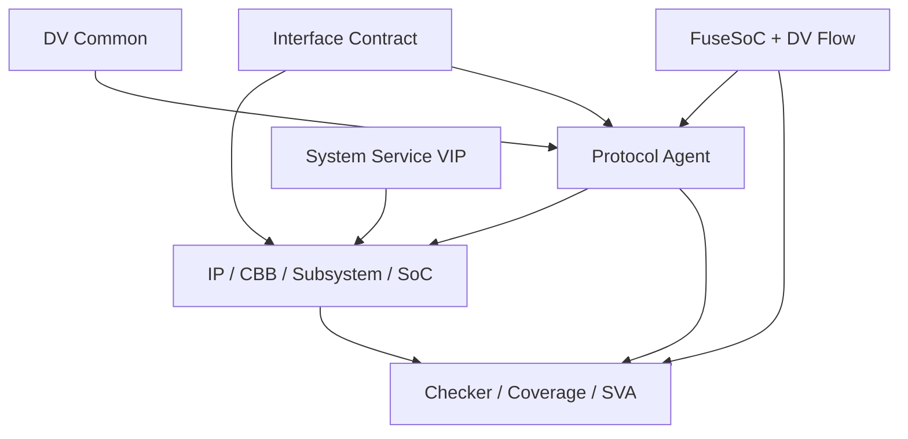

# vip — AIXSILICON VIP Repository 规划

> 来源：repos/aixsilicon_vip_repo/plan.md（完整剪切至 docs/architecture/repo-plans 统一管理）
> 迁移日期：2026-08-13
> 仓库实现现状见 docs/architecture/repos.md §1.5

---

## 一、plan.md 完整原文

# AIXSILICON VIP Repository 完整实现规划

> 版本：V1.0
> 日期：2026-08-12
> 适用范围：IP设计、CBB验证、Subsystem验证、SoC集成验证
> 工程底座：SystemVerilog/UVM、FuseSoC、YAML SSOT、SystemRDL/PeakRDL、统一Catalog、DVSim/EDA适配层

---

## 1. 建设结论

VIP Repo的目标不是收集零散UVM代码，而是建设一套可版本化、可组合、可验证、可发布、可被RTL Coding/UVM Verification Skill Suite消费的验证资产平台。

建议当前采用：

> **一个VIP Monorepo + 每个VIP独立FuseSoC Core + 统一公共基类 + 统一Release Catalog索引。**

不建议第一阶段将APB、AXI、UART等拆成多个Git仓库。VIP之间共享transaction policy、agent基类、异常注入、coverage、日志和RAL适配，过早拆仓会显著增加协同成本。以下类型成熟后可单独拆仓：

- PCIe/CXL、DDR/LPDDR、USB、Ethernet TSN、MIPI等大型VIP；
- 受特殊协议授权或出口管制约束的VIP；
- 由独立团队维护、具有独立发布节奏的VIP；
- 单个VIP代码、文档及测试规模超过仓库整体约20%，或需要单独访问控制。

### 1.1 建设目标

1. 支持IP级、CBB级、Subsystem级和SoC级验证；
2. 支持Active Master、Active Slave、Passive Monitor等标准模式；
3. 支持协议激励、协议检查、数据检查、功能覆盖、异常注入和性能测量；
4. 通过FuseSoC统一管理依赖、fileset、target、参数和工具入口；
5. 通过稳定VLNV、SemVer、Release Manifest和Catalog实现可信复用；
6. 让UVM Verification Skill Suite优先装配已有VIP，而不是重复生成Agent；
7. 支持VCS、Xcelium、Questa等商业仿真器，选择性支持Verilator/cocotb交叉验证；
8. 形成可追踪的需求—测试—覆盖—结果—发布证据链。

### 1.2 非目标

- 不把项目专用Testbench、Scoreboard和Testcase全部放入VIP Repo；
- 不在VIP中复制IP RTL或SoC Top RTL；
- 不将第三方商业VIP源码纳入公共仓库；
- 不声明“兼容某协议”而没有对应协议版本、测试和覆盖证据；
- 不直接将教学型GitHub示例作为正式VIP发布；
- 不用FuseSoC替代Regression Scheduler、结果数据库或质量Dashboard。

---

## 2. 仓库边界

| 资产 | 所属仓库 | 说明 |
|---|---|---|
| 通用UVM基类、通用Scoreboard框架 | `dv-common` | 所有VIP和项目环境共同依赖 |
| AXI/APB/UART等协议Agent | `vip-repo` | 本仓库核心内容 |
| SV interface、typedef、modport、接口语义 | `hw-interfaces` | 设计与验证共享的接口契约 |
| 项目专用Env、Virtual Sequence、Testcase | IP或SoC项目仓库 | 与被测对象版本绑定 |
| 通用协议SVA、Protocol Checker | `vip-repo` | 与对应VIP共同发布 |
| CSR定义 | 所属IP的SystemRDL | 不在VIP重复定义 |
| UVM RAL生成工具 | `eda-flow`或工具仓 | VIP提供adapter/predictor |
| SoC地址、中断、时钟复位配置 | `soc-integration` | VIP只提供对应激励/监测组件 |
| 商业VIP适配器 | 受控内部仓库 | 与开源VIP隔离，遵守许可证 |

---

## 3. 总体架构



VIP组件按职责分为六层：

1. **Interface Layer**：虚接口绑定、clocking block、modport和信号采样；
2. **Transaction Layer**：协议事务、约束、pack/unpack、compare和打印；
3. **Agent Layer**：sequencer、driver、monitor、master/slave responder；
4. **Service Layer**：memory model、RAL adapter、interrupt、clock/reset、fault injection；
5. **Checking Layer**：protocol checker、scoreboard adapter、SVA和coverage；
6. **Packaging Layer**：FuseSoC Core、metadata、测试、文档和Release Manifest。

---

## 4. 推荐目录结构

```text
vip-repo/
├── README.md
├── LICENSES/
├── CONTRIBUTING.md
├── CODEOWNERS
├── CHANGELOG.md
├── docs/
│   ├── architecture/
│   ├── development-guide/
│   ├── integration-guide/
│   └── qualification/
├── schema/
│   ├── vip_metadata.schema.yaml
│   ├── testplan.schema.yaml
│   ├── coverage.schema.yaml
│   └── release_manifest.schema.yaml
├── common/
│   ├── vip_common_pkg/
│   ├── transaction_policy/
│   ├── fault_injection/
│   ├── coverage_utils/
│   └── report_adapter/
├── protocol/
│   ├── apb/
│   ├── axi_lite/
│   ├── axi/
│   ├── axi_stream/
│   ├── ahb_lite/
│   └── ready_valid/
├── peripheral/
│   ├── uart/
│   ├── spi/
│   ├── i2c/
│   ├── gpio/
│   └── jtag_dmi/
├── system/
│   ├── clock_reset/
│   ├── interrupt/
│   ├── generic_memory/
│   ├── csr_access/
│   ├── dma_traffic/
│   ├── boot_host/
│   └── power_state/
├── safety/
│   ├── bus_fault/
│   ├── ecc_parity_fault/
│   ├── interrupt_fault/
│   ├── clock_reset_fault/
│   └── fault_campaign/
├── adapters/
│   ├── ral/
│   ├── scoreboard/
│   ├── commercial_vip/
│   └── cocotb_crosscheck/
├── formal/
│   ├── protocol_properties/
│   └── harness/
├── examples/
├── tests/
│   ├── unit/
│   ├── compatibility/
│   ├── negative/
│   ├── stress/
│   └── mutation/
├── vendor/
│   ├── manifests/
│   └── patches/
├── tools/
│   ├── metadata_check/
│   ├── testplan_check/
│   ├── package_release/
│   └── catalog_export/
└── catalog/
    ├── vip_index.yaml
    └── compatibility_matrix.yaml
```

`vendor/`只保存来源Manifest、锁定commit、许可证、补丁和SBOM信息。若直接引入第三方源码，必须保留原始版权和许可证；优先通过FuseSoC依赖外部已发布Core，而不是复制源码。

---

## 5. 单个VIP标准模板

```text
protocol/apb/
├── README.md
├── docs/
│   ├── requirements.md
│   ├── architecture.md
│   ├── user_guide.md
│   ├── testplan.md
│   └── coverage_plan.md
├── metadata/
│   ├── vip.yaml
│   ├── compatibility.yaml
│   └── release_manifest.yaml
├── src/
│   ├── apb_pkg.sv
│   ├── apb_if.sv
│   ├── apb_item.sv
│   ├── apb_config.sv
│   ├── apb_agent.sv
│   ├── apb_sequencer.sv
│   ├── apb_master_driver.sv
│   ├── apb_slave_driver.sv
│   ├── apb_monitor.sv
│   ├── apb_coverage.sv
│   ├── apb_checker.sv
│   └── apb_ral_adapter.sv
├── sva/
├── seq/
│   ├── base/
│   ├── normal/
│   ├── stress/
│   └── negative/
├── tb/
├── tests/
├── examples/
├── aix_vip_apb_1.0.0.core
└── CHANGELOG.md
```

### 5.1 FuseSoC Target规范

每个VIP至少提供：

| Target | 作用 |
|---|---|
| `default` | 作为其他Core依赖时提供package/interface/agent |
| `lint` | 编译结构和静态规则检查 |
| `unit_sim` | VIP单元测试 |
| `smoke` | 最小Master—Slave闭环 |
| `regression` | 标准回归入口 |
| `negative` | 非法时序、错误响应和协议异常测试 |
| `example` | 最小集成示例 |
| `formal` | 协议属性或Checker形式验证，可选 |
| `package` | 生成正式发布包 |

推荐VLNV：

```text
aix:vip:common:1.0.0
aix:vip:apb:1.0.0
aix:vip:axi_lite:1.0.0
aix:vip:axi:1.0.0
aix:vip:uart:1.0.0
aix:vip:clock_reset:1.0.0
```

VIP内部参数不要依赖大量编译宏。协议结构性差异使用参数、config object、policy class或独立VLNV；只允许用宏解决UVM注册、工具兼容和条件编译等必要问题。

---

## 6. VIP公共API与设计规范

### 6.1 Agent模式

所有协议Agent统一支持：

- `ACTIVE_MASTER`；
- `ACTIVE_SLAVE`；
- `PASSIVE`；
- `DISABLED`；
- 可以只启用Monitor、Checker或Coverage；
- Agent数量和实例名可配置；
- 配置必须通过config object传递，不允许依赖全局变量。

### 6.2 统一端口

每个Monitor至少提供：

- `transaction_ap`：完整事务；
- `request_ap`和`response_ap`：需要分离建模时提供；
- `error_ap`：协议错误和异常事件；
- `performance_ap`：延迟、带宽、stall等性能事件，可选。

### 6.3 统一能力

每个正式VIP必须具备：

1. 正常事务生成；
2. backpressure和随机延迟；
3. reset中断事务；
4. X/Z检测策略；
5. timeout机制；
6. 协议错误检测；
7. 合法错误响应注入；
8. Functional Coverage；
9. RAL或Scoreboard适配；
10. 自检测试和最小示例；
11. 多实例运行；
12. 固定随机种子可复现；
13. 仿真器兼容矩阵；
14. 性能开销可测量。

### 6.4 数据比较策略

禁止只依靠`uvm_object::compare()`完成所有检查。统一支持：

- 字段级compare policy；
- 允许忽略不稳定字段；
- 4-state严格比较与2-state模型比较；
- masked compare；
- order-aware和out-of-order compare；
- transaction ID关联；
- mismatch必须可失败并输出原始证据。

---

## 7. VIP建设清单与优先级

### 7.1 P0：最小可用闭环

| VIP | 首期能力 | 原因 |
|---|---|---|
| Clock/Reset VIP | 多时钟、复位序列、reset glitch、动态频率 | 所有环境依赖 |
| Ready/Valid VIP | Source/Sink/Monitor、随机stall、packet模式 | CBB与数据通路高频使用 |
| APB VIP | Master/Slave/Passive、wait/error、RAL | 最适合验证基础架构 |
| AXI4-Lite VIP | 独立读写、backpressure、error、RAL | CSR和SoC外设高频使用 |
| Generic Memory VIP | SRAM/ROM模型、延迟、错误注入、backdoor | IP与SoC普遍需要 |
| Interrupt VIP | pulse/level、mask、priority、storm、丢失/重复 | SoC集成与PIC需要 |
| VIP Common | 公共配置、transaction policy、日志、结果 | 防止各VIP重复造轮子 |

### 7.2 P1：IP和SoC主干协议

| VIP | 关键能力 |
|---|---|
| AXI4 VIP | Burst、ID、Outstanding、乱序、窄传输、4KB边界、exclusive/atomic策略 |
| AXI-Stream VIP | packet、TKEEP/TSTRB/TLAST/TID/TDEST/TUSER、backpressure |
| AHB-Lite VIP | Master/Slave/Passive、split/error策略按选定协议版本实现 |
| UART VIP | 波特率、数据位、校验、stop bit、break、framing/parity error |
| SPI/QSPI VIP | Mode 0~3、bit order、chip select、single/dual/quad、错误注入 |
| I2C VIP | Controller/Target、ACK/NACK、clock stretch、arbitration、repeated start |
| JTAG/DMI VIP | TAP状态机、IR/DR、DMI request/response、超时与错误 |
| CSR Access Service | Frontdoor/Backdoor、mirror、reset、access policy、RAL predictor |

### 7.3 P2：系统与功能安全

| VIP | 关键能力 |
|---|---|
| DMA Traffic VIP | 地址分布、burst、并发、带宽/延迟模型 |
| Boot Host VIP | ROM/Flash加载、boot strap、启动状态监测 |
| Power State VIP | power state、isolation、retention、wake-up事件 |
| ECC/Parity Fault VIP | 单比特/多比特、地址/数据/控制路径故障 |
| Bus Fault VIP | timeout、decode error、response corruption、stuck channel |
| Interrupt Fault VIP | stuck-at、lost、duplicate、storm、late interrupt |
| Fault Campaign | Fault ID、注入窗口、预期机制、检测时间、覆盖与证据 |

### 7.4 暂不建议自研的复杂VIP

PCIe/CXL、DDR/LPDDR、USB、MIPI、完整Ethernet/TSN、CHI/ACE等协议复杂、标准版本多、合规测试成本高。第一阶段应采用商业VIP或受控合作资产；内部仓库只提供统一adapter、traffic abstraction和结果接口。除非形成专职团队和明确产品化目标，否则不建议从零实现。

---

## 8. 开源VIP与参考项目调研

### 8.1 推荐候选矩阵

| 项目 | 可参考内容 | 技术/许可证 | 建议动作 | 采用等级 |
|---|---|---|---|---|
| [Accellera UVM Core](https://github.com/accellera-official/uvm-core) | IEEE 1800.2 UVM参考实现 | SystemVerilog，Apache-2.0 | 作为标准依赖与兼容基线，不修改后复制 | A |
| [OpenTitan](https://github.com/lowRISC/opentitan) `hw/dv/sv` | CIP Base、TL Agent、UART/SPI/I2C/JTAG Agent、push-pull、CSR utilities、coverage与DV方法 | SV/UVM，仓库默认Apache-2.0 | 重点研究架构、质量Gate和外设Agent；去除TL-UL及Monorepo耦合后局部复用 | A |
| [TVIP-AXI](https://github.com/taichi-ishitani/tvip-axi) | AXI4/AXI4-Lite Master/Slave、乱序、延迟、RAL adapter/predictor | SV/UVM，Apache-2.0 | 作为AXI代码起点候选；先补协议覆盖、SVA、更多工具兼容和完整自测 | A- |
| [TVIP-APB](https://github.com/taichi-ishitani/tvip-apb) | APB UVM VIP | SV/UVM，Apache-2.0 | 与自研APB骨架做对比PoC，择优重构 | B+ |
| [PULP common_verification](https://github.com/pulp-platform/common_verification) | clk/reset、timeout、ready/valid master/slave、随机等待、watchdog | SystemVerilog，含FuseSoC Core | 适合直接依赖或重构进入DV Common，需核对具体许可证文件 | A- |
| [PULP AXI](https://github.com/pulp-platform/axi) | AXI类型、测试组件、压力场景、宽度/ID转换DUT、CI测试 | SystemVerilog，Solderpad系许可证 | 用作AXI VIP对拍DUT和极限场景参考，不作为主UVM架构 | A- |
| [CORE-V-VERIF](https://github.com/openhwgroup/core-v-verif) | 工业级UVM环境、公共lib、OBI Agent、日志、CPU软件测试、ISS比较 | SV/UVM，项目含Solderpad/Apache等内容，逐文件核查 | 参考SoC/CPU环境分层、BSP/ISS/软件用例协同；不整仓移植 | A- |
| [CHIPS Alliance riscv-dv](https://github.com/chipsalliance/riscv-dv) | RISC-V随机指令生成与覆盖 | SV/UVM，Apache-2.0 | 作为CPU验证扩展接入，不归类为通用总线VIP | A |
| [cocotbext-axi](https://github.com/alexforencich/cocotbext-axi) | AXI/AXI-Lite/AXI-Stream/APB Python BFM与Memory Model | Python/cocotb，MIT | 作为独立oracle、快速原型和交叉验证模型，不替代UVM VIP | A- |
| [ZipCPU wb2axip](https://github.com/ZipCPU/wb2axip) | AXI-Lite、APB、Wishbone等形式属性与反例经验 | SVA/Formal，Apache-2.0 | 参考协议属性和负向测试；注意其Full AXI属性在主分支并不完整 | B+ |
| [Accellera OVL](https://www.accellera.org/downloads/standards/ovl) | 通用Assertion Checker | Verilog/SV等，Apache-2.0条款 | 作为公共Assertion基础依赖，不替代协议专用SVA | B+ |
| [PULP uvm-components](https://github.com/pulp-platform/uvm-components) | 历史UVM组件和FuseSoC打包示例 | SV/UVM，Apache-2.0 | 仅作历史参考；该仓库已于2025-11-28归档 | C |

采用等级含义：

- **A**：优先评估，可直接形成正式依赖或关键参考；
- **A-**：高价值，但需要适配、重构或许可证逐文件审计；
- **B+**：适合局部能力、测试思想或交叉验证；
- **C**：只作历史/教学参考，不作为新架构基础。

### 8.2 最有价值的OpenTitan目录

重点检查：

```text
hw/dv/sv/
├── cip_lib/
├── dv_utils/
├── csr_utils/
├── tl_agent/
├── push_pull_agent/
├── uart_agent/
├── spi_agent/
├── i2c_agent/
└── jtag_agent/
```

OpenTitan的价值主要不是直接拿到AXI VIP，而是参考以下工程方法：

- 公共Agent与IP专用Env分离；
- Base Env、CSR访问、scoreboard和coverage的统一组织；
- IP级DV文档、测试计划、覆盖计划和回归结果关联；
- 多IP共享DV组件；
- Full-chip环境复用IP级Agent。

需要主动剥离的耦合包括：TL-UL、CIP基类、HJSON/DVSim配置、OpenTitan目录假设、专用alert/interrupt语义。你的仓库继续统一到YAML SSOT和FuseSoC，不复制HJSON体系。

### 8.3 开源代码发现渠道

1. GitHub组织：`lowRISC`、`pulp-platform`、`openhwgroup`、`chipsalliance`、`accellera-official`；
2. GitHub检索式：
   - `language:SystemVerilog uvm_agent axi license:apache-2.0`
   - `language:SystemVerilog uvm_driver spi`
   - `path:*.core verification uvm`
   - `path:LICENSE uvm vip apb`
3. [Awesome Open Hardware Verification](https://github.com/ben-marshall/awesome-open-hardware-verification)用于候选发现，但最终结论必须回到原始仓库；
4. Accellera官方UVM、OVL和VIP Recommended Practices；
5. 开源SoC/IP项目的`dv/`、`tb/`、`verification/`和`vendor_lib/`目录；
6. 商业EDA工具随附的UVM示例只能用于学习，是否可复制必须检查授权。

---

## 9. 第三方VIP准入流程

任何开源资产进入正式仓库前必须经过以下流程：


### G0：来源与许可证

- 记录仓库URL、commit hash、tag、作者、许可证和NOTICE；
- 检查仓库级许可证与文件头是否一致；
- 检查依赖、submodule、生成代码和协议规范授权；
- 生成SBOM；
- GPL/AGPL、未知许可证或仅限非商业使用的资产默认不进入正式库；
- Apache/Solderpad/MIT等也必须经过公司法务或开源办公室确认。

### G1：代码结构审计

- 是否是真正可复用VIP，而非单一DUT的Testbench；
- 是否支持Master/Slave/Passive；
- 是否存在全局变量、硬编码层次路径、固定宽度和固定实例名；
- 是否依赖特定仿真器私有语法；
- 是否有可运行测试、coverage、checker和文档；
- 是否存在未锁定外部依赖。

### G2：协议符合性审计

- 建立协议条款—Requirement ID—Test ID—Coverage ID映射；
- 审计正常、边界、异常和reset行为；
- 独立检查driver和monitor，避免两者共享同一个错误假设；
- Protocol Checker不能只检查数据结果，还要检查信号时序和稳定性；
- 未覆盖功能必须在compatibility metadata中明确声明。

### G3：隔离PoC

- 用最小Master—Slave loopback运行；
- 用至少两个独立DUT验证；
- 对接至少两个仿真器；
- 注入已知协议错误，确认Checker真实报错；
- 固定种子重跑，确认可复现。

### G4：交叉验证

建议至少使用两种独立实现交叉检查：

- 内部UVM Master ↔ cocotbext或PULP参考Slave；
- TVIP Master ↔ 内部Slave；
- 内部Master ↔ PULP AXI模块；
- 协议SVA ↔ 故意带Bug的mutation DUT；
- 商业VIP ↔ 内部VIP，条件允许时执行。

### G5：内部重构与发布

- 适配统一interface contract；
- 适配统一config、analysis port、error event和coverage API；
- 形成FuseSoC Core；
- 补齐需求、架构、用户指南、测试计划和覆盖计划；
- 通过Qualification后再发布内部VLNV；
- 不隐去第三方版权，不将内部重构声称为完全自研。

---

## 10. 测试与Qualification体系

### 10.1 测试层次

| 层次 | 目标 |
|---|---|
| Structure Test | 文件、metadata、VLNV、依赖、Schema正确 |
| Compile Test | 多仿真器编译和elaboration通过 |
| Component Unit Test | transaction、config、sequence、driver、monitor单元行为正确 |
| Loopback Test | Master—Slave—Monitor闭环 |
| Checker Negative Test | 每一类协议错误都能被检测 |
| Reference DUT Test | 在开源或内部黄金DUT上验证 |
| Cross-model Test | 与独立VIP/BFM对拍 |
| Stress Test | 长时间、随机stall、多Outstanding、reset打断 |
| Mutation Test | 人为注入DUT或VIP缺陷，验证检测能力 |
| Integration Test | 在真实IP、CBB和Subsystem中复用 |

### 10.2 质量Gate

| Gate | 出口条件 |
|---|---|
| V0 Prototype | 单仿真器编译，基本事务跑通，不允许正式项目依赖 |
| V1 Alpha | Master/Slave/Passive基本完成，单元测试通过 |
| V2 Beta | 两个DUT、两个仿真器、基础coverage和negative test通过 |
| V3 Qualified | RTM闭环、协议覆盖达标、mutation test通过、文档齐全 |
| V4 Proven | 至少两个项目使用并完成问题闭环，兼容矩阵稳定 |

正式Catalog默认只显示`Qualified`和`Proven`版本。

### 10.3 建议指标

- Requirement覆盖率：100%；
- Planned Test执行率：100%；
- Planned Functional Coverage覆盖率：100%，覆盖点命中率按协议设Gate；
- 所有P0/P1 Protocol Checker负向用例：100%检测；
- 严重等级S0/S1缺陷：0；
- 至少VCS/Xcelium/Questa中的两种通过；
- 同一seed和同一工具版本可复现；
- Release包包含命令、工具版本、日志hash、源码hash和依赖锁定；
- 公共VIP不允许存在未声明的项目层次路径依赖。

---

## 11. CI/CD与发布

### 11.1 Pull Request流水线

1. YAML/Schema/格式检查；
2. 许可证和SBOM检查；
3. FuseSoC Core解析、依赖闭包和VLNV重复检查；
4. Lint与编译；
5. 受影响VIP的unit/smoke/negative测试；
6. RTM、Testplan和Coverage ID完整性检查；
7. 文档构建；
8. 生成影响分析报告。

### 11.2 Nightly流水线

- 全VIP多工具编译；
- 标准Regression；
- 随机种子扩展；
- Coverage Merge；
- Mutation Test抽样；
- 性能与仿真开销趋势；
- Flaky Test检测；
- Catalog质量状态更新。

### 11.3 Release流水线

- 只允许从受保护Release分支或tag触发；
- SemVer和CHANGELOG检查；
- 依赖锁定；
- 全量Qualification；
- 生成Release Manifest、SBOM、Quality Report、RTM和文档；
- 生成签名或hash；
- 发布到GitHub Release；
- Catalog Builder更新统一Catalog；
- AIXSILICON展示版本、成熟度、兼容矩阵和验证证据。

---

## 12. YAML元数据建议

```yaml
schema_version: 1.0

vip:
  id: VIP-AXI-001
  name: axi
  vlnv: aix:vip:axi:1.0.0
  lifecycle: beta
  owner: dv-platform
  license: Apache-2.0

protocol:
  family: AMBA
  name: AXI4
  revision: declared-controlled-version
  modes: [active_master, active_slave, passive]

capabilities:
  outstanding: true
  out_of_order: true
  narrow_transfer: true
  unaligned_transfer: true
  read_interleave: true
  exclusive_access: planned

dependencies:
  - aix:vip:common:^1.0
  - aix:interface:axi:^1.0

tools:
  vcs: qualified
  xcelium: qualified
  questa: beta
  verilator: unsupported

quality:
  gate: V2_BETA
  requirement_coverage: 100
  negative_test_pass_rate: 100

provenance:
  derived_from: []
  sbom: metadata/sbom.spdx.json
```

协议规范版本不能写成模糊的“latest”，必须在受控环境中记录实际使用的规范标识。对于无法随仓库分发的标准正文，只记录引用和内部受控位置。

---

## 13. 实现路线图

以下按5人核心团队估算：1名架构/负责人、2名VIP工程师、1名DV Flow/CI工程师、1名验证与Qualification工程师；形式验证、法务/开源合规和协议专家兼职支持。

### 阶段0：立项和技术选型，2周

交付：

- VIP Charter和仓库边界；
- UVM版本与仿真器基线；
- VIP Metadata/Testplan/Release Manifest Schema；
- 开源候选清单与License Review模板；
- APB、AXI开源PoC方案；
- P0需求基线和TODO Board。

出口：所有Owner明确，架构评审通过，选定首个PoC。

### 阶段1：公共底座，4周

交付：

- 仓库骨架；
- `aix:vip:common`；
- FuseSoC target模板；
- Clock/Reset、Ready/Valid基础组件；
- CI最小闭环；
- 文档、Testplan、Coverage模板；
- Catalog导出器初版。

出口：新建VIP可以由模板在1天内生成骨架并跑通smoke。

### 阶段2：APB与系统基础VIP，6周

并行建设：

- APB VIP；
- Generic Memory VIP；
- Interrupt VIP；
- CSR/RAL adapter；
- OpenTitan/TVIP/PULP候选审计与对拍。

出口：APB达到V3 Qualified，其余达到V2 Beta；至少接入一个真实IP。

### 阶段3：AXI4-Lite与AXI-Stream，8周

交付：

- AXI4-Lite VIP；
- AXI-Stream VIP；
- SVA/Protocol Checker；
- cocotbext/PULP交叉验证；
- reset/backpressure/error/mutation测试；
- 多仿真器兼容。

出口：AXI4-Lite达到V3，AXI-Stream达到V2；在总线桥、CSR IP或数据通路CBB中落地。

### 阶段4：完整AXI4，10~12周

交付：

- Burst、ID、Outstanding、乱序、窄传输、非对齐、4KB边界；
- 高并发Master和可编程Slave responder；
- Memory model与scoreboard adapter；
- 性能监测；
- 协议覆盖与大量负向测试；
- 与TVIP-AXI、PULP AXI及可用商业VIP交叉验证。

出口：AXI4达到V2 Beta；V3 Qualification可在后续项目中持续完成。完整AXI不应因赶节点而提前标为Qualified。

### 阶段5：外设与SoC服务VIP，8~12周

按项目需求排序建设UART、SPI/QSPI、I2C、JTAG/DMI、Boot Host、Power State；复用OpenTitan Agent架构，但去除TL-UL和CIP耦合。

出口：至少三类外设VIP达到V2，至少一个Subsystem/SoC环境完成复用。

### 阶段6：功能安全与规模化运营，持续

交付：

- Bus/Interrupt/ECC/Clock/Reset故障注入；
- Fault Campaign Schema与自动执行；
- PIC、总线安全、CRG、存储安全机制接入；
- 质量Dashboard；
- UVM Verification Skill自动选型、装配与Gate；
- 项目反馈—缺陷—回归—版本闭环。

---

## 14. 人力与周期建议

| 模式 | 配置 | 预期结果 |
|---|---|---|
| 最小团队 | 3人，6个月 | Common、APB、AXI4-Lite、Clock/Reset、Memory、Interrupt达到可用；完整AXI难以Qualified |
| 推荐团队 | 5人，9~12个月 | P0/P1主干完成，完整AXI Beta/Qualified，若干外设VIP落地 |
| 平台团队 | 7~9人，12个月 | 增加Formal、功能安全、外设并行、多工具Qualification和项目支持 |

人员能力要求：

- 至少2人熟悉完整SystemVerilog/UVM；
- 至少1人熟悉AXI协议边界和SoC互联；
- 至少1人负责CI、FuseSoC、回归和结果Schema；
- 至少1人独立负责Checker、Coverage和Qualification，避免实现者自证；
- 形式验证能力可以兼职，但协议SVA不能长期无人负责。

---

## 15. 与Skill Suite及AIXSILICON的结合

UVM Verification Skill Suite不应默认生成新的Agent，而应按以下流程工作：

1. 从IP/SoC接口Metadata识别协议和版本；
2. 查询Catalog，选择兼容且成熟度足够的VIP VLNV；
3. 生成FuseSoC依赖和环境装配代码；
4. 生成IP专用Config、Virtual Sequence、Reference Model adapter和Scoreboard；
5. 将Requirement ID映射到VIP sequence、project testcase和coverage；
6. 运行compile/smoke/regression Gate；
7. 将日志、coverage、seed、工具版本和hash写入Evidence；
8. 在AIXSILICON项目座舱展示VIP版本、质量等级和复用关系。

Skill负责专业决策、装配和异常路径，脚本负责Schema校验、构建、运行、报告和发布等确定性任务。

---

## 16. 主要风险与控制

| 风险 | 控制措施 |
|---|---|
| 开源代码看似完整但协议覆盖不足 | RTM、负向测试、mutation test、独立对拍 |
| Driver与Monitor共享同一Bug | 独立实现关键解析逻辑，使用第三方模型交叉检查 |
| AXI范围无限膨胀 | 明确首版支持矩阵，按SemVer增加功能 |
| 第三方许可证污染 | SBOM、逐文件审计、受控vendor流程、法务确认 |
| 与OpenTitan/PULP强耦合 | 只吸收架构与局部组件，统一适配到本地Interface/DV Common |
| 仿真器兼容性差 | PR双工具编译、Nightly多工具回归、禁止无条件私有语法 |
| VIP变成项目代码垃圾场 | 项目Env/Test留在项目仓，公共VIP必须通过复用准入评审 |
| 只追求代码生成数量 | Gate按检测能力、协议覆盖、项目复用和缺陷发现统计 |
| 商业VIP与自研VIP接口割裂 | 建立统一adapter、transaction abstraction和结果Schema |

---

## 17. 首批TODO List

### P0：立即启动

- [ ] 建立`vip-repo`和CODEOWNERS；
- [ ] 冻结VIP/dv-common/hw-interfaces边界；
- [ ] 确认UVM基线：UVM 1.2与IEEE 1800.2兼容策略；
- [ ] 定义VIP Metadata、Testplan、Coverage和Release Manifest Schema；
- [ ] 定义统一Agent Config、analysis port和error event API；
- [ ] 创建FuseSoC Core模板和标准targets；
- [ ] 对TVIP-APB、OpenTitan、PULP common_verification完成许可证及架构审计；
- [ ] 完成APB“自研骨架 vs TVIP-APB适配”双PoC；
- [ ] 建立Clock/Reset和Ready/Valid组件；
- [ ] 建立最小CI：Schema→Compile→Smoke→Negative→Report；
- [ ] 选择第一个真实IP作为穿刺项目。

### P1：首个季度

- [ ] APB达到V3 Qualified；
- [ ] Clock/Reset、Memory、Interrupt达到V2以上；
- [ ] AXI4-Lite和AXI-Stream完成Beta；
- [ ] 接入至少两种仿真器；
- [ ] 建立cocotbext/PULP交叉验证；
- [ ] 接入UVM Verification Skill Suite；
- [ ] Catalog显示VIP能力和兼容矩阵。

### P2：两个季度

- [ ] 完整AXI4达到V2/V3；
- [ ] UART、SPI、I2C至少三项达到V2；
- [ ] 完成功能安全故障注入基础框架；
- [ ] 至少两个IP和一个Subsystem复用；
- [ ] 建立Mutation Test和质量趋势Dashboard；
- [ ] 形成首个Proven级VIP版本。

---

## 18. 第一批验收场景

建议选择三个真实穿刺对象：

1. **APB寄存器型IP**：验证APB、RAL、Interrupt、Clock/Reset完整闭环；
2. **AXI/AXI-Lite桥或X2X类IP**：验证Outstanding、位宽、异步、backpressure、error response和reset；
3. **PIC或功能安全中断模块**：验证Interrupt VIP、故障注入、Safety Mechanism Checker和Fault Campaign。

三类场景分别代表外设IP、数据/总线路径和SoC功能安全集成，可以较完整地检验VIP Repo是否真正具备通用性。

---

## 19. 最终出口定义

VIP Repo一期完成不能只以“提交多少个Agent”衡量，应满足：

- P0 VIP具有稳定VLNV和FuseSoC依赖；
- APB、AXI4-Lite等至少一个主干VIP达到Qualified；
- 至少两个真实项目成功复用；
- 开源来源、许可证、修改和SBOM可追踪；
- Requirement/Test/Coverage/Evidence闭环；
- Checker能通过负向和mutation测试证明检测能力；
- 多仿真器兼容；
- Catalog可以查询能力、版本、质量和兼容关系；
- UVM Verification Skill Suite能够自动发现并装配VIP；
- 项目不再重复生成APB/AXI/UART等基础Agent。

届时VIP Repo将从“验证代码仓”升级为IP设计与SoC集成的公共验证产品线。

---

## 20. 跨仓一致性修订（2026-08-13）

> 依据 [`plans/cross-repo-architecture-review.md`](../../plans/cross-repo-architecture-review.md)（ADR-0003/0005/0006）。

- 修正幽灵仓引用：`eda-flow`/`eda-rules` → workflow（DAG/Gate）+ tool（Result adapter）、workflow `policies/`；`hw-models` → techlib/model；
- 与 dv-common 划界（R6）：VIP `common/` 只保留协议/事务相关公共；log/scoreboard/clk_rst/result 等协议无关机制归 dv-common；
- 协议 SVA/Checker/Coverage 归本仓；接口契约归 hwif；桥/同步器/位宽转换实现归 cbb；
- vendored `reference/`（OpenTitan/PULP 等）为只读对拍，不发布、不进入 fusesoc 正式发现与 Catalog（A2）；
- VLNV 统一 `aixsilicon:vip:*`（ADR-0003，存量 `aix:vip:*` 走迁移窗口）。
