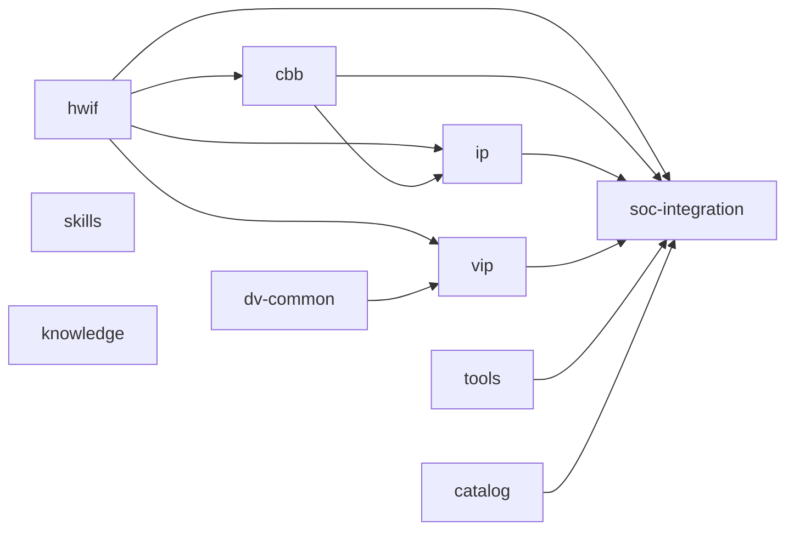

# 被统筹对象：10 个 Repo（repos）

> 本页从「Workflow 统筹对象」视角，为每个 repo 提供一份材料，并单独成章阐述 repo 之间的依赖、数据流与边界关系。
> 全景依赖源：[`manifests/default.yaml`](../../manifests/default.yaml)；Schema 所有权：[`docs/schema-ownership.md`](../schema-ownership.md)；写入边界：[`ownership-map.yaml`](../../ownership-map.yaml)。

---

## 0. 关系总览

### 0.1 仓库全景表

| 逻辑 ID | 仓库 | 类型 | 定位 | 开放度 | 当前内容状态 |
|---|---|---|---|---|---|
| hwif | [`aixsilicon_hwif_repo`](../../repos/aixsilicon_hwif_repo) | hw-interface | 接口语义契约与 HDL 多视图 | 开源 | 已建（契约/绑定/多视图目录齐全） |
| cbb | [`aixsilicon_cbb_repo`](../../repos/aixsilicon_cbb_repo) | cbb | 可参数化公共逻辑构件与 PPA 实现 | 开源 | 已建（结构齐备，待填充资产） |
| ip | [`aixsilicon_ip_repo`](../../repos/aixsilicon_ip_repo) | ip | 可独立集成和发布的完整 IP | 开源 | 已建（registry + ips 骨架） |
| dv-common | [`aixsilicon_dv_common`](../../repos/aixsilicon_dv_common) | dv-common | 协议无关验证公共底座 | 开源 | 已建（src/rtl/schemas/release 齐全） |
| vip | [`aixsilicon_vip_repo`](../../repos/aixsilicon_vip_repo) | vip | 协议与系统验证组件 | 开源 | 已建（protocol/schema/adapters 骨架） |
| tools | [`aixsilicon_tool_repo`](../../repos/aixsilicon_tool_repo) | tool | 确定性生成/检查/转换/打包工具 | 开源 | 已建（5 个 packages） |
| catalog | [`aixsilicon_catalog_repo`](../../repos/aixsilicon_catalog_repo) | catalog | 已发布资产索引、兼容矩阵、成熟度 | 开源 | 已建（index + assets + schema） |
| soc-integration | [`aixsilicon_soc_integration`](../../repos/aixsilicon_soc_integration) | soc-integration | 通用 SoC 集成 Schema/模板/规则 | 开源 | 已建（schema + examples） |
| skills | [`aixsilicon_skill_repo`](../../repos/aixsilicon_skill_repo) | skill | AI 辅助研发 Skill Suite | **私有** | 已建（ip-development-suite + registry） |
| knowledge | [`aixsilicon_chipknowledge`](../../repos/aixsilicon_chipknowledge) | other | 芯片研发知识库（方法论/术语/索引） | 开源 | 已接入（内容待填充） |

### 0.2 仓库依赖 DAG

由 [`manifests/default.yaml`](../../manifests/default.yaml) 的 `depends_on` 推导（有向无环）：

> 说明：`skills`、`knowledge` 不参与资产依赖 DAG；`skills` 提供“能力增强”，`knowledge` 提供“知识/参考”，二者与主链以虚线语义协作（见 §2.2）。

### 0.3 四域分组

| 域 | 仓库 | 共同点 |
|---|---|---|
| **接口/设计域** | hwif、cbb、ip | 定义接口与设计资产，是 IP 主线的核心 SSOT |
| **验证域** | dv-common、vip | 提供验证基础设施与协议组件，支撑两条主线验证 |
| **集成/发布域** | soc-integration、catalog | 消费设计/验证资产，产出 SoC 与发布索引 |
| **执行/知识域** | tools、skills、knowledge | 提供确定性执行能力、AI 方法论与知识参考 |

---

## 1. 每个 Repo 的材料（10 份，统一模板）

> 模板：**定位 / 当前内容 / 职责与边界 / 依赖关系 / IP 主线角色 / SoC 主线角色 / Schema 所有权 / 工具归属 / 关系阐述**。

### 1.1 hwif — `aixsilicon_hwif_repo`

- **定位**：接口语义契约（YAML Contract）与 HDL 多视图（SV package / interface / flat wrapper）的单一事实源。
- **当前内容**：`contracts/bindings/generated` 语义目录 + `bus/`、`memory/`、`peripheral/`、`common/`、`foundation/`、`profiles/`、`schema/`、`tools/`、`docs/`、`tests/`、`examples/`。
- **职责与边界**：负责接口契约及其兼容性信息（DIRECT / ADAPTER_REQUIRED / INCOMPATIBLE）；不保存具体 IP 的 RTL/验证。
- **依赖关系**：上游无；**下游**：cbb、ip、vip、soc-integration 均 `depends_on [hwif]`，是依赖 DAG 的底座。
- **IP 主线角色**：`hwif.compatibility-check` 阶段校验 producer/consumer 契约；多视图由 `aix-hwif-gen` 确定性生成。
- **SoC 主线角色**：为 SoC 实例提供接口契约与视图，约束互联与绑定。
- **Schema 所有权**：`interface-contract / profile / binding / compatibility`（[`docs/schema-ownership.md`](../schema-ownership.md)）。
- **工具归属**：契约检查与多视图生成属 T1（`aix-hwif-gen` 已入 tool_repo）；仓内 `tools/compatibility_check` 为迁移窗口内的 T2 回退脚本。
- **关系阐述**：向 cbb/ip/vip/soc-integration **提供**接口契约；契约变更经 `hwif-change` 流程向下游广播影响。

### 1.2 cbb — `aixsilicon_cbb_repo`

- **定位**：可参数化公共逻辑构件（FIFO/CDC/仲裁/位宽转换/ECC 等）与 PPA 实现的 SSOT。
- **当前内容**：`components/`、`adapters/`、`recipes/`、`flows/`、`verification/`、`schemas/`、`templates/`、`docs/`（含 `cbb_spec/`、`ppa/`）、`registry.yaml`。
- **职责与边界**：聚焦构件粒度与参数空间/PPA；不承担完整 IP 的 CSR/中断语义（那属于 IP）。
- **依赖关系**：上游 `[hwif]`；**下游**：ip、soc-integration。
- **IP 主线角色**：IP 通过 `depends_on [hwif, cbb]` 复用 CBB 构件；`tool.ppa-bench` 阶段可对 CBB 做参数化 PPA 评估。
- **SoC 主线角色**：作为实例化单元进入 SoC，参与 build/sim。
- **Schema 所有权**：`cbb-metadata / params / result`。
- **工具归属**：PPA bench 等跨仓工具归 T1；仓内测试/CI 脚本归 T2。
- **关系阐述**：消费 hwif 契约，产出被 ip 与 soc-integration 依赖的构件；与 ip 的边界是“构件 vs 完整功能单元”。

### 1.3 ip — `aixsilicon_ip_repo`

- **定位**：可独立集成和发布的完整 IP（RTL/CSR/文档/验证交付）的 SSOT。
- **当前内容**：`ips/`、`registry.yaml`、`ipkg.yaml`、`docs/`、`fusesoc.conf`、`CHANGELOG.md`。
- **职责与边界**：负责具体 IP 的 SystemRDL/RTL/UVM 环境与交付定义；不保存 SoC Top 事实源。
- **依赖关系**：上游 `[hwif, cbb]`；**下游**：soc-integration。
- **IP 主线角色**：**核心写入方**——`spec/contract/csr/rtl/dv` 各阶段把规格、契约、CSR 派生、RTL、验证写入 `ips/`；`ip-verification` 发布前在此完成联合验证与打包。
- **SoC 主线角色**：作为被实例化资产进入 SoC 集成（由 catalog 选型后实例化）。
- **Schema 所有权**：IP 级文档/交付（IP 自身约定）；具体 Schema 交由各 Owner 域。
- **工具归属**：CSR/核心生成用 T1 `aix-reg-tool` / `aix-core-tool`；仓内脚本 T2。
- **关系阐述**：站在 hwif+cbb 之上，产出被 soc-integration 消费；是「IP 设计验证」主线的交付核心。

### 1.4 dv-common — `aixsilicon_dv_common`

- **定位**：协议无关的 UVM 公共基础设施（环境/运行服务/RAL 公共机制/结果 Schema）的 SSOT。
- **当前内容**：`src/`、`rtl/`、`dpi/`、`schemas/`、`release/`、`metadata/`、`unit/`、`docs/`（architecture/component_catalog/dependency_rules）、`tools/`。
- **职责与边界**：提供验证公共底座；不保存具体协议行为（归 VIP）与具体 IP 验证环境（归 IP）。
- **依赖关系**：上游无；**下游**：vip。
- **IP 主线角色**：为 IP 的 UVM 环境提供公共组件与 Run Manifest / Test Result Schema。
- **SoC 主线角色**：为 SoC 级验证提供公共底座。
- **Schema 所有权**：`dv-run-manifest / test-result / failure / metric`。
- **工具归属**：验证运行/结果归一工具 T1/T2；仓内脚本 T2。
- **关系阐述**：被 vip 依赖；与 hwif 无直接依赖，但与 vip 共同构成「验证域」供给 IP/SoC 主线。

### 1.5 vip — `aixsilicon_vip_repo`

- **定位**：协议与系统验证组件（事务/Agent/BFM/Monitor/Checker/Coverage/Sequence）的 SSOT。
- **当前内容**：`protocol/`、`peripheral/`、`common/`、`adapters/`、`formal/`、`safety/`、`system/`、`catalog/`、`schema/`、`tests/`、`docs/`。
- **职责与边界**：负责协议行为与验证组件；不保存协议无关公共底座（归 dv-common）。
- **依赖关系**：上游 `[hwif, dv-common]`；**下游**：供 ip/soc-integration 验证复用。
- **IP 主线角色**：`vip-development` 维护验证组件；IP 验证环境消费 VIP Agent/Checker/Coverage。
- **SoC 主线角色**：SoC 级系统验证（boot smoke、系统抽查）复用 VIP。
- **Schema 所有权**：`vip-metadata / testplan / coverage / release-manifest`。
- **工具归属**：协议相关确定性生成/自检工具 T1/T2。
- **关系阐述**：建立在 hwif（协议接口）与 dv-common（公共底座）之上，向 IP/SoC 验证提供协议能力。

### 1.6 tools — `aixsilicon_tool_repo`

- **定位**：跨仓公共**确定性执行能力**（生成/检查/转换/打包），经 `aixsilicon.commands` 插件暴露为 `aix tool`。
- **当前内容**：`packages/`：`aix-core-tool`、`aix-hwif-gen`、`aix-reg-tool`、`aix-schema`、`aix-tool-core`（各含 `pyproject.toml`、`src/`、`tests/`）。
- **职责与边界**：保存“怎么确定性生成/检查”，**不保存某个 IP 的事实**；EDA 二进制/License/私有路径不进本仓。
- **依赖关系**：上游无；**下游**：soc-integration（`depends_on` 含 tools）。
- **IP 主线角色**：`tool.reg-gen`（CSR/RAL/Header）、`tool.schema`（校验）、`tool.core-tool`（FuseSoC core）在 IP 主线各阶段执行确定性生成。
- **SoC 主线角色**：`tool.address-gen / irq-gen / crg-gen / top-gen / sw-gen / connect-check` 生成 SoC 派生视图。
- **Schema 所有权**：`tool-result / diagnostic / artifact / plugin-manifest`。
- **工具归属**：**T1 的核心载体**；t2 仓内脚本留在各资产仓；t3 私有适配走私有 overlay。
- **关系阐述**：是「Workflow 编排 → 确定性执行」的落点，把命令作用于 hwif/cbb/ip/soc 等资产仓。

### 1.7 catalog — `aixsilicon_catalog_repo`

- **定位**：已发布资产索引、兼容矩阵与成熟度（VLNV / Git URL / Tag / SHA / SemVer / 依赖 / License / Owner / Evidence）。
- **当前内容**：`catalog/index.yaml`、`catalog/assets/`（cbb-hac-adapters、dv-common-types、hwif-apb、hwif-hac-if、ip-hac-aes、ip-uart、vip-hac-if）、`schemas/catalog-asset.schema.json`。
- **职责与边界**：发布资产目录，**不保存源码/交付物**；只索引与判定可发布资产。
- **依赖关系**：上游无；**下游**：soc-integration（选型消费）。
- **IP 主线角色**：`catalog.update` 在 IP 发布后写入资产条目。
- **SoC 主线角色**：`catalog.resolve` 在 SoC 集成起步做资产选型。
- **Schema 所有权**：`catalog-asset`。
- **工具归属**：目录更新走 release 流程（生成草案 + PR，不自动 merge）。
- **关系阐述**：是「IP 主线 → 发布 → SoC 主线」之间的**桥梁**；Workflow 消费并更新它，但不以其取代本地 Manifest。

### 1.8 soc-integration — `aixsilicon_soc_integration`

- **定位**：通用 SoC 集成 Schema、模板、规则（实例/地址/中断/CRG/Power/连接）的 SSOT；**不是具体产品 Top**。
- **当前内容**：`schema/soc-config.schema.json`、`examples/`（hac-accel-soc、minimal-soc）。
- **职责与边界**：负责通用集成能力；具体芯片配置归私有 `chip_<project>_soc_repo`，生成器归 tools。
- **依赖关系**：上游 `[hwif, cbb, ip, catalog, tools]`（聚合度最高）。
- **IP 主线角色**：基本不参与（IP 主线在 IP 粒度）。
- **SoC 主线角色**：**核心消费/配置方**——`soc.schema-check` 校验 SoC 配置；提供实例化/地址/中断/CRG/Power 规则。
- **Schema 所有权**：`soc-config（instance/address/irq/crg/power/connect）`。
- **工具归属**：集成检查/生成走 T1 tools；仓内示例与规则 T2。
- **关系阐述**：消费 hwif/cbb/ip/catalog/tools 全部上游，产出 SoC 集成规则与参考配置，是「SoC 集成验证」主线的核心支撑。

### 1.9 skills — `aixsilicon_skill_repo`（私有）

- **定位**：AI 辅助研发 Skill Suite（IP 开发/验证方法论、Agent 编排、Prompt）与核心方法论；**私有**。
- **当前内容**：`skills/ip-development-suite/`（SKILL.md、references/、scripts/、evals/、lib/uvm-1.2/）、`registry/skills.yaml`、`skill_repo_plan.md`。
- **职责与边界**：决定“如何理解与辅助”；不保存资产事实；不成为开源仓构建/测试的隐藏必需依赖。
- **依赖关系**：上游无（DAG 之外，能力增强层）。
- **IP 主线角色**：`skill.ip.spec` / `skill.ip.rtl` 驱动 IP 设计与生成。
- **SoC 主线角色**：间接辅助 SoC 集成方法。
- **Schema 所有权**：`skill-metadata / context-pack / skill-result / eval`。
- **工具归属**：Skill 内脚本随 Skill 私有；公共确定性能力仍走 T1 tools。
- **关系阐述**：与 Workflow 是“指导/编排”关系——Skill 选流程，Workflow 执行并判定。

### 1.10 knowledge — `aixsilicon_chipknowledge`

- **定位**：芯片研发知识库（方法论/术语/参考索引），`exports: [chip-knowledge]`。
- **当前内容**：`knowledge/`、`schemas/`、`templates/`、`skills/`、`assets/`、知识手册相关文档（原 `ROADMAP.md`/`TODO.md`/`plans/reference-material-spec.md` 已收口至 [`repo-plans/knowledge.md`](repo-plans/knowledge.md)）。
- **职责与边界**：知识/参考沉淀，不替代资产仓 SSOT。
- **依赖关系**：上游无；被工程实践消费（参考性）。
- **IP/SoC 主线角色**：提供方法论文档与术语参考，辅助 Skill 与工程实践。
- **Schema 所有权**：无（独立知识域）。
- **工具归属**：知识库建设脚本 T2/T4。
- **关系阐述**：横向知识供给，与主链无硬依赖。

---

## 2. 关系阐述

### 2.1 依赖关系推导表

| 仓库 | 上游 `depends_on` | 下游被依赖 | 依赖 DAG 中的位置 |
|---|---|---|---|
| hwif | — | cbb、ip、vip、soc-integration | 底座 |
| cbb | hwif | ip、soc-integration | 设计层 |
| ip | hwif、cbb | soc-integration | 设计层（IP 主线核心） |
| dv-common | — | vip | 验证底座 |
| vip | hwif、dv-common | ip/soc 验证复用 | 验证层 |
| tools | — | soc-integration | 执行层 |
| catalog | — | soc-integration | 发布层 |
| soc-integration | hwif、cbb、ip、catalog、tools | — | 聚合终点 |
| skills | —（DAG 外） | Workflow（能力增强） | 方法层 |
| knowledge | —（DAG 外） | 工程实践（参考） | 知识层 |

### 2.2 数据流关系

- **契约流**：hwif（interface contract）→ cbb / ip / vip / soc-integration（消费接口语义）。
- **验证流**：dv-common（公共底座）+ vip（协议组件）→ ip 验证 / SoC 验证 → Evidence。
- **发布流**：ip（+ hwif/cbb）→ `release-train`（G7）→ catalog 条目 → soc-integration 选型。
- **执行流**：Workflow 编排 tools（T1）对 hwif/cbb/ip/soc 做确定性生成/检查；skills 指导流程选择。

### 2.3 写入边界关系（[`ownership-map.yaml`](../../ownership-map.yaml)）

| 资产 | Owner 仓 | Skill 写入策略 | 允许路径 |
|---|---|---|---|
| Interface Contract | hwif | 生成草案可，提交需人工确认 | contracts/bindings/generated |
| CBB 代码/属性/PPA | cbb | 可写指定目录，不自动 commit | cbb |
| VIP 代码 | vip | 可写工作树，不自动 commit | transactions/agents/bfm/monitor/checker/coverage |
| DV Common 组件 | dv-common | 可写工作树，不自动 commit | common |
| IP RTL/SystemRDL/文档 | ip | 可写指定 IP 目录 | ips |
| Tool 实现 | tools | 仅 Tool 开发流程可写 | packages |
| SoC 通用 Schema/模板 | soc-integration | 仅通用集成能力开发可写 | schema/templates/rules |
| Manifest/Flow/Policy | **workflow（本仓）** | 仅 Workflow 维护流程可写 | manifests/workflows/policies/schemas/changesets |
| Catalog 资产条目 | catalog | 仅 Release 流程可写（草案+PR，不自动 merge） | assets/compatibility/maturity |
| Skill 实现 | skills | 仅 Skill 开发流程可写；私有 | skills |

### 2.4 Schema 所有权关系（[`docs/schema-ownership.md`](../schema-ownership.md)）

每个事实域**只有一个 Owner 仓**，禁止多仓各自维护同义 Schema：

| 事实域 | Owner |
|---|---|
| workspace-manifest / lock / flow / change-bundle / tool-profile / evidence | **workflow（本仓）** |
| interface-contract / profile / binding / compatibility | hwif |
| cbb-metadata / params / result | cbb |
| vip-metadata / testplan / coverage / release-manifest | vip |
| dv-run-manifest / test-result / failure / metric | dv-common |
| soc-config（instance/address/irq/crg/power/connect） | soc-integration |
| catalog-asset | catalog |
| tool-result / diagnostic / artifact / plugin-manifest | tools |
| skill-metadata / context-pack / skill-result / eval | skills |

### 2.5 命名与状态备注

- **命名不一致**：`dv-common`、`soc-integration` 无 `_repo` 后缀，与其余 7 仓不一致（待统一决策，GitHub 自动重定向旧 URL）。
- **待填充**：`tool_repo`（packages 骨架）、`catalog_repo`（assets 初始条目）、`soc_integration`（schema/examples）、`skill_repo`（suite 齐全）、`chipknowledge`（内容待填充）。
- **规划文件已收口**：各子仓 plan/todo 已剪切至 [`repo-plans/`](repo-plans/README.md) 统一管理。

---

## 3. 相关文档

- 统筹编排：**[workflows.md](workflows.md)**
- 关系框图：**[relationship-diagram.md](relationship-diagram.md)**
- 各仓计划/待办：**[repo-plans/](repo-plans/README.md)**
- 全仓清单：**[gitlist.md](../../gitlist.md)**、**[docs/schema-ownership.md](../schema-ownership.md)**
