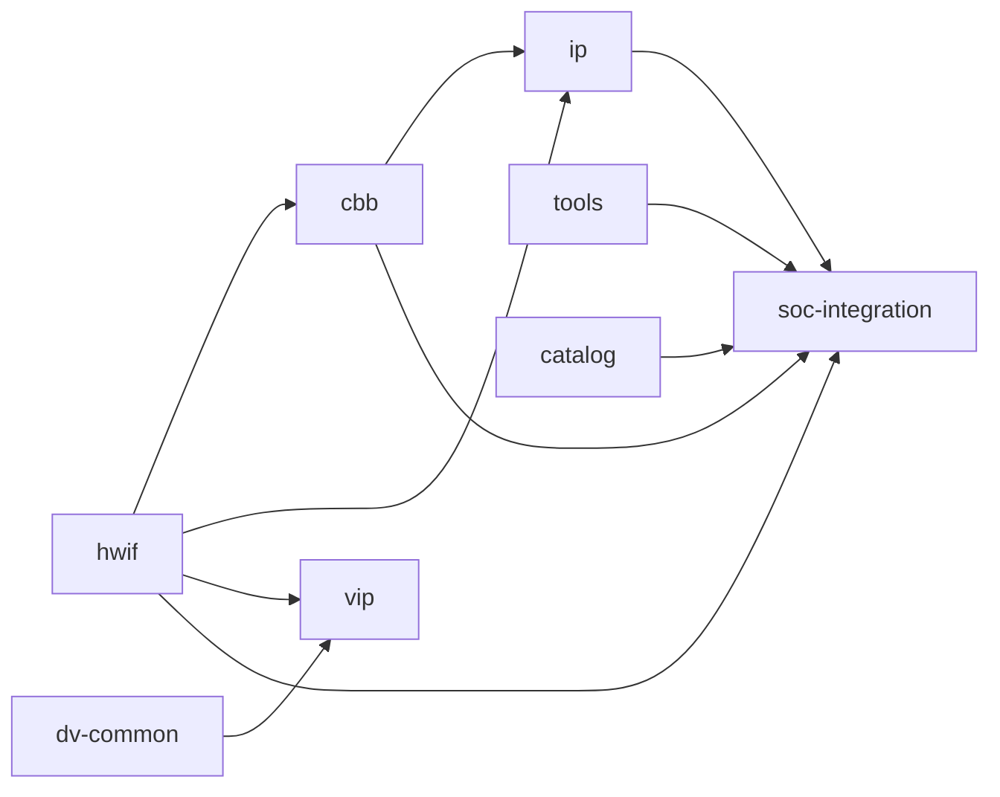

# 仓库职责与依赖

本文只定义仓库边界、依赖和数据关系；流程顺序见 [`workflows.md`](workflows.md)，待实施的依赖优化见 [`target-design.md`](target-design.md)。当前仓库集合与无类型依赖以 [`manifests/default.yaml`](../../manifests/default.yaml) 为准，路径写权限以 [`ownership-map.yaml`](../../ownership-map.yaml) 为准。

## 1. 分仓原则

- Workflow 是控制面：解析工作区、编排 Flow、执行 Gate、汇总 Evidence、协调跨仓变更和发布；不保存资产源码。
- 资产仓是事实面：每类资产只有一个 Owner，正式事实、源码和交付物写回 Owner 仓。
- Tools 是确定性能力面，Skills 是可选辅助面；两者都不能取代资产事实或 Gate 证据。
- Catalog 只登记已发布资产，Manifest/Lock 分别描述期望工作区和实际版本，三者不可互相替代。
- 具体芯片配置、商业 EDA、PDK 和 Memory 适配属于私有项目或 Overlay，不进入公共仓硬编码。

## 2. 十仓职责矩阵

| ID / 仓库 | 唯一职责 | 明确不负责 | 主要关系 |
|---|---|---|---|
| `hwif` / [`aixsilicon_hwif_repo`](../../repos/aixsilicon_hwif_repo) | 接口语义契约、兼容关系与 HDL 多视图 | 具体 IP 实现和产品验证环境 | 向 cbb、ip、vip、soc-integration 提供契约 |
| `cbb` / [`aixsilicon_cbb_repo`](../../repos/aixsilicon_cbb_repo) | 参数化公共逻辑构件、属性与 PPA 数据 | 完整 IP 的 CSR、中断和产品语义 | 消费 hwif，供 ip 与 SoC 复用 |
| `ip` / [`aixsilicon_ip_repo`](../../repos/aixsilicon_ip_repo) | 可独立集成和发布的完整 IP 交付 | SoC Top 和通用集成规则 | 消费 hwif/cbb，向 SoC 和 Catalog 交付 |
| `dv-common` / [`aixsilicon_dv_common`](../../repos/aixsilicon_dv_common) | 协议无关的 DV runtime、RAL 公共机制和结果模型 | 具体协议 VIP 与产品 DUT | 向 vip、IP/SoC 验证提供公共底座 |
| `vip` / [`aixsilicon_vip_repo`](../../repos/aixsilicon_vip_repo) | 协议 driver/monitor/checker/coverage 等验证组件 | 协议无关 runtime 和产品验证环境 | 消费 hwif/dv-common，供 IP/SoC 验证复用 |
| `tools` / [`aixsilicon_tool_repo`](../../repos/aixsilicon_tool_repo) | 跨仓确定性生成、检查、转换和打包工具 | Flow 编排、资产 SSOT、私有 EDA/PDK 路径 | 通过注册 action/provider 被 Workflow 调用 |
| `catalog` / [`aixsilicon_catalog_repo`](../../repos/aixsilicon_catalog_repo) | 已发布资产、版本、兼容性和成熟度索引 | 源码、开发分支和本地工作区选择 | 接收发布 PR，供 SoC 选型和版本发现 |
| `soc-integration` / [`aixsilicon_soc_integration`](../../repos/aixsilicon_soc_integration) | 通用 SoC Schema、模板、规则和示例 | 具体芯片配置、产品 Top 和生成器实现 | 聚合资产规则；生成器仍归 tools |
| `skills` / [`aixsilicon_skill_repo`](../../repos/aixsilicon_skill_repo) | 私有、可选的 AI 研发方法和辅助编排 | 确定性最低结果、事实源和 Gate 判定 | 可增强 Workflow，缺失不得阻塞公共最低流程 |
| `knowledge` / [`aixsilicon_chipknowledge`](../../repos/aixsilicon_chipknowledge) | 方法论、术语、参考资料和知识索引 | 接口、版本、状态或 Gate 的事实来源 | 供人和 Skill 引用，不进入资产依赖闭包 |

当前不增加 `techlib`、`model`、`sw`、`reference-soc` 公共仓。只有出现至少两个真实消费者、独立生命周期、明确 Owner/Schema 且首个 PR 可带最小资产和 CI 时，才通过 ADR 建仓。

## 3. 当前依赖图

下图严格反映 Manifest v1 的 `depends_on`，不把流程消费、验证供给或可选上下文伪装成现有硬依赖。

`skills` 和 `knowledge` 不在资产依赖 DAG 中。当前图还有两个已知限制：`depends_on` 没有区分 product、verification、tooling、discovery、context；SoC 的运行流程会消费 dv-common/vip，但 Manifest 没有表达这种验证供给。两项均在 [`target-design.md`](target-design.md) 中统一处理。

## 4. 数据与版本关系

| 关系 | 提供方 | 消费方 | 约束 |
|---|---|---|---|
| 接口契约 | hwif | cbb、ip、vip、soc-integration | 契约是 SSOT，视图由工具确定性派生 |
| 公共构件 | cbb | ip、SoC 项目 | 构件参数/PPA 留在 cbb，产品语义留在消费者 |
| 完整 IP | ip | SoC 项目、release | 源码与验证交付留在 ip，Catalog 只存索引 |
| 验证底座/组件 | dv-common、vip | IP/SoC 验证 | 流程消费不等于复制资产所有权 |
| 集成规则 | soc-integration | 私有 `chip-<project>-soc` | 公共仓存 Schema/规则，项目仓存具体配置与生成物 |
| 工具能力 | tools/provider | Workflow action | Flow 不直接执行任意脚本路径；版本/hash 进入 Lock/Evidence |
| 发布索引 | 资产 Release → catalog | SoC resolve | Catalog 更新走 PR，不由 Workflow 直接改 main |
| 辅助上下文 | skills、knowledge | 人/Workflow | 可选、可审计，不改变确定性最低结果 |

## 5. 所有权与写入规则

Schema、仓库与工具的唯一归属见 [`../workflow/ownership.md`](../workflow/ownership.md)。执行时遵守以下顺序：

1. Flow 的 `write_scope` 声明阶段计划写入的仓和路径；
2. `ownership-map.yaml` 校验该路径是否属于对应 Owner；
3. 跨仓改动创建 Change Bundle，各仓独立 PR、审查和合入；
4. Evidence 记录仓 SHA、provider 版本和产物 hash；
5. 发布后才通过 Catalog PR 暴露可消费版本。

仓名以 Manifest 的 `id` 和真实路径为 canonical。`dv-common`、`soc-integration` 没有 `_repo` 后缀是现状，不在普通整理中重命名；如需改名，必须单独 ADR 并验证 URL、CI、Lock 和消费者兼容性。

## 6. 与流程的衔接

- IP 主线写 `ip`，读取 hwif/cbb/dv-common/vip，并通过 tools/provider 生成和验证；
- SoC 主线读取 Catalog 与公共资产，在私有芯片仓写具体配置/派生物，公共 soc-integration 只提供规则；
- hwif-change、VIP 开发、跨仓资格验证和 release-train 分别承担上游变更、验证供给、联合 Gate 和发布出口；
- CBB 当前缺少专用 Flow，是实施缺口而不是仓库职责缺口。

具体阶段、读写点和 Gate 见 [`workflows.md`](workflows.md)。
