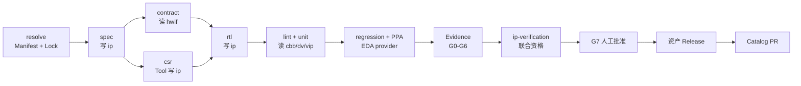
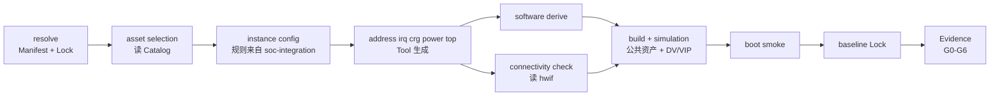

# Workflow 执行模型与主线

本文只定义 Workflow 如何调用仓库和执行 Gate；仓库边界见 [`repos.md`](repos.md)，当前缺口及目标契约见 [`target-design.md`](target-design.md)。实现事实以 [`workflows/`](../../workflows) 和 [`src/aixworkflow/actions.py`](../../src/aixworkflow/actions.py) 为准。

## 1. 执行模型

```text
Flow：阶段顺序、needs、preconditions、gates、write_scope
Action Contract：稳定名称、输入输出、权限、确定性和证据要求
Provider：Python、公共 Tool、EDA 或私有 Overlay 的真实实现与版本
```

| 层 | 负责 | 不负责 |
|---|---|---|
| Flow | 编排顺序、失败策略、Gate 和写入范围 | 内嵌任意 Shell、实现领域算法 |
| Action | 向 Flow 暴露稳定能力契约 | 隐藏不可用状态或伪造成功 |
| Provider | 完成确定性执行并返回结构化结果/证据 | 修改 Flow 语义或越过所有权边界 |

每次执行应形成 `Manifest → resolved Lock → Flow/Action/Provider → Run Manifest → Evidence Index → Gate` 的可重建链。Skill 只能辅助理解或生成候选内容，不能单独把 Gate 判为 pass。

## 2. 当前 Flow 清单与成熟度

仓库已有 8 份 Flow YAML，但“可解析”不等于“端到端可执行”：标准 runner 尚未注册其中全部 `tool.*`、`release.*`、`catalog.*`、`soc.*`、`skill.*` action。完成 preflight 与真实 provider 集成前，统一按 `draft / integration-needed` 管理。

| Flow | 用途 | 主要仓库 | 声明 Gate | 当前判定 |
|---|---|---|---|---|
| [`apb-register-ip.yaml`](../../workflows/apb-register-ip.yaml) | APB 寄存器 IP 垂直穿刺 | hwif、cbb、ip、dv-common、vip、tools | 示例链路 | P0 基准，待真实闭环 |
| [`ip-development.yaml`](../../workflows/ip-development.yaml) | IP 设计开发 | hwif、cbb、ip、dv-common、vip、tools | G0–G4、G6 | 待 provider 补齐 |
| [`ip-verification.yaml`](../../workflows/ip-verification.yaml) | IP 发布前资格验证 | hwif、cbb、ip、dv-common、vip | 当前 YAML 声明 G0–G7 | 待修订为 G0–G6 并完成联合验证 |
| [`soc-integration.yaml`](../../workflows/soc-integration.yaml) | SoC 集成验证 | catalog、公共资产、soc-integration、tools | G0–G6 | P2，待生成/EDA 能力 |
| [`hwif-change.yaml`](../../workflows/hwif-change.yaml) | 接口契约变更和影响传播 | hwif、vip、cbb、ip、SoC 消费者 | G0–G6 | 待真实消费者联验 |
| [`vip-development.yaml`](../../workflows/vip-development.yaml) | DV common/VIP 开发验证 | dv-common、vip、参考 DUT | G0–G2、G4–G6 | 待模拟器矩阵闭环 |
| [`cross-repo-qualification.yaml`](../../workflows/cross-repo-qualification.yaml) | Change Bundle 联合资格验证 | Bundle 涉及仓库 | G0–G6 | P0，待 action 接入 |
| [`release-train.yaml`](../../workflows/release-train.yaml) | 候选、审批、发布和 Catalog PR | 发布资产、catalog | G0–G7 | 契约桩，G7 未落地 |

当前没有 `cbb-development` / `cbb-verification`。它们是 P0 待建流程，不计入现有 8 条 Flow。

资格验证与发布的目标边界是 G0～G6 / G7；当前 `ip-verification` 声明 G7 属于已登记的 F-011，实现/Flow YAML 本轮不修改。

## 3. 主线一：IP 设计、验证与发布



| 阶段组 | 核心动作 | 读写边界 | 主要输出 |
|---|---|---|---|
| resolve | 工作区解析、clean/lock 检查 | 读 Manifest/仓状态，写 `.aix` 运行态 | resolved Lock、聚合配置 |
| spec/contract | 规格和接口兼容检查 | 写 ip 文档/metadata，读 hwif | 规格、测试计划、兼容报告 |
| csr/rtl | 寄存器和 RTL 派生/实现 | tools/provider 写 ip 的受控路径 | CSR、RTL、RAL、Header |
| lint/unit/regression/PPA | 构建、仿真、回归、实现评估 | 读 hwif/cbb/ip/dv-common/vip | 报告、日志、退出码、产物 hash |
| qualification/evidence | 联合验证和证据索引 | 写 workflow Evidence | Run Manifest、Evidence Index |
| release/catalog | 打包、审批、发布、登记 | 资产仓 Release；Catalog 单独 PR | Tag/Release、SBOM/RTM、Catalog diff |

发布必须 clean、locked、无 override、G0–G6 合格并经人工批准。Workflow 可生成发布/Catalog PR，但不能绕过仓库 Review 或直接更新 Catalog main。

## 4. 主线二：SoC 集成验证



具体项目数据写入私有 `chip-<project>-soc`/软件仓；公共 `soc-integration` 只保存 Schema、模板和规则，公共 `tools` 保存生成器。该 Flow 会消费 dv-common/vip 的验证能力，但当前 Manifest 尚未显式表达，目标模型见 [`target-design.md`](target-design.md)。

## 5. 支撑流程

| Flow | 在主线中的位置 | 必须守住的边界 |
|---|---|---|
| `hwif-change` | 两条主线共同上游 | 契约变更先做兼容/SemVer，再验证 VIP、CBB/IP 与 SoC 消费者 |
| `vip-development` | 验证能力供给 | dv-common 保存公共底座，vip 保存协议组件，产品环境留在产品仓 |
| `cross-repo-qualification` | 多仓改动合入前 | 拉取各 PR HEAD，按影响图运行联合测试；各仓仍独立 Review/merge |
| `release-train` | 合格资产到 Catalog | 幂等发布、人工批准、资产 Tag 和 Catalog PR 分离 |

CBB 专用 Flow 应覆盖参数域/边界组合、形式或随机验证、PPA Sweep、下游影响分析，并复用同一 Lock、Evidence、Gate 和 Release 契约。

## 6. Flow 与仓库关系

| 仓库 | IP 主线 | SoC 主线 | 支撑流程 |
|---|---|---|---|
| hwif | 读契约 | 读契约/连通 | `hwif-change` 写契约和视图 |
| cbb | 复用构件/PPA | 实例化 | CBB Flow 待建、变更需下游联验 |
| ip | 主要写入与发布主体 | 实例化 | 资格验证/Change Bundle |
| dv-common | 验证底座 | 验证底座 | `vip-development` 可写公共组件 |
| vip | 协议验证组件 | 系统验证组件 | `vip-development` 写协议组件 |
| tools | 生成/检查 provider | 派生生成 provider | 版本/hash 必须可追踪 |
| catalog | 发布后登记 | 选型/解析 | `release-train` 生成更新 PR |
| soc-integration | — | 读通用规则 | 公共规则不承载具体产品事实 |
| skills | 可选辅助 | 可选辅助 | 缺失不得降低 Gate |
| knowledge | 参考 | 参考 | 不参与确定性判定 |

## 7. Gate 最小语义

| Gate | 判定对象 |
|---|---|
| G0 | Schema、安全、路径和仓 SHA 卫生 |
| G1 | resolved Lock、remote/dirty/override 状态 |
| G2 | 依赖/VLNV 解析完整性与冲突 |
| G3 | Contract/Profile/Binding 兼容性 |
| G4 | lint/build/unit 结果与产物 |
| G5 | 跨仓影响集合和联合资格验证 |
| G6 | Run Manifest、Evidence Index 与可重建性 |
| G7 | SemVer、材料、人工审批和 Catalog diff |

最小证据字段和完成度分级统一见 [`target-design.md`](target-design.md)；实际建设顺序见 [`../roadmap.md`](../roadmap.md)。
