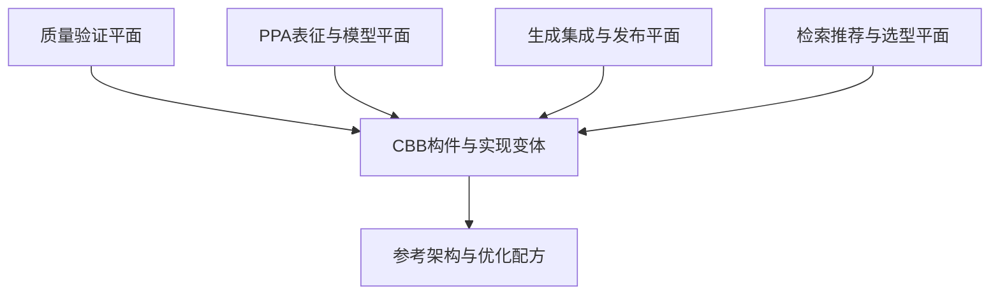

# cbb — 完整设计参考

> 完整保留历史长篇设计要求；旧状态、日期和优先级不再作为执行依据。当前设计见 [`README.md`](README.md)，活动交付见 [`delivery.md`](delivery.md)。

> 来源：repos/aixsilicon_cbb_repo/cbb_repo_plan.md + cbb_repo_list.md（完整剪切至 docs/architecture/repo-plans 统一管理）
> 迁移日期：2026-08-13
> 仓库实现现状见 docs/architecture/repos.md §1.2

---

## 一、cbb_repo_plan.md 完整原文

# 面向 PPA 优化的 CBB 库整体规划

> 版本：V1.0
> 定位：面向 IP/SoC 研发、可由工程师与 AI Skill 共同使用的 PPA 优化基础构件平台

## 1. 规划结论

这套 CBB 库不应只是“参数化 RTL 代码集合”，也不适合用单一 L0～L7 层级描述全部内容。建议将其建设为四类资产、六维分类、四个支撑平面组成的工程体系：

1. **构件资产**：可直接实例化、具有稳定接口契约的 RTL/硬核适配构件；
2. **实现变体**：同一功能契约下，针对面积、频率、功耗和延迟的不同微架构；
3. **参考架构与优化配方**：描述多个构件如何组合，以及在什么条件下采用何种结构；
4. **PPA 数据与证据**：综合、时序、功耗、验证、适用范围和版本回归结果。

在此之上，由四个支撑平面贯穿全部资产：

- 质量验证平面；
- PPA 表征与模型平面；
- 生成、集成与发布平面；
- 检索、推荐与智能选型平面。

最终目标是让系统能够可靠回答：

> 在指定工艺、位宽、吞吐、延迟、频率、功耗模式和接口约束下，哪些构件实现可行，哪几个处于 Pareto 前沿，应选择哪一个，选择依据和验证证据是什么？

---

## 2. 产品定位与边界

### 2.1 核心定位

建议正式定位为：

> **PPA-aware CBB Platform：经过功能验证、实现验证和多维 PPA 表征，可按设计约束自动检索、比较、选型和集成的芯片公共基础构件平台。**

它服务于三类消费者：

| 消费者 | 主要诉求 | CBB库提供的能力 |
|---|---|---|
| RTL/IP 设计人员 | 快速复用，减少重复造轮子 | 稳定接口、实现变体、示例、约束和验证环境 |
| PPA 优化人员 | 找到真正有效的优化结构 | 可比较的 PPA 数据、Pareto 分析、退化检测 |
| AI/Skill | 自动识别、推荐、生成和集成 | 机器可读元数据、规则、API、证据和失败边界 |

### 2.2 CBB、IP、工具函数与参考架构的边界

| 类型 | 判断标准 | 示例 | 是否属于可实例化CBB |
|---|---|---|---|
| RTL工具函数 | 编译期展开，无独立接口和验证生命周期 | 位宽计算函数、Gray编码函数 | 否，作为公共包 |
| 原语适配 | 隔离工艺、宏单元或平台差异 | SRAM/ICG/Isolation Wrapper | 是 |
| CBB | 通用功能、稳定接口、可独立验证与版本化 | FIFO、Arbiter、Adder Tree、AXI Slice | 是 |
| 参考架构/Recipe | 描述多个CBB的组合方法和选型规则 | 多Bank存储、分层仲裁、高频Ready/Valid链路 | 否，属于配方资产 |
| IP | 完成业务功能，通常有寄存器、软件接口和项目需求 | DMA、完整中断控制器、NPU子模块 | 通常不纳入CBB库 |
| 子系统模板 | 介于CBB与IP之间，可生成项目实例 | AXI互联、存储子系统 | 作为独立模板产品管理 |

一个资产只有同时满足以下条件，才进入正式 CBB Catalog：

- 功能语义通用，不绑定单一项目；
- 接口契约清晰，参数合法域明确；
- 有独立验证入口和质量结果；
- 有明确的综合语义及约束要求；
- 有版本、维护人、依赖和兼容性声明；
- 对 PPA 型 CBB，至少完成一个基准工艺/库上的表征。

### 2.3 不应追求的目标

- 不追求一个模块用大量参数覆盖所有微架构；
- 不把普通 RTL 公共库直接包装成“PPA库”；
- 不用脱离工艺、约束和活动场景的单个面积/功耗数字做宣传；
- 不允许 AI 仅凭代码形态断言 PPA 收益；
- 不把安全关键 CDC/RDC、ICG、Isolation 等结构交给 AI 自由改写；
- 不在公共仓库中混入 Foundry、标准单元库或 Memory Compiler 的敏感信息。

---

## 3. 总体架构：资产分层、领域分类与支撑平面

### 3.1 纵向分层只表达构件抽象粒度

| 层级 | 定位 | 典型资产 | 依赖原则 |
|---|---|---|---|
| A0 技术适配构件 | 隔离工艺、宏单元、FPGA/ASIC差异 | SRAM Wrapper、ICG Wrapper、LS/ISO/Retention Wrapper | 不依赖上层 |
| A1 原子机制构件 | 功能单一、接口简单、可独立验证 | Mux、Encoder、Counter、LZC、Synchronizer、Adder | 可依赖A0 |
| A2 通用复合构件 | 协议无关、由多个机制构成 | FIFO、Arbiter、Adder Tree、Register File、ECC | 可依赖A0/A1 |
| A3 协议构件 | 具有明确握手或总线协议语义 | Ready/Valid Slice、AXI Buffer、APB Adapter、Stream Mux | 可依赖A0～A2 |
| A4 子系统模板 | 完成一类可配置系统能力 | AXI Fabric、Memory Subsystem、Clock/Reset Manager | 可依赖A0～A3 |

A4 应单独治理：当其出现大量软件可见寄存器、复杂业务状态或独立产品路线时，应升级为 IP，而不是继续塞入 CBB 库。

### 3.2 横向技术域

| Domain | 主要内容 | PPA关注点 |
|---|---|---|
| Arithmetic | 加减乘除、MAC、压缩树、舍入、饱和 | 逻辑深度、位宽、流水、资源共享 |
| Selection & Decode | Mux、Encoder、Priority、地址译码 | 扇入、扇出、层次化、毛刺功耗 |
| Arbitration | Fixed/RR/WRR/Credit/Multi-grant | 优先级链、授权延迟、规模扩展 |
| Storage & Queue | FIFO、RF、SRAM、Buffer、Queue | 寄存器/宏选择、Bank、端口、读写冲突 |
| Streaming & Pipeline | Slice、Skid、Fork/Join、Rate Match | Ready链、气泡、吞吐、延迟 |
| Interconnect | AXI/AHB/APB/Stream桥与互联 | 译码、仲裁、Buffer、ID和Outstanding |
| CDC/RDC | Synchronizer、Handshake、Async FIFO | 正确性优先、MTBF、约束、签核 |
| Clock/Reset/Power | ICG、Clock Mux、Reset、Isolation | 时钟功耗、门控粒度、扇出、唤醒 |
| Control | FSM、Timer、Sequencer、Watchdog | 编码、状态翻转、控制路径 |
| Safety & Integrity | Parity、ECC、Monitor、Lockstep辅助 | 诊断覆盖率、延迟和面积开销 |
| Monitor & Debug | 性能计数、Trace、事件采集 | 可观测性开销、门控、带宽 |

Domain 是标签，不是目录层级。Async FIFO 可以是 `A2 + Storage + CDC`，AXI CDC Bridge 可以是 `A3 + Interconnect + CDC`。

### 3.3 六维资产坐标

每个 CBB 至少用六个正交维度描述：

1. **抽象粒度**：A0～A4；
2. **技术域**：主 Domain + 次 Domain；
3. **功能契约**：接口、顺序、吞吐、背压、异常行为；
4. **实现变体**：真正不同的微架构；
5. **适用区域**：参数范围、工艺、频率、延迟和使用限制；
6. **成熟度**：实验、验证、表征、发布、量产复用。

`AREA/PERFORMANCE/LOW_POWER` 不能直接作为代码变体名称。它们是优化意图；同一个实现是否“高性能”，取决于参数、工艺和约束。正式选型应落到具体微架构和表征数据。

### 3.4 四个支撑平面



---

## 4. CBB功能资产规划

### 4.1 第一主线：算术与数据通路

| 构件族 | 应规划的主要实现 | 核心变量 |
|---|---|---|
| Adder/Subtractor | Ripple、分段、Prefix、流水 | 位宽、符号、进位、延迟 |
| Multi-operand Add | Balanced Tree、CSA、Compressor Tree | 操作数数目、位宽、流水 |
| Multiplier/MAC | Array、Booth、常系数、分时复用、流水 | 位宽、符号、吞吐、精度 |
| Divider | 迭代、Radix-2/4、常数除法 | 周期数、面积、吞吐 |
| Shift/Rotate | Barrel、分级、迭代 | 最大移位量、方向、周期 |
| Compare/Min/Max | 线性、树形、分段、Early-out | 路数、位宽、流水 |
| Bit Operation | Popcount、LZC/LZD、Priority | 位宽、树深、流水 |
| Numeric Format | Round、Saturate、Clip、Scale、Convert | 精度、误差、饱和语义 |
| Integrity Datapath | CRC、Parity、ECC Encode/Decode | 多项式、数据宽度、吞吐 |

建设重点不是覆盖全部算法，而是沉淀：位宽推导、常量特化、流水切分、Operand Isolation、资源共享和等价验证方法。

### 4.2 第二主线：选择、译码与仲裁

- Binary/One-hot/Priority Mux；
- 分层、分簇和稀疏选择网络；
- 地址范围译码、Mask译码、两级译码；
- Fixed Priority、Round-Robin、Mask RR、Rotate+Priority；
- WRR、Deficit、Credit和Multi-grant；
- 分层仲裁、预授权和寄存授权；
- 配置广播、本地译码和高扇出复制。

表征时必须覆盖 4/8/16/32/64 路规模，明确组合授权与寄存授权、延迟与吞吐、扇出与复制的关系。

### 4.3 第三主线：存储、FIFO与Buffer

- Register/Shift/SRAM FIFO；
- Sync/Async/Fall-through FIFO；
- Skid/Elastic/Pipeline Buffer；
- Packet/Credit/Width-conversion Buffer；
- Register File、1R1W、2R1W、Banked/Replicated RF；
- SRAM拼深、拼宽、Banking、Byte-write；
- RAW/WAR冲突处理、Bypass和Write-through；
- Ping-Pong、Line Buffer和多通道Queue；
- ECC/Parity、Sleep、Retention和MBIST接口。

应形成明确的自动选型边界，而非仅提供统一参数化代码：

| 条件 | 候选方向 |
|---|---|
| 小深度、小位宽、低延迟 | Register/Fall-through |
| 中等深度、无合适Macro | Register Array或Shift结构 |
| 大深度 | SRAM/Banked SRAM |
| 高频跨层接口 | 前后增加Slice或分离Ready路径 |
| 双时钟域 | 受控Async FIFO实现 |
| 低功耗长空闲 | Memory Sleep + 局部门控 |

### 4.4 第四主线：流水与流接口

- Forward、Backward、Full Register Slice；
- Skid、Bubble-free、Pipeline FIFO；
- Stream Fork/Join/Mux/Demux；
- Width Converter、Rate Matcher、Pack/Unpack；
- 数据与控制延迟对齐；
- 可旁路Pipeline、Timing Cut、Fanout Cut；
- Speculative Ready和分布式背压配方。

每个构件必须声明：是否允许组合 `ready` 穿透、最大组合级联建议、满吞吐条件、首拍延迟和背压传播延迟。

### 4.5 第五主线：CDC/RDC与时钟复位

- 2/3级单比特同步器；
- Pulse、Toggle、Handshake同步器；
- Gray Counter、Bus Snapshot、Async FIFO；
- Reset Synchronizer、Reset Bridge、Reset Isolation；
- Glitch-free Clock Mux、Divider、ICG Wrapper；
- Local Enable、Clock Gating Tree辅助；
- Power Domain Handshake、Isolation/Retention控制适配。

此类资产实行白名单结构：内部实现受控，AI 只能选择、参数化和实例化，不能任意重写。PPA优化不得越过 CDC/RDC、DFT 和低功耗签核要求。

### 4.6 第六主线：协议与互联构件

建议先做可组合接口构件，不以首期建设完整大 IP 为目标：

- AXI/AHB/APB Register Slice和Buffer；
- AXI Width/ID/Clock Converter；
- Outstanding Limiter、Burst Split/Merge；
- Address Decoder、Default Slave、Timeout/Error Responder；
- AXI-to-APB Bridge；
- Stream协议适配、包头插入/删除；
- 分层互联、共享仲裁和多Bank访问参考架构。

### 4.7 第七主线：控制、低功耗与安全辅助

- Binary/One-hot/Gray FSM模板与选型规则；
- Timer、Timeout、Watchdog、Sequencer；
- Token/Credit Manager、Sticky Status、Event Collector；
- Idle Detection、Operand Isolation、Data Gating；
- 局部更新、空闲冻结、Memory Sleep Controller；
- Parity/ECC、错误汇聚、故障注入接口；
- 性能计数、活动率监控和轻量Trace。

---

## 5. 实现变体管理方法

### 5.1 功能契约与微架构分离

同一构件族先定义不可歧义的功能契约，再挂接多个实现：

```text
统一功能契约
├── impl_linear
├── impl_tree
├── impl_segmented
└── impl_pipelined
```

功能参数与架构选择应分开：

- 功能参数：数据宽度、深度、端口数、协议特性；
- 微架构参数：流水级、Bank数、仲裁结构、存储实现；
- 环境参数：工艺、PVT、目标频率、活动场景；
- 优化目标：面积、功耗、延迟、吞吐及优先级。

不建议用大量 `ifdef` 隔离微架构。差异较小可用 `generate`；状态机、数据组织或时序行为明显不同时，应使用独立实现文件，共享接口、断言和参考模型。

### 5.2 参数合法域

每个实现必须声明：

- 支持和禁止的参数组合；
- 最大推荐规模；
- 延迟、吞吐和顺序语义；
- 对 RAM、ICG、DFT、UPF、CDC 约束的依赖；
- 已表征区域与外推区域；
- 已知劣化区和替代实现。

“能编译”不等于“被支持”；未验证参数组合默认属于实验域。

---

## 6. PPA表征体系

### 6.1 统一基准环境

没有统一基准，跨构件或跨版本的 PPA 数据不可比较。应固定并版本化：

- 工艺和标准单元库代号；
- 综合、STA、功耗工具及版本；
- PVT、RC Corner和工作电压；
- 时钟周期、uncertainty、IO delay、transition和load；
- Max fanout、Max transition、Dont-use列表；
- 层次化/扁平化、retiming、physical-aware等综合选项；
- 活动率来源和功耗窗口；
- 测试Harness、输入输出寄存边界和约束模板。

基准环境使用 `benchmark_profile_id` 标识，任何数据都必须绑定该 ID。

### 6.2 表征维度

| 维度 | 典型取值 |
|---|---|
| 实现 | linear/tree/pipelined/register/sram等 |
| 功能参数 | width/depth/ports/clients/IDs |
| 性能参数 | pipeline stages、latency、throughput |
| 工艺环境 | technology、PVT、RC corner |
| 约束 | target clock、IO delay、load |
| 活动场景 | idle、typical、stress、业务Trace |
| 工具环境 | tool、version、recipe、library revision |
| 结果 | area、WNS/TNS、Fmax、leakage/internal/switching |

功耗至少分为 Leakage、Internal、Switching，不能只给 Total Power；动态功耗必须同时保存活动场景和采样窗口。

### 6.3 控制组合爆炸

不对全部参数做笛卡尔积扫描，采用三阶段策略：

1. **锚点扫描**：典型位宽、深度、端口和频率；
2. **边界扫描**：最小值、最大值和架构切换附近；
3. **自适应补点**：在模型误差大、Pareto边界和选型临界区加点。

原始测量和拟合模型分开保存。模型输出必须包含误差或置信信息，不能用预测值伪装成实测值。

### 6.4 PPA比较原则

先进行硬约束过滤，再做 Pareto 分析：

1. 过滤功能、协议、工艺和参数不兼容实现；
2. 过滤无法满足频率、吞吐、延迟和质量门禁的实现；
3. 对可行实现计算 Area/Power/Latency 等 Pareto 前沿；
4. 只有用户给出偏好后，才使用加权目标排序；
5. 返回候选、选择理由、数据来源和风险，不只返回单一答案。

建议默认输出：`recommended`、`alternatives`、`rejected_with_reason` 三组结果。

### 6.5 PPA回归门限

每次提交至少与最近发布基线比较：

- 功能、参数合法域和综合成功率不得退化；
- 面积、Fmax、功耗按关键表征点设置门限；
- 对处于测量噪声范围的变化标记为无显著差异；
- 任一指标变好但另一指标恶化时，不简单判定通过或失败，应检查是否改变 Pareto 前沿；
- 工具或库版本变化时重建新基线，不与旧环境直接混判。

---

## 7. 质量验证与成熟度

### 7.1 统一质量门禁

| Gate | 目标 | 必需产物 |
|---|---|---|
| G0 Intake | 资产定义完整 | 需求、接口契约、元数据、Owner |
| G1 Function | 功能正确 | Lint、仿真、断言、参考模型 |
| G2 Robustness | 边界与协议正确 | 随机测试、Formal/协议检查、覆盖率 |
| G3 Implementation | 可实现且约束正确 | 综合、STA、CDC/RDC/DFT检查 |
| G4 PPA Characterized | PPA结论可复现 | 表征矩阵、原始结果、基线、Pareto |
| G5 Released | 可被项目稳定消费 | SemVer包、FuseSoC Core、文档、Manifest |
| G6 Proven | 真实项目复用 | 项目反馈、问题闭环、生产级状态 |

不同类型的必选检查不同。例如 A1 组合算术构件重点做形式等价；CDC构件重点做CDC结构和约束；AXI构件重点做协议断言、随机背压和顺序性。

### 7.2 成熟度等级

| 等级 | 含义 | 使用策略 |
|---|---|---|
| E0 Concept | 方案或实验代码 | 不进入正式Catalog |
| E1 Functional | 基础功能通过 | 仅限探索 |
| E2 Verified | 完成规定验证 | 可在非关键场景试用 |
| E3 Characterized | 完成基准PPA表征 | 可供选型器推荐 |
| E4 Released | 版本化发布并持续回归 | 项目可正式依赖 |
| E5 Proven | 多项目或量产验证 | 默认优选资产 |

成熟度与抽象层级无关，也不能用代码覆盖率单指标代替。

---

## 8. 元数据与SSOT

每个构件使用 `cbb.yaml` 作为机器可读 SSOT；Markdown 文档由元数据和结果生成或校验，避免重复维护事实。

```yaml
schema_version: 1.0

cbb:
  name: async_fifo
  version: 1.2.0
  owner: cbb-storage-team
  maturity: E3

classification:
  abstraction: A2
  primary_domain: storage_queue
  secondary_domains: [cdc_rdc]

contract:
  interface: ready_valid
  clock_domains: 2
  ordering: in_order
  throughput: 1_item_per_cycle

parameters:
  data_width:
    type: integer
    supported: [8, 16, 32, 64, 128, 256, 512, 1024]
  depth:
    type: integer
    supported: [4, 8, 16, 32, 64, 128, 256]

implementations:
  - id: register_gray
    source: rtl/impl/register_gray/
    constraints: constraints/register_gray/
  - id: sram_gray
    source: rtl/impl/sram_gray/
    dependencies: [tech:sram_1r1w]

quality:
  required_gates: [lint, simulation, formal, cdc, synthesis]

characterization:
  benchmark_profiles: [asic_base_v3]
  measured_region:
    data_width: [8, 512]
    depth: [4, 256]

release:
  fusesoc_core: aixsilicon:cbb:async_fifo:1.2.0
  license: internal
```

PPA结果不要全部塞入 `cbb.yaml`，而应通过不可变的 `run_id` 和 `dataset_version` 关联到结果库。

---

## 9. 仓库、版本与发布策略

### 9.1 推荐仓库形态

CBB 数量多、粒度小、共享验证与表征基础设施多，首期不建议“一构件一仓库”。建议采用混合模式：

```text
cbb-platform/             # 公共构件Monorepo
├── components/           # A1～A3构件，逻辑上独立版本
├── adapters/             # 开源/通用技术适配接口
├── recipes/              # 参考架构与优化配方
├── schemas/              # cbb.yaml与结果Schema
├── verification/         # 公共VIP、Formal与测试框架
├── flows/                # 表征、回归和发布流程
└── tools/                # 检索、比较、选择和生成工具

cbb-tech-<node>/          # 受控私有仓库
├── memory/
├── clock_power_cells/
├── constraints/
└── benchmark_profiles/

cbb-catalog/              # 发布索引与可检索元数据
├── releases/
├── compatibility/
└── datasets/
```

当 A4 子系统模板具备独立团队、发布节奏或权限边界时，再拆成独立仓库。IP库可以继续使用“IP独立仓库 + Catalog”，但不必把同样的物理仓库策略强加给细粒度 CBB。

### 9.2 逻辑独立发布

即使采用 Monorepo，每个 CBB 也应具备独立的：

- FuseSoC VLNV和SemVer；
- Changelog和兼容性声明；
- 依赖锁定与Release Manifest；
- 质量状态和PPA数据版本；
- Owner与生命周期状态。

接口/行为不兼容变化升级 Major；新增兼容功能升级 Minor；修复和不改变契约的PPA优化升级 Patch。PPA数据集、表征流程和技术适配包分别版本化，不与RTL版本混成一个版本号。

### 9.3 单个CBB目录

```text
components/async_fifo/
├── cbb.yaml
├── rtl/
│   ├── interface/
│   └── impl/
├── pkg/
├── verification/
│   ├── common/
│   ├── simulation/
│   ├── formal/
│   └── assertions/
├── constraints/
├── fusesoc/
├── characterization/
│   ├── plan.yaml
│   └── baselines/
├── examples/
├── docs/
├── CHANGELOG.md
└── OWNERS
```

---

## 10. 工具链规划

### 10.1 必需工具

| 工具 | 职责 | 首期优先级 |
|---|---|---|
| Schema Validator | 校验元数据、参数域、依赖和发布信息 | P0 |
| CBB Test Runner | 统一运行Lint/仿真/Formal/CDC/综合 | P0 |
| Characterization Runner | 参数采样、综合、STA、功耗、结果归档 | P0 |
| PPA Comparator | 跨实现、参数和版本比较，生成Pareto前沿 | P0 |
| Catalog Builder | 从发布包构建可查询索引 | P0 |
| CBB Selector | 硬约束过滤、候选排序、理由输出 | P1 |
| Wrapper/Instance Generator | 生成实例、适配Wrapper、FuseSoC依赖 | P1 |
| PPA Regression Bot | 检测退化和Pareto变化 | P1 |
| RTL Pattern Scanner | 识别可替换热点并匹配CBB | P2 |
| AI PPA Advisor | 解释热点、生成方案并驱动闭环 | P2 |

### 10.2 自动选型输入输出

选型输入建议统一为：

```yaml
request:
  function: round_robin_arbiter
  technology: tech_x
  parameters:
    requesters: 32
  constraints:
    frequency_mhz: 800
    max_latency_cycles: 1
    throughput: 1_grant_per_cycle
  objectives:
    primary: power
    secondary: area
```

输出包含：

- 选中的构件版本、实现和参数；
- 可满足硬约束的备选项；
- 被淘汰项及原因；
- 实测/预测标识和置信信息；
- 预期PPA及对比基线；
- 依赖、约束、验证证据和集成清单；
- 生成后的 FuseSoC/RTL Manifest。

### 10.3 AI的职责边界

AI适合：需求转约束、热点解释、候选搜索、Recipe匹配、参数建议、报告生成。确定性工具负责：代码生成、Schema校验、综合、STA、功耗、形式验证和Gate判定。最终选择必须由工具证据闭环。

---

## 11. 与SoC集成Skill Suite的衔接

建议将 CBB 平台作为 SoC 集成和 IP Development Skill Suite 的公共能力，而不是孤立代码库。

| Skill阶段 | 使用CBB平台的方式 | 输出证据 |
|---|---|---|
| 需求/规格 | 把频率、吞吐、延迟、低功耗等转为选型约束 | machine-readable constraints |
| HLD/LLD | 搜索构件与Recipe，形成候选架构 | selection report |
| RTL生成 | 实例化已发布CBB，少生成重复通用逻辑 | FuseSoC依赖与Manifest |
| RTL分析 | 识别大Mux、深优先链、Ready长链、高扇出等热点 | replacement proposals |
| PPA优化 | 比较原实现和CBB候选，运行增量综合 | before/after evidence |
| 验证 | 复用CBB断言、参考模型和回归 | verification report |
| Release | 锁定版本、工艺适配和PPA数据 | release manifest/SBOM |

集成后，AI生成的RTL应优先“调用经过验证的CBB”，而不是每次重新发明FIFO、Arbiter、CDC或AXI Slice。

---

## 12. 首期建设范围

### 12.1 P0：平台底座与15个种子构件

先建立最小闭环，避免首期铺满所有Domain。

**平台底座：**

- 元数据Schema、Catalog和FuseSoC发布；
- 统一Test Harness；
- 综合/STA/功耗表征流程；
- PPA Comparator与基础Selector；
- CI质量门禁和版本回归。

**种子构件：**

1. Priority Encoder；
2. One-hot/Binary Mux；
3. Round-Robin Arbiter；
4. Address Decoder；
5. Counter/Timer；
6. Popcount/LZC；
7. Adder Tree；
8. Sync FIFO；
9. Async FIFO；
10. Skid Buffer；
11. Ready/Valid Register Slice；
12. SRAM Wrapper；
13. Bit/Pulse/Handshake Synchronizer族；
14. ICG/Reset Synchronizer Wrapper；
15. AXI Register Slice。

这15项覆盖选择、仲裁、算术、存储、流水、CDC、时钟复位和协议，足以验证整个平台是否真实可用。

### 12.2 P1：形成可量化PPA收益

- Compressor/CSA Tree、常系数乘法器、流水MAC；
- 分层Mux和分层仲裁；
- Register/SRAM FIFO自动切换；
- Banked Memory与多端口映射Recipe；
- Stream Width Converter和Pipeline FIFO；
- Operand Isolation与高扇出本地复制Recipe；
- AXI Buffer、Outstanding Limiter、Width Converter；
- 选型器、PPA回归和项目试点。

### 12.3 P2：扩展到架构优化与AI闭环

- AXI/APB桥、AXI CDC和分层互联模板；
- 多Bank存储子系统；
- 资源共享、分布式仲裁、低功耗缓冲架构；
- RTL Pattern Scanner；
- AI PPA Advisor；
- 与AIXSILICON/PPASight、RTL Coding和SoC集成Skill全面打通。

---

## 13. 分阶段实施路线

| 阶段 | 建议周期 | 主要目标 | 退出条件 |
|---|---:|---|---|
| Phase 0 定义 | 4～6周 | 边界、Schema、基准环境、Gate、仓库和种子清单 | 规范评审通过，3个样例跑通 |
| Phase 1 MVP | 2～3个月 | 15个种子构件、Catalog、表征和比较闭环 | 至少10个达到E3，项目可检索使用 |
| Phase 2 PPA产品化 | 3～4个月 | 多实现、Pareto、Selector、回归、首个试点 | 形成可复现收益和项目替换案例 |
| Phase 3 规模化 | 4～6个月 | 协议构件、Recipe、技术适配、多项目推广 | 30～50个E4资产，多项目复用 |
| Phase 4 智能化 | 持续 | Pattern Scanner、AI Advisor、闭环优化 | AI建议均有工具证据和可追溯结果 |

首期不要用“构件数量”作为唯一目标。优先证明一条端到端链路：资产定义 → 验证 → 表征 → 发布 → 检索 → 选型 → 集成 → PPA回归。

---

## 14. 组织与治理

### 14.1 角色

| 角色 | 职责 |
|---|---|
| CBB架构委员会 | 定义边界、接口契约、Domain和技术路线 |
| Domain Owner | 维护领域Roadmap、评审构件和Recipe |
| CBB Owner | 负责代码、验证、表征、问题和版本 |
| PPA Flow Owner | 维护基准环境、工具Recipe和数据可信度 |
| Verification Owner | 定义分类型质量门禁和签核要求 |
| Tech Adapter Owner | 管理工艺、Macro、约束和权限隔离 |
| Catalog/Release Owner | 负责版本、依赖、发布和弃用 |
| 项目接口人 | 提交需求、试点、反馈与收益确认 |

### 14.2 生命周期

```text
Proposal → Incubating → Verified → Characterized → Released → Proven
                                                    ↓
                                              Deprecated → Retired
```

弃用必须提供替代构件、迁移说明和最后支持版本；已发布版本不可静默覆盖。

### 14.3 贡献机制

- 项目代码进入库前先做通用化和知识产权检查；
- 贡献者必须提交契约、测试、Owner和初始表征计划；
- Domain Owner负责技术评审，Flow Owner负责数据可比性评审；
- PPA收益声明必须引用可复现实验，不接受截图式结论；
- 项目反馈形成Issue、数据补点或Recipe更新，不能只沉淀在个人经验中。

---

## 15. 度量指标

### 15.1 平台建设指标

- E3/E4 构件数量及占比；
- 自动回归覆盖的参数点比例；
- PPA数据可复现率；
- Catalog元数据完整率；
- 发布成功率和回归稳定性；
- 已覆盖工艺/库/工具基准数量。

### 15.2 项目价值指标

- 项目复用次数和独立项目数；
- 重复RTL减少量与开发周期缩短；
- 由CBB替换获得的面积、频率、功耗收益分布；
- 问题逃逸率和公共缺陷修复复用率；
- AI推荐采纳率、推荐正确率和证据完备率；
- 从提出需求到可集成版本的平均周期。

PPA收益必须按同工艺、同约束、同工具Recipe、同功能和等价延迟/吞吐口径比较。

---

## 16. 主要风险与对策

| 风险 | 典型表现 | 对策 |
|---|---|---|
| 参数化过度 | 一个模块复杂到无法验证和综合优化 | 契约统一、微架构分实现、限制支持域 |
| 数据不可比 | 不同约束和工具结果混在一起 | 强制benchmark_profile_id和环境版本 |
| PPA数字失真 | 使用静态活动率或单点结果外推 | 保存场景、窗口、原始数据和置信信息 |
| 工艺泄密 | 公共仓库包含库名、Macro和报告 | 技术适配独立私有仓库，结果脱敏分级 |
| 构件无人维护 | 贡献后长期失管 | 强制Owner、成熟度降级和弃用机制 |
| AI错误替换 | 功能正确但协议/CDC/时序语义改变 | 白名单、硬Gate、形式/协议验证闭环 |
| 只建库不落地 | 构件多但项目不使用 | 种子构件绑定真实试点，按复用价值排期 |
| 追求单一评分 | 权重掩盖关键约束和trade-off | 先硬约束、再Pareto、最后偏好排序 |

---

## 17. 建议的首个示范闭环

建议选择三个代表性场景，而不是先建设大量孤立模块：

### 场景一：32路仲裁器

对比 Linear Priority、Mask RR、Rotate+Priority、Hierarchical RR，在 250/500/800 MHz 和不同请求活动率下形成 Pareto 曲线，验证“选型而非固定最佳实现”。

### 场景二：Ready/Valid长链

对比 Bypass、Forward Slice、Skid、Full Slice、Pipeline FIFO，展示组合Ready路径、吞吐、首拍延迟和面积之间的关系，并形成自动插入Recipe。

### 场景三：FIFO存储映射

扫描数据宽度和深度，对比 Register、Shift、SRAM、Banked SRAM，实现从参数到存储结构的自动选择，并覆盖功耗活动场景。

三个场景分别验证控制路径、协议流水和存储映射，能够较完整地检验CBB平台的价值。

---

## 18. 最终蓝图

完整体系可归纳为：

```text
PPA-aware CBB Platform
├── 构件资产
│   ├── A0 技术适配
│   ├── A1 原子机制
│   ├── A2 通用复合
│   ├── A3 协议构件
│   └── A4 子系统模板
├── 实现与知识资产
│   ├── 微架构变体
│   ├── 参考架构
│   └── PPA优化Recipe
├── 工程支撑平面
│   ├── 质量验证
│   ├── PPA表征与模型
│   ├── 生成集成与发布
│   └── 检索推荐与选型
└── 生态与应用
    ├── FuseSoC Catalog
    ├── IP Development Skill Suite
    ├── RTL Analysis/PPA Skill Suite
    ├── SoC Integration Skill Suite
    └── AIXSILICON / PPASight
```

因此，这个项目的建设重点不是“列出尽可能多的CBB”，而是建立以下能力闭环：

> **统一契约定义构件，以多个微架构承载Trade-off，以标准流程生成可信PPA证据，以Catalog和Selector完成自动选型，以FuseSoC和Skill Suite完成可追溯集成。**

只有这条闭环建立起来，CBB库才会从公共代码仓升级为真正面向PPA优化的工程基础设施。

---

## 25. 跨仓一致性修订（2026-08-13）

> 依据历史 [`cross-repo-architecture-review.md`](../reference/cross-repo-architecture-review.md)（ADR-0003/0005/0006）。

- `cbb-catalog` → 统一 `aixsilicon_catalog_repo`；`cbb-tech-<node>` → 私有 overlay / 待建 `aixsilicon_techlib_repo`（A3/A4）；
- VLNV 统一 `aixsilicon:cbb:*`（ADR-0003）；
- 依赖方向（C5）：CBB 实现依赖 HWIF；CBB 验证可依赖 DV-Common/VIP，但实现不依赖；
- P0 15 种子构件先 verified 再扩充，避免“只建清单不落地”（配合 build todolist）。

---

## 二、cbb_repo_list.md 完整原文

# 面向 PPA 优化的 CBB 构件完整清单

> 版本：V1.0
> 适用范围：通用数字 IP、SoC 集成、DSP/AI 数据通路及功能安全公共逻辑
> 建库口径：表中一行代表一个具有统一功能契约的“构件族”；不同微架构作为实现变体，不重复虚增构件数量。

## 1. 清单使用说明

### 1.1 抽象级别

| 级别 | 定义 |
|---|---|
| A0 | 工艺、Macro、标准单元或目标平台适配构件 |
| A1 | 功能单一、接口简单的原子机制构件 |
| A2 | 协议无关、可独立复用的通用复合构件 |
| A3 | 带 Ready/Valid、AXI、AHB、APB、CHI、NoC 等协议语义的构件 |
| A4 | 由多个构件组成、可配置生成的子系统模板；应与普通 CBB 分区治理 |


### 1.3 统一变体原则

- `AREA/PERFORMANCE/LOW_POWER` 是优化目标，不作为实现名称；实现必须按真实微架构命名。
- 同一构件族共享功能契约、参考模型和一致性测试，不同实现分别表征。
- CDC/RDC、ICG、Isolation、Retention、Clock Mux 等采用白名单实现，AI 只能选型和参数化。
- A4 模板若出现大量软件可见寄存器、复杂业务状态或独立路线，应升级为 IP 产品。

---

## 2. A0 工艺与物理实现适配

| ID | 构件族 | 主要实现/配置 | 优先级 | PPA与工程关注点 |
|---|---|---|---|---|
| TEC-001 | 通用组合标准单元 Wrapper | AND/OR/XOR/MUX/AOI/OAI 映射 | P2 | 保持可移植 RTL 与定向映射双路径 |
| TEC-002 | DFF Wrapper | 普通、Enable、Set/Reset、Scan | P1 | 面积、时钟功耗、DFT约束 |
| TEC-003 | Multi-bit FF Wrapper | 2/4/8-bit MBFF | P2 | 时钟功耗与布局可实现性 |
| TEC-004 | Latch Wrapper | 普通、门控、Scan | P3 | 时序借用与验证边界 |
| TEC-005 | ICG Wrapper | 不同使能/测试使能接口 | P0 | 时钟功耗、门控检查、DFT |
| TEC-006 | Glitch-free Clock Mux Wrapper | 2/4 路时钟选择 | P0 | 无毛刺、切换延迟、CTS |
| TEC-007 | Clock Divider Cell Wrapper | 2/N 分频、旁路 | P1 | 占空比、generated clock |
| TEC-008 | Clock Buffer/Delay Wrapper | Buffer tree、delay cell | P3 | 仅供受控物理实现使用 |
| TEC-009 | Level Shifter Wrapper | Up/Down、Enable LS | P1 | 电压域、方向、隔离组合 |
| TEC-010 | Isolation Cell Wrapper | Clamp-0/1、Latch isolation | P1 | 控制极性、位置、UPF一致性 |
| TEC-011 | Retention FF/Bank Wrapper | Save/restore、always-on | P2 | 状态范围、唤醒延迟、面积 |
| TEC-012 | Power Switch Control Wrapper | Header/footer 控制接口 | P3 | 物理专用，不承载电源网实现 |
| TEC-013 | Tie/Constant Cell Wrapper | Tie-high/low | P2 | 避免逻辑常量不规范直连 |
| TEC-014 | Scan/Lockup Wrapper | Lockup latch、scan bypass | P3 | DFT链与跨时钟域 |
| TEC-015 | SRAM Macro Wrapper | 1P、SP、1R1W、TDP | P0 | 统一读延迟、mask、sleep、BIST |
| TEC-016 | Register File Macro Wrapper | 多读写端口、同步/异步读 | P1 | 端口语义与 bypass |
| TEC-017 | ROM Macro Wrapper | Mask ROM、compiler ROM | P2 | 初始化、时序和测试接口 |
| TEC-018 | CAM/TCAM Macro Wrapper | Binary/ternary、分段 | P3 | 高功耗宏，严格适用范围 |
| TEC-019 | eFuse/OTP Macro Wrapper | Read/program/test 抽象接口 | P3 | 安全、一次性编程、厂商差异 |
| TEC-020 | PLL/DLL/OSC Digital Wrapper | 配置、锁定、旁路、状态同步 | P3 | 仅数字接口适配，不替代模拟IP |
| TEC-021 | FPGA Memory Wrapper | BRAM/URAM/LUTRAM | P1 | ASIC/FPGA双实现映射 |
| TEC-022 | FPGA DSP Wrapper | DSP slice、MAC、pre-adder | P2 | 推断稳定性与流水位置 |

---

## 3. 基础位操作、编码与选择网络

| ID | 构件族 | 主要实现变体 | 级别 | 优先级 | PPA关注点 |
|---|---|---|---|---|---|
| SEL-001 | 2:1/N:1 Binary Mux | Linear、balanced tree、pipelined | A1 | P0 | 扇入、逻辑深度、毛刺 |
| SEL-002 | One-hot Mux | OR-tree、AND-OR、segmented | A1 | P0 | One-hot假设、扇出、X处理 |
| SEL-003 | Priority Mux | Linear、tree、grouped | A1 | P1 | 优先级链与规模扩展 |
| SEL-004 | Sparse/Masked Mux | sparse map、mask select | A1 | P2 | 无效输入消除、综合稳定性 |
| SEL-005 | Cross-point Switch | full、sparse、staged | A2 | P2 | 交叉规模、布线与流水 |
| SEL-006 | Binary Encoder | combinational、tree | A1 | P0 | 位宽与深度 |
| SEL-007 | One-hot Encoder | strict、first-hot、last-hot | A1 | P0 | 非法输入语义 |
| SEL-008 | Decoder | binary-to-onehot、segmented | A1 | P0 | 高扇出、本地译码 |
| SEL-009 | Priority Encoder | leading/trailing、tree | A1 | P0 | 深优先级链 |
| SEL-010 | Thermometer Encoder/Decoder | binary/thermometer conversion | A1 | P3 | 编码密度与毛刺 |
| SEL-011 | Leading Zero/One Count | tree、segmented、pipelined | A1 | P1 | 关键路径、前缀结构 |
| SEL-012 | Trailing Zero/One Count | reverse、tree | A1 | P2 | 共享反转逻辑 |
| SEL-013 | Bit Scan/First-set | LSB/MSB、priority tree | A1 | P1 | 大位宽时序 |
| SEL-014 | Population Count | adder tree、compressor、lookup | A1 | P1 | 面积/时序Pareto |
| SEL-015 | One-hot Checker | zero/one/multi-hot detect | A1 | P0 | 安全检查复用 |
| SEL-016 | Range Comparator | single/multi-range、tree | A1 | P1 | 共享比较与译码 |
| SEL-017 | Address Decoder | range、mask、base+size | A2 | P0 | 比较器共享、扇出 |
| SEL-018 | Hierarchical Address Decoder | cluster/local decode | A2 | P1 | 大规模地址空间时序 |
| SEL-019 | Configurable Truth Table | LUT/case/ROM mapped | A1 | P3 | 面积与综合推断 |
| SEL-020 | Bit Permutation Network | fixed、programmable、Benes | A2 | P3 | 布线主导、配置代价 |

---

## 4. 算术与数值数据通路

| ID | 构件族 | 主要实现变体 | 级别 | 优先级 | PPA关注点 |
|---|---|---|---|---|---|
| ARI-001 | Incrementer/Decrementer | ripple、segmented | A1 | P0 | Counter专用优化 |
| ARI-002 | Adder/Subtractor | ripple、CLA、prefix、segmented | A1 | P0 | 位宽、进位结构、流水 |
| ARI-003 | Carry-save Adder | 3:2、4:2 compressor | A1 | P1 | 多操作数压缩 |
| ARI-004 | Multi-operand Adder | linear、balanced、CSA tree | A2 | P1 | 操作数数量与树平衡 |
| ARI-005 | Adder Tree | balanced、registered、saturating | A2 | P1 | 流水级与吞吐 |
| ARI-006 | Accumulator | wrap、saturate、clear/load | A2 | P0 | 反馈路径与门控 |
| ARI-007 | Absolute Value/Negate | signed、saturating | A1 | P1 | 最小负数语义 |
| ARI-008 | Comparator | signed/unsigned、segmented | A1 | P0 | Early-out与关键路径 |
| ARI-009 | Multi-way Min/Max | linear、balanced、pipelined | A2 | P1 | 路数、索引回传 |
| ARI-010 | Clamp/Clip | symmetric/asymmetric limits | A1 | P1 | 比较共享与常量特化 |
| ARI-011 | Saturating Add/Sub | signed/unsigned | A1 | P1 | 溢出判定与延迟 |
| ARI-012 | Fixed-point Round | truncate、RNE、RNA、stochastic | A1 | P1 | 精度、偏差、随机源 |
| ARI-013 | Fixed-point Resize | extend、round、saturate | A1 | P0 | 位宽最小化 |
| ARI-014 | Scale/Shift | power-of-two、programmable | A1 | P1 | 常量传播与复用 |
| ARI-015 | Logical/Arithmetic Shifter | staged、barrel、iterative | A1/A2 | P1 | 面积、周期数、路由 |
| ARI-016 | Rotator/Funnel Shifter | barrel、staged | A2 | P2 | 双输入拼接与布线 |
| ARI-017 | Integer Multiplier | array、Booth、Wallace/Dadda | A2 | P1 | 位宽、符号、流水 |
| ARI-018 | Constant Multiplier | shift-add、CSD、MCM | A2 | P1 | 常量特化与共享 |
| ARI-019 | Multiply-Accumulate | fused、separate、pipelined | A2 | P1 | 融合、截断、吞吐 |
| ARI-020 | Dot-product Engine | parallel、time-mux、tree | A2 | P2 | 并行度、累加宽度 |
| ARI-021 | Integer Divider | restoring、non-restoring、SRT | A2 | P2 | 面积/延迟/吞吐 |
| ARI-022 | Constant Divider | reciprocal multiply、shift-add | A2 | P2 | 误差与常量特化 |
| ARI-023 | Modulo/Reducer | arbitrary、power-of-two、Barrett | A2 | P3 | 除法消除与延迟 |
| ARI-024 | Square/Sum-of-squares | dedicated、shared multiplier | A2 | P3 | DSP场景资源共享 |
| ARI-025 | Average/Weighted Sum | shift、reciprocal、MAC | A2 | P2 | 系数与位宽增长 |
| ARI-026 | Reciprocal/RSqrt Approximation | LUT+iteration、piecewise | A2 | P3 | 精度/延迟/面积 |
| ARI-027 | CORDIC | iterative、unrolled、pipelined | A2 | P3 | 迭代次数、精度 |
| ARI-028 | Polynomial Evaluator | Horner、parallel tree | A2 | P3 | 系数常量化与MAC复用 |
| ARI-029 | BCD/Binary Converter | iterative、double-dabble | A2 | P3 | 周期与面积 |
| ARI-030 | Decimal/BCD Arithmetic | add/adjust/compare | A2 | P3 | 专用业务驱动 |
| ARI-031 | FP Classify/Compare | IEEE754 subsets | A1/A2 | P3 | NaN/Inf/zero语义 |
| ARI-032 | FP Add/Multiply/FMA Shell | vendor/core wrapper、config | A2 | P3 | 不重复造完整FPU，重在适配 |
| ARI-033 | Block Floating-point Scale | shared exponent、normalize | A2 | P3 | 精度与存储带宽 |
| ARI-034 | Quantize/Dequantize | affine、symmetric、per-channel | A2 | P2 | AI数据通路位宽与功耗 |
| ARI-035 | Packed SIMD Lane Operator | add/mul/min/max、lane mask | A2 | P3 | Lane复用与门控 |

---

## 5. CRC、编码、压缩与数据完整性算法

| ID | 构件族 | 主要实现变体 | 级别 | 优先级 | PPA关注点 |
|---|---|---|---|---|---|
| COD-001 | Parity Generator/Checker | even/odd、tree、pipelined | A1 | P0 | XOR树平衡 |
| COD-002 | CRC Generator/Checker | serial、parallel、sliced | A2 | P1 | 多项式、数据宽度、吞吐 |
| COD-003 | SECDED ECC | encode/decode/correct、pipelined | A2 | P0 | 校验位、纠错延迟 |
| COD-004 | Configurable Hamming ECC | shortened、extended | A2 | P1 | 参数合法域 |
| COD-005 | BCH/RS Codec Wrapper | iterative/vendor-wrapper | A2 | P3 | 算法复杂度与授权边界 |
| COD-006 | Gray/Binary Converter | combinational、pipelined | A1 | P0 | CDC计数器复用 |
| COD-007 | Scrambler/Descrambler | self-synchronous、LFSR | A2 | P2 | 并行展开与吞吐 |
| COD-008 | LFSR/PRBS | Fibonacci、Galois、parallel | A1/A2 | P1 | 多项式与切换功耗 |
| COD-009 | Run-length Encoder/Decoder | streaming、bounded run | A2 | P3 | 数据相关吞吐 |
| COD-010 | Zero Suppression/Bitmap Codec | sparse、block mask | A2 | P3 | 元数据开销与活动率 |
| COD-011 | Byte/Bit Order Converter | endian swap、bit reverse | A1 | P0 | 固定连线优先 |
| COD-012 | Data Packer/Unpacker | field map、aligned/unaligned | A2 | P1 | Mux规模与时序 |

---

## 6. 寄存器、存储器与存储映射

| ID | 构件族 | 主要实现变体 | 级别 | 优先级 | PPA关注点 |
|---|---|---|---|---|---|
| MEM-001 | Parameter Register | plain、enable、masked write | A1 | P0 | Enable推断与时钟功耗 |
| MEM-002 | Shadowed Register | dual-copy、commit | A2 | P1 | 安全一致性与面积 |
| MEM-003 | Sticky/W1C/W1S Register | status semantics variants | A1/A2 | P0 | 软件语义与门数 |
| MEM-004 | Register Array | async/sync read、byte mask | A2 | P0 | 推断RAM或FF阵列 |
| MEM-005 | 1R1W Register File | flop、macro、replicated | A2 | P1 | 读延迟、RAW bypass |
| MEM-006 | Multi-read Register File | replicated、banked、muxed | A2 | P1 | 面积与端口冲突 |
| MEM-007 | Multi-write Register File | arbitration、banked | A2 | P2 | 写冲突与旁路 |
| MEM-008 | SRAM Width Composer | concat、byte-lane banking | A2 | P0 | Macro利用率与mask |
| MEM-009 | SRAM Depth Composer | cascaded decode、bank select | A2 | P0 | 译码/输出Mux关键路径 |
| MEM-010 | SRAM Bank Mapper | interleave、hash、range | A2 | P1 | 冲突率、地址逻辑 |
| MEM-011 | SRAM Port Adapter | 1R1W↔SP/TDP语义适配 | A2 | P1 | 冲突语义与吞吐 |
| MEM-012 | Memory RAW Bypass | write-first/read-first/no-change | A2 | P0 | 数据一致性与Mux延迟 |
| MEM-013 | Memory Byte-write Adapter | RMW、native mask | A2 | P1 | RMW周期与功耗 |
| MEM-014 | Memory Init/Load Adapter | ROM/file/bus initialization | A2 | P2 | 仿真与综合一致性 |
| MEM-015 | Memory Sleep/Retention Controller | idle-based、software-driven | A2 | P2 | break-even时间、唤醒 |
| MEM-016 | Memory ECC Shell | sidecar/in-line、scrub | A2 | P1 | 延迟、容量、可靠性 |
| MEM-017 | Memory Scrubber | periodic、on-demand、priority | A2 | P2 | 带宽占用、功耗 |
| MEM-018 | Memory BIST Interface Adapter | march controller interface | A2 | P2 | DFT接口与功能隔离 |
| MEM-019 | Multi-bank Access Scheduler | fixed/RR/conflict-aware | A2 | P2 | Bank冲突与吞吐 |
| MEM-020 | Ping-pong Buffer | dual-bank、N-bank rotation | A2 | P1 | 读写重叠与容量 |
| MEM-021 | Line Buffer | shift/SRAM/circular | A2 | P2 | 图像/卷积带宽 |
| MEM-022 | Circular Buffer | pointer/wrap、power-of-two | A2 | P1 | 地址简化与满空判定 |
| MEM-023 | Lookup Table/ROM | case、distributed、macro | A1/A2 | P1 | 深宽映射与推断 |
| MEM-024 | CAM | register-based、banked | A2 | P3 | 并行比较功耗 |
| MEM-025 | Content Tag Array | tag+valid+compare | A2 | P3 | Cache/TLB公共结构 |

---

## 7. FIFO、Queue 与 Buffer

| ID | 构件族 | 主要实现变体 | 级别 | 优先级 | PPA关注点 |
|---|---|---|---|---|---|
| QUE-001 | Synchronous FIFO | register、shift、SRAM | A2 | P0 | 深宽自动映射 |
| QUE-002 | Asynchronous FIFO | Gray pointer、bundled reset | A2 | P0 | CDC正确性、深度限制 |
| QUE-003 | Fall-through FIFO | combinational head、registered | A2 | P0 | 首拍延迟与Ready路径 |
| QUE-004 | Shift-register FIFO | shift-all、tap pointer | A2 | P1 | 小深度面积与翻转 |
| QUE-005 | SRAM FIFO | single/dual-port、prefetch | A2 | P1 | 读延迟隐藏 |
| QUE-006 | Elastic Buffer | 1/2-entry、bubble-free | A2 | P0 | 满吞吐与反压 |
| QUE-007 | Skid Buffer | output/input registered | A3 | P0 | 切断Ready组合链 |
| QUE-008 | Pipeline FIFO | distributed entries | A2/A3 | P1 | 物理距离与吞吐 |
| QUE-009 | Packet FIFO | packet commit/drop | A2 | P2 | 包边界和回滚 |
| QUE-010 | Frame Buffer Queue | descriptor+payload | A2 | P3 | 容量与元数据 |
| QUE-011 | Credit FIFO | credit-aware enqueue/dequeue | A2/A3 | P1 | Credit一致性 |
| QUE-012 | Width-conversion FIFO | narrow↔wide、gearbox | A2/A3 | P1 | 存储利用率与Mux |
| QUE-013 | Multi-channel FIFO | shared RAM、per-channel pointers | A2 | P2 | RAM共享与仲裁 |
| QUE-014 | Multi-enqueue FIFO | 2/N push、compaction | A2 | P2 | 写合并与指针更新 |
| QUE-015 | Multi-dequeue FIFO | 2/N pop、lookahead | A2 | P2 | 读端口与输出Mux |
| QUE-016 | Reorder Queue | tag/index、CAM/window | A2 | P3 | 存储与比较功耗 |
| QUE-017 | Priority Queue | heap、bucket、sorted array | A2 | P3 | 延迟与容量 |
| QUE-018 | Descriptor Queue | linked/ring/indexed | A2 | P2 | 控制开销与访存 |
| QUE-019 | Replay/Retry Buffer | checkpoint、selective replay | A2 | P3 | 状态容量和恢复延迟 |
| QUE-020 | Broadcast/Replication Buffer | reference count、copy | A2/A3 | P2 | 数据复制与背压 |

---

## 8. 流水、Ready/Valid 与流处理

| ID | 构件族 | 主要实现变体 | 级别 | 优先级 | PPA关注点 |
|---|---|---|---|---|---|
| STR-001 | Fixed Delay Line | FF、SRL、RAM-based | A1/A2 | P0 | 延迟、面积、初始化 |
| STR-002 | Enable Delay Line | clock-enable/data-gated | A1/A2 | P1 | 空闲功耗 |
| STR-003 | Data/Control Aligner | fixed/programmable latency | A2 | P0 | 控制数据一致性 |
| STR-004 | Forward Register Slice | payload registered | A3 | P0 | 数据关键路径 |
| STR-005 | Backward Register Slice | ready registered | A3 | P0 | 反压关键路径 |
| STR-006 | Full Register Slice | skid/full throughput | A3 | P0 | 双向切时序 |
| STR-007 | Bypassable Register Slice | static/dynamic bypass | A3 | P1 | 模式Mux与验证 |
| STR-008 | Stream Mux | binary/one-hot/arbitrated | A3 | P0 | 选择与反压 |
| STR-009 | Stream Demux | decoded/multicast | A3 | P0 | 输出Ready聚合 |
| STR-010 | Stream Fork | all-ready、independent buffer | A3 | P1 | 复制和阻塞语义 |
| STR-011 | Stream Join | lockstep、tagged join | A3 | P1 | 同步等待与Buffer |
| STR-012 | Stream Merge | priority/RR/interleaved | A3 | P1 | 仲裁与包锁定 |
| STR-013 | Stream Split | field/length/packet based | A3 | P2 | 状态与边界 |
| STR-014 | Stream Width Converter | integer/non-integer ratio | A3 | P1 | Gearbox与跨拍状态 |
| STR-015 | Stream Gearbox | bit/byte lane gearbox | A3 | P2 | 相位、吞吐、布线 |
| STR-016 | Stream Rate Matcher | throttle/replicate/drop | A3 | P2 | 速率与Buffer深度 |
| STR-017 | Stream Packetizer | header/trailer insert | A3 | P2 | 包头Mux与CRC衔接 |
| STR-018 | Stream Depacketizer | parse/strip/metadata extract | A3 | P2 | 解析关键路径 |
| STR-019 | Stream Arbiter | transfer/packet locked | A3 | P1 | 公平性和切换气泡 |
| STR-020 | Stream Multicast | all/subset destinations | A3 | P2 | Ready汇聚与复制 |
| STR-021 | Stream Broadcaster | registered/distributed | A3 | P1 | 高扇出与物理距离 |
| STR-022 | Stream Throttler | fixed/token-bucket | A3 | P2 | 控制翻转和精度 |
| STR-023 | Stream Traffic Shaper | token/leaky bucket | A3 | P3 | 速率状态和突发 |
| STR-024 | Stream Monitor Tap | passive/filtered/sampled | A3 | P2 | 零干扰与观测开销 |
| STR-025 | Bubble Inserter/Remover | scheduled/elastic | A3 | P3 | 时序整形 |

---

## 9. 仲裁、调度、共享与流控

| ID | 构件族 | 主要实现变体 | 级别 | 优先级 | PPA关注点 |
|---|---|---|---|---|---|
| ARB-001 | Fixed-priority Arbiter | linear、tree、grouped | A2 | P0 | 优先级链 |
| ARB-002 | Round-robin Arbiter | mask、rotate+priority、pointer | A2 | P0 | 规模扩展、翻转 |
| ARB-003 | Weighted RR Arbiter | quota、smooth WRR | A2 | P2 | 权重状态与公平性 |
| ARB-004 | Deficit RR Arbiter | byte/packet quantum | A2 | P3 | 加法状态与包长 |
| ARB-005 | Age-based Arbiter | timestamp/counter | A2 | P3 | 比较网络面积 |
| ARB-006 | Lottery/Random Arbiter | LFSR-weighted | A2 | P3 | 随机质量与验证 |
| ARB-007 | Multi-grant Arbiter | top-K、prefix、bank-aware | A2 | P2 | 多授权组合复杂度 |
| ARB-008 | Hierarchical Arbiter | local+global、cluster | A2 | P1 | 大规模请求时序 |
| ARB-009 | Pipelined Arbiter | registered grant、lookahead | A2 | P1 | 延迟与满吞吐 |
| ARB-010 | Packet-locking Arbiter | lock until EOP/length | A2/A3 | P1 | 锁定状态与公平性 |
| ARB-011 | Credit Manager | per-VC/shared pool | A2 | P0 | 计数一致性和位宽 |
| ARB-012 | Token Allocator | bitmap/free-list/tree | A2 | P1 | 分配/回收时序 |
| ARB-013 | Resource Pool Manager | free list、stack、bitmap | A2 | P2 | 容量、并行分配 |
| ARB-014 | Request Coalescer | same target/address merge | A2 | P2 | 比较网络和Buffer |
| ARB-015 | Request Distributor | RR/hash/load-aware | A2 | P2 | 均衡度与路由逻辑 |
| ARB-016 | Shared Operator Scheduler | static/dynamic/time-mux | A2/A4 | P1 | 资源面积与排队延迟 |
| ARB-017 | Bank Conflict Resolver | replay/stall/remap | A2 | P1 | 冲突率和吞吐 |
| ARB-018 | Outstanding Tracker | counter/tag table/bitmap | A2 | P1 | 容量与匹配逻辑 |
| ARB-019 | Reservation/Lock Manager | owner/timeout/priority | A2 | P3 | 死锁与状态开销 |
| ARB-020 | Barrier/Join Controller | count/bitmap/generation | A2 | P2 | 参与者数量与扇入 |

---

## 10. CDC、RDC 与多时钟域

| ID | 构件族 | 主要实现变体 | 级别 | 优先级 | PPA关注点 |
|---|---|---|---|---|---|
| CDC-001 | Single-bit Synchronizer | 2/3-stage、hardened cell | A1 | P0 | MTBF、属性、布局 |
| CDC-002 | Multi-bit Static Synchronizer | per-bit + stability contract | A1/A2 | P0 | 仅适用于静态配置总线 |
| CDC-003 | Pulse Synchronizer | toggle、stretch、acknowledged | A2 | P0 | 脉宽与连续脉冲间隔 |
| CDC-004 | Toggle Synchronizer | event toggle、counter extension | A2 | P0 | 事件丢失边界 |
| CDC-005 | Handshake Synchronizer | 2-phase、4-phase | A2 | P0 | 延迟、吞吐、复位 |
| CDC-006 | Bundled-data CDC | req/ack + stable data | A2 | P1 | 数据稳定窗口和约束 |
| CDC-007 | Bus Snapshot CDC | shadow/latch/snapshot | A2 | P1 | 原子采样 |
| CDC-008 | Gray Counter CDC | binary-gray-sync-decode | A2 | P0 | 最大跳变与约束 |
| CDC-009 | Async FIFO | small register/large SRAM | A2 | P0 | 指针、满空、复位 |
| CDC-010 | Mesochronous Elastic Buffer | phase-slip/elastic | A2 | P3 | 同频异相场景 |
| CDC-011 | Plesiochronous Rate Matcher | skip/repeat/elastic | A2 | P3 | 频偏吸收 |
| CDC-012 | Clock-domain Event Aggregator | per-source sync + collect | A2 | P1 | 同时事件和扇入 |
| CDC-013 | Clock-domain Config Bridge | shadow+update handshake | A2/A3 | P1 | 一致性与低频配置 |
| RDC-001 | Async Assert/Sync Release Reset | 2/3-stage | A1 | P0 | 复位恢复/移除时间 |
| RDC-002 | Fully Synchronous Reset Bridge | request/ack sequence | A2 | P1 | 域间顺序 |
| RDC-003 | Reset Pulse Stretcher | min-cycle programmable | A1/A2 | P0 | 最短复位周期 |
| RDC-004 | Reset Domain Isolation | clamp/handshake | A2 | P1 | 失复位域影响隔离 |
| RDC-005 | Reset Sequencer | dependency DAG、timeout | A2/A4 | P1 | 扇出、启动延迟 |
| RDC-006 | Warm/Cold Reset Controller | cause/filter/distribution | A2/A4 | P2 | 状态保留边界 |

---

## 11. 时钟、复位、功耗与高扇出优化

| ID | 构件族 | 主要实现变体 | 级别 | 优先级 | PPA关注点 |
|---|---|---|---|---|---|
| CRP-001 | Local Clock Enable | CE inference、ICG wrapper | A1/A0 | P0 | 门控粒度与工具识别 |
| CRP-002 | Hierarchical Clock Gating Controller | local/global enables | A2 | P1 | ICG共享与扇出 |
| CRP-003 | Auto Clock Gating Detector | idle/activity based | A2 | P2 | 收益阈值与唤醒 |
| CRP-004 | Clock Divider | integer/even/odd/fraction shell | A2 | P1 | 占空比与毛刺 |
| CRP-005 | Clock Switch Controller | glitch-free mux protocol | A2 | P1 | 切换握手和无时钟场景 |
| CRP-006 | Clock Request/Acknowledge | gated source handshake | A2 | P1 | 启停延迟 |
| CRP-007 | Reset Synchronizer | parameterized stages | A1 | P0 | RDC签核属性 |
| CRP-008 | Reset Filter/Deglitch | sampled/qualified | A2 | P2 | 外部复位噪声 |
| CRP-009 | Reset Cause Collector | sticky/priority encode | A2 | P1 | 软件可观测性 |
| CRP-010 | Reset Distribution Helper | partition/local replication | A2 | P1 | 高扇出和局部化 |
| CRP-011 | Operand Isolation | input hold/zero/mux isolation | A1/A2 | P1 | 动态功耗与时序代价 |
| CRP-012 | Data Gating | valid-based/change-based | A1/A2 | P1 | 毛刺和翻转抑制 |
| CRP-013 | Pipeline Freeze Controller | clock/data enable | A2 | P1 | 状态一致性与唤醒 |
| CRP-014 | Idle Detector | counter/window/protocol-aware | A2 | P1 | 检测功耗和误判 |
| CRP-015 | Activity Detector | toggle/event/window | A2 | P1 | 监控开销 |
| CRP-016 | Power-domain Handshake | request/ack/isolate/save | A2 | P2 | UPF状态序列 |
| CRP-017 | Isolation Control Sequencer | clamp/unclamp ordering | A2 | P2 | 安全时序 |
| CRP-018 | Retention Control Sequencer | save/restore/check | A2 | P2 | 数据完整性 |
| CRP-019 | Memory Sleep Controller | bank/global idle policy | A2 | P2 | break-even与唤醒 |
| CRP-020 | High-fanout Replicator | register/mux/decode replication | A2 | P1 | 功能等价与物理收益 |
| CRP-021 | Config Mirror/Local Decode | centralized/distributed | A2 | P1 | 布线与寄存器面积 |
| CRP-022 | Enable Tree Helper | hierarchical enable pipeline | A2 | P1 | 时钟周期与控制对齐 |

---

## 12. 控制、计数、事件与状态管理

| ID | 构件族 | 主要实现变体 | 级别 | 优先级 | PPA关注点 |
|---|---|---|---|---|---|
| CTL-001 | Up/Down Counter | binary/Gray/saturating | A1 | P0 | 最小位宽、切换功耗 |
| CTL-002 | Modulo Counter | arbitrary/power-of-two | A1 | P0 | 比较与回绕 |
| CTL-003 | Timestamp Counter | free-running/prescaled | A1/A2 | P1 | 位宽、跨域采样 |
| CTL-004 | Timer | one-shot/periodic/cascade | A2 | P0 | Prescaler共享 |
| CTL-005 | Timeout Monitor | cycle/event/progress based | A2 | P0 | 监控开销与恢复 |
| CTL-006 | Watchdog | windowed/non-windowed | A2 | P1 | 安全诊断覆盖 |
| CTL-007 | Prescaler/Rate Divider | integer/fraction accumulator | A1/A2 | P1 | 精度和切换 |
| CTL-008 | FSM Shell | binary/one-hot/Gray encoding | A1/A2 | P0 | 编码按表征选型 |
| CTL-009 | Hierarchical FSM | parent/child decomposition | A2 | P2 | 状态爆炸控制 |
| CTL-010 | Micro-sequencer | ROM/table-driven | A2 | P2 | 控制ROM与可配置性 |
| CTL-011 | Command Sequencer | queue/FSM/table | A2 | P2 | 状态与Buffer |
| CTL-012 | Retry Controller | bounded/backoff/selective | A2 | P2 | 活锁与计数器 |
| CTL-013 | Event Edge Detector | rise/fall/both | A1 | P0 | CDC前后使用约束 |
| CTL-014 | Pulse Stretcher/Compressor | fixed/programmable | A1 | P0 | 最小脉宽 |
| CTL-015 | Event Collector | OR/tree/bitmap/count | A2 | P0 | 事件丢失语义 |
| CTL-016 | Event Router | programmable/static map | A2 | P1 | Mux、扇出和配置 |
| CTL-017 | Event Debouncer/Filter | count/window/majority | A2 | P2 | 延迟和外部输入 |
| CTL-018 | Token/Credit Counter | saturating/checked | A2 | P0 | 上下溢保护 |
| CTL-019 | Sequence Number Manager | wrap/window/compare | A2 | P2 | 回绕比较 |
| CTL-020 | Bitmap Allocator | linear/tree/hierarchical | A2 | P1 | 查找与更新关键路径 |
| CTL-021 | Free-list Manager | FIFO/stack/bitmap | A2 | P2 | 多分配/回收 |
| CTL-022 | Scoreboard | bit/vector/tagged | A2 | P2 | CAM/bitmap权衡 |
| CTL-023 | Dependency Tracker | counter/bitmap/DAG subset | A2 | P3 | 状态规模 |
| CTL-024 | Quiesce/Drain Controller | stop-accept/drain/ack | A2 | P1 | 低功耗与复位切换 |

---

## 13. 中断、错误与功能安全公共构件

| ID | 构件族 | 主要实现变体 | 级别 | 优先级 | PPA关注点 |
|---|---|---|---|---|---|
| SAF-001 | Parity-protected Register | data+parity、auto-check | A2 | P1 | 面积与读写延迟 |
| SAF-002 | ECC-protected Memory Shell | SECDED、scrub、bypass | A2 | P1 | 纠错路径和带宽 |
| SAF-003 | Dual Modular Comparator | cycle/transaction compare | A2 | P2 | 比较覆盖与延迟 |
| SAF-004 | Lockstep Alignment Buffer | fixed/elastic delay | A2 | P2 | 双核对齐与状态 |
| SAF-005 | Lockstep Comparator | configurable compare masks | A2 | P2 | 比较宽度与错误延迟 |
| SAF-006 | Temporal Redundancy Controller | replay/double-execute | A2 | P3 | 性能开销 |
| SAF-007 | TMR Voter | bit/word/state voter | A1/A2 | P3 | 面积、共因失效边界 |
| SAF-008 | Safety Mechanism Bypass/Mode | controlled mux + status | A2 | P2 | 安全状态与测试 |
| SAF-009 | Fault Injection Point | force/flip/stuck-at/pulse | A1/A2 | P1 | 综合隔离和验证 |
| SAF-010 | Error Status Latch | sticky/first-error/count | A2 | P0 | 信息保留与面积 |
| SAF-011 | Error Aggregator | OR/tree/vector/priority | A2 | P0 | 扇入、延迟、去重 |
| SAF-012 | Error Router | destination mask/multicast | A2 | P1 | 高扇出和配置 |
| SAF-013 | Error Escalation Controller | threshold/window/stage | A2 | P2 | 状态和响应延迟 |
| SAF-014 | Alarm Handler Core | class/severity/timeout subset | A4 | P2 | 接近IP，需边界治理 |
| SAF-015 | Bus Transaction Monitor | timeout/protocol/address | A3 | P1 | 插入延迟与观测覆盖 |
| SAF-016 | End-to-end Protection Codec | data+sequence+CRC | A3 | P2 | 带宽、延迟、标准配置 |
| SAF-017 | Duplicate/Sequence Checker | rolling window/bitmap | A2/A3 | P2 | 窗口容量 |
| SAF-018 | Alive/Heartbeat Monitor | periodic/windowed | A2 | P1 | 误报和监控时钟 |
| SAF-019 | Clock Monitor Digital Shell | missing/too-fast/too-slow | A2 | P2 | 参考时钟与计数误差 |
| SAF-020 | Reset Monitor | cause/order/duration check | A2 | P2 | RDC与安全状态 |
| SAF-021 | Voltage/Temperature Monitor Wrapper | alarm/status synchronizer | A0/A2 | P3 | 模拟监控器接口 |
| SAF-022 | Safe-state Controller | local/global request/ack | A2/A4 | P2 | 失效响应时间 |
| SAF-023 | Memory Address/Data Protection | parity/tag/ECC sideband | A2 | P2 | 存储与延迟开销 |
| SAF-024 | Latent Fault Test Controller | periodic test handshake | A2 | P3 | 业务中断与覆盖 |
| SAF-025 | Safety Counter Checker | dual counter/encoded counter | A1/A2 | P2 | 诊断覆盖与面积 |
| SAF-026 | Safety FSM Checker | illegal state/transition monitor | A1/A2 | P1 | 编码与综合保持 |
| SAF-027 | Interrupt Source Conditioner | sync/pulse2level/sticky/mask | A2 | P0 | PIC前端复用重点 |
| SAF-028 | Interrupt Aggregator | vector/tree/hierarchical | A2 | P0 | 大位宽扇入 |
| SAF-029 | Interrupt Router | static/configurable/multicast | A2/A3 | P1 | 到CLIC/安全岛双送 |
| SAF-030 | Interrupt Rate Limiter | debounce/count/window | A2 | P2 | 中断风暴控制 |

---

## 14. APB/AHB/寄存器接口构件

| ID | 构件族 | 主要实现变体 | 级别 | 优先级 | PPA关注点 |
|---|---|---|---|---|---|
| BUS-001 | Generic CSR Bus Adapter | req/rsp、single outstanding | A3 | P0 | 内部统一接口 |
| BUS-002 | APB Slave Adapter | APB3/APB4、wait/error | A3 | P0 | 低面积与时序 |
| BUS-003 | APB Register Slice | request/response/full | A3 | P1 | PREADY返回路径 |
| BUS-004 | APB Decoder | one-to-N、hierarchical | A3 | P0 | 地址译码与PREADY Mux |
| BUS-005 | APB Mux/Interconnect | N-to-M、fixed arbitration | A3/A4 | P1 | 规模与共享路径 |
| BUS-006 | APB CDC Bridge | handshake/async queue | A3 | P1 | 低吞吐CDC优化 |
| BUS-007 | APB Width Adapter | 32/64/custom | A3 | P2 | Byte strobe与跨拍 |
| BUS-008 | APB Timeout/Default Slave | programmable/fixed | A3 | P0 | 防挂死与低开销 |
| BUS-009 | AHB-Lite Slave Adapter | pipelined address/data | A3 | P1 | 地址/数据相位 |
| BUS-010 | AHB-Lite Register Slice | forward/full | A3 | P1 | HREADY路径 |
| BUS-011 | AHB-Lite Decoder/Mux | one-to-N/N-to-one | A3 | P2 | 响应Mux时序 |
| BUS-012 | AHB-Lite CDC Bridge | handshake/async FIFO | A3 | P2 | 相位与响应 |
| BUS-013 | AHB↔APB Bridge | single/multi APB port | A3/A4 | P1 | Buffer与时钟比 |
| BUS-014 | CSR Shadow/Commit Adapter | atomic update/snapshot | A3 | P1 | 配置一致性 |
| BUS-015 | CSR Access Policy Filter | RO/RW/W1C/privilege | A3 | P1 | 译码与安全策略 |
| BUS-016 | Register Broadcast Adapter | one-to-N/local mirrors | A3 | P2 | 高扇出优化 |

---

## 15. AXI4/AXI4-Lite/AXI-Stream 构件

| ID | 构件族 | 主要实现变体 | 级别 | 优先级 | PPA关注点 |
|---|---|---|---|---|---|
| AXI-001 | AXI Channel Register Slice | per-channel F/B/full/skid | A3 | P0 | 五通道独立切时序 |
| AXI-002 | AXI-Lite Register Slice | combined/per-channel | A3 | P0 | 小面积低延迟 |
| AXI-003 | AXI Buffer | channel depth/transaction buffer | A3 | P1 | Outstanding与背压 |
| AXI-004 | AXI Data Width Converter | upsize/downsize | A3 | P1 | Burst、strobe、unaligned |
| AXI-005 | AXI Address Width Adapter | extend/truncate/window | A3 | P1 | 地址合法性 |
| AXI-006 | AXI ID Width Converter | remap/compress/expand | A3 | P1 | ID表面积和并发 |
| AXI-007 | AXI User Signal Adapter | map/tie/filter | A3 | P2 | 固定字段裁剪 |
| AXI-008 | AXI Burst Splitter | boundary/max-length/4KB | A3 | P1 | 状态与吞吐 |
| AXI-009 | AXI Burst Merger/Coalescer | adjacent/same attribute | A3 | P2 | 比较、Buffer、顺序 |
| AXI-010 | AXI Burst Length Adapter | fixed/max programmable | A3 | P2 | 地址推进 |
| AXI-011 | AXI Outstanding Limiter | global/per-ID/per-channel | A3 | P1 | 计数器和阻塞 |
| AXI-012 | AXI ID Remapper | static/table/free-list | A3 | P2 | 表容量与匹配 |
| AXI-013 | AXI Transaction Serializer | full/per-ID | A3 | P1 | 面积换并发 |
| AXI-014 | AXI Read/Write Interleaver | ordered/tagged | A3 | P3 | 顺序规则复杂度 |
| AXI-015 | AXI Clock Converter | async FIFO/handshake hybrid | A3 | P0 | 全通道CDC正确性 |
| AXI-016 | AXI Protocol Converter | AXI4↔AXI4-Lite subset | A3 | P1 | Burst拆分与错误 |
| AXI-017 | AXI-to-APB Bridge | single/multi port | A3/A4 | P1 | 队列、译码、时钟 |
| AXI-018 | AXI-to-AHB Bridge | buffered/pipelined | A3/A4 | P2 | 顺序和响应映射 |
| AXI-019 | AXI Address Decoder | region/mask/hierarchical | A3 | P0 | 比较和路由关键路径 |
| AXI-020 | AXI Demux | static/dynamic target | A3 | P1 | 响应路由状态 |
| AXI-021 | AXI Mux | fixed/RR/QoS arbitration | A3 | P1 | 五通道仲裁与锁定 |
| AXI-022 | AXI Crossbar | shared/full/sparse | A4 | P2 | 面积、布线、并发 |
| AXI-023 | AXI Default Slave | DECERR/SLVERR programmable | A3 | P0 | 无目标响应 |
| AXI-024 | AXI Timeout Monitor | per-channel/transaction | A3 | P1 | 表项和恢复策略 |
| AXI-025 | AXI Firewall/Region Filter | address/ID/privilege | A3 | P2 | 安全策略与关键路径 |
| AXI-026 | AXI Exclusive Access Monitor | local/global table | A3 | P3 | 表项与一致性范围 |
| AXI-027 | AXI Atomic Adapter | subset/emulation | A3 | P3 | 原子性和锁定 |
| AXI-028 | AXI QoS Mapper | static/table/traffic class | A3 | P2 | 配置和仲裁衔接 |
| AXI-029 | AXI Performance Monitor | latency/bandwidth/outstanding | A3 | P1 | 被动观测开销 |
| AXI-030 | AXI Error Injector | channel/response/data | A3 | P2 | 验证模式隔离 |
| AXIS-001 | AXI-Stream Register Slice | F/B/full/skid | A3 | P0 | Ready路径 |
| AXIS-002 | AXI-Stream Width Converter | byte-aligned/general ratio | A3 | P1 | TKEEP/TLAST对齐 |
| AXIS-003 | AXI-Stream Switch | mux/demux/crossbar | A3/A4 | P2 | 包锁定与路由 |
| AXIS-004 | AXI-Stream Packet FIFO | store-forward/cut-through | A3 | P1 | 包边界与容量 |
| AXIS-005 | AXI-Stream Broadcaster | all/subset outputs | A3 | P2 | Ready汇聚 |
| AXIS-006 | AXI-Stream Combiner/Subset | TDATA/TUSER composition | A3 | P2 | Lane映射 |
| AXIS-007 | AXI-Stream Frame Length Monitor | min/max/count | A3 | P2 | 低开销检查 |
| AXIS-008 | AXI-Stream Rate Limiter | token bucket/gap insert | A3 | P2 | 吞吐整形 |

---

## 16. NoC、片间与高级互联公共构件

| ID | 构件族 | 主要实现变体 | 级别 | 优先级 | PPA关注点 |
|---|---|---|---|---|---|
| NOC-001 | Flit Packer/Unpacker | fixed/variable header | A3 | P2 | Mux、字段映射 |
| NOC-002 | Virtual-channel FIFO | shared/dedicated storage | A3 | P2 | RAM利用率与头阻塞 |
| NOC-003 | VC Allocator | separable/input-first/output-first | A3 | P3 | 仲裁规模 |
| NOC-004 | Switch Allocator | speculative/non-speculative | A3 | P3 | 关键路径核心 |
| NOC-005 | NoC Input Port | buffer+route+VC state | A3/A4 | P3 | 面积和流控 |
| NOC-006 | NoC Output Port | arbitration+credit | A3/A4 | P3 | 扇入与信用返回 |
| NOC-007 | Crossbar Fabric | full/sparse/multistage | A2/A3 | P2 | 布线、Mux、流水 |
| NOC-008 | Route Compute | table/XY/source route | A2/A3 | P3 | 组合延迟 |
| NOC-009 | Credit Return Channel | aggregated/per-VC | A3 | P2 | 反馈延迟与位宽 |
| NOC-010 | Link Register Slice | forward/reverse/full | A3 | P1 | 长距离切时序 |
| NOC-011 | Link CDC Adapter | async FIFO/mesochronous | A3 | P2 | 时钟关系 |
| NOC-012 | Link Width Converter | flit segmentation/assembly | A3 | P2 | Buffer与延迟 |
| NOC-013 | Link CRC/Replay Shell | detect/retry/sequence | A3 | P3 | 可靠性和Buffer |
| NOC-014 | Link Power-state Handshake | quiesce/isolate/wakeup | A3 | P2 | 低功耗序列 |
| NOC-015 | Deadlock/Progress Monitor | timeout/dependency summary | A3 | P3 | 观测开销 |
| NOC-016 | CHI/ACE Channel Slice | protocol-channel pipeline | A3 | P3 | 一致性协议专项验证 |
| NOC-017 | Chiplet Streaming Adapter | die-to-die logical stream | A3 | P3 | 不替代PHY/标准协议IP |

---

## 17. 监控、调试、性能与可观测性

| ID | 构件族 | 主要实现变体 | 级别 | 优先级 | PPA关注点 |
|---|---|---|---|---|---|
| MON-001 | Event Counter | saturating/wrapping/clear-on-read | A1/A2 | P0 | 位宽和门控 |
| MON-002 | Multi-event Counter Bank | shared prescaler/muxed update | A2 | P1 | 多事件更新与面积 |
| MON-003 | Cycle/Busy/Idle Counter | gated/free-running | A2 | P0 | 时钟功耗 |
| MON-004 | Latency Monitor | timestamp/FIFO/histogram | A2/A3 | P1 | 表项和量化 |
| MON-005 | Bandwidth Monitor | bytes/beats/window | A2/A3 | P1 | 计数位宽 |
| MON-006 | Occupancy Monitor | current/max/average/histogram | A2 | P1 | 除法与采样近似 |
| MON-007 | Stall/Backpressure Monitor | reason bitmap/counter | A3 | P1 | 信号扇入 |
| MON-008 | Activity/Toggle Sampler | sampled/windowed | A2 | P2 | PPA数据采集开销 |
| MON-009 | Trace Event Encoder | fixed/variable format | A2 | P2 | 编码与带宽 |
| MON-010 | Trace FIFO | lossless/drop/overwrite | A2 | P2 | 容量和观测影响 |
| MON-011 | Trace Funnel | priority/RR/timestamp merge | A3 | P2 | 仲裁与排序 |
| MON-012 | Trigger/Qualifier | match/mask/sequence | A2 | P2 | 比较网络 |
| MON-013 | Snapshot Register Bank | atomic capture/readout | A2 | P1 | 面积和采样一致性 |
| MON-014 | Protocol Progress Monitor | state/timeout/event | A3 | P2 | 误报和状态开销 |
| MON-015 | Performance Counter CSR Adapter | APB/AXI-Lite/generic CSR | A3 | P1 | 统一软件接口 |
| MON-016 | Lightweight Logic Analyzer Shell | trigger+buffer+readout | A4 | P3 | 调试配置按需裁剪 |

---

## 18. DFT、测试与可制造性辅助

| ID | 构件族 | 主要实现变体 | 级别 | 优先级 | PPA关注点 |
|---|---|---|---|---|---|
| DFT-001 | Test-mode Synchronizer | static test control sync | A1 | P1 | 功能/测试模式隔离 |
| DFT-002 | Scan-enable Distribution Helper | local latch/replication | A2 | P2 | 高扇出与CTS |
| DFT-003 | Clock-control Test Override | ICG/mux bypass | A0/A2 | P1 | DFT与无毛刺 |
| DFT-004 | Reset-control Test Override | controlled bypass/force | A2 | P1 | RDC与测试顺序 |
| DFT-005 | MBIST Port Arbiter | functional/test ownership | A2 | P2 | Mux延迟和隔离 |
| DFT-006 | LBIST/MISR | configurable polynomial/width | A2 | P3 | 面积和切换峰值 |
| DFT-007 | PRPG | LFSR/phase shifter | A2 | P3 | 随机模式与功耗 |
| DFT-008 | Signature Comparator | expected/masked compare | A1/A2 | P3 | 测试数据路径 |
| DFT-009 | Test Access Mux | scan/JTAG/internal bus | A3 | P2 | 功能路径零影响目标 |
| DFT-010 | Memory Repair Data Adapter | fuse/OTP/BISR mapping | A2 | P3 | 工艺相关元数据 |

---

## 19. DSP、图像与 AI 数据搬运公共构件

这些构件只承载通用数据整形和规则计算；完整 FFT、FIR、卷积核、矩阵引擎通常应作为 IP，而不是基础 CBB。

| ID | 构件族 | 主要实现变体 | 级别 | 优先级 | PPA关注点 |
|---|---|---|---|---|---|
| DSP-001 | Lane Packer/Unpacker | fixed/masked lanes | A2/A3 | P2 | 布线和有效位 |
| DSP-002 | Vector Reduction | sum/min/max/and/or | A2 | P2 | 树形、流水、精度 |
| DSP-003 | Dot-product Tree | full parallel/folded | A2 | P2 | MAC数量与吞吐 |
| DSP-004 | Sliding Window Generator | register/SRAM line buffer | A2/A3 | P2 | 存储带宽和边界 |
| DSP-005 | Tensor Layout Converter | NHWC/NCHW/block/tile | A3 | P3 | Buffer和地址生成 |
| DSP-006 | Tile Address Generator | nested counter/affine | A2 | P2 | 乘法消除、增量地址 |
| DSP-007 | Stride/Dilation Address Generator | nested/parameterized | A2 | P2 | 控制面积和吞吐 |
| DSP-008 | Scatter/Gather Index Generator | list/affine/masked | A2 | P3 | 随机访存和队列 |
| DSP-009 | DMA Descriptor Walker Core | ring/linked list subset | A4 | P3 | 若含完整DMA则升级为IP |
| DSP-010 | Quantization Pipeline | scale/zero-point/clamp | A2/A3 | P2 | 位宽、乘法与流水 |
| DSP-011 | Activation Approximation | ReLU/PReLU/LUT-piecewise | A2 | P3 | 精度/面积 |
| DSP-012 | Sparse Bitmap/Index Decoder | bitmap/RLE/block sparse | A2/A3 | P3 | 控制分支与吞吐 |
| DSP-013 | Accumulator Bank | banked/multi-lane/reduction | A2 | P2 | 写冲突和位宽 |
| DSP-014 | Double-buffer Controller | ping-pong/N-buffer | A2 | P2 | 计算搬运重叠 |
| DSP-015 | Loop/Nested-counter Generator | programmable/static | A2 | P2 | 控制复用 |

---

## 20. 子系统模板与参考架构配方

以下资产进入独立的 `templates/recipes` Catalog，不与普通 RTL CBB 数量混算。

| ID | 模板/配方 | 组成与主要变体 | 级别 | 优先级 | 核心价值 |
|---|---|---|---|---|---|
| TMP-001 | 多Bank SRAM子系统 | bank mapper + scheduler + ECC + sleep | A4 | P1 | 容量、吞吐、功耗Pareto |
| TMP-002 | 低延迟寄存器文件子系统 | RF + bypass + replication | A4 | P2 | 多读端口优化 |
| TMP-003 | 共享运算单元模板 | arbiter + operand queue + result route | A4 | P1 | 面积换延迟 |
| TMP-004 | 高吞吐加法/MAC树 | compressor + pipeline + isolation | A4 | P1 | 数据通路示范闭环 |
| TMP-005 | 高频 Ready/Valid 通道 | F/B/full slice组合 | A4 | P0 | 自动切分反压路径 |
| TMP-006 | 长距离物理链路 | slice + replication + CDC可选 | A4 | P1 | 跨分区时序收敛 |
| TMP-007 | 分层仲裁网络 | local/global arbiter + buffers | A4 | P1 | 32/64/128路扩展 |
| TMP-008 | 分层地址译码网络 | global region + local decode | A4 | P1 | 高扇出和响应Mux |
| TMP-009 | AXI共享互联模板 | decode + arbitrate + buffer + monitor | A4 | P2 | 可裁剪互联 |
| TMP-010 | AXI异步桥模板 | channel CDC + depth selection | A4 | P1 | 宽总线跨域PPA |
| TMP-011 | AXI宽度转换桥模板 | splitter/packer/ID tracking | A4 | P2 | 32～1024bit适配 |
| TMP-012 | APB外设簇模板 | bridge + decoder + timeout + CSR | A4 | P1 | 低面积控制面 |
| TMP-013 | NoC Router模板 | VC + allocators + crossbar + credit | A4 | P3 | 先进互联研究 |
| TMP-014 | 安全中断前端模板 | condition + sticky + route + monitor | A4 | P1 | PIC/CLIC/安全岛复用 |
| TMP-015 | 错误管理树模板 | local aggregate + route + escalation | A4 | P1 | 功能安全公共架构 |
| TMP-016 | 电源域控制模板 | quiesce + isolate + save + switch + restore | A4 | P2 | UPF控制闭环 |
| TMP-017 | Clock/Reset Manager模板 | source switch + divide + gate + reset seq | A4 | P2 | 时钟复位公共方案 |
| TMP-018 | 低功耗流水线模板 | valid gating + freeze + operand isolate | A4 | P1 | 活动相关功耗优化 |
| TMP-019 | 高扇出控制优化配方 | mirror + local decode + enable tree | A4 | P1 | 布线和时序 |
| TMP-020 | 流式数据整形模板 | width/rate/packet/buffer pipeline | A4 | P2 | 复合协议适配 |
| TMP-021 | 端到端数据保护通道 | sequence + CRC + timeout + retry | A4 | P2 | 安全通信链 |
| TMP-022 | 性能观测子系统 | event mux + counters + trace + CSR | A4 | P2 | 可观测性按需裁剪 |
| TMP-023 | Memory BIST接入模板 | mux + isolate + controller adapter | A4 | P3 | DFT一致接入 |
| TMP-024 | DSP双缓冲数据通路 | DMA-side stream + ping-pong + compute feed | A4 | P3 | 搬运计算重叠 |

---

## 21. 明确不纳入基础 CBB Catalog 的资产

| 类型 | 示例 | 管理建议 |
|---|---|---|
| 完整业务 IP | DMA、GIC、CLIC、完整PIC、FFT、NPU、Cache Controller | 独立 IP 仓库和版本生命周期 |
| 模拟/混合信号 IP | PLL、ADC、PHY、PMIC接口宏 | CBB库只保留数字 Wrapper |
| 单项目胶水逻辑 | 特定层次路径、项目地址常量、临时workaround | 留在项目仓库；高复用后再提炼 |
| 纯工具函数 | clog2、位宽推导、静态断言宏 | 放公共 SystemVerilog package |
| 验证组件 | VIP、BFM、scoreboard、coverage model | 放验证资产库；CBB包可声明依赖 |
| 物理实现脚本 | Floorplan、CTS、route directive | 放技术适配/实现 Recipe 库 |
| 未经验证代码片段 | 个人snippet、AI临时代码 | 进入 incubator，不进入正式Catalog |

---

## 22. 推荐的首期落地集合

### 22.1 P0 最小公共底座

建议首先形成约 40 个可发布构件族，而不是立即实现全清单：

1. SRAM/ICG/Clock Mux Wrapper；
2. Mux、Encoder、Decoder、LZC、Popcount；
3. Adder/Subtractor、Accumulator、Compare、Resize；
4. Parity、SECDED、Gray converter；
5. Address Decoder、Register Array、SRAM拼宽/拼深、RAW Bypass；
6. Sync FIFO、Async FIFO、Fall-through FIFO、Elastic/Skid Buffer；
7. Forward/Backward/Full Ready-Valid Slice；
8. Fixed Priority、Round-robin Arbiter、Credit Manager；
9. 单比特、Pulse、Handshake、Gray Counter CDC；
10. Reset Synchronizer、Reset Stretcher；
11. Counter、Timer、Timeout、Event Collector；
12. Interrupt Conditioner/Aggregator；
13. Generic CSR/APB Adapter、APB Decoder/Timeout；
14. AXI/AXI-Lite/AXI-Stream Register Slice、AXI Decoder、Default Slave。

### 22.2 P1 PPA示范集合

- 多操作数 Adder/CSA/Compressor Tree；
- Constant Multiplier、Pipelined Multiplier/MAC；
- SRAM FIFO、Width-conversion FIFO、Multi-channel FIFO；
- Hierarchical Arbiter、Pipelined Arbiter；
- AXI Width Converter、Outstanding Limiter、Clock Converter；
- 高扇出 Replication、Local Decode、Operand Isolation、Pipeline Freeze；
- 多Bank SRAM、共享运算单元、高频 Ready/Valid、分层仲裁四类参考模板。

---

## 23. Catalog 建库字段建议

每个表中构件落库时至少补齐：

```yaml
cbb:
  id: QUE-001
  name: sync_fifo
  abstraction_level: A2
  primary_domain: storage_queue
  secondary_domains: [streaming]
  priority: P0

contract:
  interface: ready_valid
  ordering: fifo
  throughput: 1_per_cycle
  latency_definition: first_word_to_output
  reset_behavior: empty_after_reset

implementations:
  - impl_register_pointer
  - impl_shift_register
  - impl_sram_prefetch

parameters:
  data_width: {min: 1, max: 2048}
  depth: {min: 2, max: 4096}
  fall_through: [false, true]

evidence:
  quality_gates: [lint, simulation, formal, synthesis]
  ppa_characterization: required
  characterized_implementations: []
```

除上述字段外，还应登记维护人、版本、依赖、License、支持工艺、合法参数域、时钟/复位假设、约束文件、验证状态、PPA数据集和已知限制。

---

## 24. 清单治理建议

- `candidate`：已登记需求，但功能契约尚未评审；
- `incubator`：有RTL与初步验证，尚未完成统一质量门禁；
- `qualified`：功能、质量和至少一个基准环境PPA表征通过；
- `released`：版本稳定，可通过FuseSoC/Catalog正式依赖；
- `preferred`：在明确适用区域内处于Pareto前沿并有项目复用证据；
- `deprecated`：停止新增使用，保留迁移路径；
- `retired`：从新版本Catalog移除，但历史发布包仍可追溯。

本清单用于定义“候选全集”，不意味着所有构件同时开工。实际建设顺序应由跨项目复用频率、PPA潜在收益、正确性风险、现有资产成熟度和表征成本共同决定。
