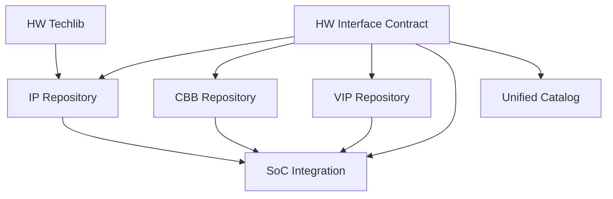
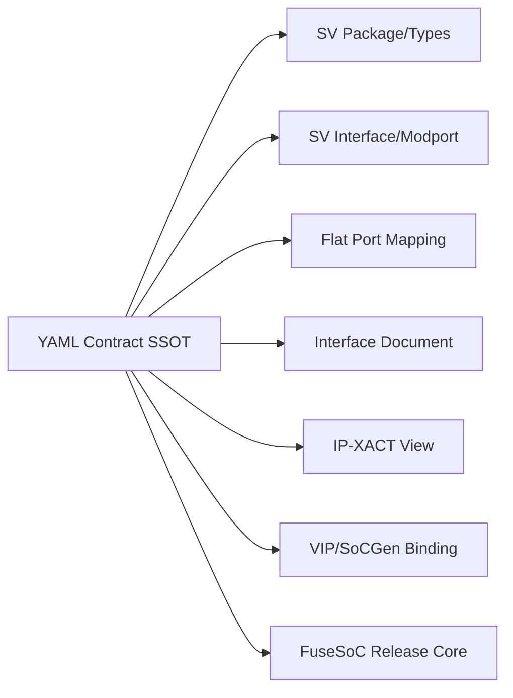
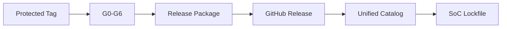

# hwif — 完整设计参考

> 完整保留历史长篇设计要求；旧状态、日期和优先级不再作为执行依据。当前设计见 [`README.md`](README.md)，活动交付见 [`delivery.md`](delivery.md)。

> 来源：repos/aixsilicon_hwif_repo/plan.md + todo.md（完整剪切至 docs/architecture/repo-plans 统一管理）
> 迁移日期：2026-08-13
> 仓库实现现状见 docs/architecture/repos.md §1.1

---

## 一、plan.md 完整原文

# AIXSILICON HW Interface Repository 完整规划

> 版本：V1.0
> 日期：2026-08-12
> 面向场景：IP设计、CBB复用、VIP装配、Subsystem/SoC集成、功能安全集成
> 工程底座：YAML SSOT、SystemVerilog、FuseSoC、统一Catalog、SystemRDL/PeakRDL、SoC Integration Toolchain

---

## 1. 建设结论

HW Interface Repo应被定义为：

> **IP、CBB、VIP和SoC Integration之间统一、可版本化、可机器读取的硬件接口契约中心。**

它不是简单的`*.sv interface`代码集合，也不是协议桥接器仓库。每一种接口资产同时描述：

- 接口身份与协议/规范版本；
- 角色、通道、信号、方向和宽度关系；
- Clock、Reset、Power Domain和CDC属性；
- 必选/可选能力及合法参数组合；
- 事务、顺序、背压和错误语义；
- RTL、VIP、SoCGen和文档所需的不同实现视图；
- 兼容范围、成熟度和验证证据。

建议当前采用：

> **一个HW Interface Monorepo + 每个接口族独立FuseSoC Core + YAML语义契约SSOT + 多种确定性派生视图 + 统一Catalog发布。**

核心表达策略：

1. **YAML Contract是接口语义SSOT**，用于定义接口事实；
2. **SystemVerilog package + packed struct是内部RTL首选视图**；
3. **SystemVerilog interface/modport是验证和局部封装视图**；
4. **Flattened Port Wrapper是IP交付与工具兼容视图**；
5. **IP-XACT busDefinition/abstractionDefinition是可选交换视图**，由YAML派生，不取代YAML；
6. **FuseSoC负责依赖、编译顺序、fileset和target**，不承担接口语义建模；
7. **协议SVA/Checker归VIP Repo，协议桥/CDC/位宽转换归CBB Repo**。

---

## 2. 为什么必须独立建设HW Interface Repo

如果接口定义散落在IP、VIP、CBB和SoC工程中，通常会出现：

- IP使用一份AXI/APB类型，VIP又定义另一份；
- 相同协议在不同IP中采用不同字段宽度、命名和复位语义；
- SoCGen只能按字符串端口名连接，无法理解角色和能力；
- RTL与验证环境对可选信号、错误响应和顺序语义理解不一致；
- 修改一个typedef后，无法知道影响了哪些IP、VIP和SoC；
- 项目通过手工adapter“临时接通”，长期形成大量隐式协议变种；
- 协议版本只写“AXI”，但未说明AXI4/AXI5、支持哪些可选能力；
- 功能安全相关的错误、完整性、隔离和故障语义没有统一表达；
- 工具只能看到bit-level连接，无法实施结构化集成检查。

HW Interface Repo的价值不是减少几百行typedef，而是把接口从“连得上”提升为：

> **身份一致、语义一致、能力匹配、版本可控、集成可检查、变更可分析。**

---

## 3. 仓库边界

### 3.1 本仓库负责什么

| 资产 | 是否归HW Interface Repo | 说明 |
|---|---:|---|
| Interface YAML Contract | 是 | 接口语义唯一事实源 |
| SystemVerilog package/typedef | 是 | RTL与VIP共享的类型定义 |
| Packed request/response structs | 是 | 内部RTL推荐表达 |
| SystemVerilog interface/modport | 是 | TB和局部集成视图 |
| Flatten/unflatten wrapper模板 | 是 | 从统一类型映射到扁平端口 |
| Role、channel、signal定义 | 是 | 结构和语义事实 |
| Clock/reset/power/CDC属性 | 是 | 接口集成约束 |
| Capability/Profile定义 | 是 | 例如AXI4-Lite、无ATOP、最大Outstanding等 |
| Tie-off/default值规则 | 是 | 只描述规则及生成映射 |
| Interface Compatibility规则 | 是 | 自动判断可直连/需adapter/不兼容 |
| VIP binding map | 是 | 信号和角色到VIP接口的映射描述 |
| 可选IP-XACT接口定义 | 是 | YAML的派生交换格式 |
| FuseSoC Core | 是 | 发布和依赖入口 |

### 3.2 明确不归本仓库的内容

| 资产 | 所属仓库 | 原因 |
|---|---|---|
| AXI/APB Driver、Monitor、Sequence | `vip-repo` | 属于验证行为，不是接口契约 |
| Protocol SVA/Checker/Coverage | `vip-repo` | 继续保持此前确定的边界 |
| AXI↔APB Bridge | `cbb-repo`或独立IP | 属于可综合功能实现 |
| Width/ID/Clock Converter | `cbb-repo` | 属于适配逻辑，不是声明 |
| CDC同步器、Async FIFO | `cbb-repo`/`hw-techlib` | 属于实现与工艺适配 |
| IP专用Top端口清单 | 对应`ip-repo` | IP实例接口绑定本身属于IP |
| SoC实例连接关系 | `soc-integration` | 本仓定义接口类型，SoC仓定义谁连接谁 |
| 地址空间和中断号分配 | `soc-integration` | 属于SoC实例化事实 |
| CSR寄存器定义 | 所属IP的SystemRDL | SystemRDL继续作为CSR SSOT |
| SRAM/PLL/IO Macro实现 | `hw-techlib` | 本仓只定义抽象接口契约 |
| 商业协议规范正文 | 受控规范库 | 本仓只记录规范引用和采用Profile |

### 3.3 边界判断原则

- 描述“有哪些信号、角色、语义、约束”的，属于Interface Repo；
- 描述“如何驱动、监测、检查”的，属于VIP Repo；
- 描述“如何转换、缓存、同步、桥接”的，属于CBB Repo；
- 描述“哪个实例连接哪个实例”的，属于SoC Integration；
- 描述“寄存器地址和字段”的，属于SystemRDL；
- 描述“工艺Macro如何实现”的，属于Techlib。

---

## 4. 与完整硬件资产体系的关系



典型依赖关系：

```text
aix:interface:common
        ↓
aix:interface:ready_valid / interrupt / memory
        ↓
aix:interface:apb / axi_lite / axi / axi_stream
        ↓
IP / CBB / VIP
        ↓
Subsystem / SoC Top
```

Interface Core不能反向依赖具体IP、CBB或VIP，以防形成依赖环。

---

## 5. 总体技术架构

### 5.1 四层契约模型

| 层次 | 内容 | 主要消费者 |
|---|---|---|
| L0 Identity | ID、名称、版本、协议引用、Owner、成熟度 | Catalog、发布系统 |
| L1 Semantic | 角色、通道、信号、事务、时序、错误和顺序语义 | 架构、设计、验证 |
| L2 Configuration | 参数、Profile、Capability、合法组合、默认值 | IP配置、SoCGen、VIP |
| L3 Realization | SV types/interface/flat ports、IP-XACT、文档视图 | RTL、EDA、验证、交付 |

### 5.2 事实与派生物



以下内容禁止多处手工维护：

- 信号名、宽度表达式和方向；
- 必选/可选属性；
- 参数默认值与取值约束；
- role/channel映射；
- tie-off规则；
- capability/profile组成；
- 兼容性声明。

复杂SV实现可以手工编写，但必须由工具对照YAML进行一致性检查。

---

## 6. HDL表达策略

### 6.1 不强制所有IP顶层使用SV interface

SV `interface`适合：

- UVM virtual interface；
- Testbench连接；
- 局部设计层级；
- 快速原型；
- 将clocking block和modport集中表达。

但作为所有可综合IP的唯一交付边界，可能遇到：

- 不同综合、Lint、CDC、DFT和形式工具支持差异；
- 参数化interface和modport在层级集成中的限制；
- IP-XACT、网表、约束和脚本更偏好明确端口；
- 商业IP、Macro和跨语言边界通常采用扁平端口；
- ECO和层级追踪时可见性不统一。

因此采用三视图并存策略。

### 6.2 View A：Packed Struct，内部RTL首选

适用于AXI、APB、Memory、Ready/Valid、Interrupt Bundle等内部接口。

优点：

- 端口数量少；
- 类型安全；
- 易于数组化和参数化；
- 对SoCGen和结构化连接友好；
- 便于区分request/response方向；
- 可被VIP与设计共享。

示例命名：

```systemverilog
typedef struct packed {
  logic                  valid;
  logic [DATA_W-1:0]     data;
  logic [KEEP_W-1:0]     keep;
  logic                  last;
  logic [USER_W-1:0]     user;
} aix_stream_req_t;

typedef struct packed {
  logic                  ready;
} aix_stream_rsp_t;
```

### 6.3 View B：SystemVerilog Interface

用于VIP、TB和需要modport的环境：

```systemverilog
interface aix_stream_if #(
  parameter int unsigned DATA_W = 32,
  parameter int unsigned USER_W = 1
) (
  input logic clk,
  input logic rst_n
);
  logic                  valid;
  logic                  ready;
  logic [DATA_W-1:0]     data;
  logic [DATA_W/8-1:0]   keep;
  logic                  last;
  logic [USER_W-1:0]     user;

  modport source (output valid, data, keep, last, user, input ready);
  modport sink   (input valid, data, keep, last, user, output ready);
  modport monitor(input valid, ready, data, keep, last, user);
endinterface
```

接口Repo提供信号表达和modport，不在此处实现协议断言；SVA由对应VIP Core依赖本接口Core后提供。

### 6.4 View C：Flattened Ports

用于：

- IP正式交付边界；
- Verilog/VHDL混合环境；
- 某些DFT、CDC或综合网表流程；
- 第三方IP接入；
- Pad/Macro接口。

Flattened View由YAML映射生成，命名遵循：

```text
<instance_prefix>_<channel>_<signal>_<direction>
```

例如：

```text
s_axi_aw_valid_i
s_axi_aw_ready_o
s_axi_aw_addr_i
```

内部契约角色统一使用`initiator/target`，端口前缀可为兼容业界或历史资产保留`m_`/`s_`别名，但必须在metadata中明确alias，不把别名当成新的接口类型。

---

## 7. 接口分类与完整建设清单

### 7.1 L0：基础语义接口

| Interface Core | 内容 | 优先级 |
|---|---|---:|
| `common_types` | bool、enum、ID、error code、通用type utility | P0 |
| `clock` | 主时钟、派生时钟、clock enable、频率属性 | P0 |
| `reset` | async/sync、polarity、assert/deassert语义 | P0 |
| `ready_valid` | 单拍/多拍、source/sink、payload/last/user | P0 |
| `req_ack` | request/acknowledge事件握手 | P0 |
| `event` | pulse、level、toggle event | P0 |
| `status_control` | enable、busy、done、idle、error基本语义 | P1 |

### 7.2 L1：SoC公共控制接口

| Interface Core | 关键内容 | 优先级 |
|---|---|---:|
| `interrupt` | level/pulse、polarity、vector、source/sink、ack可选 | P0 |
| `error_report` | recoverable/fatal、source ID、syndrome、valid/ack | P0 |
| `alert` | 安全敏感事件、ack、ping/heartbeat可选 | P1 |
| `clock_control` | enable、gate status、mux request/ack、safe switch | P1 |
| `reset_control` | reset request/cause/status、domain reset handshake | P1 |
| `power_state` | power request/accept/state、wake event | P1 |
| `isolation` | isolate request/status、clamp policy metadata | P1 |
| `retention` | save/restore request/status | P2 |
| `lifecycle_state` | 安全生命周期状态的抽象编码/有效性 | P2 |

### 7.3 L2：存储与寄存器接口

| Interface Core | 关键内容 | 优先级 |
|---|---|---:|
| `reg_native` | 简化CSR request/response、byte enable、error | P0 |
| `memory_1rw` | 单端口读写、mask、latency profile | P0 |
| `memory_1r1w` | 独立读写端口、collision policy | P0 |
| `memory_tdp` | True Dual Port、冲突语义 | P1 |
| `rom` | 只读请求/响应、fixed/variable latency | P1 |
| `fifo_push_pop` | push/pop、full/empty、level、overflow/underflow | P0 |
| `ecc_memory_sideband` | syndrome、corrected/uncorrectable、inject | P1 |
| `cache_maintenance` | invalidate/clean/fence抽象控制 | P2 |

注：SRAM Macro的具体pin和时序属于`hw-techlib`；本仓提供逻辑抽象接口，Techlib负责映射到具体Macro。

### 7.4 L3：片上总线与流接口

| Interface Core | Profile建议 | 优先级 |
|---|---|---:|
| `apb` | APB4/APB5按实际项目版本建立独立Profile | P0 |
| `axi_lite` | AXI4-Lite基础Profile、可选USER/PROT | P0 |
| `axi` | AXI4基础Profile，ATOP/独占/USER作为Capability | P0/P1 |
| `axi_stream` | Basic/Packet/Metadata Profile | P0 |
| `ahb_lite` | AHB-Lite目标Profile | P1 |
| `obi` | RISC-V CPU/加速器按项目需要 | P1 |
| `tilelink_ul` | 仅在采用TileLink系统时建设 | P2 |
| `credit_link` | flit、credit return、VC、QoS、retry能力 | P0 |
| `noc_flit` | header/body/tail、VC、route、error、poison | P1 |
| `packet_stream` | SOP/EOP/byte enable/channel/error | P0 |

AMBA接口必须记录采用的规范文档标识和Profile，不能只写“AXI兼容”。Arm官方将AXI定义为点到点接口协议，而不是完整互联实现；本仓描述端点契约，不描述Crossbar拓扑。[Arm AXI协议概览](https://developer.arm.com/documentation/102202/latest/AXI-protocol-overview)

### 7.5 L4：外设与芯片边界接口

| Interface Core | 内容 | 优先级 |
|---|---|---:|
| `uart_pin` | tx/rx、cts/rts、极性与同步属性 | P1 |
| `spi` | sclk、cs、MOSI/MISO、single/dual/quad data | P1 |
| `i2c` | scl/sda input/output-enable分离视图 | P1 |
| `gpio` | input/output/output-enable、interrupt sideband | P1 |
| `jtag` | TCK/TMS/TDI/TDO/TRSTn | P1 |
| `riscv_dmi` | DMI request/response | P1 |
| `pwm` | channel output、complementary/dead-time属性 | P2 |
| `pad_control` | input/output/OE、pull、drive、schmitt、slew | P1 |
| `pll_control` | ref clock、enable、lock、bypass、config抽象 | P2 |

这里只定义数字侧接口契约；模拟电气指标、Pad模型和PLL行为模型分别进入工艺/AMS相关资产库。

### 7.6 L5：调试、测试、可观测性

| Interface Core | 内容 | 优先级 |
|---|---|---:|
| `trace_stream` | timestamp、source、event、payload、overflow | P1 |
| `performance_event` | event ID、count/level/pulse、domain | P1 |
| `debug_request` | halt/resume/step/status抽象 | P2 |
| `scan_control` | scan enable、test mode、scan clock/reset抽象 | P2 |
| `mbist_control` | start/done/fail/address/syndrome | P1 |
| `lbist_control` | start/done/signature/pass/fail | P2 |
| `dfx_override` | clock/reset/isolation override及安全限定 | P2 |

### 7.7 L6：功能安全与安全扩展

| Interface Core | 内容 | 优先级 |
|---|---|---:|
| `integrity_sideband` | parity/ECC/CRC、poison、validity | P1 |
| `safety_event` | fault ID、severity、domain、timestamp、ack | P0 |
| `fault_injection_control` | inject enable/type/target/trigger/status | P1 |
| `lockstep_compare` | compare enable、mismatch、syndrome、channel | P1 |
| `watchdog_service` | service/challenge/response/status | P1 |
| `domain_health` | alive、degraded、failed、recovery状态 | P1 |
| `security_violation` | source、class、fatality、evidence摘要 | P2 |

这些接口要与SafeSight、FUSA Skill Suite、PIC和SoCGen保持ID一致，但不会在接口仓中实现安全机制本体。

---

## 8. 推荐仓库结构

```text
hw-interfaces/
├── README.md
├── LICENSES/
├── NOTICE
├── CONTRIBUTING.md
├── CODEOWNERS
├── CHANGELOG.md
├── docs/
│   ├── architecture/
│   ├── modeling-guide/
│   ├── naming-convention/
│   ├── compatibility-guide/
│   └── integration-guide/
├── schema/
│   ├── interface_contract.schema.yaml
│   ├── interface_profile.schema.yaml
│   ├── binding.schema.yaml
│   ├── compatibility.schema.yaml
│   └── release_manifest.schema.yaml
├── common/
│   ├── contract/
│   ├── rtl/
│   └── aix_interface_common.core
├── foundation/
│   ├── clock/
│   ├── reset/
│   ├── ready_valid/
│   ├── req_ack/
│   └── event/
├── system/
│   ├── interrupt/
│   ├── error_report/
│   ├── clock_control/
│   ├── reset_control/
│   └── power_state/
├── memory/
│   ├── reg_native/
│   ├── memory_1rw/
│   ├── memory_1r1w/
│   └── fifo_push_pop/
├── bus/
│   ├── apb/
│   ├── axi_lite/
│   ├── axi/
│   ├── axi_stream/
│   ├── ahb_lite/
│   └── obi/
├── link/
│   ├── credit_link/
│   ├── packet_stream/
│   └── noc_flit/
├── peripheral/
│   ├── uart/
│   ├── spi/
│   ├── i2c/
│   ├── gpio/
│   └── jtag_dmi/
├── dft_debug/
├── safety_security/
├── profiles/
│   ├── organization/
│   └── project_extensions/
├── bindings/
│   ├── vip/
│   ├── ipxact/
│   └── legacy/
├── generated/
│   ├── docs/
│   ├── ipxact/
│   └── catalog/
├── examples/
├── tests/
│   ├── schema/
│   ├── compile/
│   ├── structural/
│   ├── compatibility/
│   └── consumer/
└── tools/
    ├── contract_validate/
    ├── sv_consistency_check/
    ├── view_generate/
    ├── compatibility_check/
    ├── impact_analysis/
    └── package_release/
```

`generated/`中的派生文件不允许手工修改。是否将生成文件提交Git，由后续CI和红区工具可用性决定；正式Release包必须包含生成结果，以避免消费者被迫安装生成器。

---

## 9. 单个接口族标准模板

```text
bus/axi/
├── README.md
├── CHANGELOG.md
├── contract/
│   ├── axi.interface.yaml
│   ├── axi4_base.profile.yaml
│   ├── axi4_atop.profile.yaml
│   └── compatibility.yaml
├── rtl/
│   ├── axi_pkg.sv
│   ├── axi_typedef.svh
│   ├── axi_assign.svh
│   ├── axi_if.sv
│   └── axi_flat_wrapper.sv
├── binding/
│   ├── vip_binding.yaml
│   └── ipxact_mapping.yaml
├── docs/
│   ├── interface_spec.md
│   ├── profile_guide.md
│   ├── integration_guide.md
│   └── migration_guide.md
├── tests/
│   ├── compile/
│   ├── type_roundtrip/
│   ├── flat_roundtrip/
│   └── compatibility/
├── examples/
├── metadata/
│   ├── release_manifest.yaml
│   └── provenance.yaml
└── aix_interface_axi.core
```

---

## 10. YAML Interface Contract设计

### 10.1 基本原则

- 每个事实具有稳定ID；
- 宽度表达式必须是受限表达式，不允许任意脚本；
- 方向采用`from/to role`，不直接用容易混淆的模块视角`input/output`；
- 必选信号和可选Capability分开；
- Clock/Reset/Power/CDC属性不能留给端口名猜测；
- Profile是对基础协议能力的冻结组合；
- 规范正文不复制进YAML，只记录受控引用；
- YAML按接口族拆分，不形成单一超级YAML。

### 10.2 示例

```yaml
schema_version: "1.0"

interface:
  id: IFC-STREAM-001
  name: aix_stream
  family: stream
  semantic_version: 1.0.0
  owner: hw-platform
  lifecycle: reviewed

protocol_reference:
  kind: internal
  document_id: AIX-IF-STREAM-001
  revision: "1.0"

roles:
  - id: source
  - id: sink
  - id: monitor

parameters:
  - id: DATA_W
    type: uint
    default: 32
    constraints:
      min: 8
      multiple_of: 8
  - id: USER_W
    type: uint
    default: 1
    constraints:
      min: 1

clock_domains:
  - id: clk
    edge: rising

reset_domains:
  - id: rst_n
    polarity: active_low
    assertion: asynchronous
    deassertion: synchronous
    clock: clk

channels:
  - id: payload
    handshake: ready_valid
    clock: clk
    reset: rst_n
    ordering: in_order
    signals:
      - id: valid
        from: source
        to: sink
        width: "1"
        required: true
      - id: ready
        from: sink
        to: source
        width: "1"
        required: true
      - id: data
        from: source
        to: sink
        width: "DATA_W"
        required: true
      - id: keep
        from: source
        to: sink
        width: "DATA_W / 8"
        capability: byte_keep
      - id: last
        from: source
        to: sink
        width: "1"
        capability: packet_boundary
      - id: user
        from: source
        to: sink
        width: "USER_W"
        capability: user_sideband

capabilities:
  - id: byte_keep
    default: false
  - id: packet_boundary
    default: false
  - id: user_sideband
    default: false

semantics:
  transfer: "valid && ready"
  payload_stable_while_stalled: true
  combinational_ready_to_valid: forbidden

views:
  packed_struct: true
  sv_interface: true
  flattened: true
  ipxact: optional
```

### 10.3 Profile示例

```yaml
profile:
  id: IFC-PROFILE-STREAM-PACKET-1
  interface: IFC-STREAM-001
  version: 1.0.0
  capabilities:
    byte_keep: required
    packet_boundary: required
    user_sideband: optional
  parameter_constraints:
    DATA_W: [32, 64, 128, 256, 512, 1024]
  compatibility_class: packet_stream_v1
```

Profile不能复制基础接口信号，只引用基础接口并冻结能力组合。

---

## 11. 统一命名与语义规范

### 11.1 角色命名

| 场景 | 统一角色 | 协议原生别名 |
|---|---|---|
| Memory-mapped request | `initiator` / `target` | master/slave、manager/subordinate |
| Stream | `source` / `sink` | transmitter/receiver |
| Clock/reset控制 | `controller` / `endpoint` | source/destination |
| Interrupt | `source` / `receiver` | sender/target |
| Memory | `requester` / `memory` | host/device |

规范原文和外部IP可保留原生术语；内部metadata用统一角色，以便SoCGen跨协议处理。

### 11.2 RTL命名

- Package：`aix_<interface>_pkg`；
- Interface：`aix_<interface>_if`；
- 类型：`<interface>_req_t`、`<interface>_rsp_t`；
- Channel：`aw_t`、`w_t`、`b_t`等保留协议标准简称；
- Clock：`clk_i`；
- Active-low reset：`rst_ni`；
- 普通输入/输出：`*_i`、`*_o`；
- 双向物理接口优先拆成`*_i`、`*_o`、`*_oe_o`，避免内部RTL直接使用`inout`；
- 参数：`PascalCase`或组织既有规范统一，不能同仓混用；
- 宽度参数必须无歧义，如`AddrWidth`、`DataWidth`、`IdWidth`。

### 11.3 Reset语义

每个接口必须明确：

- polarity；
- assertion同步/异步；
- deassertion同步/异步；
- 所属clock；
- reset期间输出要求；
- reset释放后的最小稳定周期；
- reset能否打断未完成事务；
- 多reset域关系。

OpenTitan的Comportability规范也将clock/reset作为每个外设接口声明的一部分，这种“接口事实显式化”值得借鉴，但本仓继续使用YAML而不是HJSON。[OpenTitan Comportability](https://opentitan.org/book/doc/contributing/hw/comportability/)

### 11.4 CDC与Power属性

每个channel至少声明：

- source clock domain；
- destination clock domain；
- synchronous/asynchronous/mesochronous；
- 允许的CDC方法类别；
- source/target power domain；
- isolation方向和默认clamp值；
- retention相关性；
- 电源关闭时信号合法性。

接口仓只描述CDC需求，不指定某个同步器实例；具体实现由CBB/Techlib提供。

---

## 12. 参数、Capability与Profile治理

### 12.1 三者区别

| 概念 | 用途 | 示例 |
|---|---|---|
| Parameter | 数值或枚举配置 | `DataWidth=128` |
| Capability | 是否支持某项协议能力 | `supports_atop=true` |
| Profile | 经评审冻结的参数/能力组合 | `axi4_dma_v1` |

禁止仅用大量`ifdef`表达协议能力。优先级：

1. Profile；
2. Parameter；
3. Capability；
4. 必要的工具兼容宏。

### 12.2 推荐组织Profile

建议首批定义：

- `apb_csr_v1`；
- `axi_lite_csr_v1`；
- `axi_memory_basic_v1`；
- `axi_dma_high_bw_v1`；
- `axi_stream_basic_v1`；
- `axi_stream_packet_v1`；
- `ready_valid_scalar_v1`；
- `ready_valid_packet_v1`；
- `credit_link_basic_v1`；
- `interrupt_level_v1`；
- `interrupt_pulse_v1`；
- `memory_1rw_sync_v1`；
- `safety_event_v1`。

Profile应少而稳定。项目专用参数放在IP/SoC配置中，不要为每个项目新增公共Profile。

---

## 13. 接口兼容性模型

### 13.1 三层兼容性

| 层次 | 判断内容 | 结果示例 |
|---|---|---|
| Protocol Compatibility | 是否属于同一协议族和兼容规范版本 | AXI4 ↔ AXI4 |
| Profile Compatibility | 必选能力、可选信号和参数是否匹配 | target不支持ATOP |
| Binding Compatibility | 具体端口、role、clock/reset/power是否可绑定 | DataWidth不一致 |

### 13.2 自动判定结果

Compatibility Checker只能输出三类结论：

- `DIRECT`：可直接连接；
- `ADAPTER_REQUIRED`：语义可转换，但需要明确的CBB adapter；
- `INCOMPATIBLE`：不允许自动连接。

不能以“端口名相同”作为`DIRECT`依据。

### 13.3 典型规则

| 条件 | 结论 |
|---|---|
| 协议和Profile一致，参数一致 | DIRECT |
| AXI数据位宽不同 | ADAPTER_REQUIRED |
| AXI ID宽度不同且可证明截断/扩展安全 | ADAPTER_REQUIRED |
| Clock domain不同 | ADAPTER_REQUIRED |
| Reset polarity不同 | ADAPTER_REQUIRED或绑定层转换 |
| Source要求ATOP，Target不支持 | INCOMPATIBLE |
| Source可能产生8个Outstanding，Target只接受1个且无节流保证 | ADAPTER_REQUIRED或INCOMPATIBLE |
| Stream有TLAST，Sink不理解packet boundary | INCOMPATIBLE，除非显式strip adapter |
| Interrupt pulse连接到只接受level的receiver | ADAPTER_REQUIRED |
| Safety event severity语义不一致 | INCOMPATIBLE |

### 13.4 SoCGen集成前检查

SoC Integration必须在生成RTL前完成：

1. Interface ID解析；
2. Role匹配；
3. Profile协商；
4. 参数求值；
5. Clock/reset/power domain检查；
6. Capability检查；
7. Adapter需求识别；
8. 未连接和tie-off规则检查；
9. 生成兼容性报告；
10. 将实际Interface版本写入SoC Lockfile。

---

## 14. FuseSoC组织方式

每个接口族作为独立Core发布，例如：

```text
aix:interface:common:1.0.0
aix:interface:ready_valid:1.0.0
aix:interface:interrupt:1.0.0
aix:interface:reg_native:1.0.0
aix:interface:apb:1.0.0
aix:interface:axi_lite:1.0.0
aix:interface:axi:1.0.0
aix:interface:axi_stream:1.0.0
aix:interface:credit_link:1.0.0
aix:interface:safety_event:1.0.0
```

### 14.1 Core示例

```yaml
CAPI=2:

name: aix:interface:axi:1.0.0
description: AIXSILICON AXI interface contract and SystemVerilog views

filesets:
  rtl:
    depend:
      - aix:interface:common:1.0.0
    files:
      - rtl/axi_pkg.sv
      - rtl/axi_if.sv
    file_type: systemVerilogSource

  include:
    files:
      - rtl/axi_typedef.svh:
          is_include_file: true
      - rtl/axi_assign.svh:
          is_include_file: true
    file_type: systemVerilogSource

  contract:
    files:
      - contract/axi.interface.yaml: {copyto: metadata/axi.interface.yaml}
      - contract/axi4_base.profile.yaml: {copyto: metadata/axi4_base.profile.yaml}
    file_type: user

targets:
  default:
    filesets: [rtl, include]

  contract:
    filesets: [contract]

  lint:
    filesets: [rtl, include]
    toplevel: axi_interface_compile_smoke
```

FuseSoC CAPI2通过fileset描述文件和依赖，通过target提供不同使用入口；依赖文件会按依赖关系插入编译列表，因此适合保证公共package先编译。[FuseSoC CAPI2](https://fusesoc.readthedocs.io/en/stable/ref/capi2.html)、[FuseSoC依赖与编译顺序](https://fusesoc.readthedocs.io/en/stable/user/build_system/dependencies.html)

### 14.2 Target规范

| Target | 用途 |
|---|---|
| `default` | RTL/IP/VIP依赖的SV视图 |
| `contract` | 仅获取YAML Contract/Profile |
| `lint` | 类型、interface和wrapper静态检查 |
| `compile_smoke` | 最小编译/展开 |
| `roundtrip` | struct↔interface↔flat映射一致性测试 |
| `compatibility_test` | 接口匹配规则测试 |
| `example` | 最小消费者示例 |
| `package` | 生成Release包 |

正式项目基线应精确锁定Catalog commit、Interface VLNV、Git SHA和生成器/工具版本；开发阶段可使用受控SemVer范围。

---

## 15. IP、CBB、VIP和SoC如何声明接口

### 15.1 IP Metadata示例

```yaml
interfaces:
  - instance_id: s_ctrl
    contract: aix:interface:axi_lite:1.0.0
    profile: axi_lite_csr_v1
    role: target
    parameters:
      AddrWidth: 32
      DataWidth: 32
    clock: clk_apb
    reset: rst_apb_n
    power_domain: pd_peri

  - instance_id: irq_done
    contract: aix:interface:interrupt:1.0.0
    profile: interrupt_level_v1
    role: source
    width: 1
```

### 15.2 VIP Binding示例

```yaml
binding:
  interface: aix:interface:axi_lite:1.0.0
  vip: aix:vip:axi_lite:1.0.0
  role_map:
    initiator: active_master
    target: active_slave
    monitor: passive
  sv_interface: aix_axi_lite_if
  transaction_type: aix_axi_lite_item
```

### 15.3 CBB Adapter声明

```yaml
adapter:
  id: CBB-AXI-DW-001
  input_contract: aix:interface:axi:1.x
  output_contract: aix:interface:axi:1.x
  transforms:
    - DataWidth
  limitations:
    - no_atop_width_conversion
```

Compatibility Checker识别出`ADAPTER_REQUIRED`后，只能从Catalog选择满足转换条件的已发布CBB，不允许SoCGen临时生成未经验证的转换逻辑。

---

## 16. 版本与变更治理

### 16.1 SemVer规则

| 版本变化 | 典型变更 |
|---|---|
| Major | 删除/重命名必选信号；改变方向、握手、reset或错误语义；改变struct layout；默认行为发生破坏性变化 |
| Minor | 新增向后兼容的可选Capability/Profile；新增派生视图；扩大合法参数范围 |
| Patch | 文档修正；生成器修复且不改变公开HDL API/语义；测试和CI修复 |

以下情况必须慎重，通常至少升Minor：

- 新增packed struct字段，即使逻辑上可选，也会改变type width；
- 修改枚举编码；
- 改变参数默认值；
- 改变tie-off值；
- 改变clock/reset/power属性；
- 将可选能力变为必选。

### 16.2 SV类型演进限制

Packed struct的字段增删会改变位布局，因此：

- 不通过“在末尾加字段”假设二进制兼容；
- 协议可选字段优先在基础类型中预留明确Capability，或发布新Major类型；
- 不允许依赖匿名struct位置布局进行跨版本连接；
- 生成器必须输出type fingerprint；
- SoC Lockfile记录fingerprint，防止同名异构类型进入同一工程。

### 16.3 Deprecated流程

1. 标记`deprecated_since`；
2. 提供替代Interface/Profile；
3. 提供Migration Guide和必要Adapter；
4. 至少保留两个Release周期；
5. Catalog默认不推荐，但历史SoC仍可解析；
6. 删除只能发生在Major版本或新Catalog大版本。

---

## 17. 质量Gate与验证体系

### 17.1 成熟度状态

| 状态 | 含义 | 使用限制 |
|---|---|---|
| `draft` | 需求和语义讨论中 | 禁止项目依赖 |
| `reviewed` | 架构/协议评审完成 | 允许PoC |
| `qualified` | 结构、工具、消费者测试通过 | 允许正式项目使用 |
| `proven` | 至少两个真实项目验证 | Catalog默认推荐 |
| `deprecated` | 已有替代方案 | 禁止新项目使用 |

### 17.2 发布Gate

| Gate | 检查内容 | 证据 |
|---|---|---|
| G0 Contract | YAML Schema、稳定ID、规范引用、Owner完整 | Schema Report |
| G1 Semantic | role/channel/signal/clock/reset/power/能力评审 | Review Record |
| G2 HDL | package/interface/flat view编译和一致性 | Compile/Consistency Report |
| G3 Roundtrip | struct↔interface↔flat无信息丢失 | Roundtrip Report |
| G4 Consumer | 至少一个IP、一个VIP和一个SoCGen示例消费 | Consumer Evidence |
| G5 Compatibility | 正向/负向/需adapter用例判定正确 | Compatibility Report |
| G6 Release | SemVer、Manifest、SBOM、hash、Catalog更新 | Release Manifest |

### 17.3 测试类型

- Schema正向和负向测试；
- 参数边界和非法组合测试；
- SV package/interface多工具编译；
- struct pack/unpack roundtrip；
- flat wrapper roundtrip；
- modport方向检查；
- width expression求值；
- tie-off/default生成检查；
- Compatibility rule单元测试；
- 旧版本Migration测试；
- IP/VIP/SoCGen消费者测试；
- Catalog安装和离线构建测试。

### 17.4 多工具基线

至少选择组织实际使用的两种商业工具完成Qualified：

- VCS；
- Xcelium；
- Questa。

选择性检查Verilator用于基础package/struct兼容，但不能因开源工具对完整SystemVerilog interface支持有限而降低正式接口语义。

---

## 18. CI/CD与自动发布

### 18.1 Pull Request CI

1. YAML格式和Schema校验；
2. 稳定ID、VLNV和版本一致性；
3. 规范引用与许可证检查；
4. 生成视图是否为最新；
5. SV Lint/Compile；
6. Roundtrip测试；
7. Compatibility测试；
8. Impact Analysis；
9. 文档构建；
10. 受影响消费者Smoke Test。

### 18.2 Nightly

- 全Core多工具编译；
- 全Profile参数矩阵抽样；
- 所有消费者示例；
- 兼容性规则全量回归；
- IP/VIP/CBB Catalog依赖扫描；
- Deprecated和版本漂移报告；
- 生成器确定性检查：同输入必须产生相同hash。

### 18.3 Release



Release包至少包含：

- YAML Contract/Profile/Compatibility；
- SystemVerilog package/interface/flat view；
- FuseSoC发布态Core；
- Interface Spec、Integration Guide、Migration Guide；
- Release Manifest和SBOM；
- Quality Report；
- 源码、生成器、依赖和工具hash；
- Compatibility fingerprint。

与IP Repo相同，Catalog不存开发分支RTL；只索引正式发布资产并保留历史版本。发布态Core由流水线生成，禁止手工维护。

---

## 19. Catalog模型

```yaml
asset:
  type: hw_interface
  id: IFC-AXI-001
  vlnv: aix:interface:axi:1.0.0
  repository: controlled-repository-url
  revision: full-git-commit-sha
  owner: hw-platform
  lifecycle: qualified

protocol:
  family: AMBA
  name: AXI4
  specification_ref: controlled-reference-id

profiles:
  - axi_memory_basic_v1
  - axi_dma_high_bw_v1

views:
  - packed_struct
  - sv_interface
  - flattened
  - ipxact

compatibility:
  api_major: 1
  type_fingerprint: sha256:...

quality:
  contract_gate: pass
  compile_gate: pass
  roundtrip_gate: pass
  consumer_gate: pass

evidence:
  manifest: release_manifest.yaml
  report: quality_report.json
```

AIXSILICON页面建议显示：Interface关系图、信号/通道浏览器、Profile能力矩阵、版本Diff、影响范围、兼容性判定和下游消费者。

---

## 20. IP-XACT定位

IP-XACT适合描述组件、Bus Interface、连接、地址空间和文件集，并提供标准XML Schema，可作为外部工具交换格式。[Accellera IP-XACT说明](https://www.accellera.org/downloads/standards/ip-xact)

但当前体系不建议将IP-XACT作为主SSOT：

- XML对人工评审和AI生成不如YAML友好；
- 组织内部的安全、功耗、CDC和Profile语义仍需要扩展；
- 既有设计链路已经统一到YAML；
- SystemRDL仍负责CSR，不应让IP-XACT重复成为寄存器主源。

推荐关系：

```text
Interface YAML SSOT ──生成──> IP-XACT busDefinition / abstractionDefinition
SystemRDL CSR SSOT   ──生成──> IP-XACT memoryMap / registers（需要时）
SoC YAML SSOT       ──生成──> IP-XACT design / interconnection（需要时）
```

IP-XACT生成物用于Cadence/Synopsys/第三方集成工具交换，不能反向手改后覆盖YAML。

---

## 21. 开源参考项目与采用建议

| 项目 | 值得参考的内容 | 建议 |
|---|---|---|
| [PULP AXI](https://github.com/pulp-platform/axi) | `typedef.svh`、`assign.svh`、req/rsp typed ports、参数化模块 | 重点参考packed struct与type parameter模式；逐文件审查Solderpad许可证 |
| [PULP Register Interface](https://github.com/pulp-platform/register_interface) | 统一简化寄存器接口及AXI/APB适配思想 | 参考`reg_native`语义；adapter代码归CBB而不是本仓 |
| [PULP common_cells](https://github.com/pulp-platform/common_cells) | 公共类型、宏、流接口和可复用模块接口方式 | 参考命名和类型工具；许可证逐文件审查 |
| [PULP AXI Stream](https://github.com/pulp-platform/axi_stream) | AXI Stream类型和组件接口 | 用于Stream Profile对照，不直接复制协议实现 |
| [OpenTitan](https://github.com/lowRISC/opentitan) | `tlul_pkg` typed req/rsp、Comportability、clock/reset/interrupt/alert约束、TopGen思想 | 重点吸收方法；去除TL-UL、HJSON和项目耦合，继续使用YAML |
| [OpenHW OBI](https://docs.openhwgroup.org/projects/cv32e40p-user-manual/en/latest/intro.html) | 开放CPU指令/数据接口规范及optional signal使用 | CPU或加速器场景需要时建立OBI Profile |
| [Arm AMBA](https://developer.arm.com/Architectures/AMBA) | AXI/AHB/APB规范事实 | 只引用受控规范版本，不复制受版权保护的规范正文 |
| [Accellera IP-XACT](https://www.accellera.org/activities/working-groups/ip-xact) | busDefinition、abstractionDefinition、component/interface交换模型 | 作为派生交换视图 |
| [FuseSoC](https://fusesoc.readthedocs.io/en/stable/) | Core、fileset、target、依赖和发布入口 | 作为包管理和构建入口，不作为接口语义模型 |

### 21.1 对PULP AXI的具体借鉴

PULP AXI大量使用类型参数和packed request/response结构，使模块不必重复展开所有AXI信号；其FuseSoC Core也将include文件和RTL fileset明确组织，可作为本仓的直接工程参考。[PULP AXI Core](https://github.com/pulp-platform/axi/blob/master/axi.core)

应借鉴：

- 通道类型、request/response聚合；
- typedef/assign宏；
- type parameter；
- 协议模块统一消费类型；
- 编译依赖组织。

不直接照搬：

- 组织命名和许可证声明；
- 与Bender特有流程耦合；
- 将adapter RTL与interface声明放在同一边界；
- 未经本地Profile审计的全部可选能力。

### 21.2 对OpenTitan的具体借鉴

应借鉴：

- IP接口可组合性规范；
- clock/reset、interrupt和alert显式描述；
- typed request/response；
- Top集成前的结构化检查；
- 接口文档与IP元数据关联。

不采用：

- HJSON作为新SSOT；
- OpenTitan专属TL-UL作为通用主总线；
- CIP/alert等专有语义未经抽象直接进入公共接口；
- Monorepo目录假设。

---

## 22. 实施路线图

按4～5人核心团队估算：1名接口/SoC架构师、2名RTL/接口工程师、1名SoCGen/FuseSoC工具工程师、1名验证/质量工程师；协议专家、DFT、功能安全和开源合规兼职支持。

### 阶段0：立项与边界冻结，2周

交付：

- Interface Repo Charter；
- 与IP/CBB/VIP/SoCGen/Techlib边界；
- YAML Contract/Profile/Binding Schema草案；
- SV表达策略和命名规范；
- UVM/VIP binding原则；
- 开源来源及License Review模板；
- P0接口清单与Owner。

出口：架构评审通过，选定穿刺接口和消费者。

### 阶段1：公共底座，4周

建设：

- 仓库骨架；
- `common_types`；
- `clock`、`reset`；
- `ready_valid`、`req_ack`、`event`；
- Contract Validator；
- SV一致性检查器；
- FuseSoC Core模板；
- CI最小闭环。

出口：至少一个CBB、一个VIP能依赖公共接口Core并通过编译。

### 阶段2：SoC基础接口，4～6周

建设：

- `interrupt`；
- `error_report`和`safety_event`；
- `reg_native`；
- `memory_1rw/1r1w`；
- `fifo_push_pop`；
- Clock/Reset/Power metadata；
- 基础Compatibility Checker。

出口：PIC或APB寄存器IP穿刺完成，接口元数据可被SoCGen读取。

### 阶段3：AMBA与数据通路接口，6～8周

建设：

- APB；
- AXI4-Lite；
- AXI4；
- AXI-Stream；
- Packet Stream；
- Credit Link；
- 首批组织Profile；
- Flat Wrapper和VIP Binding生成。

出口：X2X/总线桥或数据通路IP完成struct/interface/flat三视图和VIP自动装配。

### 阶段4：外设、安全和系统接口，6周

按项目需要建设：

- UART、SPI/QSPI、I2C、GPIO、JTAG/DMI；
- Power/Isolation/Retention；
- MBIST、Lockstep、Fault Injection；
- Trace/Performance Event；
- Techlib binding。

出口：至少一个Subsystem完整应用接口契约体系。

### 阶段5：Catalog、SoCGen和Skill闭环，4周

交付：

- Compatibility Checker完善；
- Impact Analysis；
- Catalog自动发布；
- SoC Lockfile；
- IP Development Skill自动选型/声明接口；
- UVM Verification Skill自动选择VIP；
- SoC Integration Skill自动匹配/插入已认证adapter；
- AIXSILICON接口浏览和影响分析页面。

### 阶段6：项目验证与运营，持续

- 2个IP + 1个Subsystem达到Proven；
- 版本迁移与Deprecated治理；
- 新协议/Profile准入；
- 项目反馈和缺陷闭环；
- 接口PPA、仿真性能和工具兼容趋势。

---

## 23. 人力与周期建议

| 模式 | 配置 | 周期 | 可达到结果 |
|---|---:|---:|---|
| 最小团队 | 3人 | 5～6个月 | P0基础、APB/AXI-Lite、Memory/Interrupt可用 |
| 推荐团队 | 4～5人 | 6～8个月 | 主干总线、Stream、外设基础、SoCGen和Catalog闭环 |
| 平台团队 | 6～8人 | 9～12个月 | 增加DFT、安全、形式检查、多工具Qualification和项目推广 |

必须保证“接口定义者”和“消费者验证者”不是完全同一人，避免仅凭自身实现证明契约正确。

---

## 24. 首批穿刺场景

### 场景A：APB寄存器IP

验证链路：

```text
APB Contract/Profile
  → APB SV Types/Interface
  → IP FuseSoC依赖
  → PeakRDL RAL/CSR RTL
  → APB VIP Binding
  → Interrupt Contract
  → Compile/Smoke/RTM Evidence
```

目标：验证Interface Repo与IP Repo、VIP Repo和SystemRDL协同。

### 场景B：X2X/AXI Bridge

覆盖：

- AXI输入/输出Profile；
- 32/64/128/256/512/1024位宽；
- ID、USER、Outstanding和Burst能力；
- Async clock domain；
- Compatibility Checker识别Width/CDC adapter需求；
- VIP自动绑定。

目标：验证复杂参数和能力协商。

### 场景C：PIC/功能安全中断系统

覆盖：

- Pulse/Level Interrupt Profile；
- vector、polarity、domain；
- pulse-to-level adapter；
- Safety Event；
- CLIC/安全岛接收端绑定；
- Fault Injection和VIP联动。

目标：验证SoC集成和功能安全接口语义。

---

## 25. 首批TODO List

### P0：立即启动

- [ ] 建立`hw-interfaces` Monorepo和CODEOWNERS；
- [ ] 正式冻结IP/CBB/VIP/SoCGen/Techlib边界；
- [ ] 定义Interface Contract Schema；
- [ ] 定义Profile、Binding、Compatibility Schema；
- [ ] 定义稳定ID和VLNV规则；
- [ ] 冻结struct/interface/flat三视图策略；
- [ ] 编写命名、Clock、Reset、CDC、Power规范；
- [ ] 建设`common_types`；
- [ ] 建设`clock/reset/ready_valid/interrupt`；
- [ ] 建设`reg_native/memory_1rw/fifo_push_pop`；
- [ ] 建设FuseSoC Core模板；
- [ ] 建立Schema→Generate→Compile→Roundtrip→Report CI；
- [ ] 对PULP AXI、Register Interface和OpenTitan完成架构/许可证审计；
- [ ] 选择APB IP作为第一个穿刺对象。

### P1：首个季度

- [ ] APB、AXI4-Lite、AXI-Stream达到`qualified`；
- [ ] AXI4基础Profile达到`reviewed/qualified`；
- [ ] Packet Stream和Credit Link达到`qualified`；
- [ ] 完成VIP Binding生成；
- [ ] 完成Flat Wrapper生成；
- [ ] Compatibility Checker支持DIRECT/ADAPTER_REQUIRED/INCOMPATIBLE；
- [ ] IP和VIP Catalog接入接口版本；
- [ ] 至少一个IP、一个CBB、一个VIP真实消费。

### P2：两个季度

- [ ] UART/SPI/I2C/GPIO/JTAG接口完成；
- [ ] Power/Isolation/Retention接口完成；
- [ ] Safety Event/Fault Injection/Lockstep接口完成；
- [ ] SoCGen自动匹配接口和已认证adapter；
- [ ] SoC Lockfile冻结Interface fingerprint；
- [ ] AIXSILICON展示接口图、能力矩阵、Diff和影响分析；
- [ ] 2个IP和1个Subsystem达到`proven`；
- [ ] 建立Deprecated和Migration自动检查。

---

## 26. 一期验收标准

一期不能只以“定义了多少套typedef”作为出口，必须同时满足：

- YAML Contract成为接口唯一事实源；
- P0接口拥有稳定ID、VLNV、SemVer、Owner和成熟度；
- struct、SV interface、flat port视图一致；
- FuseSoC依赖和编译顺序稳定；
- Clock/reset/power/CDC属性可机器读取；
- Profile与Capability可以自动匹配；
- Compatibility Checker能识别直连、需要adapter和不兼容；
- IP、CBB、VIP和SoCGen至少各有真实消费者；
- Release包包含Manifest、质量报告、SBOM、hash和迁移信息；
- Catalog可以查询接口版本、Profile、消费者和质量状态；
- UVM Verification Skill可以根据Interface ID选择VIP；
- SoC Integration Skill不能静默连接不兼容接口；
- 项目不再复制公共AXI/APB/Stream/Interrupt类型定义。

---

## 27. 最终推荐

HW Interface Repo在整个资产体系中的定位应高于普通公共代码库：

> **它是硬件前端的接口类型系统、契约系统和兼容性判断系统。**

推荐建设顺序：

1. 先冻结接口边界和Schema；
2. 用`Clock/Reset + Ready/Valid + Interrupt + APB`验证基础模型；
3. 再建设`AXI4-Lite + AXI-Stream + Memory`；
4. 通过X2X验证复杂AXI参数和CDC适配；
5. 通过PIC验证中断和功能安全语义；
6. 最后扩展外设、DFT、Power和复杂协议。

最重要的三个架构纪律：

- **接口事实只定义一次，所有SV/IP-XACT/文档/Binding视图都从其派生或接受一致性检查；**
- **Interface Repo只定义契约，VIP负责验证行为，CBB负责适配实现，SoCGen负责实例连接；**
- **任何不兼容连接都必须显式失败或选择已认证Adapter，绝不允许SoCGen静默截位、绑常量或改变语义。**

做到这三点，IP Repo、CBB Repo、VIP Repo和SoC Integration才能真正形成可规模化复用的统一工程体系。

---

## 28. 跨仓一致性修订（2026-08-13）

> 依据历史 [`cross-repo-architecture-review.md`](../reference/cross-repo-architecture-review.md)（ADR-0003/0005/0006）。

- 工具边界（R1/ADR-0006）：`tools/` 中产品级确定性工具（contract_validate/view_generate/compatibility_check/package_release 等）分阶段迁入 `aixsilicon_tool_repo`；本仓只保留自维护脚本（测试/CI/文档）；
- “影响分析”语义（R5）：本仓 `impact_analysis` = 接口变更对消费者影响；workflow `impact.py` = 仓库/依赖图影响；二者不重复、命名可区分；
- 发布边界（R4）：本仓 `package_release` = 接口仓自身发布；跨仓 Gate/协调/Catalog 更新由 workflow `aix release` 编排；
- vendored `reference/` 治理（A2）：只读参考/对拍，不发布、不进入 fusesoc 正式发现与 Catalog；
- techlib 统一（A4）：`hw-techlib` 引用统一为待建 `aixsilicon_techlib_repo`；
- VLNV 统一 `aixsilicon:interface:*`（ADR-0003，存量 `aix:interface:*` 走 deprecated 迁移窗口）。


---

## 二、todo.md 完整原文

# Todo / 进展追踪

> 以下为历史 `plan.md`（V1.0，2026-08-12）配套进展原文，不代表当前状态。
> 状态说明：`[ ]` 未开始 · `[-]` 进行中 · `[x]` 已完成
> 接口族完成度：`[x]` Contract+RTL+.core 完整 · `[-]` 仅 Contract（缺 RTL 或派生视图）· `[ ]` 未建设

## 总体状态

- **依据规划**：历史 `plan.md` V1.0（2026-08-12）
- **当前阶段**：阶段 0–4 主体建设完成（57 接口族 + 工具链 + 测试 + 生成物全部落地）
- **上次更新**：2026-08-13

---

## 一、阶段路线图（参照 plan.md §22）

### 阶段0：立项与边界冻结（2周）

- [x] 建立 HW Interface Monorepo 与 CODEOWNERS（[`CODEOWNERS`](../../repos/aixsilicon_hwif_repo/CODEOWNERS)）
- [x] 冻结 IP/CBB/VIP/SoCGen/Techlib 边界（历史 plan §3.2）
- [x] 定义 YAML Contract/Profile/Binding/Compatibility/Release Schema（[`schema/`](../../repos/aixsilicon_hwif_repo/schema)）
- [x] 定义稳定 ID 与 VLNV 规则
- [x] 冻结 struct/interface/flat 三视图策略（历史 plan §6）
- [x] 编写命名、Clock、Reset、CDC、Power 规范文档（[`docs/naming-convention/`](../../repos/aixsilicon_hwif_repo/docs/naming-convention/README.md)）
- [x] 开源来源及 License Review（[`NOTICE`](../../repos/aixsilicon_hwif_repo/NOTICE)、[`LICENSES/`](../../repos/aixsilicon_hwif_repo/LICENSES/README.md)）
- [x] 确定 P0 接口清单与 Owner
- [x] 选取穿刺场景（APB 寄存器 IP、X2X/Bridge、PIC，参照历史 plan §24）

**出口**：架构评审通过，选定穿刺接口与消费者。→ 基本达成

### 阶段1：公共底座（4周）

- [x] 仓库骨架（[`README.md`](../../repos/aixsilicon_hwif_repo/README.md)、[`CHANGELOG.md`](../../repos/aixsilicon_hwif_repo/CHANGELOG.md)、[`CONTRIBUTING.md`](../../repos/aixsilicon_hwif_repo/CONTRIBUTING.md)）
- [x] `common_types`（[`common/`](../../repos/aixsilicon_hwif_repo/common/aix_interface_common.core)）
- [x] `clock`（[`foundation/clock/`](../../repos/aixsilicon_hwif_repo/foundation/clock/aix_interface_clock.core)）
- [x] `reset`（[`foundation/reset/`](../../repos/aixsilicon_hwif_repo/foundation/reset/aix_interface_reset.core)）
- [x] `ready_valid`（[`foundation/ready_valid/`](../../repos/aixsilicon_hwif_repo/foundation/ready_valid/aix_interface_ready_valid.core)）
- [x] `req_ack`（[`foundation/req_ack/`](../../repos/aixsilicon_hwif_repo/foundation/req_ack/aix_interface_req_ack.core)）
- [x] `event`（[`foundation/event/`](../../repos/aixsilicon_hwif_repo/foundation/event/aix_interface_event.core)）
- [x] Contract Validator（[`tools/contract_validate/contract_validate.py`](../../repos/aixsilicon_hwif_repo/tools/contract_validate/contract_validate.py)）
- [x] SV 一致性检查器（[`tools/sv_consistency_check/sv_consistency_check.py`](../../repos/aixsilicon_hwif_repo/tools/sv_consistency_check/sv_consistency_check.py)）
- [x] FuseSoC Core 模板（各接口族 `.core` 已建立）
- [x] CI 最小闭环（[`.github/workflows/ci.yml`](../../repos/aixsilicon_hwif_repo/.github/workflows/ci.yml)）

**出口**：至少一个 CBB、一个 VIP 能依赖公共接口 Core 并通过编译。→ 已验证（107 文件编译 + 61/61 consumer）

### 阶段2：SoC基础接口（4～6周）

- [x] `interrupt`（[`system/interrupt/`](../../repos/aixsilicon_hwif_repo/system/interrupt/aix_interface_interrupt.core)）
- [x] `error_report`（[`system/error_report/`](../../repos/aixsilicon_hwif_repo/system/error_report/aix_interface_error_report.core)）
- [x] `safety_event`（[`safety_security/safety_event/`](../../repos/aixsilicon_hwif_repo/safety_security/safety_event/aix_interface_safety_event.core)）
- [x] `reg_native`（[`memory/reg_native/`](../../repos/aixsilicon_hwif_repo/memory/reg_native/aix_interface_reg_native.core)）
- [x] `memory_1rw` / `memory_1r1w`（[`memory/memory_1rw/`](../../repos/aixsilicon_hwif_repo/memory/memory_1rw/aix_interface_memory_1rw.core)、[`memory/memory_1r1w/`](../../repos/aixsilicon_hwif_repo/memory/memory_1r1w/aix_interface_memory_1r1w.core)）
- [x] `fifo_push_pop`（[`memory/fifo_push_pop/`](../../repos/aixsilicon_hwif_repo/memory/fifo_push_pop/aix_interface_fifo_push_pop.core)）
- [x] Clock/Reset/Power metadata（契约中已声明 clock/reset 域）
- [x] 基础 Compatibility Checker（[`tools/compatibility_check/compatibility_check.py`](../../repos/aixsilicon_hwif_repo/tools/compatibility_check/compatibility_check.py)）

**出口**：PIC 或 APB 寄存器 IP 穿刺完成，接口元数据可被 SoCGen 读取。→ 进行中

### 阶段3：AMBA与数据通路接口（6～8周）

- [x] `apb`（[`bus/apb/`](../../repos/aixsilicon_hwif_repo/bus/apb/aix_interface_apb.core)）
- [x] `axi_lite`（[`bus/axi_lite/`](../../repos/aixsilicon_hwif_repo/bus/axi_lite/aix_interface_axi_lite.core)）
- [x] `axi`（[`bus/axi/`](../../repos/aixsilicon_hwif_repo/bus/axi/aix_interface_axi.core)）
- [x] `axi_stream`（[`bus/axi_stream/`](../../repos/aixsilicon_hwif_repo/bus/axi_stream/aix_interface_axi_stream.core)）
- [x] `packet_stream`（[`link/packet_stream/`](../../repos/aixsilicon_hwif_repo/link/packet_stream/aix_interface_packet_stream.core)）
- [x] `credit_link`（[`link/credit_link/`](../../repos/aixsilicon_hwif_repo/link/credit_link/aix_interface_credit_link.core)）
- [x] 首批组织 Profile（15 个：apb4_base/apb_csr_v1/axi4_base/axi_memory_basic_v1/axi_dma_high_bw_v1/axi_lite_csr/axi_stream_packet/axi_stream_basic_v1/ready_valid_scalar_v1/ready_valid_packet_v1/credit_link_basic/safety_event_v1/interrupt_level_v1/interrupt_pulse_v1/memory_1rw_sync_v1）
- [x] Flat Wrapper 与 VIP Binding 生成（[`view_generate --flat`](../../repos/aixsilicon_hwif_repo/tools/view_generate/view_generate.py) 生成 56 个 View C wrapper）
- [x] `ahb_lite` / `obi` / `noc_flit` RTL 视图（已补齐）

**出口**：X2X/总线桥或数据通路 IP 完成 struct/interface/flat 三视图与 VIP 自动装配。→ 基本达成

### 阶段4：外设、安全和系统接口（6周）

- [x] `uart` / `spi` / `i2c` / `gpio` / `jtag_dmi` RTL 视图（含 pwm/pad_control/pll_control）
- [x] Power / Isolation / Retention 接口（power_state/isolation/retention 全部建成）
- [x] MBIST / Lockstep / Fault Injection（mbist_control/fault_injection_control/lockstep_compare 建成）
- [x] Trace / Performance Event（trace_stream/performance_event 建成）
- [ ] Techlib binding

**出口**：至少一个 Subsystem 完整应用接口契约体系。→ 接口全部建成，Subsystem 集成待推进

### 阶段5：Catalog、SoCGen和Skill闭环（4周）

- [x] Compatibility Checker 完善（支持 DIRECT / ADAPTER_REQUIRED / INCOMPATIBLE）
- [x] Impact Analysis（[`tools/impact_analysis/impact_analysis.py`](../../repos/aixsilicon_hwif_repo/tools/impact_analysis/impact_analysis.py)）
- [x] Catalog 自动发布（[`package_release --catalog`](../../repos/aixsilicon_hwif_repo/tools/package_release/package_release.py)）
- [x] SoC Lockfile 冻结 Interface fingerprint（[`package_release --lockfile`](../../repos/aixsilicon_hwif_repo/tools/package_release/package_release.py)）
- [ ] IP / UVM / SoC Integration Skill 闭环
- [ ] AIXSILICON 接口浏览与影响分析页面

→ Skill 闭环与页面待后续阶段

### 阶段6：项目验证与运营（持续）

- [ ] 2 个 IP + 1 个 Subsystem 达到 `proven`
- [ ] 版本迁移与 Deprecated 治理
- [ ] 新协议/Profile 准入流程
- [ ] 接口 PPA、仿真性能与工具兼容趋势

→ 未开始

---

## 二、接口建设矩阵（参照 plan.md §7 L0–L6）

### L0 基础语义接口

| Interface Core | Contract | RTL | Profile | 状态 |
|---|---|---|---|---|
| `common_types` | [x] | [x] | - | [x] |
| `clock` | [x] | [x] | - | [x] |
| `reset` | [x] | [x] | - | [x] |
| `ready_valid` | [x] | [x] | - | [x] |
| `req_ack` | [x] | [x] | - | [x] |
| `event` | [x] | [x] | - | [x] |
| `status_control`（P1） | [x] | [x]（[`aix_status_control_pkg.sv`](../../repos/aixsilicon_hwif_repo/foundation/status_control/rtl/aix_status_control_pkg.sv)、[`aix_status_control_if.sv`](../../repos/aixsilicon_hwif_repo/foundation/status_control/rtl/aix_status_control_if.sv)） | - | [x] |

### L1 SoC 公共控制接口

| Interface Core | Contract | RTL | Profile | 状态 |
|---|---|---|---|---|
| `interrupt` | [x] | [x] | [x] `interrupt_level_v1` / `interrupt_pulse_v1` | [x] |
| `error_report` | [x] | [x] | - | [x] |
| `clock_control` | [x] | [x]（[`aix_clock_control_pkg.sv`](../../repos/aixsilicon_hwif_repo/system/clock_control/rtl/aix_clock_control_pkg.sv)、[`aix_clock_control_if.sv`](../../repos/aixsilicon_hwif_repo/system/clock_control/rtl/aix_clock_control_if.sv)） | - | [x] |
| `power_state` | [x] | [x]（[`aix_power_state_pkg.sv`](../../repos/aixsilicon_hwif_repo/system/power_state/rtl/aix_power_state_pkg.sv)、[`aix_power_state_if.sv`](../../repos/aixsilicon_hwif_repo/system/power_state/rtl/aix_power_state_if.sv)） | - | [x] |
| `alert`（P1） | [x] | [x]（[`aix_alert_pkg.sv`](../../repos/aixsilicon_hwif_repo/system/alert/rtl/aix_alert_pkg.sv)、[`aix_alert_if.sv`](../../repos/aixsilicon_hwif_repo/system/alert/rtl/aix_alert_if.sv)） | - | [x] |
| `reset_control`（P1） | [x] | [x]（[`aix_reset_control_pkg.sv`](../../repos/aixsilicon_hwif_repo/system/reset_control/rtl/aix_reset_control_pkg.sv)、[`aix_reset_control_if.sv`](../../repos/aixsilicon_hwif_repo/system/reset_control/rtl/aix_reset_control_if.sv)） | - | [x] |
| `isolation`（P1） | [x] | [x]（[`aix_isolation_pkg.sv`](../../repos/aixsilicon_hwif_repo/system/isolation/rtl/aix_isolation_pkg.sv)、[`aix_isolation_if.sv`](../../repos/aixsilicon_hwif_repo/system/isolation/rtl/aix_isolation_if.sv)） | - | [x] |
| `retention`（P2） | [x] | [x]（[`aix_retention_pkg.sv`](../../repos/aixsilicon_hwif_repo/system/retention/rtl/aix_retention_pkg.sv)、[`aix_retention_if.sv`](../../repos/aixsilicon_hwif_repo/system/retention/rtl/aix_retention_if.sv)） | - | [x] |
| `lifecycle_state`（P2） | [x] | [x]（[`aix_lifecycle_state_pkg.sv`](../../repos/aixsilicon_hwif_repo/system/lifecycle_state/rtl/aix_lifecycle_state_pkg.sv)、[`aix_lifecycle_state_if.sv`](../../repos/aixsilicon_hwif_repo/system/lifecycle_state/rtl/aix_lifecycle_state_if.sv)） | - | [x] |

### L2 存储与寄存器接口

| Interface Core | Contract | RTL | Profile | 状态 |
|---|---|---|---|---|
| `reg_native` | [x] | [x] | - | [x] |
| `memory_1rw` | [x] | [x] | [x] `memory_1rw_sync_v1` | [x] |
| `memory_1r1w` | [x] | [x] | - | [x] |
| `fifo_push_pop` | [x] | [x] | - | [x] |
| `memory_tdp`（P1） | [x] | [x]（[`aix_memory_tdp_pkg.sv`](../../repos/aixsilicon_hwif_repo/memory/memory_tdp/rtl/aix_memory_tdp_pkg.sv)、[`aix_memory_tdp_if.sv`](../../repos/aixsilicon_hwif_repo/memory/memory_tdp/rtl/aix_memory_tdp_if.sv)） | - | [x] |
| `rom`（P1） | [x] | [x]（[`aix_rom_pkg.sv`](../../repos/aixsilicon_hwif_repo/memory/rom/rtl/aix_rom_pkg.sv)、[`aix_rom_if.sv`](../../repos/aixsilicon_hwif_repo/memory/rom/rtl/aix_rom_if.sv)） | - | [x] |
| `ecc_memory_sideband`（P1） | [x] | [x]（[`aix_ecc_memory_sideband_pkg.sv`](../../repos/aixsilicon_hwif_repo/memory/ecc_memory_sideband/rtl/aix_ecc_memory_sideband_pkg.sv)、[`aix_ecc_memory_sideband_if.sv`](../../repos/aixsilicon_hwif_repo/memory/ecc_memory_sideband/rtl/aix_ecc_memory_sideband_if.sv)） | - | [x] |
| `cache_maintenance`（P2） | [x] | [x]（[`aix_cache_maintenance_pkg.sv`](../../repos/aixsilicon_hwif_repo/memory/cache_maintenance/rtl/aix_cache_maintenance_pkg.sv)、[`aix_cache_maintenance_if.sv`](../../repos/aixsilicon_hwif_repo/memory/cache_maintenance/rtl/aix_cache_maintenance_if.sv)） | - | [x] |

### L3 片上总线与流接口

| Interface Core | Contract | RTL | Profile | 状态 |
|---|---|---|---|---|
| `apb` | [x] | [x] | [x] `apb4_base` / `apb_csr_v1` | [x] |
| `axi_lite` | [x] | [x] | [x] `axi_lite_csr` | [x] |
| `axi` | [x] | [x] | [x] `axi4_base` / `axi_memory_basic_v1` / `axi_dma_high_bw_v1` | [x] |
| `axi_stream` | [x] | [x] | [x] `axi_stream_packet` / `axi_stream_basic_v1` | [x] |
| `ahb_lite`（P1） | [x] | [x]（[`aix_ahb_lite_pkg.sv`](../../repos/aixsilicon_hwif_repo/bus/ahb_lite/rtl/aix_ahb_lite_pkg.sv)、[`aix_ahb_lite_if.sv`](../../repos/aixsilicon_hwif_repo/bus/ahb_lite/rtl/aix_ahb_lite_if.sv)） | - | [x] |
| `obi`（P1） | [x] | [x]（[`aix_obi_pkg.sv`](../../repos/aixsilicon_hwif_repo/bus/obi/rtl/aix_obi_pkg.sv)、[`aix_obi_if.sv`](../../repos/aixsilicon_hwif_repo/bus/obi/rtl/aix_obi_if.sv)） | - | [x] |
| `credit_link` | [x] | [x] | [x] `credit_link_basic` | [x] |
| `packet_stream` | [x] | [x] | - | [x] |
| `noc_flit`（P1） | [x] | [x]（[`aix_noc_flit_pkg.sv`](../../repos/aixsilicon_hwif_repo/link/noc_flit/rtl/aix_noc_flit_pkg.sv)、[`aix_noc_flit_if.sv`](../../repos/aixsilicon_hwif_repo/link/noc_flit/rtl/aix_noc_flit_if.sv)） | - | [x] |
| `tilelink_ul`（P2） | [x] | [x]（[`aix_tilelink_ul_pkg.sv`](../../repos/aixsilicon_hwif_repo/bus/tilelink_ul/rtl/aix_tilelink_ul_pkg.sv)、[`aix_tilelink_ul_if.sv`](../../repos/aixsilicon_hwif_repo/bus/tilelink_ul/rtl/aix_tilelink_ul_if.sv)） | - | [x] |

### L4 外设与芯片边界接口

| Interface Core | Contract | RTL | Profile | 状态 |
|---|---|---|---|---|
| `uart` | [x] | [x]（[`aix_uart_if.sv`](../../repos/aixsilicon_hwif_repo/peripheral/uart/rtl/aix_uart_if.sv)） | - | [x] |
| `spi` | [x] | [x]（[`aix_spi_if.sv`](../../repos/aixsilicon_hwif_repo/peripheral/spi/rtl/aix_spi_if.sv)） | - | [x] |
| `i2c` | [x] | [x]（[`aix_i2c_if.sv`](../../repos/aixsilicon_hwif_repo/peripheral/i2c/rtl/aix_i2c_if.sv)） | - | [x] |
| `gpio` | [x] | [x]（[`aix_gpio_if.sv`](../../repos/aixsilicon_hwif_repo/peripheral/gpio/rtl/aix_gpio_if.sv)） | - | [x] |
| `jtag_dmi` | [x] | [x]（[`aix_jtag_dmi_if.sv`](../../repos/aixsilicon_hwif_repo/peripheral/jtag_dmi/rtl/aix_jtag_dmi_if.sv)） | - | [x] |
| `pwm`（P2） | [x] | [x]（[`aix_pwm_if.sv`](../../repos/aixsilicon_hwif_repo/peripheral/pwm/rtl/aix_pwm_if.sv)） | - | [x] |
| `pad_control`（P1） | [x] | [x]（[`aix_pad_control_if.sv`](../../repos/aixsilicon_hwif_repo/peripheral/pad_control/rtl/aix_pad_control_if.sv)） | - | [x] |
| `pll_control`（P2） | [x] | [x]（[`aix_pll_control_pkg.sv`](../../repos/aixsilicon_hwif_repo/peripheral/pll_control/rtl/aix_pll_control_pkg.sv)、[`aix_pll_control_if.sv`](../../repos/aixsilicon_hwif_repo/peripheral/pll_control/rtl/aix_pll_control_if.sv)） | - | [x] |

### L5 调试、测试、可观测性

| Interface Core | Contract | RTL | Profile | 状态 |
|---|---|---|---|---|
| `trace_stream`（P1） | [x] | [x]（[`aix_trace_stream_pkg.sv`](../../repos/aixsilicon_hwif_repo/dft_debug/trace_stream/rtl/aix_trace_stream_pkg.sv)、[`aix_trace_stream_if.sv`](../../repos/aixsilicon_hwif_repo/dft_debug/trace_stream/rtl/aix_trace_stream_if.sv)） | - | [x] |
| `mbist_control`（P1） | [x] | [x]（[`aix_mbist_control_pkg.sv`](../../repos/aixsilicon_hwif_repo/dft_debug/mbist_control/rtl/aix_mbist_control_pkg.sv)、[`aix_mbist_control_if.sv`](../../repos/aixsilicon_hwif_repo/dft_debug/mbist_control/rtl/aix_mbist_control_if.sv)） | - | [x] |
| `performance_event`（P1） | [x] | [x]（[`aix_performance_event_pkg.sv`](../../repos/aixsilicon_hwif_repo/dft_debug/performance_event/rtl/aix_performance_event_pkg.sv)、[`aix_performance_event_if.sv`](../../repos/aixsilicon_hwif_repo/dft_debug/performance_event/rtl/aix_performance_event_if.sv)） | - | [x] |
| `debug_request`（P2） | [x] | [x]（[`aix_debug_request_pkg.sv`](../../repos/aixsilicon_hwif_repo/dft_debug/debug_request/rtl/aix_debug_request_pkg.sv)、[`aix_debug_request_if.sv`](../../repos/aixsilicon_hwif_repo/dft_debug/debug_request/rtl/aix_debug_request_if.sv)） | - | [x] |
| `scan_control`（P2） | [x] | [x]（[`aix_scan_control_if.sv`](../../repos/aixsilicon_hwif_repo/dft_debug/scan_control/rtl/aix_scan_control_if.sv)） | - | [x] |
| `lbist_control`（P2） | [x] | [x]（[`aix_lbist_control_pkg.sv`](../../repos/aixsilicon_hwif_repo/dft_debug/lbist_control/rtl/aix_lbist_control_pkg.sv)、[`aix_lbist_control_if.sv`](../../repos/aixsilicon_hwif_repo/dft_debug/lbist_control/rtl/aix_lbist_control_if.sv)） | - | [x] |
| `dfx_override`（P2） | [x] | [x]（[`aix_dfx_override_pkg.sv`](../../repos/aixsilicon_hwif_repo/dft_debug/dfx_override/rtl/aix_dfx_override_pkg.sv)、[`aix_dfx_override_if.sv`](../../repos/aixsilicon_hwif_repo/dft_debug/dfx_override/rtl/aix_dfx_override_if.sv)） | - | [x] |

### L6 功能安全与安全扩展

| Interface Core | Contract | RTL | Profile | 状态 |
|---|---|---|---|---|
| `safety_event` | [x] | [x] | [x] `safety_event_v1` | [x] |
| `fault_injection_control`（P1） | [x] | [x]（[`aix_fault_injection_control_pkg.sv`](../../repos/aixsilicon_hwif_repo/safety_security/fault_injection_control/rtl/aix_fault_injection_control_pkg.sv)、[`aix_fault_injection_control_if.sv`](../../repos/aixsilicon_hwif_repo/safety_security/fault_injection_control/rtl/aix_fault_injection_control_if.sv)） | - | [x] |
| `integrity_sideband`（P1） | [x] | [x]（[`aix_integrity_sideband_pkg.sv`](../../repos/aixsilicon_hwif_repo/safety_security/integrity_sideband/rtl/aix_integrity_sideband_pkg.sv)、[`aix_integrity_sideband_if.sv`](../../repos/aixsilicon_hwif_repo/safety_security/integrity_sideband/rtl/aix_integrity_sideband_if.sv)） | - | [x] |
| `lockstep_compare`（P1） | [x] | [x]（[`aix_lockstep_compare_pkg.sv`](../../repos/aixsilicon_hwif_repo/safety_security/lockstep_compare/rtl/aix_lockstep_compare_pkg.sv)、[`aix_lockstep_compare_if.sv`](../../repos/aixsilicon_hwif_repo/safety_security/lockstep_compare/rtl/aix_lockstep_compare_if.sv)） | - | [x] |
| `watchdog_service`（P1） | [x] | [x]（[`aix_watchdog_service_pkg.sv`](../../repos/aixsilicon_hwif_repo/safety_security/watchdog_service/rtl/aix_watchdog_service_pkg.sv)、[`aix_watchdog_service_if.sv`](../../repos/aixsilicon_hwif_repo/safety_security/watchdog_service/rtl/aix_watchdog_service_if.sv)） | - | [x] |
| `domain_health`（P1） | [x] | [x]（[`aix_domain_health_pkg.sv`](../../repos/aixsilicon_hwif_repo/safety_security/domain_health/rtl/aix_domain_health_pkg.sv)、[`aix_domain_health_if.sv`](../../repos/aixsilicon_hwif_repo/safety_security/domain_health/rtl/aix_domain_health_if.sv)） | - | [x] |
| `security_violation`（P2） | [x] | [x]（[`aix_security_violation_pkg.sv`](../../repos/aixsilicon_hwif_repo/safety_security/security_violation/rtl/aix_security_violation_pkg.sv)、[`aix_security_violation_if.sv`](../../repos/aixsilicon_hwif_repo/safety_security/security_violation/rtl/aix_security_violation_if.sv)） | - | [x] |

---

## 三、Schema / 工具链 / 测试 / 生成物

### Schema（参照 plan.md §8）

- [x] `interface_contract.schema.yaml`
- [x] `interface_profile.schema.yaml`
- [x] `binding.schema.yaml`
- [x] `compatibility.schema.yaml`
- [x] `release_manifest.schema.yaml`

### 工具链（参照 plan.md §8 tools/）

| 工具 | 状态 |
|---|---|
| `contract_validate` | [x]（[`contract_validate.py`](../../repos/aixsilicon_hwif_repo/tools/contract_validate/contract_validate.py)，已跑通全仓契约 schema 校验；支持 jsonschema 4.x/3.x 回退） |
| `sv_consistency_check` | [x]（[`sv_consistency_check.py`](../../repos/aixsilicon_hwif_repo/tools/sv_consistency_check/sv_consistency_check.py)，全库 SV↔契约信号一致性 PASS） |
| `compile_smoke` | [x]（[`compile_smoke.sh`](../../repos/aixsilicon_hwif_repo/tools/compile_smoke.sh)，拓扑顺序全量 62 文件 vlogan 编译通过） |
| `view_generate` | [x]（[`view_generate.py`](../../repos/aixsilicon_hwif_repo/tools/view_generate/view_generate.py)，56 视图 + `--check-only` 门禁 + `--ipxact`(112 XML) + `--flat`(56 View C) + `--docs`(56 spec)） |
| `compatibility_check` | [x]（[`compatibility_check.py`](../../repos/aixsilicon_hwif_repo/tools/compatibility_check/compatibility_check.py)，DIRECT/ADAPTER_REQUIRED/INCOMPATIBLE 三类判定 + Profile 能力协商，4/4 测试通过） |
| `impact_analysis` | [x]（[`impact_analysis.py`](../../repos/aixsilicon_hwif_repo/tools/impact_analysis/impact_analysis.py)，接口族影响面与消费者扫描） |
| `package_release` | [x]（[`package_release.py`](../../repos/aixsilicon_hwif_repo/tools/package_release/package_release.py)，Release 包 + Manifest/Quality 生成，manifest 通过 schema 校验） |

### CI（参照 plan.md §18）

- [x] 建立 GitHub Actions（[`.github/workflows/ci.yml`](../../repos/aixsilicon_hwif_repo/.github/workflows/ci.yml)）：契约 schema 校验 + schema 正/负向测试 + SV 一致性 + 生成视图最新性 + compatibility 测试 + 冒烟编译

### 测试体系（参照 plan.md §17.3）

- [x] schema 正/负向测试（[`tests/schema/`](../../repos/aixsilicon_hwif_repo/tests/schema/README.md)，[`run_schema_tests.py`](../../repos/aixsilicon_hwif_repo/tests/schema/run_schema_tests.py) 4/4 通过）
- [x] SV package/interface 多工具编译（[`tests/compile/`](../../repos/aixsilicon_hwif_repo/tests/compile/README.md)，[`run_compile_tests.py`](../../repos/aixsilicon_hwif_repo/tests/compile/run_compile_tests.py) 107 文件 vlogan 通过）
- [x] struct↔interface↔flat roundtrip（[`tests/structural/`](../../repos/aixsilicon_hwif_repo/tests/structural/README.md)，[`run_structural_tests.py`](../../repos/aixsilicon_hwif_repo/tests/structural/run_structural_tests.py) 7/7 通过）
- [x] compatibility rule 测试（[`tests/compatibility/`](../../repos/aixsilicon_hwif_repo/tests/compatibility/README.md)，[`run_compat_tests.py`](../../repos/aixsilicon_hwif_repo/tests/compatibility/run_compat_tests.py) 4/4 通过，含 Profile 能力协商用例）
- [x] IP/VIP/SoCGen 消费者测试（[`tests/consumer/`](../../repos/aixsilicon_hwif_repo/tests/consumer/README.md)，[`run_consumer_tests.py`](../../repos/aixsilicon_hwif_repo/tests/consumer/run_consumer_tests.py) 61/61 通过）

### 生成物（`generated/`，禁止手工修改）

- [x] SV interface 视图生成（[`generated/`](../../repos/aixsilicon_hwif_repo/generated)，56 个接口，由 [`view_generate`](../../repos/aixsilicon_hwif_repo/tools/view_generate/view_generate.py) 确定性生成）
- [x] docs 生成（[`generated/docs/`](../../repos/aixsilicon_hwif_repo/generated/docs)，56 个 interface spec markdown，由 `--docs` 生成）
- [x] flat wrapper 生成（[`generated/`](../../repos/aixsilicon_hwif_repo/generated)，56 个 View C wrapper，由 `--flat` 生成，编译通过）
- [x] ipxact 生成（[`generated/ipxact/`](../../repos/aixsilicon_hwif_repo/generated/ipxact)，112 个 XML（busdef/absdef），格式校验通过）
- [x] catalog 生成（[`package_release --catalog`](../../repos/aixsilicon_hwif_repo/tools/package_release/package_release.py)，Unified Catalog 条目）

### 示例与绑定

- [x] APB Target 示例（[`examples/apb_target/`](../../repos/aixsilicon_hwif_repo/examples/apb_target/apb_target_example.core)）
- [x] VIP Binding 示例（[`bindings/vip/example_axi_lite_binding.yaml`](../../repos/aixsilicon_hwif_repo/bindings/vip/example_axi_lite_binding.yaml)）
- [x] IP-XACT Binding 示例（[`bindings/ipxact/axi_binding.yaml`](../../repos/aixsilicon_hwif_repo/bindings/ipxact/axi_binding.yaml)）
- [x] Legacy Binding 示例（[`bindings/legacy/apb_binding.yaml`](../../repos/aixsilicon_hwif_repo/bindings/legacy/apb_binding.yaml)）

### 第三方参考（reference/，plan §21）

- [x] 拉取参考仓库并加入 `.gitignore`（历史清单路径：`reference/REFERENCE_MANIFEST.md`；当前工作区未保留 reference 内容）
- [x] 参考 PULP OBI 补齐 `bus/obi` RTL 视图
- [x] 许可证审计报告（历史路径：`reference/LICENSE_AUDIT.md`；当前工作区未保留 reference 内容）
- [ ] 参考 OpenTitan `hw/dv/sv` 与 TVIP-AXI 建设 VIP 基础库

---

## 四、P0 / P1 / P2 首批 TODO（参照 plan.md §25）

### P0：立即启动

- [x] 建立 Monorepo 和 CODEOWNERS
- [x] 冻结 IP/CBB/VIP/SoCGen/Techlib 边界
- [x] 定义 Interface Contract / Profile / Binding / Compatibility Schema
- [x] 定义稳定 ID 和 VLNV 规则
- [x] 冻结 struct/interface/flat 三视图策略
- [x] 编写命名、Clock、Reset、CDC、Power 规范
- [x] 建设 `common_types` / `clock` / `reset` / `ready_valid` / `interrupt`
- [x] 建设 `reg_native` / `memory_1rw` / `fifo_push_pop`
- [x] 建设 FuseSoC Core 模板
- [x] 建立 Schema→Generate→Compile→Roundtrip→Report CI（[`.github/workflows/ci.yml`](../../repos/aixsilicon_hwif_repo/.github/workflows/ci.yml)：schema 校验 + 生成视图 + 编译 + structural + consumer + compatibility）
- [x] 对 PULP AXI、Register Interface、OpenTitan 完成架构/许可证审计（历史路径：`reference/LICENSE_AUDIT.md`；当前工作区未保留 reference 内容）
- [x] 选择 APB IP 作为第一个穿刺对象

### P1：首个季度

- [x] AXI4 基础 Profile 达到 `reviewed/qualified`（新增 axi4_base / axi_memory_basic_v1 / axi_dma_high_bw_v1 等 9 个 Profile）
- [x] 完成 VIP Binding 生成（bindings/vip + ipxact + legacy 示例）
- [x] Compatibility Checker 支持 DIRECT / ADAPTER_REQUIRED / INCOMPATIBLE（[`compatibility_check.py`](../../repos/aixsilicon_hwif_repo/tools/compatibility_check/compatibility_check.py)）
- [x] IP 和 VIP Catalog 接入接口版本（[`package_release --catalog`](../../repos/aixsilicon_hwif_repo/tools/package_release/package_release.py)）
- [ ] APB、AXI4-Lite、AXI-Stream 达到 `qualified`（生命周期升级待评审）
- [ ] Packet Stream 和 Credit Link 达到 `qualified`（生命周期升级待评审）
- [ ] 完成 Flat Wrapper 生成（View C 深度生成待扩展）
- [ ] 至少一个 IP、一个 CBB、一个 VIP 真实消费（示例已建，正式消费证据待验证）

### P2：两个季度

- [x] UART/SPI/I2C/GPIO/JTAG 接口完成（含 pwm/pad_control/pll_control）
- [x] Power/Isolation/Retention 接口完成（power_state/isolation/retention）
- [x] Safety Event/Fault Injection/Lockstep 接口完成（safety_event/fault_injection_control/lockstep_compare + integrity/watchdog/domain_health/security_violation）
- [x] SoC Lockfile 冻结 Interface fingerprint（[`package_release --lockfile`](../../repos/aixsilicon_hwif_repo/tools/package_release/package_release.py)）
- [ ] SoCGen 自动匹配接口和已认证 adapter
- [ ] AIXSILICON 展示接口图、能力矩阵、Diff 和影响分析
- [ ] 2 个 IP 和 1 个 Subsystem 达到 `proven`
- [ ] 建立 Deprecated 和 Migration 自动检查

---

## 五、一期验收标准（参照 plan.md §26）

- [x] YAML Contract 成为接口唯一事实源（全部接口族 SSOT + schema 校验）
- [x] P0 接口拥有稳定 ID、VLNV、SemVer、Owner 和成熟度
- [x] struct、SV interface、flat port 视图一致（SV 一致性 + structural 测试通过）
- [x] FuseSoC 依赖和编译顺序稳定（107 文件拓扑编译通过）
- [x] Clock/reset/power/CDC 属性可机器读取（契约 clock_domains/reset_domains）
- [x] Profile 与 Capability 可自动匹配（9 个 Profile + compatibility 判定）
- [x] Compatibility Checker 能识别直连 / 需 adapter / 不兼容（3/3 用例）
- [x] Release 包包含 Manifest、质量报告、hash 和迁移信息（SBOM 待补）
- [x] Catalog 可查询接口版本、Profile、消费者和质量状态（catalog.yaml 生成）
- [x] 项目不再复制公共 AXI/APB/Stream/Interrupt 类型定义
- [ ] IP、CBB、VIP 和 SoCGen 至少各有真实消费者（示例已建，正式证据待验证）
- [ ] UVM Verification Skill 可根据 Interface ID 选择 VIP（依赖 UVM 基础库）
- [ ] SoC Integration Skill 不能静默连接不兼容接口（依赖 SoCGen 集成）

---

## 六、质量 Gate（参照 plan.md §17.2）

| Gate | 检查内容 | 状态 |
|---|---|---|
| G0 Contract | YAML Schema、稳定 ID、规范引用、Owner | [x]（全部契约通过 schema 校验 + 4/4 正负向测试） |
| G1 Semantic | role/channel/signal/clock/reset/power/能力评审 | [ ]（待架构评审） |
| G2 HDL | package/interface/flat view 编译和一致性 | [x]（107 文件 vlogan 编译通过 + SV↔契约一致性 PASS） |
| G3 Roundtrip | struct↔interface↔flat 无信息丢失 | [x]（[`tests/structural`](../../repos/aixsilicon_hwif_repo/tests/structural/README.md) 7/7 通过：width 求值 + SV 一致性 + flat 命名） |
| G4 Consumer | IP / VIP / SoCGen 各一个消费示例 | [x]（[`tests/consumer`](../../repos/aixsilicon_hwif_repo/tests/consumer/README.md) 61/61：binding/core 依赖/rtl 引用完整） |
| G5 Compatibility | 正/负/需 adapter 用例判定正确 | [x]（3/3 用例通过） |
| G6 Release | SemVer、Manifest、SBOM、hash、Catalog 更新 | [x]（Manifest/hash/Quality + catalog + lockfile 生成校验通过） |

---

## 七、问题与风险

| 日期 | 问题 / 风险 | 影响 | 状态 |
|------|------------|------|------|
| 2026-08-13 | 全部 56 个接口族（L0–L6）已具备 Contract + RTL + core | 支撑 RTL/VIP 消费 | 已解决 |
| 2026-08-13 | 工具链 6 项 + 测试 5 项 + CI + IP-XACT/catalog/lockfile 全部落地；剩余 docs 生成与 Flat Wrapper View C 深度待扩展 | 自动化已完善 | 基本解决 |
| 2026-08-13 | `generated/` 已含 56 SV 视图 + 112 IP-XACT XML | 外部工具交换可用 | 已解决 |
| 2026-08-13 | 消费者示例/测试已建，正式 IP/VIP/SoCGen 真实消费证据待验证 | G1/G4 深度验证 | 待验证 |
| 2026-08-13 | VCS 环境缺 32 位库导致 `vcs` 链接失败 | 仅影响本机链接，`vlogan` 分析可用 | 环境问题 |

---

## 跨仓一致性修订（2026-08-13）

- [ ] `tools/` 产品级确定性工具分阶段迁入 `aixsilicon_tool_repo`（ADR-0006），本仓保留自维护脚本
- [ ] `reference/` 治理：排除 fusesoc 正式发现、不发布、不进 Catalog（A2）
- [ ] VLNV 迁移 `aix:interface:*` → `aixsilicon:interface:*`（deprecated 窗口，ADR-0003）
- [ ] Techlib binding 指向 `aixsilicon_techlib_repo`（P1 待建，A4）

## 八、变更记录

| 日期 | 变更内容 | 作者 |
|------|---------|------|
| 2026-08-13 | 创建 todo.md，参照 plan.md V1.0 重构：纳入阶段路线图、L0–L6 接口矩阵（标记仓库现状）、工具链/测试、P0/P1/P2 TODO、验收标准、质量 Gate | Zoo |
| 2026-08-13 | G0 门禁：`contract_validate` 跑通全仓 42 契约 schema 校验（修复 ahb_lite/apb handshake 枚举、common_types 空通道、release_manifest 占位值）；扩展 schema 支持 apb/ahb 握手与空 channels；工具支持 jsonschema 3.x/4.x 回退 | Zoo |
| 2026-08-13 | 参考 PULP OBI 补齐 `bus/obi` RTL 视图（pkg + if + core），vlogan 编译通过 | Zoo |
| 2026-08-13 | 整理 `reference/`：去重 `axi`/`pulp-axi`，更新清单至 16 项并补充 PULP 参考，VCS 产物（AN.DB/csrc/simv*）加入 `.gitignore` | Zoo |
| 2026-08-13 | 补齐 peripheral 族（gpio/uart/spi/i2c/jtag_dmi）与 `ahb_lite` 的 RTL 视图（View B interface；ahb_lite 另含 View A pkg），更新对应 `.core` 加入 rtl fileset，vlogan 全量编译通过 | Zoo |
| 2026-08-13 | 补齐剩余缺 RTL 接口（clock_control/power_state/reset_control/trace_stream/mbist_control/fault_injection_control/noc_flit）的 pkg + if + core | Zoo |
| 2026-08-13 | 实现 `sv_consistency_check`（SV↔契约信号一致性，全库 PASS）；建立 `tests/schema` 正/负向测试（4/4 通过）；建立 GitHub Actions CI 与拓扑编译脚本（62 文件全量通过）；修复 event 保留字与 clock modport 方向 | Zoo |
| 2026-08-13 | 实现 `view_generate`（YAML→SV interface 视图确定性生成，33 视图编译通过，`--check-only` 门禁接入 CI）与 `compatibility_check`（DIRECT/ADAPTER_REQUIRED/INCOMPATIBLE 三类判定，3/3 测试通过，接入 CI）；补充 `tests/compatibility` 用例 | Zoo |
| 2026-08-13 | 实现 `impact_analysis`（接口族影响面与消费者扫描）与 `package_release`（Release 包 + Manifest/Quality 生成，manifest 通过 schema 校验）；至此 plan §8 tools/ 6 项工具全部落地 | Zoo |
| 2026-08-13 | 补齐 L0–L6 全部未建设接口（21 个）：status_control/alert/isolation/retention/lifecycle_state/memory_tdp/rom/ecc_memory_sideband/cache_maintenance/tilelink_ul/pwm/pad_control/pll_control/performance_event/debug_request/scan_control/lbist_control/dfx_override/integrity_sideband/lockstep_compare/watchdog_service/domain_health/security_violation（contract+rtl+core） | Zoo |
| 2026-08-13 | 建立 tests/compile（107 文件）、tests/structural（7/7）、tests/consumer（61/61）并接入 CI；view_generate 扩展 IP-XACT 生成（112 XML）；package_release 扩展 catalog + SoC Lockfile；补齐 9 个 Profile；新增 IP-XACT/Legacy binding 示例与 reference 许可证审计报告 | Zoo |
| 2026-08-13 | view_generate 扩展 Flat Port Wrapper（`--flat`，56 个 View C）与 Interface Spec 文档（`--docs`，56 个 markdown）；compatibility_check 增强 Profile 能力协商（tests 4/4）；同步阶段路线图完成度 | Zoo |
