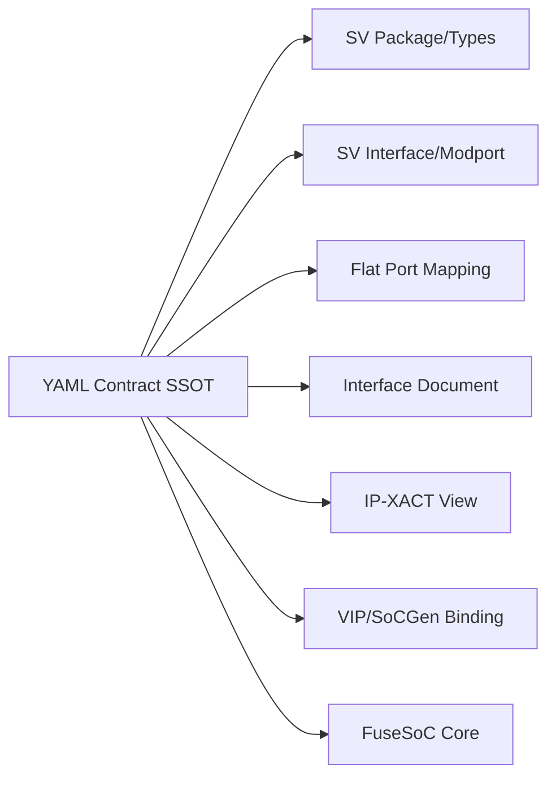

# HWIF Repository Architecture

> 当前唯一：本文件描述 `aixsilicon_hwif_repo` 的**现行架构**（2026-08-17 起有效）。
> 历史完整规划（plan.md/todo.md 原文、P1–P4 分片过程）已在 hwif-repo `archived/` 存档，
> 不再作为执行依据；本文件与 [`README.md`](README.md)、[`skill.md`](skill.md) 为准。

## 1. 定位与边界

`aixsilicon_hwif_repo` 是硬件前端的**接口类型系统、契约系统与兼容性判断系统**（SSOT 中心）：

- **负责**：Interface Contract、Role/Signal/Profile/Capability、Binding、兼容性规则、SemVer、
  可发布视图（SV package/interface/flat + IP-XACT + 文档）；
- **不负责**：协议行为（VIP 验证）、适配实现（CBB）、实例连接（SoC Integration）、
  CSR 寄存器（SystemRDL）、工艺 Macro（techlib）；
- **契约边界判断**：描述"有哪些信号/角色/语义/约束" → HWIF；描述"如何驱动/监测/检查" → VIP；
  描述"如何转换/缓存/桥接" → CBB；描述"谁连接谁/地址/中断" → SoC Integration。

## 2. 四层契约模型（L0–L3）

| 层次 | 内容 | 消费者 |
|---|---|---|
| L0 Identity | ID、名称、版本、协议引用、Owner、成熟度 | Catalog、Release |
| L1 Semantic | 角色、通道、信号、时序、错误、顺序语义 | 架构、设计、验证 |
| L2 Configuration | 参数、Profile、Capability、合法组合 | IP 配置、SoCGen、VIP |
| L3 Realization | SV types/interface/flat ports、IP-XACT、文档 | RTL、EDA、验证 |

## 3. 事实与派生物（单一事实源）

**禁止多处手工维护**：信号名/宽度/方向、必选可选属性、参数默认值、role/channel 映射、
tie-off 规则、capability/profile、兼容性声明。

## 4. 三视图策略

| 视图 | 适用 | 说明 |
|---|---|---|
| A. Packed Struct | 内部 RTL 首选 | 端口少、类型安全、request/response 分离 |
| B. SV Interface | VIP/TB/modport | virtual interface、clocking block、局部集成 |
| C. Flattened Ports | IP 交付边界 | Verilog/VHDL 混合、DFT/CDC/网表、第三方 IP |

`generated/` 中派生文件禁止手工修改（drift 门禁拒绝）。

## 5. 接口族分类（L0–L6）

| 分类 | 位置 | 示例 |
|---|---|---|
| L0 基础语义 | `foundation/`、`common/` | clock / reset / ready_valid / req_ack / event / status_control |
| L1 SoC 公共控制 | `system/` | interrupt / error_report / clock_control / reset_control / power_state / isolation / retention / lifecycle_state |
| L2 存储与寄存器 | `memory/` | reg_native / memory_1rw / memory_1r1w / memory_tdp / rom / fifo_push_pop / ecc_sideband |
| L3 总线与流 | `bus/`、`link/` | apb / axi_lite / axi / axi_stream / ahb_lite / obi / tilelink_ul / credit_link / noc_flit / packet_stream |
| L4 外设边界 | `peripheral/` | uart / spi / i2c / gpio / pwm / pad_control / pll_control |
| L5 调试/测试/可观测 | `dft_debug/` | trace_stream / performance_event / scan / mbist / lbist / dfx_override |
| L6 功能安全 | `safety_security/` | integrity / safety_event / fault_injection / lockstep / watchdog / domain_health / security_violation |
| 加速接口 | `accelerator/` | hac_if（ctrl/stream/mem/lmem/event/mgmt 六族） |

共 **64 个 `.core` / 62 Contract / 18 Profile**（2026-08-17）。

## 6. Schema 体系（`schema/`）

| Schema | 用途 |
|---|---|
| `interface_contract.schema.yaml` | 接口语义 SSOT（角色/通道/信号/参数/时钟复位/能力/视图） |
| `interface_profile.schema.yaml` | Profile（冻结参数+能力组合，引用接口 ID 不复制信号） |
| `binding.schema.yaml` | VIP/IP-XACT/Legacy 绑定映射 |
| `compatibility.schema.yaml` | 兼容性规则与结论 |
| `release_manifest.schema.yaml` | Release 包元数据 |

## 7. 兼容性模型

- **三层兼容**：身份（L0）→ 语义（L1 信号集/方向/宽度/能力）→ 配置（L2 参数/Profile）；
- **判定结论**：`DIRECT`（同 family 且兼容）／ `ADAPTER_REQUIRED`（跨族但有已文档化桥）／ `INCOMPATIBLE`（无桥或无法满足）；
- **AMBA 桥规则**（2026-08-17 增补）：axi/axi_lite/ahb_lite/apb/axi_stream 跨族互连 → `ADAPTER_REQUIRED`；
- SoCGen 前必须判定；INCOMPATIBLE 禁止静默连接（fail-closed）。

## 8. 确定性工具边界（唯一入口收敛）

> **hwif 仓不保存确定性实现**（`tools/`、`tests/` 已于 2026-08-17 移除）。

| 能力 | 唯一入口（`hwif-development-suite` skill） |
|---|---|
| 契约校验（Schema + 语义） | `hwif_tool.py validate` |
| 多视图生成 + drift | `hwif_tool.py generate [--check-only]` |
| SV 一致性 | `hwif_tool.py consistency` |
| 兼容判定 | `hwif_tool.py compat` |
| 变更影响 | `hwif_tool.py impact` |
| `.core` 校验（CAPI=2 + aix 命名） | `hwif_tool.py core` |
| Release 输入校验 | `hwif_tool.py package` |

Skill 设计见 [`skill.md`](skill.md)；能力归属原则见 [`../workflow/ownership.md`](../workflow/ownership.md)。

## 9. 版本与变更治理

- **SemVer**：breaking（SV 类型/信号/角色/能力变化）→ Major；新增可选 → minor；文档 → patch；
- SV 类型演进：packed struct 变更视为破坏性，需显式迁移窗口；
- Deprecated：进入废弃清单（CAT-007），逆兼容期后移除；
- 消费者矩阵记录精确 SHA，禁止只看名字。

## 10. References

- 域总入口：[`README.md`](README.md)；Skill 设计：[`skill.md`](skill.md)；任务状态：workflow [`../todo.md`](../todo.md)
- 历史完整参考（已归档）：hwif-repo `archived/docs/design-reference.md`、`archived/plan.md`、`archived/todo.md`；归档索引见 `archived/docs/README.md`
- 收敛过程：hwif-repo `archived/docs/aix-hwif-gen-unified-plan.md`
