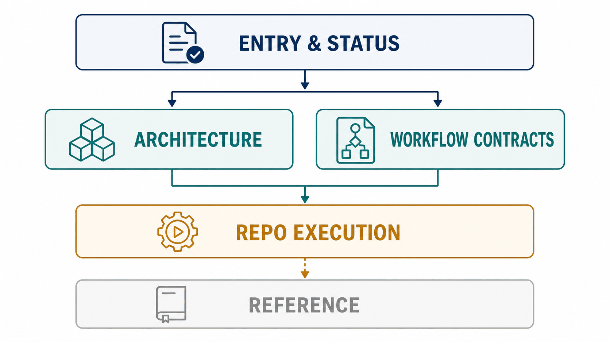

# AIXSILICON 文档中心

本页是 Workflow 控制面与 10 个资产仓的唯一文档入口。材料按“根级治理 → architecture 稳定结构 → workflow 可执行契约 → repo 仓级执行 → reference 历史背景”分层；同一主题只设一个活动权威落点。

图示读法：入口与状态负责“从哪里读、现在如何”，Architecture 与 Workflow Contracts 分别解释稳定结构和可执行契约，Repo Execution 承接仓级实施；Reference 使用弱化样式，表示仅供历史追溯，不控制当前工作。

## 1. 从这里开始

| 需求 | 阅读入口 |
|---|---|
| 初次了解系统 | [`architecture/overview.md`](architecture/overview.md) → [`architecture/repos.md`](architecture/repos.md) → [`architecture/workflows.md`](architecture/workflows.md) |
| 安装和使用 | [`getting-started.md`](getting-started.md) → [`workflow/troubleshooting.md`](workflow/troubleshooting.md) |
| 审核目标方案 | [`architecture/target-design.md`](architecture/target-design.md) → [`roadmap.md`](roadmap.md) |
| 查看当前任务与负责人 | [`todo.md`](todo.md) |
| 查看里程碑、风险与决策 | [`progress.md`](progress.md) |
| 查看审核缺陷与关闭条件 | [`findings.md`](findings.md) |
| 修改 Workflow | [`workflow/README.md`](workflow/README.md) → [`workflow/delivery.md`](workflow/delivery.md) |
| 查看 Repo 设计与交付 | [`repositories.md`](repositories.md) |
| 判断 Owner/写入边界 | [`architecture/repos.md`](architecture/repos.md) → [`workflow/ownership.md`](workflow/ownership.md) → [`../ownership-map.yaml`](../ownership-map.yaml) |

## 2. 根级：入口、治理与状态

| 材料 | 唯一职责 |
|---|---|
| [`index.md`](index.md) | 导航和阅读路径 |
| [`getting-started.md`](getting-started.md) | 安装、初始化和基本操作 |
| [`governance.md`](governance.md) | 文档分层、状态规则和维护门禁 |
| [`roadmap.md`](roadmap.md) | 唯一跨仓活动路线图、依赖顺序和验收出口 |
| [`todo.md`](todo.md) | 唯一任务状态、负责人、日期、Evidence、下一动作和阻塞台账 |
| [`progress.md`](progress.md) | 组合级里程碑状态、风险和决策队列 |
| [`findings.md`](findings.md) | 方案/实现审核发现、处置和关闭证据 |
| [`repositories.md`](repositories.md) | 现有仓设计/交付入口与候选仓提案 |

## 3. Architecture：稳定结构

| 材料 | 唯一职责 |
|---|---|
| [`architecture/README.md`](architecture/README.md) | 架构材料关系和规范源 |
| [`architecture/overview.md`](architecture/overview.md) | 系统定位、责任链、分层和不变量 |
| [`architecture/repos.md`](architecture/repos.md) | 十仓职责、当前依赖和数据边界 |
| [`architecture/workflows.md`](architecture/workflows.md) | Flow 执行模型、IP/SoC 主线和 Gate |
| [`architecture/target-design.md`](architecture/target-design.md) | 现状评审、目标 Profile/依赖/Provider 模型和迁移 |

架构决策记录统一进入 [`adr/`](adr/README.md)，架构正文不维护当前任务状态。

## 4. Workflow：可执行契约与仓级实施

| 材料 | 唯一职责 |
|---|---|
| [`workflow/README.md`](workflow/README.md) | Workflow 文档入口和上下游边界 |
| [`workflow/delivery.md`](workflow/delivery.md) | Workflow 稳定任务定义、依赖和验收条件 |
| [`workflow/manifest.md`](workflow/manifest.md) | Manifest、Profile、Lock 和 Override |
| [`workflow/ownership.md`](workflow/ownership.md) | Schema、仓库和工具归属 |
| [`workflow/collaboration.md`](workflow/collaboration.md) | Change Bundle、影响分析和联合 CI |
| [`workflow/release.md`](workflow/release.md) | Gate、Evidence、成熟度、Baseline 和 Release |
| [`workflow/troubleshooting.md`](workflow/troubleshooting.md) | 故障、安全和凭据处理 |

## 5. Repo：设计与交付

每个现有资产仓的 `README.md` 是唯一仓级设计契约，`delivery.md` 保存稳定任务定义、依赖与验收条件，`design-reference.md` 仅保存完整历史细节；所有任务状态统一在根级 [`todo.md`](todo.md)。全部入口和跨仓覆盖矩阵见 [`repositories.md`](repositories.md)。

尚未建仓的方案放在 [`proposals/repositories/`](proposals/repositories/README.md)；提案不代表已排期，也不得进入 Manifest 或 required dependency。

## 6. 图示约定

- 项目图片统一保存在 [`assets/`](assets/README.md)；
- 生成式图片用于建立整体心智模型，不替代正文、Mermaid、表格或机器可读配置；
- 图片必须提供 alt 文本、文字解释和生成记录；
- 精确依赖看 Manifest/`repos.md`，精确 Flow 看 `workflows/*.yaml`，任务状态只看 `todo.md`，里程碑状态只看 `progress.md`。
