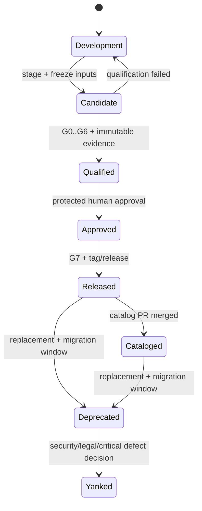
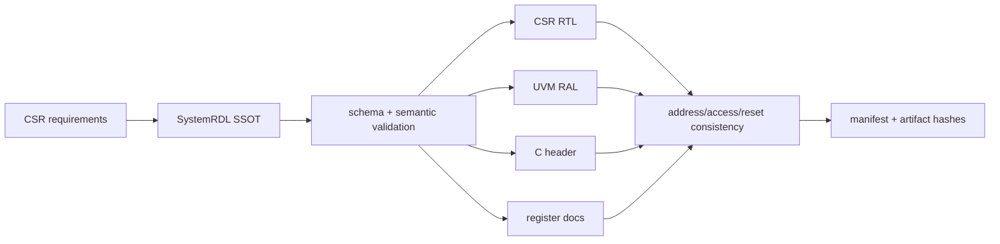
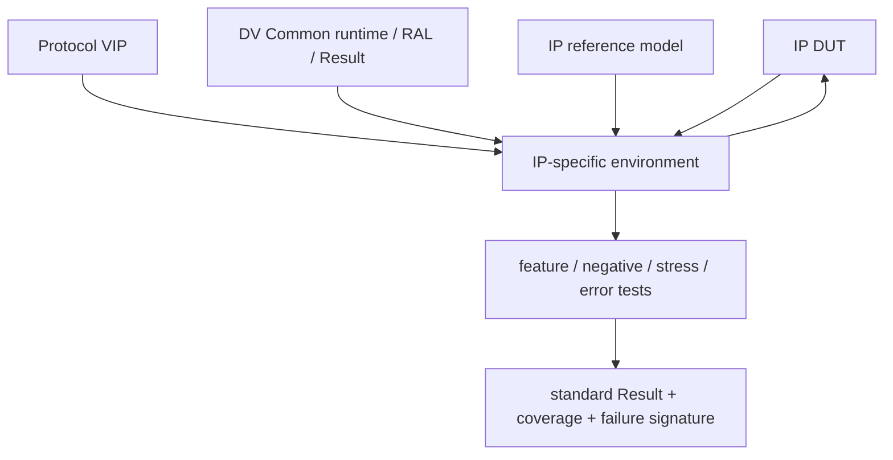
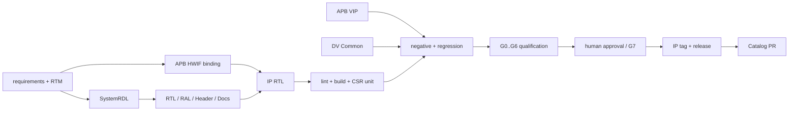

# IP 仓完整设计参考

本文细化 `aixsilicon_ip_repo` 的资产模型、工程结构、生成链、验证、证据和发布设计。当前稳定边界见 [`README.md`](README.md)，任务定义与验收看 [`delivery.md`](delivery.md)，任务状态看 [`../todo.md`](../todo.md)，组合状态见 [`../progress.md`](../progress.md)。本文中的“目标”不是已实现声明；基线差距必须通过交付任务和 Evidence 关闭。

## 1. 设计目标与不变量

IP 仓面向“可独立集成、验证、版本化和发布的完整 IP”，不是 RTL 代码集合。每个可发布版本必须形成以下闭环：

```text
需求/约束 → 接口与寄存器契约 → RTL/派生视图 → 验证与实现证据
        → 固定版本交付包 → 人工批准 → Release → Catalog 索引
```

不可破坏的不变量：

1. 每个事实只有一个 Owner；SystemRDL、HWIF Contract、RTL、派生物不能互为双 SSOT；
2. 开发态可编辑，发布态不可变；已发布版本不得原地修改；
3. Qualification 只产生 G0～G6，人工批准后的 Release Readiness 才产生 G7；
4. 缺 provider、required stage 被跳过、证据缺失或工作区不干净时必须 fail-closed；
5. 仓内 registry 只索引本仓版本，组织级 Catalog 只登记已发布资产，两者职责不同；
6. IP 不复制 HWIF、CBB、VIP、DV Common 或公共 Tool 的正式实现；
7. Release 必须绑定精确 repo SHA、依赖 Lock、工具/环境、产物 hash 和批准记录。

## 2. 仓库职责与跨仓边界

| 资产/能力 | 唯一 Owner | IP 仓如何使用 | 禁止模式 |
|---|---|---|---|
| IP 需求、架构、RTL、产品验证环境 | IP | 本仓维护、独立版本 | 把产品事实放入 Workflow/Skill |
| 接口语义、Profile、Binding | HWIF | 以版本化 Contract 引用 | 在 IP 内复制并私自修改协议定义 |
| 公共参数化 RTL 构件 | CBB | 通过固定版本/VLNV 依赖 | vendoring 后形成第二事实源 |
| 协议 VIP | VIP | 复用 driver/monitor/checker/coverage | 在每个 IP 复制 APB/AXI agent |
| 协议无关 DV runtime、RAL 公共机制 | DV Common | 复用 Result、CSR sequence、timeout 等 | 建立产品专属的公共 base 分叉 |
| SystemRDL/HWIF/Core 等确定性工具 | Tools | 通过 Action/Provider 调用并锁版本 | ipkg 或本仓脚本重写同类生成器 |
| 工作区、Flow、Gate、Evidence、Release 协调 | Workflow | 解析 Lock、执行资格与发布流程 | ipkg 绕过 Gate/审批直接发布 |
| 已发布资产发现与兼容索引 | Catalog | Release 后通过独立 PR 登记 | 把开发分支或 candidate 写入 Catalog |
| AI 辅助方法 | Skills（可选） | 生成候选方案或变更 | 由 Skill 单独判定 Gate |

## 3. 资产身份与坐标

### 3.1 Canonical 身份

发布 IP 的 canonical VLNV：

```text
aixsilicon:ip:<name>:<semver>
```

组织名 `boyangwang1991-design` 只用于 Git remote，不再作为新发布的 VLNV vendor。历史 `boyangwang1991-design:ip:*` 进入显式 deprecated alias 窗口；Lock、依赖和 Catalog 必须在迁移时同步，不能静默把旧名解析到新版本。

每个版本至少由以下坐标唯一识别：

| 维度 | 示例/规则 |
|---|---|
| logical identity | vendor/library/name |
| version | SemVer，不使用 `latest` 作为正式依赖 |
| source identity | repository URL + immutable commit/tag |
| package identity | `ip-package.yaml` digest + Release Manifest digest |
| dependency identity | resolved Lock 中的 HWIF/CBB/DV/VIP/tool 精确版本 |
| evidence identity | qualification run-id + Evidence Index hash |

### 3.2 仓内 Registry 与组织 Catalog

| 对象 | 内容 | 更新时点 | 是否可含开发态 |
|---|---|---|---|
| `registry.yaml` | 本 IP monorepo 中的名称、版本、路径、Tag、Core 和仓内摘要 | IP 版本发布提交 | 否 |
| Unified Catalog | 跨仓资产类型、成熟度、兼容性、Release/Evidence/SBOM/RTM 引用 | 资产 Release 成功后的独立 PR | 否 |
| Workspace Manifest | 期望使用哪些仓/Profile | 工作区配置 | 可以指开发分支 |
| Workspace Lock | 本次实际仓 SHA、依赖、provider/tool/env | resolve/qualification | 可以，但 Release 必须满足正式约束 |

`registry.yaml` 与 Catalog 可以互相校验，但不得相互生成循环或同时成为版本事实源。

## 4. 双态生命周期



### 4.1 Development

- feature 分支可编辑规格、SystemRDL、RTL、验证和文档；
- 可以使用开发 Lock、snapshot 依赖和本地 Evidence；
- 不得写入已发布版本目录，不得被 Catalog 标为 `qualified/released`。

### 4.2 Candidate / Qualified

- candidate 固定源 SHA、依赖 Lock、provider/tool/env 和拟发布 SemVer；
- `ipkg stage` 只负责仓内包冻结与一致性，不判跨仓资格；
- G0～G6 全部由可验证 Evidence 判定，不能从 registry 中的字符串反向推断。

### 4.3 Released / Cataloged

- protected approval 后才判 G7，创建不可变 Tag/Release；
- Catalog PR 与资产 Release 分离，可重试且幂等；
- Catalog 失败不能删除已创建的资产 Release，但必须留下恢复状态和未登记告警。

## 5. 推荐目录模型

```text
aixsilicon_ip_repo/
├── README.md
├── registry.yaml                 # 已发布版本的仓内索引
├── ipkg.yaml                     # 仓内 stage/package 配置
├── docs/                         # 仓级规范、迁移说明
├── schemas/                      # 仅 IP Owner 的内部契约 Schema
├── examples/                     # 非发布的最小消费示例
└── ips/<vendor>/<ip>/<version>/  # 不可变发布版本
    ├── ip-package.yaml           # 包身份、依赖、交付入口
    ├── manifest.yaml             # 文件清单与 hash
    ├── README.md
    ├── CHANGELOG.md
    ├── LICENSE
    ├── specs/                    # LRS/HLD/LLD 或等价规格
    ├── model/                    # 可校验结构化产品模型
    ├── regs/                     # SystemRDL SSOT
    ├── rtl/
    │   ├── generated/            # 只允许工具写入
    │   └── handwritten/          # 或清晰等价分区
    ├── verification/             # IP 专用 Env/test/model/bind
    ├── constraints/
    ├── sw/generated/             # Header 等派生视图
    ├── fusesoc/
    ├── trace/
    ├── docs/generated/
    └── release/                  # 发布材料索引，不存任意临时日志
```

目录名可以兼容现有资产，但必须保持以下语义：发布目录不可变；generated/handwritten 边界明确；临时运行结果不提交；正式报告只通过 Release Manifest/Evidence 引用进入交付。

## 6. 单个 IP 包最小契约

`ip-package.yaml` 至少应表达：

| 类别 | 必需字段 |
|---|---|
| identity | schema version、name、version、vendor、library、description |
| ownership | technical owner、maintainer、reviewers、visibility/license |
| source | repo、commit/tag、package path、package digest |
| interfaces | HWIF contract/profile/binding 的精确引用 |
| registers | SystemRDL root、address block、生成策略版本 |
| dependencies | typed product/verification/tooling 依赖及版本约束 |
| build | FuseSoC core、标准 targets、顶层、参数合法域 |
| verification | testplan、coverage goals、required providers、known limitations |
| delivery | RTL/constraints/sw/docs/verification artifacts |
| evidence | qualification run、Evidence Index、SBOM、RTM、artifact hashes |
| compatibility | supported profiles、deprecated aliases、migration notes |

`quality: {}` 或仅写 `Gx: pass` 不能构成合格证据；quality 必须引用可验证 Evidence，而不是复制结果文字。

## 7. 事实源与派生物

| 事实域 | SSOT | 典型派生物 | 漂移策略 |
|---|---|---|---|
| 需求/架构 | 结构化 model + 已批准规格 | RTM、文档索引 | 双向 trace 检查 |
| 接口 | HWIF Contract/Binding | SV package/interface/flat ports、文档 | 重新生成 + hash diff |
| CSR | SystemRDL | CSR RTL、RAL、C Header、HTML/Markdown | `--check-only`/manifest hash |
| RTL 行为 | 手写 RTL + 已批准生成输入 | filelist/Core | build/lint + source manifest |
| 验证意图 | feature/test/coverage plan | testlist、coverage report | feature→test→coverage trace |
| 版本 | SemVer 决策 + Git Tag | registry/Catalog 条目 | release cross-check |

生成文件必须包含 generator、版本、输入 digest 和生成时间/模式；不得手工修补后继续声称可重建。若确需 patch，必须回到 SSOT 或建立明确、可审查的 patch layer。

## 8. SystemRDL 与 CSR 派生链



必测规则：地址对齐/重叠、字段宽度、reset value、RW/RO/W1C/W1S/RC 等访问语义、reserved 位、side effect、byte enable、非法地址、错误响应、RAL mirror/predict 和软硬视图 hash 一致性。

IP 专用寄存器语义归 IP；SystemRDL 编译与多视图生成归 Tools；通用 CSR sequence/RAL base 归 DV Common。

## 9. HWIF、CBB 与参数治理

### 9.1 HWIF Binding

每个外部接口必须引用 contract + profile + role + binding version。IP 可以组合多个接口，但不能在顶层重新定义同名信号语义。接口 breaking change 必须通过 `hwif-change` 影响分析，并在 IP SemVer/迁移说明中体现。

### 9.2 CBB 依赖

CBB 依赖必须固定构件版本和参数合法域；IP 只保存实例化参数与产品级约束，不复制 CBB 源码。若为性能临时 fork，应先记录偏离原因、上游回馈计划和退出条件，正式发布前决定回归 CBB 或转为 IP 私有实现。

### 9.3 IP 参数

参数分为：

- elaboration parameter：影响结构，必须声明合法域和验证矩阵；
- runtime configuration：通过 CSR/接口设置，必须进入寄存器与场景验证；
- implementation option：影响 PPA/工艺映射，必须绑定工具/约束环境；
- product policy：不应硬编码进公共 IP，留给消费者或 profile/binding。

参数组合不能穷举时，至少覆盖默认值、每个边界、非法值、关键 pairwise、历史缺陷和发布 profile。

## 10. 验证架构与复用边界



| 内容 | 归属 |
|---|---|
| APB/AXI driver、monitor、protocol checker、protocol coverage | VIP |
| clock/reset/timeout、RAL base、标准 CSR sequences、Result/Failure | DV Common |
| 产品 reference model、scoreboard policy、virtual sequence、功能覆盖 | IP |
| simulator/EDA adapter 与报告归一化 | Tools/私有 provider |
| test orchestration、Gate、Evidence 汇总 | Workflow |

IP 内可保留迁移期 adapter，但不得把复制的通用 APB/TLUL agent 当作长期正式依赖。迁移完成后，产品 Env 只通过稳定 API 组合 VIP/DV Common。

## 11. 标准验证层级

| 层级 | 目标 | 最小内容 |
|---|---|---|
| static | 消除结构/编码/连接风险 | schema、lint、elaboration、CDC/RDC（适用时） |
| unit | 隔离模块与寄存器行为 | reset、CSR、边界参数、错误注入 |
| IP smoke | 证明默认 profile 可运行 | 初始化、基本数据流、中断/状态 |
| feature regression | 覆盖全部批准功能 | feature→test→check→coverage trace |
| negative/robustness | 证明错误不会被忽略 | 非法访问、超时、协议违规、异常恢复 |
| formal/assertion | 证明关键不变量 | protocol/property、deadlock、FIFO/arbiter 等适用属性 |
| PPA/constraints | 证明交付约束可用 | 综合/STA/面积/功耗场景及可比环境 |
| integration | 证明真实消费者可用 | HWIF/CBB/VIP/软件视图/SoC smoke |

通过标准必须由 checker/assertion/reference model 给出，不能只以“仿真退出码 0”判定。

## 12. FuseSoC 与构建 Target

每个发布 Core 应按适用性提供稳定 target：

| Target | 用途 | 是否应依赖商业工具 |
|---|---|---|
| `default`/`rtl` | 源文件发现与依赖 | 否 |
| `lint` | 公共静态检查 | 否，至少有公开 provider |
| `unit_sim` | 单元/CSR 验证 | 否，至少一个公开 smoke 路径 |
| `smoke` | 默认 profile 端到端 | 否，公共最低路径 |
| `regression` | 完整功能回归 | 可含可选 provider，但需 preflight |
| `formal` | 属性验证 | 可选，缺失不得伪装通过 |
| `synth`/`ppa` | 约束与实现评估 | provider/profile 显式 |
| `package` | 交付文件发现/校验 | 否 |

正式 CI 不应通过解析 `.core` 文本猜 VLNV，也不应对所有 Core 强行调用不存在的 `lint` target；应先用 capability/preflight 读取可用 target/provider，再按 required/optional 语义执行。

## 13. 需求追踪与评审材料

最小追踪链：

```text
requirement ID
  → architecture/design decision
  → RTL/CSR/interface implementation
  → assertion/checker/reference-model check
  → test + coverage point
  → result/evidence
  → release item / known limitation
```

每条 P0/P1 需求必须有唯一 ID、Owner、验收方法和状态；`N/A` 必须给理由和 Reviewer。RTM 不应只列文件链接，还要记录版本、关系类型和最后验证 run-id。

评审至少分为需求、架构、接口/CSR、RTL、验证计划、覆盖关闭、集成和 Release Readiness；同一人可以承担多个角色，但 Author 与最终 Verifier 不应由同一自动化 Agent 自证。

## 14. Gate 与 Evidence 映射

| Gate | IP 判定内容 | 最小 Evidence |
|---|---|---|
| G0 | Schema、安全、路径、license、仓状态卫生 | schema/security/path/license report、repo SHA |
| G1 | fixed Lock、clean、remote、override、provider 可用 | resolved Lock、precondition report |
| G2 | VLNV/Core/typed dependency 完整且无冲突 | dependency graph、Core resolve report |
| G3 | HWIF/Profile/Binding/CSR/参数兼容 | compatibility、register consistency、parameter matrix |
| G4 | lint/build/unit/smoke/regression/coverage | structured Result、reports、artifact hashes |
| G5 | 受影响仓与真实消费者联合资格 | Change Bundle、PR HEAD SHA、joint CI |
| G6 | Run Manifest/Evidence Index 完整且可重建 | run/evidence schema validation、replay record |
| G7 | SemVer、材料、审批、Tag/Release、Catalog diff | approval、Release Manifest、SBOM/RTM、Catalog PR |

G0～G6 属于 Qualification；G7 属于 Release。当前 Flow/runner 的已知差距见 [`../findings.md`](../findings.md)，设计参考不得把目标 Gate 表格当作通过证明。

## 15. Evidence 与可重建性

每次 qualification 至少固定：

- IP repo SHA、候选版本、dirty/override 状态；
- HWIF/CBB/DV/VIP 的精确 SHA/版本和依赖类型；
- provider/tool/container/EDA/OS 版本与 hash；
- Flow/action 版本、参数、命令摘要、seed、开始/结束时间和退出码；
- SystemRDL/HWIF/RTL/testplan 输入 digest；
- 生成 RTL/RAL/Header/Doc、报告和交付物 hash；
- 每个 Gate 的 evaluator、输入 Evidence 和结论；
- Failure Signature、waiver、known limitation 和人工批准记录。

E0 本地结果可短期保存；E1 PR 结果绑定 PR SHA；E2 qualification 不可静默覆盖；E3 Release 必须持久保存关键索引、hash、SBOM、RTM 和批准记录。大体积日志/波形进入制品存储，不直接提交到 IP 版本目录。

## 16. ipkg、Workflow 与 Catalog 的发布边界

| 组件 | 负责 | 不负责 |
|---|---|---|
| `ipkg stage` | 冻结仓内版本目录、文件清单、package manifest、registry 草案 | 判 G0～G7、跨仓联合验证 |
| `aix-core-tool` | 生成/检查 Core、依赖发现 | 决定 IP 版本或批准发布 |
| Workflow `release prepare` | 校验 clean/Lock/override、汇总 G0～G6、生成候选材料 | 自动批准、直接更新 main |
| protected approval | 人工接受版本、风险、waiver 和材料 | 修改候选内容 |
| `ipkg publish`/资产发布 provider | 在已批准输入上创建 commit/tag/release，保持幂等 | 绕过 Workflow、自行声称 G7 |
| Catalog provider | 生成并提交 Catalog diff/PR | 复制源码、直接 merge |

目标上 `ipkg` 的 push/tag 行为必须由受保护 Release provider 调用或显式 dry-run/批准参数控制。普通开发命令不得因本地配置自动 push。

## 17. 版本、兼容与弃用

### 17.1 SemVer

- MAJOR：接口/寄存器/软件 ABI、行为或默认参数存在不兼容变化；
- MINOR：向后兼容能力、寄存器或 profile 增加；
- PATCH：不改变外部契约的缺陷修复、文档或验证增强。

硬件“向后兼容”必须分别评估 HWIF、CSR/software ABI、时序/性能、reset/clock/power、安全行为和交付文件，不得只看端口是否相同。

### 17.2 Deprecated/Yanked

弃用必须记录替代版本、迁移指南、最后支持期和已知消费者。Yank 仅用于安全、法律或严重不可用问题；保留历史索引和原因，避免 Lock 无法解释。

## 18. 安全、许可证与第三方参考

- `reference/` 或 vendored 第三方材料只读、可追溯、带 license/source/revision；
- 不进入正式 FuseSoC library roots、IP package、SBOM 漏扫区或 Catalog；
- 外部 RTL/模型进入产品前必须做来源、许可证、恶意构建脚本、生成器和供应链审计；
- CI/Release 不在日志、Manifest 或 Evidence 中保存 token、SSH key、license server secret；
- Flow/工具只接受结构化参数和允许路径，不执行来自 IP metadata 的任意 shell；
- 安全/功能安全 IP 的 threat/safety requirement、fault campaign、waiver 和独立审核进入 RTM/Evidence。

## 19. APB 寄存器 IP Golden Slice

APB 寄存器 IP 是当前唯一 P0 方案切片：



### 19.1 最小功能范围

- APB3/APB4 的具体 profile 必须显式，不以“APB”模糊代称；
- 至少包含 RW、RO、W1C、reserved、reset、byte enable 和错误响应；
- 支持 wait-state/背压语义；若不支持必须在 Contract/限制中明确；
- 至少一个状态/中断或等价可观察行为，证明 CSR 到功能数据通路闭环；
- 默认参数在公开 simulator/provider 上可完成最小 smoke。

### 19.2 必测负向场景

非法/未对齐地址、只读写入、reserved 位、写掩码、reset 中访问、wait-state、error response、并发 CSR/功能更新、RAL mirror mismatch、协议时序违规、缺 provider、脏工作区、Lock 漂移、required stage skip、证据缺失和重复 publish。

### 19.3 完成出口

固定 Lock 下可从 clean workspace 重建生成物、lint/build/sim、覆盖与 Evidence；故意破坏任一 required 输入会稳定失败；人工批准后创建唯一 Tag/Release，Catalog PR 可审查且重复执行幂等。

## 20. 后续 IP 的进入门禁

APB 切片达到 C4 Released 前，Bridge/PIC 只保留设计候选，不进入活动承诺。下一 IP 必须回答：

- 是否有真实消费者和明确 Owner；
- 是否引入新的 HWIF/VIP/DV/CBB/provider 能力；
- 最小功能/参数/性能/安全边界是什么；
- 如何复用 APB 已验证的 package、Gate、Evidence 和 Release 契约；
- 是否值得作为完整 IP，还是应落入 CBB、VIP、model 或项目仓。

候选方向：X2X/AXI Bridge 重点覆盖宽度转换、Outstanding、顺序、背压和异步时钟；PIC 重点覆盖优先级、claim/complete、错误、故障注入和功能安全追踪。

## 21. 当前仓库基线观察（非状态权威）

以下是 2026-08-14 对工作区副本的设计审查快照，用于解释迁移风险；最新事实仍以 IP 仓代码和运行 Evidence 为准。

| ID | 观察 | 设计影响 | 对应关闭方向 |
|---|---|---|---|
| IP-R01 | 仓内同时存在 `aixsilicon:ip:hac_aes` 与 legacy `boyangwang1991-design:ip:uart` | VLNV、Lock、消费者和 Catalog 可能双命名 | IP-005：显式 alias/迁移/兼容检查 |
| IP-R02 | `ipkg.yaml` 默认 `auto_tag/auto_push: true`，发布检查聚焦 G5/manifest/hash | 普通仓内命令可能越过目标 G6/G7/审批边界 | IP-004/005：受保护 provider、dry-run 和批准令牌 |
| IP-R03 | package 的 `quality` 为空或 registry 直接记录 Gx 字符串 | 无法从条目验证 Evidence 与可重建性 | IP-003/004：quality 引用 Evidence Index/Release Manifest |
| IP-R04 | UART 版本目录含本地 APB/TLUL agent 副本 | 与 VIP/DV Common 的长期 Owner 边界冲突 | IP-003/005：保留迁移 adapter，改用版本化公共组件 |
| IP-R05 | CI 通过 shell/grep/find 推断 Core 并统一调用 `lint` target | target 缺失、路径/空格和 capability 差异可能造成误判 | TOOL-002/WF-004：Core API + capability preflight |
| IP-R06 | registry 中 UART 标为 G0～G5 pass、HAC 多数 Gate unknown，但条目未直接关联 Evidence | “登记值”可能被误读为资格证明 | IP-003/004：Gate 只由 Evidence evaluator 判定 |
| IP-R07 | 现有两个资产的包结构、license、dependency 字段和文档深度差异较大 | 消费者难以形成统一 package/compatibility 规则 | IP-001/002：统一最小包 Schema 与正负样例 |
| IP-R08 | HAC/现有 HWIF 依赖仍大量使用 legacy `aix:interface:*`，而 ADR-0003 已确定 `aixsilicon:*` | 迁移期间可能出现双命名、解析冲突或 Lock 漂移 | HWIF-001/003、IP-005：显式 alias 窗口与跨仓 Lock 迁移测试 |

这些观察不是对资产质量的最终结论，也不授权修改 IP 仓实现；进入实施时应在相应 Repo 的 Issue/PR 与 Evidence 中复核。

## 22. 设计评审清单

### 22.1 新 IP/新版本准入

- [ ] Owner、消费者、版本和非目标明确；
- [ ] HWIF/CSR/参数/clock/reset/power/error 契约完整；
- [ ] product/verification/tooling 依赖类型与版本明确；
- [ ] 生成物 SSOT、generator/version/hash 和漂移策略明确；
- [ ] 验证计划包含正向、负向、边界、恢复和覆盖目标；
- [ ] FuseSoC targets/provider capability 可预检；
- [ ] RTM、SBOM、license、known limitations 和迁移说明可生成；
- [ ] G0～G6 Evidence 可重建，G7 审批与发布幂等；
- [ ] registry、Tag/Release 和 Catalog 条目互相一致。

### 22.2 Breaking change

- [ ] 影响 HWIF、CSR/software ABI、参数默认、时序/性能、安全和交付格式已分类；
- [ ] 受影响消费者由 typed dependency/Change Bundle 找全；
- [ ] deprecated alias/兼容层有时限与退出条件；
- [ ] Major 版本、迁移指南和并行支持策略获批；
- [ ] 旧/新版本交叉资格验证和回滚方案存在。

## 23. 与活动交付和 Findings 的映射

| 设计主题 | 活动任务 | 相关全局 Finding |
|---|---|---|
| APB 规格、SystemRDL、包契约 | IP-001 | F-010/F-011（依赖/Gate 语义） |
| 确定性 RTL/RAL/Header/Core | IP-002、TOOL-002 | F-004/F-008 |
| lint/build/unit/regression/G0～G6 | IP-003、WF-008 | F-001/F-002/F-004/F-007/F-008/F-011 |
| approval/G7/Release/Catalog | IP-004、WF-010、CAT-004 | F-003/F-009/F-011 |
| ipkg/Core/发布边界与 legacy 迁移 | IP-005 | F-003/F-006/F-012 |
| Bridge/PIC 后续决策 | IP-006 | 需在 APB C4 后新增评审 Evidence |

## 24. 历史来源与原规划要点

本文吸收并保留 2026-08-13 `repos/aixsilicon_ip_repo/plan.md` 的全部核心要求：

- IP 仓为统一 monorepo 与 IP 事实/交付源；
- 目录采用 `ips/<vendor>/<ip>/<version>/`，发布版本不可变；
- 新 VLNV 使用 `aixsilicon:ip:*`，旧 vendor 进入 deprecated 窗口；
- 本仓保存规格、SystemRDL、RTL、IP 验证和发布记录；
- P0/P1/P2 候选分别为 APB 寄存器 IP、X2X/AXI Bridge、PIC；
- `.core` 生成复用 `aix-core-tool`，不在 ipkg 中建立第二套；
- vendored reference 只读、不发布、不进入正式 FuseSoC/Catalog；
- ipkg 负责仓内 stage/publish，Workflow 负责跨仓 Gate、协调和 Catalog；
- 发布物需要 VLNV、SemVer、Tag、registry、可重建生成物和 clean/locked 环境。

本次细化修正了旧文中“发布前 G0～G7”的歧义：Qualification 为 G0～G6，G7 只在人工批准后的 Release 流程判定。相关历史评审见 [`../reference/cross-repo-architecture-review.md`](../reference/cross-repo-architecture-review.md)，总体执行模型见 [`../architecture/workflows.md`](../architecture/workflows.md)。
