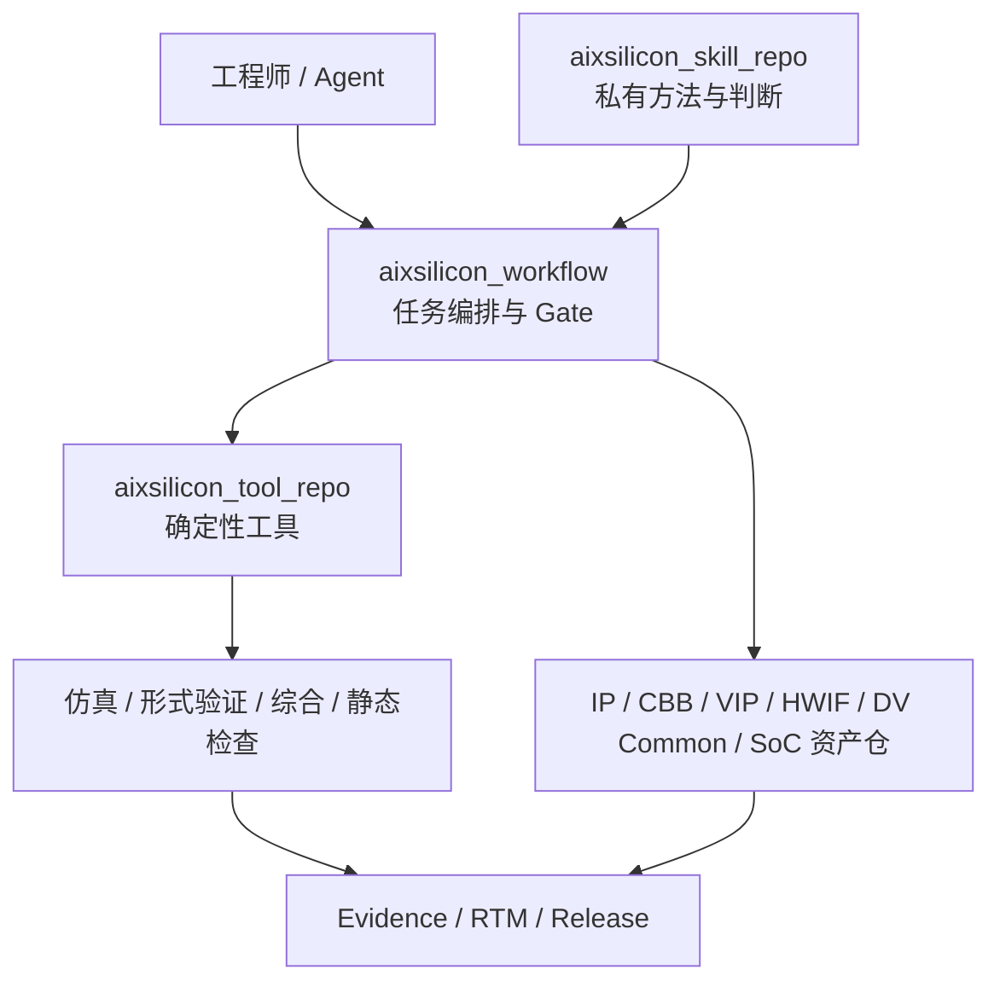

# skills — 完整设计参考（私有）

> 完整保留历史长篇设计要求；旧状态、日期和优先级不再作为执行依据。当前设计见 [`README.md`](README.md)，活动交付见 [`delivery.md`](delivery.md)。

> 来源：repos/aixsilicon_skill_repo/skill_repo_plan.md + todo.md（完整剪切至 docs/architecture/repo-plans 统一管理）
> 迁移日期：2026-08-13
> 仓库实现现状见 docs/architecture/repos.md §1.9

---

## 一、skill_repo_plan.md 完整原文

# AIXSILICON Skill Repo 完整规划

> 仓库名：`aixsilicon_skill_repo`
> 可见性：**Private**
> 定位：AIXSILICON AI 原生芯片研发体系的“方法、判断、上下文与评审能力层”
> 服务对象：IP 设计验证、CBB 设计验证、SoC 集成，以及与之配套的 Agent 研发活动

---

## 1. 结论先行

`aixsilicon_skill_repo` 应建设为一个**私有 Skill Monorepo**，保存 AIXSILICON 的核心研发方法论、Agent 操作规程、领域上下文构建方式、评审规则和评测资产。

它不是：

- RTL、UVM、Schema 或项目配置的资产仓库；
- 公共 Workflow 的执行引擎；
- EDA 工具的替代品；
- 确定性脚本的集中堆放仓；
- 一个能够绕过工程 Gate 自动提交所有代码的“超级 Agent”。

它应该做到：

1. 把资深芯片工程师的工作方法转化为可复用 Skill；
2. 告诉 Agent 如何理解任务、选择上下文、规划改动、调用工具、解释结果和完成评审；
3. 通过统一的输入输出契约连接 `aixsilicon_workflow` 和 `aixsilicon_tool_repo`；
4. 用 Eval、回归测试和人工批准控制 AI 行为质量；
5. 保持私有核心能力与开源基础设施之间的清晰边界；
6. 即使不安装本仓库，所有开源仓库仍能完成确定性构建、测试和发布验证。

建议采用以下核心公式：

> **Skill = 领域方法 + 上下文选择 + 判断规则 + 输出契约 + 工具调用策略**
> **Workflow = 状态机 + Gate + 审批 + 证据链**
> **Tool = 确定性生成、检查、分析和报告**
> **Asset Repo = 事实源、源码和交付物**
> **EDA = 工程结论**

---

## 2. 在整体仓库体系中的位置



### 2.1 仓库职责矩阵

| 仓库 | 核心职责 | Skill Repo 与它的关系 |
|---|---|---|
| `aixsilicon_workflow` | 多仓任务、状态机、Gate、审批、发布 | Skill 输出计划和判断，Workflow 决定何时执行、是否通过 |
| `aixsilicon_tool_repo` | 确定性生成、检查、分析、归档 | Skill 选择并调用 Tool，不复制 Tool 实现 |
| `aixsilicon_ip_repo` | IP 规格、RTL、寄存器、验证及发布资产 | IP 类 Skill 的主要读写对象 |
| `aixsilicon_cbb_repo` | 公共逻辑构件、配置、属性、PPA 数据 | CBB 类 Skill 的主要读写对象 |
| `aixsilicon_hwif_repo` | 接口定义、协议 Schema、生成输入 | 接口设计和一致性 Skill 的事实源 |
| `aixsilicon_vip_repo` | VIP、Agent、Sequence、Checker | 验证 Skill 的复用资产来源 |
| `aixsilicon_dv_common_repo` | 验证基础设施和通用组件 | UVM 环境构建 Skill 的公共底座 |
| `aixsilicon_soc_integration_repo` | 通用 SoC 集成 Schema、模板、规则 | SoC 集成 Skill 的公共基线 |
| `aixsilicon_catalog_repo` | 合格版本、兼容性和发布索引 | Release Skill 查询和登记已验证资产 |
| `chip_<project>_soc_repo` | 具体芯片配置及专有集成 | 私有项目 Skill 的主要写入对象 |

### 2.2 不可违反的边界

- 开源仓库的 CI 不得依赖私有 Skill Repo 才能通过。
- Skill 不得把未经 Tool/EDA 验证的推理当作工程事实。
- Skill 不得直接改变不在其 `write_scope` 内的仓库和路径。
- Skill 不得把 PDK、许可证、客户规格、未公开 RTL 或内部 EDA 日志写入公开仓库。
- Skill 不负责 Git 凭据管理，也不能绕过分支保护和 Code Owner。
- 跨仓修改必须由 Workflow 建立 task ID、变更计划、依赖顺序和证据链。

---

## 3. 设计原则

### 3.1 私有能力、公开契约

Skill 的提示策略、专家检查表、反例、内部经验和评测集保留在私有仓库；公开仓库只暴露稳定的机器契约，例如：

- YAML/JSON Schema；
- CLI 参数和退出码；
- Evidence Schema；
- Release Manifest；
- RTM 格式；
- 目录和命名约定。

### 3.2 轻量路由，按需加载

不要创建一个包含全部芯片知识的超大 Skill。应由路由 Skill 识别任务，再加载单一阶段 Skill 及必要 references，降低上下文污染和错误触发。

### 3.3 判断与执行分离

- Skill 负责“应该做什么、为什么、需看哪些证据”；
- Tool 负责“重复、确定性、可测试地执行”；
- Workflow 负责“现在能否执行、下一步是什么、谁来批准”；
- EDA 负责“设计是否满足工程要求”。

### 3.4 最小写权限

每个 Skill 必须声明：

- 可读仓库；
- 可写仓库和路径；
- 禁止访问的内容；
- 是否允许创建分支/提交；
- 哪些动作必须人工确认。

### 3.5 证据优先

任何“完成”都必须指向可重放证据：命令、工具版本、输入哈希、日志、报告、覆盖率、RTM 或审批记录。

### 3.6 AI 生成不等于 AI 批准

同一 Agent 不应同时承担高风险变更的作者和最终验证者。P0/P1 变更至少需要独立 Verifier 或人工批准。

---

## 4. 推荐目录结构

```text
aixsilicon_skill_repo/
├── README.md
├── LICENSE                         # 私有仓许可证/使用声明
├── SECURITY.md
├── CONTRIBUTING.md
├── CODEOWNERS
├── pyproject.toml                  # 仅仓库维护和评测工具
├── Makefile
├── skills/                         # 可独立安装和触发的 Skill
│   ├── route-chip-task/
│   │   ├── SKILL.md
│   │   └── agents/openai.yaml
│   ├── build-context-pack/
│   ├── develop-ip-spec/
│   ├── implement-ip-rtl/
│   ├── plan-ip-verification/
│   ├── verify-cbb/
│   └── integrate-soc/
├── suites/                         # 逻辑能力包，不是巨型 Skill
│   ├── foundation.yaml
│   ├── rtl-coding.yaml
│   ├── rtl-analysis.yaml
│   ├── uvm-verification.yaml
│   ├── fusa.yaml
│   ├── ip-development.yaml
│   ├── cbb-development.yaml
│   └── soc-integration.yaml
├── roles/                          # 角色职责与权限模板
│   ├── architect.yaml
│   ├── rtl-designer.yaml
│   ├── dv-engineer.yaml
│   ├── integrator.yaml
│   ├── verifier.yaml
│   └── release-manager.yaml
├── contracts/                      # Skill 的输入输出契约
│   ├── context-pack.schema.yaml
│   ├── change-plan.schema.yaml
│   ├── review-result.schema.yaml
│   ├── evidence-request.schema.yaml
│   └── skill-result.schema.yaml
├── policies/                       # AI 行为、写权限、审批和隐私策略
│   ├── repository-boundaries.yaml
│   ├── approval-policy.yaml
│   ├── data-classification.yaml
│   ├── ai-provenance.yaml
│   └── tool-trust-policy.yaml
├── registry/                       # 仓库级索引，避免污染 Skill frontmatter
│   ├── skills.yaml
│   ├── compatibility.yaml
│   ├── tool-bindings.yaml
│   └── workflow-bindings.yaml
├── evals/
│   ├── cases/
│   ├── datasets/
│   ├── rubrics/
│   ├── adversarial/
│   └── baselines/
├── fixtures/                       # 脱敏、最小化、可重放样例
│   ├── ip/
│   ├── cbb/
│   ├── soc/
│   └── malformed/
├── scripts/                        # 仅维护本 Skill Repo
│   ├── validate_skills.py
│   ├── check_trigger_collisions.py
│   ├── run_evals.py
│   └── build_registry.py
├── docs/
│   ├── architecture.md
│   ├── authoring-guide.md
│   ├── evaluation-guide.md
│   ├── security-model.md
│   └── migration-guide.md
└── .github/workflows/
    ├── validate.yaml
    ├── eval.yaml
    ├── security.yaml
    └── release.yaml
```

注意：每个 `skills/<skill-name>/` 目录保持极简。不要在单个 Skill 内增加 `README.md`、`QUICK_REFERENCE.md`、`INSTALLATION_GUIDE.md` 或 `CHANGELOG.md`。这些内容应放在仓库级 `docs/`，避免 Agent 加载无关文档。

---

## 5. 单个 Skill 的标准结构

```text
skills/implement-ip-rtl/
├── SKILL.md                        # 必需
├── agents/
│   └── openai.yaml                 # 推荐
├── references/                     # 按需加载的领域知识
│   ├── coding-rules.md
│   ├── reset-clock-rules.md
│   └── completion-checklist.md
├── scripts/                        # 仅 Skill 特有的小型确定性辅助
└── assets/                         # 输出模板，不放知识正文
    └── change-plan-template.yaml
```

### 5.1 `SKILL.md` 规范

Frontmatter 只保留：

```yaml
---
name: implement-ip-rtl
description: Implement or modify synthesizable RTL for an AIXSILICON IP after an approved architecture and change plan exist. Use when adding datapath, control, reset, clocking, protocol behavior, parameters, or assertions in an IP repository; do not use for SoC assembly or UVM-only changes.
---
```

正文应使用命令式写法，并控制在约 500 行以内，建议固定包含：

1. Goal；
2. Preconditions；
3. Required context；
4. Procedure；
5. Tool calls；
6. Output contract；
7. Verification gates；
8. Stop/ask-human conditions；
9. Failure recovery；
10. Relevant references。

### 5.2 描述即触发接口

Skill 描述必须明确：

- 能做什么；
- 在什么任务语义下触发；
- 什么情况下不要触发；
- 与相邻 Skill 的区别。

需要专门测试这些易冲突组合：

- `implement-ip-rtl` vs `integrate-soc`；
- `analyze-rtl-quality` vs `optimize-cbb-ppa`；
- `plan-ip-verification` vs `build-ip-uvm`；
- `review-chip-change` vs `qualify-ip-release`；
- `design-register-map` vs `design-hardware-interface`。

### 5.3 `agents/openai.yaml`

至少维护：

```yaml
interface:
  display_name: Implement IP RTL
  short_description: Implement synthesizable RTL under approved IP contracts
  default_prompt: Implement the approved IP RTL change and produce verifiable evidence.
```

该文件必须由 Skill 内容生成或校验，不能与 `SKILL.md` 的实际范围不一致。

### 5.4 Progressive Disclosure

Skill 内容按三层加载：

1. `name + description`：用于发现和触发；
2. `SKILL.md`：用于执行当前任务；
3. `references/scripts/assets`：只有需要时才加载。

References 只从 `SKILL.md` 直接链接一层，避免多级引用。超过 100 行的 reference 应提供目录。

---

## 6. Repo Registry 与 Skill Metadata

运行时 Skill frontmatter 保持标准化；AIXSILICON 特有的治理信息放在 `registry/skills.yaml`：

```yaml
skills:
  - id: implement-ip-rtl
    version: 0.1.0
    suite: ip-development
    maturity: experimental
    owner: rtl-methodology
    risk_class: P1
    reads:
      - aixsilicon_ip_repo
      - aixsilicon_hwif_repo
      - aixsilicon_cbb_repo
    writes:
      - repo: aixsilicon_ip_repo
        paths: [rtl, formal, manifest]
    required_tools:
      - rtl-lint
      - rtl-compile
      - cdc-check
    required_gates:
      - approved-change-plan
      - compile-pass
      - lint-pass
      - regression-pass
    approvals:
      before_commit: rtl-owner
      before_release: ip-owner
    outputs:
      contract: contracts/skill-result.schema.yaml
```

Registry 应支持：

- Skill 版本；
- Suite 归属；
- Owner 和 Code Owner；
- 风险级别；
- 读写范围；
- Tool 和 Workflow 兼容范围；
- Eval 状态；
- 成熟度；
- 退役和替代关系。

---

## 7. Skill Suite 规划

Suite 是便于安装、授权、评测和发布的一组 Skill，不应被实现成一次加载全部内容的巨型 Skill。

### 7.1 Foundation Suite

| Skill | 作用 | 优先级 |
|---|---|---:|
| `route-chip-task` | 判断任务属于 IP、CBB、VIP、HWIF、DV Common、SoC 或 Tool/Workflow | P0 |
| `build-context-pack` | 构造最小、可信、带版本的 Agent Context Pack | P0 |
| `plan-cross-repo-change` | 生成跨仓依赖、提交顺序、回滚点和 Gate | P0 |
| `review-chip-change` | 按风险和证据审查变更，不替代 EDA | P0 |
| `collect-ai-provenance` | 记录模型、Skill、输入源、工具、人工决策和产物 | P0 |
| `triage-engineering-failure` | 区分代码、环境、许可证、工具、基线和随机失败 | P0 |
| `prepare-engineering-handoff` | 生成可继续工作的状态摘要和未决项 | P1 |

### 7.2 RTL Coding Suite

兼容现有 RTL Coding 主线，并拆分为：

| Skill | 主要产出 | 优先级 |
|---|---|---:|
| `develop-ip-spec` | 可验证需求、约束、接口和验收标准 | P0 |
| `design-ip-architecture` | 模块划分、数据/控制路径、时钟复位和错误模型 | P0 |
| `design-hardware-interface` | 接口契约及 HWIF Schema 变更计划 | P0 |
| `design-register-map` | SystemRDL/寄存器语义和一致性计划 | P0 |
| `implement-ip-rtl` | 可综合 RTL、断言和变更证据 | P0 |
| `review-rtl-change` | 结构、协议、复位、时钟、可验证性评审 | P0 |
| `refactor-rtl-safely` | 行为保持型重构和等价验证计划 | P1 |

### 7.3 RTL Analysis Suite

| Skill | 主要产出 | 优先级 |
|---|---|---:|
| `analyze-rtl-quality` | Lint、复杂度、可维护性与风险解释 | P0 |
| `analyze-clock-reset` | CDC/RDC/复位和时钟假设审查 | P0 |
| `analyze-synthesis-result` | 面积、时序、推断结构和异常解释 | P1 |
| `analyze-power-intent` | 低功耗意图、一致性和验证缺口 | P2 |
| `localize-rtl-regression` | 失败聚类、最可能变更和复现步骤 | P0 |

### 7.4 UVM Verification Suite

| Skill | 主要产出 | 优先级 |
|---|---|---:|
| `plan-ip-verification` | Verification Plan、RTM 和覆盖策略 | P0 |
| `build-ip-uvm` | Agent/Env/Sequence/Scoreboard 集成计划及代码 | P0 |
| `reuse-vip` | VIP 选型、适配、配置和兼容性判断 | P0 |
| `design-uvm-sequences` | 场景、约束、负向与压力测试 | P0 |
| `design-checker-scoreboard` | 参考模型、比较策略和错误归因 | P0 |
| `close-functional-coverage` | Coverage hole 分类和最小补测计划 | P1 |
| `triage-uvm-regression` | Seed/配置/日志聚类和根因候选 | P0 |
| `review-verification-completeness` | RTM、覆盖、豁免和剩余风险审查 | P0 |

### 7.5 CBB Development Suite

| Skill | 主要产出 | 优先级 |
|---|---|---:|
| `specify-cbb` | 构件用途、参数、属性、使用约束 | P0 |
| `design-cbb` | 架构、配置空间和集成约束 | P0 |
| `implement-cbb-rtl` | 参数化 RTL 和断言 | P0 |
| `verify-cbb` | 属性验证、配置矩阵和回归计划 | P0 |
| `optimize-cbb-ppa` | PPA 实验、权衡和推荐配置 | P1 |
| `qualify-cbb-release` | 支持矩阵、限制、证据和发布意见 | P0 |

### 7.6 SoC Integration Suite

| Skill | 主要产出 | 优先级 |
|---|---|---:|
| `derive-soc-integration-spec` | IP 清单、地址/中断/时钟/复位/电源需求 | P0 |
| `configure-soc` | 具体项目的声明式 SoC 配置 | P0 |
| `integrate-soc` | 连接计划、生成结果审查和差异解释 | P0 |
| `review-soc-connectivity` | 端口、协议、地址、中断和 tie-off 审查 | P0 |
| `verify-soc-integration` | 集成级测试、断言、形式检查和覆盖策略 | P0 |
| `triage-soc-build` | 编译、生成、配置和依赖失败定位 | P0 |
| `review-soc-baseline` | IP 版本锁定、兼容性和风险审查 | P0 |
| `prepare-soc-release` | Manifest、证据、已知限制和交付摘要 | P1 |

### 7.7 Functional Safety Suite

兼容现有 FUSA 主线：

| Skill | 主要产出 | 优先级 |
|---|---|---:|
| `derive-safety-requirements` | 安全需求、假设和分配 | P1 |
| `analyze-failure-modes` | FMEA/FMEDA 输入、故障模式和检测机制 | P1 |
| `plan-fault-injection` | 故障注入范围、场景和判定 | P1 |
| `review-safety-mechanisms` | 诊断覆盖、独立性和剩余风险 | P1 |
| `build-safety-evidence` | 可追踪安全证据包 | P1 |

### 7.8 Platform and Release Suite

兼容现有 AIXSILICON PLATFORM 主线：

| Skill | 主要产出 | 优先级 |
|---|---|---:|
| `qualify-ip-release` | IP 版本、证据、限制和兼容性判定 | P0 |
| `manage-catalog-entry` | Catalog 条目和可追踪关系 | P0 |
| `plan-repository-migration` | 仓库拆分、路径迁移和兼容策略 | P1 |
| `review-public-release` | 开源边界、敏感信息、许可证和可复现性 | P0 |
| `prepare-release-notes` | 面向工程消费者的变更和迁移说明 | P1 |

---

## 8. 三条主 Workflow 的 Skill 映射

### 8.1 IP 设计验证


推荐 Skill 链：

1. `route-chip-task`；
2. `build-context-pack`；
3. `develop-ip-spec`；
4. `design-ip-architecture`；
5. `design-hardware-interface` / `design-register-map`；
6. `implement-ip-rtl`；
7. `plan-ip-verification`；
8. `build-ip-uvm` / `reuse-vip`；
9. `triage-uvm-regression` / `close-functional-coverage`；
10. `review-verification-completeness`；
11. `qualify-ip-release`。

### 8.2 CBB 设计验证

推荐 Skill 链：

1. `specify-cbb`；
2. `design-cbb`；
3. `implement-cbb-rtl`；
4. `verify-cbb`；
5. `optimize-cbb-ppa`；
6. `qualify-cbb-release`；
7. `manage-catalog-entry`。

CBB 的关键区别是配置空间和属性证明。Skill 必须要求：

- 合法参数组合；
- 非法配置负向测试；
- 关键属性或形式验证；
- 综合配置矩阵；
- 面积/频率/功耗权衡；
- 支持范围和限制声明。

### 8.3 SoC 集成

推荐 Skill 链：

1. `derive-soc-integration-spec`；
2. `review-soc-baseline`；
3. `configure-soc`；
4. `integrate-soc`；
5. `review-soc-connectivity`；
6. `verify-soc-integration`；
7. `triage-soc-build`；
8. `prepare-soc-release`。

公共 Schema、模板和规则写入 `aixsilicon_soc_integration_repo`；具体芯片配置、专有地址图、专有 IP 版本和 PDK 相关内容写入 `chip_<project>_soc_repo`。

---

## 9. Context Pack 设计

Agent 不应默认读取所有仓库。`build-context-pack` 应按任务构造带哈希和来源的最小上下文包：

```yaml
task_id: AIX-IP-0042
task_type: ip-rtl-change
objective: Add programmable timeout handling
repositories:
  - name: aixsilicon_ip_repo
    revision: 9b8a...
    paths: [ip/foo/spec, ip/foo/rtl, ip/foo/dv/plan]
  - name: aixsilicon_hwif_repo
    revision: 4ac2...
    paths: [interfaces/axi-lite]
contracts:
  - spec/foo-timeout.yaml
  - contracts/ip-deliverable.schema.yaml
constraints:
  - no_interface_change
  - no_new_clock_domain
evidence_baseline:
  compile: pass
  regression: 312/312
write_scope:
  - aixsilicon_ip_repo:ip/foo/rtl/**
human_approval:
  - architecture_change
  - interface_change
```

上下文来源优先级：

1. 当前任务的已批准规格和 Change Plan；
2. 仓库内 SSOT；
3. 固定 revision 的依赖仓；
4. Catalog 中已合格版本；
5. Skill references；
6. 历史讨论和经验，只能作为建议，不能覆盖 SSOT。

---

## 10. 输出契约

所有执行型 Skill 最终输出统一结构，而不是自由散文：

```yaml
skill_result:
  task_id: AIX-IP-0042
  skill: implement-ip-rtl
  skill_version: 0.1.0
  status: needs_verification
  summary: Implemented programmable timeout counter
  assumptions:
    - timeout value is sampled at transaction start
  changed_files:
    - repo: aixsilicon_ip_repo
      path: ip/foo/rtl/foo_timeout.sv
      reason: timeout control
  tools_requested:
    - rtl-compile
    - rtl-lint
    - ip-regression
  evidence:
    - type: change-plan
      uri: evidence/AIX-IP-0042/change-plan.yaml
  risks:
    - counter rollover requires boundary test
  approvals_required:
    - rtl-owner
  next_action: run_workflow_gate
```

允许的状态至少包括：

- `planned`；
- `changed`；
- `needs_verification`；
- `blocked`；
- `needs_human_decision`；
- `verified`；
- `rejected`。

Skill 自己不能把状态从 `needs_verification` 宣告为 `verified`；必须由独立证据和 Workflow Gate 转换。

---

## 11. Tool Binding

`registry/tool-bindings.yaml` 维护 Skill 到 `aixsilicon_tool_repo` CLI 的稳定映射：

| Skill | 典型 Tool 能力 | Tool 结果用途 |
|---|---|---|
| `design-register-map` | SystemRDL 编译、寄存器生成、diff | 验证寄存器 SSOT 与产物一致 |
| `implement-ip-rtl` | compile、lint、CDC/RDC、formal smoke | 判断基本 RTL 质量和结构风险 |
| `plan-ip-verification` | RTM schema、coverage model lint | 检查计划完整性和可追踪性 |
| `triage-uvm-regression` | log normalize、failure cluster、seed replay | 提供确定性失败数据 |
| `verify-cbb` | config matrix、property run、synthesis sweep | 验证参数空间和属性 |
| `integrate-soc` | manifest resolve、address/interrupt/connectivity check | 校验集成配置 |
| `qualify-ip-release` | evidence pack、SBOM、manifest、repro check | 建立发布证据 |

Tool Binding 必须固定：

- CLI 名称和版本范围；
- 参数 Schema；
- 输出 Schema；
- 超时和重试策略；
- 退出码；
- 日志和 Evidence 路径；
- 失败是否可由 Agent 自动修复；
- 哪些结论必须由工程师解释。

原则：Skill 可以组合 Tool，但不能通过自然语言解析不稳定日志作为唯一判断依据。优先要求 Tool 输出 JSON/YAML/JUnit/SARIF。

---

## 12. Workflow Binding 与 Agent 生命周期

统一生命周期：

```text
UNDERSTAND → CONTEXT → PLAN → CHANGE → VERIFY → REVIEW → APPROVE → COMMIT → RELEASE
```

Skill 的参与点：

| 阶段 | Skill 职责 | 禁止事项 |
|---|---|---|
| UNDERSTAND | 归类任务、识别歧义和风险 | 未澄清高风险需求即改代码 |
| CONTEXT | 选取 SSOT、依赖和基线 | 无限制扫描全部内部资料 |
| PLAN | 输出 Change Plan 和 Gate | 隐藏跨仓影响 |
| CHANGE | 在允许路径生成/修改 | 越权写其他仓库 |
| VERIFY | 请求 Tool/EDA，解释结构化结果 | 伪造或口头宣称测试通过 |
| REVIEW | 检查风险、证据和契约 | 自我批准高风险变更 |
| APPROVE | 提供决策摘要 | 代替指定人工批准者 |
| COMMIT | 生成提交建议和 provenance | 绕过保护分支 |
| RELEASE | 生成候选发布材料 | 未通过 Gate 即登记 Catalog |

---

## 13. AI 原生研发所需的额外调整

### 13.1 AI Provenance

每次重要变更记录：

- Task ID；
- Agent/模型标识和版本；
- Skill 名称和版本；
- Context Pack 哈希；
- 使用的工具及版本；
- 生成/修改文件；
- 人工输入、批准和否决；
- 证据 URI；
- 已知假设和未解决风险。

不建议保存完整敏感 Prompt；应保存经过分类和脱敏的 provenance 摘要及必要哈希。

### 13.2 Change Budget

Workflow 为 Skill 设置预算：

- 最大文件数；
- 最大变更行数；
- 允许路径；
- 最大仓库数；
- 最大自动重试次数；
- 是否允许新增依赖；
- 是否允许修改接口或 Schema。

超过预算立即停止并重新规划。

### 13.3 独立验证

- Author Agent 生成变更；
- Verifier Agent 只读审查，并运行已批准 Tool；
- 人工 Owner 对 P0/P1 或接口、CDC、复位、功能安全、发布变更最终批准；
- Verifier 不应自动继承 Author 的完整推理，应从规格和差异独立判断。

### 13.4 负向和变异测试

AI 容易生成“表面正确”的实现，因此 Eval 和工程 Gate 应加入：

- 非法参数；
- 协议 backpressure；
- reset 中断事务；
- 边界计数和溢出；
- 随机延迟；
- X/Z 传播；
- 时钟比变化；
- 配置组合；
- 断言变异；
- 删错一个连接后检查验证是否能抓到。

---

## 14. 安全与隐私模型

### 14.1 数据分类

| 级别 | 示例 | Skill 使用规则 |
|---|---|---|
| Public | 开源 RTL、公开 Schema、公开文档 | 可进入公开输出 |
| Internal | 私有方法、内部 Eval、工程经验 | 仅私有仓和批准环境 |
| Confidential | 未发布 IP、项目配置、客户规格 | 最小上下文、禁止跨项目复用 |
| Restricted | PDK、密钥、许可证、受限工艺数据 | 默认不进入模型上下文；只由受控 Tool 处理 |

### 14.2 Prompt Injection 防护

把仓库内容视为不可信数据，而不是系统指令。Skill 必须：

- 忽略源文件、Issue、日志中要求绕过策略的文本；
- 不执行日志或文档中建议的任意命令；
- 仅调用 Registry 中批准的 Tool；
- 在执行命令前显示目标、参数和写入范围；
- 不读取 `.env`、凭据目录、许可证文件和 SSH 密钥；
- 不将内部内容复制到公开 Issue、PR 或仓库。

### 14.3 权限分层

| 风险等级 | 示例 | 默认权限 |
|---|---|---|
| P3 | 解释、只读分析、文档建议 | 自动执行只读操作 |
| P2 | 测试、生成临时报告 | 可自动执行，保留证据 |
| P1 | RTL/UVM/Schema 修改、跨仓变更 | 需 Change Plan，提交前人工审批 |
| P0 | 接口破坏、时钟复位、FUSA、发布、公开数据 | 双重审查或指定 Owner 批准 |

---

## 15. Eval 体系

Skill Repo 的核心资产不只是 Prompt，而是**可重复评测集**。

### 15.1 Eval 类型

| Eval | 检查内容 |
|---|---|
| Trigger Eval | 正确触发、正确拒绝、相邻 Skill 不冲突 |
| Contract Eval | 输出满足 Schema、字段和状态转换规则 |
| Procedure Eval | 是否按规定读取上下文、规划和验证 |
| Engineering Eval | 结果能否通过真实 Tool/EDA 基线 |
| Safety Eval | 是否越权、泄密、忽略审批或接受注入 |
| Regression Eval | Skill 更新后已通过场景不退化 |
| Efficiency Eval | 上下文、轮次、工具调用和人工返工是否合理 |

### 15.2 测试集分层

- `smoke`：每个 Skill 3–5 个快速用例；
- `core`：典型任务、常见失败和边界场景；
- `adversarial`：注入、冲突规格、缺失上下文、伪造日志；
- `golden`：经过资深工程师确认的代表性项目片段；
- `forward-test`：让未见过诊断过程的 Agent 使用原始输入独立执行。

### 15.3 评分维度

建议总分 100：

| 维度 | 权重 |
|---|---:|
| 工程正确性 | 30 |
| 契约与可追踪性 | 20 |
| 风险识别 | 15 |
| Tool/证据使用 | 15 |
| 权限与隐私 | 10 |
| 清晰度与效率 | 10 |

任一以下情况直接判定失败：

- 越权写入；
- 泄露受限数据；
- 伪造测试或证据；
- 绕过人工 Gate；
- 将不兼容接口变更标为兼容；
- 将未验证结果登记为合格发布。

### 15.4 Skill 发布门槛

- Frontmatter 和命名校验通过；
- Trigger 正负样例通过；
- 输出 Schema 100% 通过；
- 安全用例 100% 通过；
- Core Eval 达到设定阈值；
- 至少一个独立 Agent forward-test；
- Owner 审查 references 和工具绑定；
- Changelog 和迁移信息在仓库级 Release 中完成。

---

## 16. CI/CD 设计

### 16.1 Pull Request CI

1. 路径和命名检查；
2. `SKILL.md` frontmatter 校验；
3. `agents/openai.yaml` 一致性检查；
4. 链接和 reference 深度检查；
5. Registry 完整性检查；
6. Trigger collision 测试；
7. Contract schema 测试；
8. Smoke Eval；
9. Secret/PII/PDK 字符串扫描；
10. Code Owner 审批。

### 16.2 Nightly

- 全量 Core Eval；
- 多模型兼容 Eval；
- 对当前 `aixsilicon_tool_repo` main 的契约测试；
- 对当前 `aixsilicon_workflow` main 的绑定测试；
- 失败案例聚类；
- Token、工具调用、成功率和返工率趋势。

### 16.3 Release CI

- 冻结 Registry；
- 验证 Tool/Workflow 兼容矩阵；
- 运行完整安全和 Golden Eval；
- 生成 Suite bundle manifest；
- 签名并生成内部 SBOM/来源信息；
- 发布到受控私有分发渠道；
- 保留前一稳定版本的快速回退能力。

---

## 17. 版本、兼容性与发布

### 17.1 版本策略

仓库和 Skill 都使用 SemVer：

- Patch：措辞、示例或不改变契约的修正；
- Minor：新增能力、兼容字段或新工具绑定；
- Major：触发范围、输出契约、权限或流程语义不兼容改变。

### 17.2 兼容矩阵

```yaml
compatibility:
  skill_repo: 1.2.x
  workflow: ">=0.8,<2.0"
  tool_repo: ">=0.6,<1.0"
  contracts: 1.x
  supported_models:
    - family: codex
      minimum_capability: tool-use-and-repo-edit
```

不要把 Skill 绑定到单一模型名称；应声明所需能力，并通过 Eval 确认可用模型。

### 17.3 成熟度

- `experimental`：只用于沙盒和样例；
- `pilot`：可用于真实任务，但必须加强人工审查；
- `stable`：通过完整 Eval，可进入标准 Workflow；
- `deprecated`：只用于迁移，不接受新能力；
- `retired`：禁止安装和触发。

### 17.4 私有分发

- 仓库保持 Private；
- 按 Suite 构建安装包或内部 Git reference；
- 不把整个仓库默认装入每个 Agent；
- 按角色和项目授予最小 Suite；
- 具体项目可有独立私有 overlay，但不得修改公共契约；
- 发布包中只包含运行所需 Skill 资源，不包含 Golden 答案和敏感 Eval 数据。

---

## 18. 贡献与治理

### 18.1 Ownership

| 范围 | Owner 建议 |
|---|---|
| Foundation / Policy | AI Platform + Methodology |
| RTL Coding / Analysis | RTL Methodology Lead |
| UVM Verification | DV Methodology Lead |
| CBB | CBB Architect + PPA Lead |
| SoC Integration | SoC Integration Lead |
| FUSA | Functional Safety Owner |
| Eval / Security | Independent Quality Owner |

### 18.2 新 Skill 准入问题

创建新 Skill 前必须回答：

1. 这是需要判断和方法的重复任务吗？
2. 能否用现有 Skill 增加 reference 或分支解决？
3. 是否其实应该实现为确定性 Tool？
4. 是否其实应该放入 Workflow Gate？
5. 触发语义能否与相邻 Skill 清楚区分？
6. 是否有至少三个真实/脱敏案例可用于评测？
7. 谁负责它的长期 Owner 和工程正确性？

只有答案明确时才新建 Skill，避免 Skill 数量无控制增长。

### 18.3 变更流程

```text
Proposal → Examples → Resource Plan → Skill Draft → Validation
→ Forward Test → Security Review → Pilot → Stable Release
```

重大方法变化应通过 RFC，至少包含：

- 问题和真实案例；
- 新旧行为；
- 影响的 Skill/Suite；
- 工具和 Workflow 契约；
- 风险和迁移；
- Eval 计划；
- 回退方案。

---

## 19. P0 首期实现清单

第一阶段不应一次实现全部 Skill。建议先交付 16 个 P0 Skill：

### Foundation（5）

1. `route-chip-task`
2. `build-context-pack`
3. `plan-cross-repo-change`
4. `review-chip-change`
5. `collect-ai-provenance`

### IP（5）

6. `develop-ip-spec`
7. `design-ip-architecture`
8. `implement-ip-rtl`
9. `plan-ip-verification`
10. `qualify-ip-release`

### Verification（2）

11. `build-ip-uvm`
12. `triage-uvm-regression`

### CBB（2）

13. `verify-cbb`
14. `qualify-cbb-release`

### SoC（2）

15. `integrate-soc`
16. `verify-soc-integration`

同时交付：

- 5 个核心 Schema；
- 4 个 Policy；
- Registry 和兼容矩阵；
- 每个 Skill 至少 3 个 Smoke Eval；
- IP/CBB/SoC 各 1 条端到端 Golden Scenario；
- Skill 验证、Trigger collision 和 Eval runner；
- 与 Workflow/Tool Repo 的契约测试。

---

## 20. 分阶段路线图

### Phase 0：契约和仓库骨架（2–3 周）

- 建立私有仓库、CODEOWNERS 和安全策略；
- 固化 Skill 文件规范；
- 定义 Context Pack、Change Plan、Skill Result、Review Result、Evidence Request；
- 定义 Registry、Tool Binding 和 Workflow Binding；
- 建立基础 CI；
- 迁移并盘点现有 RTL Coding、RTL Analysis、UVM Verification、FUSA、Platform Skill。

验收：现有 Skill 都能被索引、校验、分配 Owner，并能判断保留、拆分或退役。

### Phase 1：Foundation + IP MVP（4–6 周）

- 完成 Foundation 5 个 Skill；
- 打通 IP 规格—RTL—DV Plan—Release；
- 与 `aixsilicon_tool_repo` 的 compile/lint/regression/evidence 工具绑定；
- 建立一条脱敏 IP Golden Scenario；
- 完成 Author/Verifier 双 Agent 模式。

验收：一个小型 IP 变更可以从 Task 进入，经人工批准、工具验证和证据归档形成可审查提交。

### Phase 2：CBB + UVM 完整化（4–6 周）

- 增加配置矩阵、属性验证和 PPA 分析；
- 完成 VIP/DV Common 复用 Skill；
- 建立 Coverage closure 和 Regression triage；
- 对参数型 CBB 建立 Golden Scenario。

验收：至少一个 CBB 在多个合法配置上完成验证、综合采样和合格发布。

### Phase 3：SoC Integration（6–8 周）

- 建立 SoC Baseline、配置、连接和集成验证 Skill；
- 打通 IP Catalog、HWIF、地址图、中断、时钟和复位检查；
- 增加项目私有 overlay 机制；
- 建立小型 SoC Golden Scenario。

验收：可从版本锁定的 IP 清单生成并验证 SoC 集成候选，且公共与项目私有内容没有越界。

### Phase 4：规模化与高级能力（持续）

- FUSA、低功耗、形式验证、PPA 优化；
- 多模型 Eval 和成本/效率治理；
- 失败案例自动沉淀为 Eval 候选；
- Skill 推荐和基于风险的权限策略；
- 稳定版 Suite 发布和项目推广。

---

## 21. 量化指标

不要只统计 Skill 数量，应统计工程效果：

| 指标 | 首期目标 |
|---|---:|
| P0 Skill Schema 合规率 | 100% |
| 安全 Eval 通过率 | 100% |
| Trigger 正确率 | ≥ 95% |
| Golden Scenario 完成率 | ≥ 90% |
| 未授权路径写入 | 0 |
| 无证据“测试通过”声明 | 0 |
| 可重放 Tool 调用占比 | ≥ 95% |
| AI 变更人工返工率 | 持续下降，按月跟踪 |
| 回归失败平均定位时间 | 相比基线下降 ≥ 30% |
| Context Pack 无关内容比例 | < 20% |

首期稳定后再提高工程正确性和自动完成率目标，不能以减少人工审批次数作为唯一 KPI。

---

## 22. 主要风险与对策

| 风险 | 表现 | 对策 |
|---|---|---|
| Skill 与 Tool 重复 | Prompt 内嵌大量脚本 | 确定性能力迁入 Tool Repo，Skill 只保留调用策略 |
| Skill 与 Workflow 重复 | Skill 自己管理状态和批准 | Gate 和状态迁入 Workflow |
| Skill 过大 | 每次加载全套芯片知识 | 路由 + 阶段 Skill + 按需 reference |
| 触发冲突 | 选错 IP/SoC 或设计/验证 Skill | 描述边界 + 正负 Trigger Eval |
| 私有依赖污染开源 | 公共 CI 无 Skill 无法运行 | 公共契约与确定性命令必须独立 |
| Agent 幻觉通过 | 未运行 EDA 即声称完成 | 结构化 Evidence + 状态机限制 |
| 权限过大 | 跨仓、跨项目误改 | 最小写范围 + Change Budget + worktree |
| 经验陈旧 | Skill 固化过时方法 | Owner、SemVer、定期 Eval 和退役机制 |
| Eval 泄题 | Agent 直接看到 Golden 答案 | 运行包与评测答案分离 |
| 敏感数据泄露 | PDK/客户数据进入公开输出 | 分类、脱敏、受控 Tool、出口扫描 |
| 自动化偏差扩大 | 同类错误批量生成 | 小批试点、独立验证、负向/变异测试 |

---

## 23. 首批仓库 Issue 建议

### Epic A：Repository Foundation

- 初始化目录和 Code Owner；
- 定义 Skill authoring guide；
- 实现 `validate_skills.py`；
- 实现 Registry builder；
- 建立安全扫描和私有发布。

### Epic B：Contracts

- Context Pack Schema；
- Change Plan Schema；
- Skill Result Schema；
- Review Result Schema；
- Evidence Request Schema；
- Workflow/Tool Binding Schema。

### Epic C：Foundation Skills

- Task router；
- Context builder；
- Cross-repo planner；
- Independent reviewer；
- AI provenance collector。

### Epic D：IP Golden Path

- Spec Skill；
- Architecture Skill；
- RTL implementation Skill；
- Verification planning Skill；
- IP release qualification Skill；
- 端到端脱敏样例。

### Epic E：Evaluation

- Trigger dataset；
- Contract test；
- Adversarial dataset；
- Golden scoring rubric；
- Forward-test harness；
- Nightly dashboard 数据输出。

---

## 24. Definition of Done

一个 Skill 只有同时满足以下条件才算完成：

- [ ] 名称符合小写字母、数字、连字符规范且不超过 64 字符；
- [ ] `SKILL.md` frontmatter 只有 `name` 和 `description`；
- [ ] 描述明确触发和不触发条件；
- [ ] 正文采用命令式、步骤清楚、体量受控；
- [ ] 所需 references 可直接从 `SKILL.md` 找到；
- [ ] 没有复制 Tool Repo 的确定性实现；
- [ ] Registry 声明 Owner、风险、读写范围和依赖；
- [ ] 输入输出通过 Schema 校验；
- [ ] Tool/Workflow Binding 已通过契约测试；
- [ ] 正向、负向和对抗性 Trigger Eval 通过；
- [ ] 至少一次独立 Agent forward-test；
- [ ] 无敏感信息和凭据；
- [ ] 工程 Owner 和质量 Owner 已批准；
- [ ] 有版本、兼容性和回退方案。

---

## 25. 最终建议

`aixsilicon_skill_repo` 最有价值的资产不是一批长 Prompt，而是以下五件事：

1. **可复用的芯片研发判断方法**；
2. **精确的任务触发和边界**；
3. **连接 Workflow、Tool 与资产仓的稳定契约**；
4. **能证明 Skill 有效且安全的 Eval**；
5. **可追踪、可审批、可回退的治理体系**。

建议立即从“仓库骨架 + 五个 Foundation Skill + 一条 IP Golden Path”启动。先证明一个真实 IP 变更能够被正确理解、受控修改、确定性验证和独立审查，再扩展到 CBB 和 SoC。这样能够尽早建立可信闭环，同时避免在没有评测和权限体系前快速堆积大量不可控 Skill。

最终形成的能力关系应是：

> `aixsilicon_skill_repo` 提供私有专家能力；
> `aixsilicon_workflow` 管理过程和 Gate；
> `aixsilicon_tool_repo` 提供确定性执行；
> 各资产仓保存 SSOT 和交付物；
> EDA 与独立评审给出工程证据；
> Catalog 只接收通过全部 Gate 的合格版本。

---

## 26. V1.1 现状对齐：ip-development-suite（canonical）

> 2026-08-13 对齐。仓库的**典型/canonical skill suite** 已落地为
> [`skills/ip-development-suite/`](../../repos/aixsilicon_skill_repo/skills/ip-development-suite/README.md)（V1.0），
> 由 `rtl-coding-suite` 与 `uvm-ip-verification-suite` 合并而成。本 plan 的通用 Suite 划分
> 以此为准修订。

### 26.1 已落地主线：ip-development-suite

- **21 个子 skill**：00 工作区 → 01 LRS → 02 寄存器 → 03 HLD → 04 行为模型 → 05 LLD →
  06 验证方案 → 07 RTL → 08 FuseSoC → 09 RTL 检查 → 10 UVM 模板 → 11 Agent →
  12 Env/RM/Checker/Coverage → 13 Seq/TC → 14 编译运行 → 15 回归质量 → 16 追踪 →
  17 文档 → 18 发布 + drawio / wavedrom 辅助；
- **质量门禁 G0–G5 基于证据**：G0 LRS / G1 HLD / G2 LLD / G3 RTL / G4 Verification / G5 Release；
  门禁 = gate 报告 + canonical 模型哈希；formal release 仅 G5 pass 允许；
- **canonical 模型驱动**：`META` 注释块 → 确定性 extractor → `model/*.yaml` SSOT
  （requirements / architecture / micro_design / verification / trace）；
- **统一 UVM 1.2**：`lib/uvm-1.2/` 离线参考副本；实际编译用 VCS 自带 UVM；
  `templates/verification_template/` 为项目模板（实例化后编译）；
- **唯一运行日志** `reports/quality/run_log.md`（增量追加、UTC、证据哈希）；
- **确定性发布**：manifest + SHA-256 + archive；
- **执行模式**：full-flow / partial-task（默认）/ review-only；Linux + Bash + `uv`；
- **自校验**：`validate_suite.py` + `pytest scripts/tests` + `evals/evals.json`（8 端到端 eval）；
- **生成物示例**：ip_mcdma（G0–G5 全 pass）/ ip_apb_gpio_lite / ip_conv2d_accel / ip_mect。

### 26.2 与通用 Suite 划分的映射

| 原 plan §7 Suite | 状态 |
|---|---|
| RTL Coding Suite（spec/arch/interface/reg/impl/review） | 已并入 ip-development-suite（01/03/05/02/07 等） |
| UVM Verification Suite（plan/build/reuse/seq/checker/coverage/regression/review） | 已并入 ip-development-suite（06/10/11/12/13/14/15） |
| Foundation / CBB Development / SoC Integration / FUSA / Platform & Release | **规划中**（后续按需建设） |
| 仓库根早期通用 skeleton skills（route-chip-task 等） | 已被 suite 取代，registry 标记 superseded |

### 26.3 后续路线（对齐后）

1. 完成 suite 自校验与 8 个 eval 全链路验证；
2. 与 `aixsilicon_workflow` 的 `aix` 契约 / Gate / evidence 对齐；确定性 extractor 与
   `aixsilicon_tool_repo` 边界落地（T1/T2）；
3. 发布产物对齐 `aixsilicon:*` VLNV 与 Unified Catalog；
4. 后续建设 CBB development suite、SoC integration suite、UVM 1800.2 双 profile、多模型 eval。


---

## 二、todo.md 完整原文

# AIXSILICON Skill Repo TODO

> 依据 [`skills/ip-development-suite/README.md`](../../repos/aixsilicon_skill_repo/skills/ip-development-suite/README.md)（canonical suite）
> 与 [`skill_repo_plan.md`](../../repos/aixsilicon_skill_repo/skill_repo_plan.md) 整理。
> 状态：`[x]` 已完成 · `[-]` 进行中 · `[ ]` 待办。

## 套件主体（ip-development-suite，V1.0）

- [x] 顶层路由 SKILL.md + README（21 个子 skill）
- [x] 子 skill：00 工作区 / 01 LRS / 02 寄存器 / 03 HLD / 04 行为模型 / 05 LLD / 06 验证方案 / 07 RTL / 08 FuseSoC / 09 RTL 检查 / 10 UVM 模板 / 11 Agent / 12 Env-RM-Checker-Coverage / 13 Seq-TC / 14 编译运行 / 15 回归质量 / 16 追踪 / 17 文档 / 18 发布
- [x] 辅助 skill：drawio-ip-diagram / wavedrom-timing-diagram
- [x] 公共 scripts（log_step / validate_suite / audit_workspace / instantiate_template / update_filelist / check_file_structure / run_compile / run_test / parse_uvm_log / vcs_lint_agent/env/tc）
- [x] references（artifact-contract 唯一权威 + 10 份指南/模板/FAQ）
- [x] templates/verification_template（UVM 项目模板，唯一副本）
- [x] lib/uvm-1.2（离线参考副本，不参与编译）
- [x] evals/evals.json（8 个端到端 eval）

## 校验与自测

- [ ] 在含 pyyaml/pytest 的 IP 工作区运行 `validate_suite.py`（结构/引用/契约）
- [ ] `pytest scripts/tests` 全通过（含 extractor 测试）
- [ ] 8 个 eval 用例全链路验证（full-flow 初始化、融合式验证方案、追踪矩阵、覆盖率评审、UVM 模板、AXI-Lite agent、formal release、UVM 排错）
- [ ] 生成物示例复核：ip_mcdma（G0-G5 全 pass）、ip_apb_gpio_lite、ip_conv2d_accel、ip_mect

## 集成对齐

- [ ] 与 `aixsilicon_workflow` 的 `aix` 契约对齐（skill metadata → workflow Gate/evidence）
- [ ] 确定性 extractor 与 `aixsilicon_tool_repo` 边界落地（T1/T2，见 workflow `docs/workflow/ownership.md`）
- [ ] 发布产物对齐 `aixsilicon:*` VLNV 与 Unified Catalog
- [ ] 仓库根通用 skeleton skills 在 registry 标记 `superseded_by: ip-development-suite`

## 后续规划

- [ ] CBB development suite（参数契约/PPA/选型，衔接 `aixsilicon_cbb_repo`）
- [ ] SoC integration suite（衔接 `aixsilicon_soc_integration` + tool socgen）
- [ ] UVM 1800.2 双 profile 兼容薄层
- [ ] 多模型 eval、触发碰撞测试与成本/返工率治理

## 验收标准

- 任意 IP 变更可经套件受控完成：LRS → G0 → … → release → G5，且 evidence/trace/run_log 完整；
- 无私有 Skill 时公共确定性流程仍可运行（不依赖本仓）。
