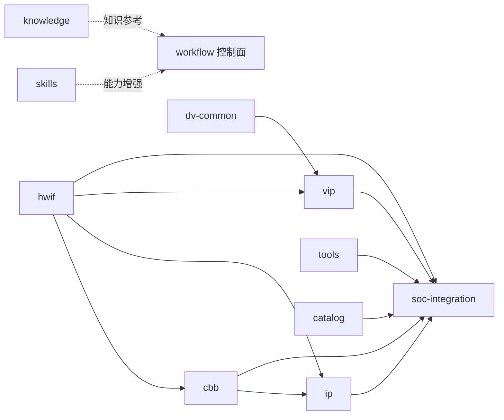

# AIXSILICON Workflow / Repo 建设规划

> 版本：V1.0（重建）｜日期：2026-08-13
> 依据客观事实：本仓 `workflows/`、`manifests/`、`policies/`、`ownership-map.yaml`、`src/aixworkflow/` 与 10 个资产仓当前内容（截至 2026-08-13）。
> 历史规划（旧 plan/todo、跨仓评审/优化、ADR、方案说明）已归档至 [`archived/`](archived/README.md)，本文件为**当前活动规划**；各仓 plan/todo 见 [`index.md`](index.md)。

---

## 1. 规划目标与范围

- **目标**：统一 `aixsilicon_workflow`（多仓工作区控制面）与 10 个资产仓的建设顺序、契约与验收，形成可执行、可审计的完整规划。
- **范围**：体系定位、仓库全景与依赖、两条主线、核心机制、治理契约、质量门禁、分阶段建设路线、各仓缺口、风险与验收。

## 2. 体系定位与责任链

**定位**：`aixsilicon_workflow` 是 Manifest 驱动的多仓工作区控制面，**不是**源码汇总仓、镜像仓或最终 SoC 工程仓。父仓只版本化 Manifest/Lockfile/Schema/流程/公共 CI/文档；子仓统一克隆到 `repos/`（父仓 `.gitignore` 完整忽略），各自保持独立 Git 历史、分支、PR、Tag、Release。

**责任链**（单一职责，各环只回答一个问题）：

```text
Skill 理解与辅助 → Workflow 顺序与 Gate → Tool 确定性执行 → 资产仓 SSOT/交付 → Catalog 发布/发现 → EDA 工程证据
```

| 环 | 归属 | 回答的问题 |
|---|---|---|
| Skill | `aixsilicon_skill_repo`（私有） | 如何理解需求、生成/解释、选流程 |
| Workflow | `aixsilicon_workflow` | 先跑什么、后跑什么、什么算通过 |
| Tool | `aixsilicon_tool_repo`（T1） | 如何确定性生成/检查 |
| 资产仓 | hwif/cbb/ip/dv-common/vip/soc-integration | 事实、源码、正式交付（SSOT） |
| Catalog | `aixsilicon_catalog_repo` | 已发布资产、版本、兼容性、成熟度 |
| EDA | EDA Provider | 仿真/综合/PPA 证据 |

## 3. 仓库全景与依赖

### 3.1 10 仓客观状态

| 逻辑 ID | 仓库 | 类型 | 客观现状（2026-08-13） | 主要缺口 | 下一步 |
|---|---|---|---|---|---|
| hwif | `aixsilicon_hwif_repo` | hw-interface | **57 接口族（L0–L6）建成**：契约+RTL+core、6 工具链、5 测试组、56 视图+112 IP-XACT 生成 | Techlib binding、Skill/SoCGen 消费闭环、VLNV 迁移 | 完成 2 个真实消费者（CBB+VIP）编译依赖 |
| cbb | `aixsilicon_cbb_repo` | cbb | 骨架+清单：registry ~330 项登记、结构齐备 | P0 15 种子构件多 planned、无 `cbb.yaml` SSOT 落地 | 首批种子构件 verified + 3 个示范闭环 |
| ip | `aixsilicon_ip_repo` | ip | 建仓：ipkg/registry、uart 0.1.0、`aixsilicon:ip:*` | 首个 APB 寄存器 IP 内容与发布 | APB IP 端到端穿刺（SystemRDL→RTL→VIP→Evidence） |
| dv-common | `aixsilicon_dv_common` | dv-common | **P0 底座完成**：types/utils/runtime/ral 骨架、12 单测+smoke+rtl_smoke、tools 5 件 | P1 RAL/CSR 正式行为、APB 穿刺、首个 Candidate | RAL base + CSR sequence + PeakRDL 接入 |
| vip | `aixsilicon_vip_repo` | vip | 规划为主：目录/文档骨架 | 无正式 VIP 落地 | APB VIP V3、Clock/Reset/Memory/Interrupt V2 |
| tools | `aixsilicon_tool_repo` | tool | **P0 五包已实现并接入 `aix tool`**：aix-tool-core/schema/hwif-gen/reg-tool/core-tool（30 用例全绿） | S5 集成收尾：`aix wf run` 转真实 provider、workspace-lock `tools:` 段、reference 适配 | 完成 S5 收尾 + P1 扩展（socgen/ppa-bench/dv-gen 等） |
| catalog | `aixsilicon_catalog_repo` | catalog | 骨架：index + 7 条资产 + catalog-asset schema | 随各仓 release 持续填充、兼容矩阵 | 首批 `qualified` 资产条目 |
| soc-integration | `aixsilicon_soc_integration` | soc-integration | 骨架：soc-config.schema.json + 2 示例 | 完整 Schema 集、地址/中断/CRG 检查接入 | 完整 Schema 集 + 最小 SoC Golden |
| skills | `aixsilicon_skill_repo` | skill（私有） | **canonical 落地**：ip-development-suite（21 子 skill、G0–G5、UVM 1.2、8 eval） | 套件自校验/Eval 全链路、与 workflow/tool 契约对齐 | 与 workflow/tool 契约对齐、CBB/SoC suite |
| knowledge | `aixsilicon_chipknowledge` | other | 已接入：知识库骨架、知识手册索引 | 内容填充、与 Skill/工程实践联动 | 方法论/术语/参考索引填充 |

### 3.2 仓库依赖 DAG（`manifests/default.yaml` 的 `depends_on`）



- **底座**：hwif（被 cbb/ip/vip/soc-integration 依赖）；dv-common（被 vip 依赖）；
- **聚合终点**：soc-integration（依赖 hwif/cbb/ip/catalog/tools）；
- **独立层**：skills、knowledge（DAG 之外的能力/知识增强）。

### 3.3 四域分组

| 域 | 仓库 | 主线角色 |
|---|---|---|
| 接口/设计 | hwif、cbb、ip | IP 设计主线核心 SSOT |
| 验证 | dv-common、vip | 两主线验证供给 |
| 集成/发布 | soc-integration、catalog | SoC 集成与发布索引 |
| 执行/知识 | tools、skills、knowledge | 确定性执行、AI 方法、知识参考 |

## 4. 两条主线

### 4.1 主线一：IP 设计验证

- **入口**：`ip-development` → `ip-verification` → `release-train`；
- **统筹仓**：hwif（契约）、cbb（复用）、ip（本体写入）、dv-common+vip（验证）、tools（确定性生成）、catalog（发布）；
- **产出**：可发布 IP（RTL/CSR/验证/文档 + Catalog 条目 + Evidence）；
- **Gate**：`ip-development` 覆盖 G0–G4+G6；`ip-verification` 覆盖 G0–G7。

### 4.2 主线二：SoC 集成验证

- **入口**：`soc-integration`（消费 Catalog 已发布资产）；
- **统筹仓**：catalog（选型）、soc-integration（Schema/规则）、tools（TopGen/地址/中断/CRG 派生）、hwif/cbb/ip（实例）、dv-common/vip（验证）；
- **产出**：SoC Top、软件派生（BSP/Header/DTS）、集成验证结果、集成基线；
- **Gate**：G0–G6。

### 4.3 支撑流程

| 流程 | 服务对象 | 定位 |
|---|---|---|
| `hwif-change` | 两主线上游 | 接口契约变更→语义检查→多视图→SemVer→下游影响 |
| `vip-development` | 两主线验证 | VIP/DV Common 开发：API→单元→模拟器矩阵→自检→代表性回归 |
| `cross-repo-qualification` | 跨仓 Change Bundle | 拉取 PR HEAD→依赖图→影响→联合测试→结论 |
| `release-train` | 两主线产出→Catalog | 候选→clean/locked→资格→材料→人工批准→发布→Catalog |
| `apb-register-ip` | 主线一示例 | APB 寄存器 IP 端到端穿刺（HWIF→SystemRDL→RTL→VIP→DV→Evidence→Catalog） |

## 5. 核心机制

| 机制 | 载体 | 说明 |
|---|---|---|
| Workspace Manifest | `manifests/*.yaml` | 描述期望工作区（仓库/路径/分支/Profile） |
| Lockfile | `locks/*.yaml` | 固定各仓 SHA/VLNV/工具版本（可重建） |
| Local Override | `overrides/local.yaml`（忽略） | 本地临时替换，不入库 |
| Change Bundle | `changesets/*.yaml` | 跨仓变更的 PR/分支/合并顺序 |
| Flow | `workflows/*.yaml`（`aix.flow/v1`） | 输入→Stage→Gate→输出 DAG |
| Evidence | Run Manifest + Evidence Index | 结论可被版本/工具/日志/报告重建 |
| CLI | `aix`（`src/aixworkflow/`） | `wf / repo / bundle / release / tool` 单入口 |
| FuseSoC 聚合 | `.aix/generated/fusesoc.conf` | core-roots / VLNV 索引 / 依赖图生成 |

## 6. 治理与统一契约（已冻结）

| 契约 | 内容 | 出处（归档） |
|---|---|---|
| ADR-0001 | Manifest + 独立 Clone，不用 Submodule | [`archived/adr/0001`](archived/adr/0001-manifest-over-submodule.md) |
| ADR-0002 | YAML SSOT + JSON Schema | [`archived/adr/0002`](archived/adr/0002-schema-driven-yaml.md) |
| ADR-0003 | VLNV 统一 `aixsilicon:*`（CLI 名保持 `aix`） | [`archived/adr/0003`](archived/adr/0003-unified-vlnv-namespace.md) |
| ADR-0004 | 单入口 `aix` + 插件组 `aixsilicon.commands` | [`archived/adr/0004`](archived/adr/0004-cli-entry-and-plugin-registry.md) |
| ADR-0005 | 跨仓边界映射（幽灵仓收敛） | [`archived/adr/0005`](archived/adr/0005-cross-repo-boundary-map.md) |
| ADR-0006 | 工具归属与迁移（T1 入 tool_repo） | [`archived/adr/0006`](archived/adr/0006-tool-ownership-and-migration.md) |
| Schema 所有权 | 每个事实域单一 Owner 仓 | [`archived/schema-ownership.md`](archived/schema-ownership.md) |
| 成熟度映射 | `draft/qualified/proven/deprecated` 统一外部尺度 | [`archived/maturity-model.md`](archived/maturity-model.md) |
| 工具归属 | T1 公共工具→tool_repo / T2 仓内脚本 / T3 私有 overlay / T4 项目脚本 | [`archived/tool-placement.md`](archived/tool-placement.md) |
| 跨仓评审决议 | R1–R7（重复构建）/ A1–A4（架构）/ C1–C5（引用清晰） | [`archived/plans/cross-repo-architecture-review.md`](archived/plans/cross-repo-architecture-review.md) |
| 跨仓优化决策 | D1–D5（VLNV/仓库命名/成熟度/CLI/工具迁移） | [`archived/plans/cross-repo-optimization-plan.md`](archived/plans/cross-repo-optimization-plan.md) |

## 7. 质量门禁 G0–G7

| Gate | 名称 | 内容 |
|---|---|---|
| G0 | Repository Hygiene | Schema 通过、路径无逃逸、无子仓源码、无 Secret/大文件 |
| G1 | Workspace Resolution | required 仓可访问、remote 一致、SHA 可达 |
| G2 | Dependency Integrity | DAG 无环、VLNV 无冲突、Catalog 一致 |
| G3 | Contract Compatibility | HWIF Schema、Profile 兼容、无禁用行为 |
| G4 | Build and Unit | Lint、编译、Unit Test、生成物可复现 |
| G5 | Cross-repo Qualification | 代表性联合测试、影响分析无缺失 |
| G6 | Evidence Completeness | Run Manifest、Log、Report、Hash 完整 |
| G7 | Release Readiness | SemVer、CHANGELOG、SBOM、clean、批准完成 |

> 门禁由**证据 + 哈希**驱动，不凭“目录存在”自证通过；成熟度升级须携带 Evidence 引用。

## 8. 分阶段建设路线（统一阶段，标注客观状态）

> 综合旧 `todo.md` 阶段0–5、旧 `aixsilicon_build_todolist.md` B0–B4、跨仓优化 P0–P4 为统一路线。状态来自 2026-08-13 实测。

| 阶段 | 目标 | 客观状态 | 出口 |
|---|---|---|---|
| 0 契约冻结 | 边界/ADR/VLNV/Schema/所有权 | ✅ 基本达成（CBB/Tool/Catalog/SoCInt/Skill 内容待填充） | 跨仓契约单一事实源；`make check`+pre-commit 全绿 |
| 1 Workspace MVP | 一条命令建环境、子仓独立提交 | ✅ 基本达成（P0 缺陷已修复） | `aix wf init`+`sync` 一键、Lockfile 可重建 |
| 2 FuseSoC 与基础跨仓验证 | 固定 Lock 重建 **APB 验证闭环** | 🔶 进行中（FuseSoC 实跑 483 core；APB 穿刺编排级） | `apb_csr` 跨仓 lint/编译/仿真/Evidence 闭环 |
| 3 Change Bundle 与影响分析 | HWIF→VIP→IP 联合变更 | ⬜ 未开始（bundle CLI 已就绪，PR 联合 checkout 占位） | 三仓联合变更真实执行 |
| 4 发布协调与 Catalog | IP 资格验证+人工批准+Catalog 更新 | ⬜ 未开始（release 桩、Catalog 内容待填充） | IP 候选经人工批准发布并更新 Catalog |
| 5 SoC 集成与规模化 | SoC 锁定基线可重建 | ⬜ 未开始 | SoC 项目可锁定资产基线并重建结果 |

## 9. 各仓建设缺口与下一步

| 仓 | 缺口（客观） | P0 下一步 | P1 下一步 | P2 下一步 |
|---|---|---|---|---|
| workflow | runner 委托 `aix tool` 真实 provider 未接入 | 接入 tool_repo 插件与版本锁 | release/bundle 端到端、reusable workflows 固定 Tag | soc-* flow 动作、Nightly 矩阵 |
| hwif | Techlib binding、消费闭环、VLNV 迁移 | 完成 CBB+VIP 各 1 真实消费 | Skill/SoCGen 消费闭环 | 2 IP+1 Subsystem proven |
| cbb | 15 种子构件实现 | 首批 verified + 3 示范闭环 | PPA 表征、Selector | 30–50 E4 资产 |
| ip | 首个 APB IP 内容与发布 | APB 寄存器 IP 端到端 | X2X/AXI Bridge | PIC 功能安全 |
| dv-common | RAL/CSR 正式行为、APB 穿刺 | RAL base + CSR seq + PeakRDL | Candidate + Catalog 接入 | out-of-order、PIC |
| vip | 无正式 VIP 落地 | APB V3、Clock/Reset/Memory/Interrupt V2 | AXI4-Lite/Stream beta | 功能安全故障注入 |
| tools | S5 集成收尾（真实 provider/版本锁） | `aix wf run` 转真实 provider | socgen/ppa-bench/dv-gen 等 P1 扩展 | P2 报告/RTM/打包 |
| catalog | 内容待填充 | 首批 `qualified` 条目 | 兼容矩阵、成熟度落地 | 覆盖各资产域 |
| soc-integration | 完整 Schema 集、检查接入 | 完整 Schema + 最小 Golden | Address/IRQ/CRG Checker 接入 | 规模化基线 |
| skills | 与 workflow/tool 契约对齐 | 套件自校验/Eval 全链路 | IP Golden Path 端到端 | CBB/SoC suite |
| knowledge | 内容填充 | 方法论/术语/参考索引 | 与 Skill/工程实践联动 | — |

## 10. 关键依赖与风险

| 依赖/风险 | 说明 | 控制 |
|---|---|---|
| hwif 先于 cbb/vip/ip | 接口契约是设计与验证共同地基 | 依赖优先建设 |
| dv-common 先于 vip/ip 验证 | 通用验证机制避免重复 | 底座先行 |
| `aix-reg-tool` 先于 APB 完整穿刺 | SystemRDL/RAL/RTL 多视图需确定性生成器 | tool_repo P0 优先 |
| Catalog 随 release 填充 | 不是一次建完，而是持续索引 | 随各仓 release 更新 |
| Workflow 变超级仓库 | 边界被破坏 | ownership-map + pre-commit Guard 持续执行 |
| 工具与发布逻辑重复（R1/R4/R7） | hwif 6 工具 vs tool_repo | ADR-0006 分阶段迁移 |
| vendored `reference/` 污染（A2） | 第三方 core 干扰 FuseSoC | 排除发现、不发布、不进 Catalog |
| 私有 Skill 阻塞公共流程 | 隐藏必需依赖 | 公共流程不依赖私有 Skill |

## 11. 验收标准（一期）

1. 一条命令按 Profile 下载全部仓库（`aix wf init` + `aix wf sync`）；✅
2. 子仓位于 `repos/` 并被父仓可靠忽略；✅
3. 任一子仓独立建分支/commit/push，父仓无变化；✅
4. dirty/错误 remote/不可达 SHA/override 可识别；✅
5. 生成完整 FuseSoC 配置并发现全部 Core（待实跑）；🔶
6. Lockfile 记录各仓 SHA 与工具 Profile（可重建）；✅
7. APB 代表性 IP 完成跨仓 Lint/编译/仿真/Evidence；⬜
8. Change Bundle 描述 HWIF+VIP+IP 联合变更（示例）；✅
9. 联合 CI 拉取各仓 PR HEAD 并产生结构化结论；⬜
10. 发布动作前人工确认，dirty/override 不可发布；⬜
11. 失败 Run 定位到仓库/SHA/Stage/工具/Failure Signature；⬜
12. README/协作/故障文档可用。✅

## 12. 关联文档与归档索引

- **规划索引**：**[`index.md`](index.md)**
- **各仓 plan/todo**：见 [`index.md`](index.md) §2（workflow/ 与 10 仓各含 plan.md + todo.md）
- **归档区**：**[`archived/README.md`](archived/README.md)**（ADR / 方案说明与关系框图 / 跨仓评审与优化 / 旧 plan-todo-build_todolist）
- **客观事实**：`manifests/default.yaml`、`workflows/*.yaml`、`ownership-map.yaml`、`src/aixworkflow/`、`repos/*`
