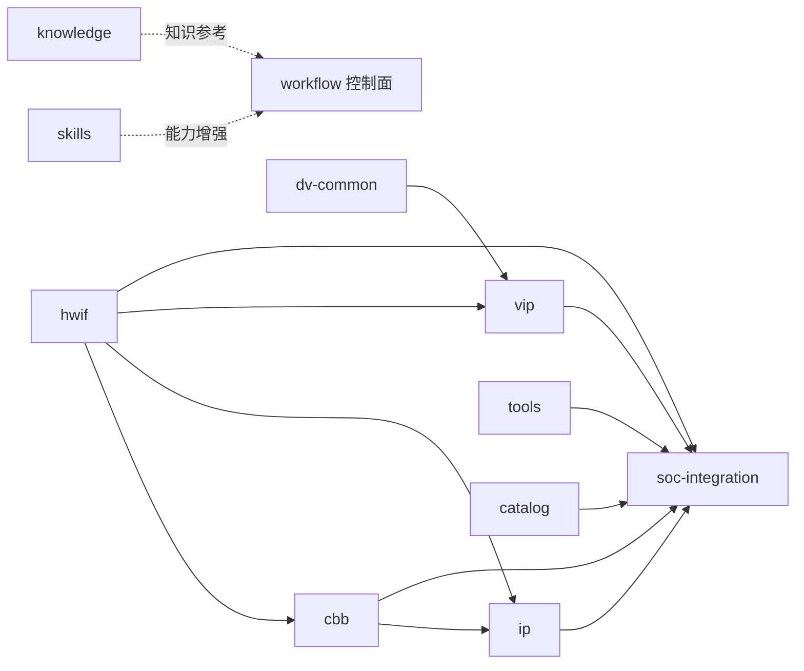
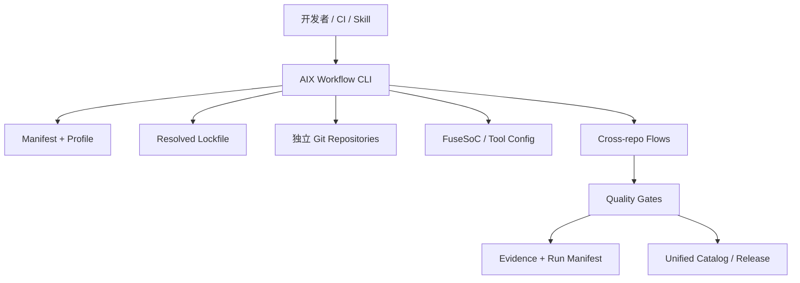

# AIXSILICON Workflow / Repo 建设规划

> 版本：V1.0（重建）｜日期：2026-08-13
> 依据客观事实：本仓 `workflows/`、`manifests/`、`policies/`、`ownership-map.yaml`、`src/aixworkflow/` 与 10 个资产仓当前内容（截至 2026-08-13）。
> 历史规划（旧 plan/todo、跨仓评审/优化、ADR、方案说明）已归档至 [`archived/`](archived/README.md)，本文件为**当前活动规划**；各仓 plan/todo 见 [`index.md`](index.md)。

---

## 1. 规划目标与范围

- **目标**：统一 `aixsilicon_workflow`（多仓工作区控制面）与 10 个资产仓的建设顺序、契约与验收，形成可执行、可审计的完整规划。
- **范围**：体系定位、仓库全景与依赖、两条主线、核心机制、治理契约、质量门禁、分阶段建设路线、各仓缺口、风险与验收。

## 2. 体系定位与责任链

**定位**：`aixsilicon_workflow` 是 Manifest 驱动的多仓工作区控制面，**不是**源码汇总仓、镜像仓或最终 SoC 工程仓。父仓只版本化 Manifest/Lockfile/Schema/流程/公共 CI/文档；子仓统一克隆到 `repos/`（父仓 `.gitignore` 完整忽略），各自保持独立 Git 历史、分支、PR、Tag、Release。

**责任链**（单一职责，各环只回答一个问题）：

```text
Skill 理解与辅助 → Workflow 顺序与 Gate → Tool 确定性执行 → 资产仓 SSOT/交付 → Catalog 发布/发现 → EDA 工程证据
```

| 环 | 归属 | 回答的问题 |
|---|---|---|
| Skill | `aixsilicon_skill_repo`（私有） | 如何理解需求、生成/解释、选流程 |
| Workflow | `aixsilicon_workflow` | 先跑什么、后跑什么、什么算通过 |
| Tool | `aixsilicon_tool_repo`（T1） | 如何确定性生成/检查 |
| 资产仓 | hwif/cbb/ip/dv-common/vip/soc-integration | 事实、源码、正式交付（SSOT） |
| Catalog | `aixsilicon_catalog_repo` | 已发布资产、版本、兼容性、成熟度 |
| EDA | EDA Provider | 仿真/综合/PPA 证据 |

### 2.1 定位细化：解决的问题与推荐形态

`aixsilicon_workflow` 统一解决六类问题：

1. 按清单把多个 Git 仓库下载到固定目录；
2. 让每个子仓继续保持独立 Git 历史、分支、PR、Tag 和 Release；
3. 用 Manifest 与 Lockfile 描述“需要哪些仓库”和“本次实际用了哪个提交”；
4. 自动生成 FuseSoC libraries、工具配置与开发态本地覆盖；
5. 执行跨仓依赖检查、影响分析、联合验证与发布协调；
6. 为 Skill Suite 提供统一、可发现、可复现、可留证的执行环境。

> **推荐技术形态：Manifest 驱动的多仓工作区 + 独立 Git Clone + 统一 Python CLI + FuseSoC 聚合配置 + Change Bundle + GitHub Actions 协调层。**
> 默认不采用 Git Submodule；子仓统一克隆到 `repos/`（父仓 `.gitignore` 完整忽略），父仓只版本化 Manifest、Lockfile、Schema、流程定义、公共 CI、脚本和文档。

### 2.2 仓库边界（本仓库负责 / 不负责）

**负责**：多仓 Manifest/Profile/Lockfile/Schema；clone/fetch/sync/checkout/status/doctor/foreach 等工作区命令；本地目录布局与 `.gitignore` 保护；FuseSoC 配置、core roots、聚合 target 生成；跨仓依赖图、兼容性检查和影响分析；跨仓 Change Bundle 与联合验证；IP 开发/验证/集成/发布等工作流定义；组织级可复用 GitHub Actions workflow/action；工具链 Profile、容器/环境定义及版本锁定；统一输出目录、Run Manifest、Evidence Index；Release Train 与 Unified Catalog 更新协调；Skill 执行入口与权限边界。

**不负责**：不保存 IP/VIP/HWIF/DV Common 的正式源码副本；不替代各资产仓 Issue/PR/Review/Tag/Release；不成为最终产品 SoC Top 事实源；不保存具体 IP 的 SystemRDL/RTL/UVM 环境与设计文档；不把所有 EDA 脚本无边界地塞入本仓；不绕过资产仓自身质量 Gate；不自动替用户提交/推送/打 Tag/发布；不在 Lockfile/日志/报告中保存凭据；不允许 AI 直接决定未知接口、版本兼容性或 Signoff 结论。

### 2.3 与 Catalog 的边界

| 对象 | 回答的问题 |
|---|---|
| Unified Catalog | 已发布了哪些可复用资产，版本、VLNV、成熟度和兼容性是什么 |
| Workspace Manifest | 当前工作区需要克隆哪些 Git 仓库，放在哪里，使用何种开发分支或版本策略 |
| Workspace Lockfile | 本次实际解析到了哪些 Git SHA、VLNV、工具版本和生成器版本 |
| Change Bundle | 本次跨仓变更由哪些分支/PR 组成，验证和合并顺序是什么 |
| Release Manifest | 某个正式发布包含什么内容，证据、SBOM、Hash 和签名是什么 |

Workflow 可以消费和更新 Catalog，但不能让本地开发 Manifest 取代发布 Catalog。

### 2.4 开源与私有边界

整体采用“公共工程底座开源、核心 AI 方法与项目资产私有”的双层模式：

| 内容 | 默认属性 | 原因 |
|---|---|---|
| HWIF、CBB、公共 IP、VIP、DV Common | 开源 | 形成可复用硬件与验证生态 |
| Workflow、Tool、Catalog、通用 SoC Integration 框架 | 开源 | 让工程链条可复现、可贡献 |
| `aixsilicon_skill_repo` | **私有** | 保存核心 Prompt、方法论、Agent 编排和组织知识 |
| 具体商业芯片 SoC 项目仓 | **私有** | 包含产品配置、未公开 IP 和项目进度 |
| 未公开 IP/CBB/VIP | 私有或私有 Overlay | 受商业、客户和出口约束 |
| Foundry/PDK/Memory Macro 适配 | **私有** | 工艺 NDA 和授权限制 |
| 商业 EDA 配置、License、路径 | **私有** | 许可证及内部基础设施信息 |
| 项目 Waiver、Signoff 例外、缺陷数据 | **私有** | 可能暴露设计和质量信息 |

公共 Workflow 必须在没有私有 Skill 的情况下也能运行确定性基础流程；私有 Skill 是能力增强层，不能成为开源仓完成构建、测试和发布验证的隐藏必需依赖。

## 3. 仓库全景与依赖

### 3.1 10 仓客观状态

| 逻辑 ID | 仓库 | 类型 | 客观现状（2026-08-13） | 主要缺口 | 下一步 |
|---|---|---|---|---|---|
| hwif | `aixsilicon_hwif_repo` | hw-interface | **57 接口族（L0–L6）建成**：契约+RTL+core、6 工具链、5 测试组、56 视图+112 IP-XACT 生成 | Techlib binding、Skill/SoCGen 消费闭环、VLNV 迁移 | 完成 2 个真实消费者（CBB+VIP）编译依赖 |
| cbb | `aixsilicon_cbb_repo` | cbb | 骨架+清单：registry ~330 项登记、结构齐备 | P0 15 种子构件多 planned、无 `cbb.yaml` SSOT 落地 | 首批种子构件 verified + 3 个示范闭环 |
| ip | `aixsilicon_ip_repo` | ip | 建仓：ipkg/registry、uart 0.1.0、`aixsilicon:ip:*` | 首个 APB 寄存器 IP 内容与发布 | APB IP 端到端穿刺（SystemRDL→RTL→VIP→Evidence） |
| dv-common | `aixsilicon_dv_common` | dv-common | **P0 底座完成**：types/utils/runtime/ral 骨架、12 单测+smoke+rtl_smoke、tools 5 件 | P1 RAL/CSR 正式行为、APB 穿刺、首个 Candidate | RAL base + CSR sequence + PeakRDL 接入 |
| vip | `aixsilicon_vip_repo` | vip | 规划为主：目录/文档骨架 | 无正式 VIP 落地 | APB VIP V3、Clock/Reset/Memory/Interrupt V2 |
| tools | `aixsilicon_tool_repo` | tool | **P0 五包已实现并接入 `aix tool`**：aix-tool-core/schema/hwif-gen/reg-tool/core-tool（30 用例全绿） | S5 集成收尾：`aix wf run` 转真实 provider、workspace-lock `tools:` 段、reference 适配 | 完成 S5 收尾 + P1 扩展（socgen/ppa-bench/dv-gen 等） |
| catalog | `aixsilicon_catalog_repo` | catalog | 骨架：index + 7 条资产 + catalog-asset schema | 随各仓 release 持续填充、兼容矩阵 | 首批 `qualified` 资产条目 |
| soc-integration | `aixsilicon_soc_integration` | soc-integration | 骨架：soc-config.schema.json + 2 示例 | 完整 Schema 集、地址/中断/CRG 检查接入 | 完整 Schema 集 + 最小 SoC Golden |
| skills | `aixsilicon_skill_repo` | skill（私有） | **canonical 落地**：ip-development-suite（21 子 skill、G0–G5、UVM 1.2、8 eval） | 套件自校验/Eval 全链路、与 workflow/tool 契约对齐 | 与 workflow/tool 契约对齐、CBB/SoC suite |
| knowledge | `aixsilicon_chipknowledge` | other | 已接入：知识库骨架、知识手册索引 | 内容填充、与 Skill/工程实践联动 | 方法论/术语/参考索引填充 |

### 3.2 仓库依赖 DAG（`manifests/default.yaml` 的 `depends_on`）



- **底座**：hwif（被 cbb/ip/vip/soc-integration 依赖）；dv-common（被 vip 依赖）；
- **聚合终点**：soc-integration（依赖 hwif/cbb/ip/catalog/tools）；
- **独立层**：skills、knowledge（DAG 之外的能力/知识增强）。

### 3.3 四域分组

| 域 | 仓库 | 主线角色 |
|---|---|---|
| 接口/设计 | hwif、cbb、ip | IP 设计主线核心 SSOT |
| 验证 | dv-common、vip | 两主线验证供给 |
| 集成/发布 | soc-integration、catalog | SoC 集成与发布索引 |
| 执行/知识 | tools、skills、knowledge | 确定性执行、AI 方法、知识参考 |

### 3.4 完整仓库生态查漏补缺（推荐清单）

| 仓库 | 定位 | 开放性 | 建设优先级 |
|---|---|---|---:|
| `aixsilicon_hwif_repo` | 接口语义契约与 HDL 多视图 | 开源 | 已有/P0 |
| `aixsilicon_cbb_repo` | 可参数化公共逻辑构件与 PPA 实现 | 开源 | **新增/P0** |
| `aixsilicon_ip_repo` | 可独立集成和发布的完整 IP | 开源基线 | 已有/P0 |
| `aixsilicon_dv_common_repo` | 协议无关验证公共底座 | 开源 | 已有/P0 |
| `aixsilicon_vip_repo` | 协议与系统验证组件 | 开源 | 已有/P0 |
| `aixsilicon_tool_repo` | 确定性生成、检查、转换、打包工具 | 开源基线 | **新增/P0** |
| `aixsilicon_catalog_repo` | 已发布资产索引、兼容矩阵和成熟度 | 开源 | **新增/P0** |
| `aixsilicon_soc_integration_repo` | 通用 SoC 集成 Schema、模板、规则和参考配置 | 开源 | **新增/P0** |
| `aixsilicon_workflow` | 多仓工作区、流程 DAG、Gate、Evidence 与发布协调 | 开源 | 本规划/P0 |
| `aixsilicon_skill_repo` | AI 辅助研发 Skill Suite 与核心方法论 | **私有** | 已有/P0 |
| `aixsilicon_techlib_repo` | Generic/FPGA 工艺抽象与公开适配 | 开源基线 | 新增/P1 |
| `aixsilicon_model_repo` | 跨 IP 共享参考模型、存储/外设模型、DPI 适配 | 开源 | 按需/P1 |
| `aixsilicon_sw_repo` | BSP、Boot、HAL、驱动、SoC Smoke Firmware | 开源基线 | 新增/P1 |
| `aixsilicon_reference_soc_repo` | 可运行的最小 SoC 与 FPGA 参考工程 | 开源 | 新增/P2 |

另有两类不属于公共仓库体系、但 Workflow 必须支持的私有仓：

- `chip_<project>_soc_repo`：某颗芯片的 SoC YAML SSOT、IP 实例、地址、中断、CRG、Power、Top 和项目证据；
- `<domain>_private_overlay_repo`：私有 IP、工艺宏、商业 EDA Profile、项目规则和 Waiver。

**必须补齐 CBB**：CBB 不能继续隐含在 IP Repo 中。IP 与 CBB 在生命周期、验证方法和 PPA 目标上不同（CBB 为 FIFO/CDC/仲裁/位宽转换/ECC 等构件，通常无 CSR/中断，验证重点为参数空间与形式属性，版本影响下游大量资产）。推荐首批 CBB：同步器、异步/同步 FIFO、Round-robin Arbiter、Priority Encoder、Skid Buffer、Ready/Valid Slice、Pulse/Level 转换、位宽转换、ECC/Parity、Clock/Reset 辅助构件。

**必须补齐 Tool**：保存“确定性执行能力”，解决脚本散落在 IP/Skill/Workflow 中的问题；建议 `packages/`（aix-schema、aix-hwif-gen、aix-reg-gen、aix-core-gen、aix-socgen、aix-connect-check、aix-dv-gen、aix-ppa-bench、aix-rtm、aix-package、aix-report）+ fusesoc_generators + schemas + adapters。Tool 保存“怎么生成/检查”，Workflow 保存“先跑什么、什么算通过”，Skill 保存“如何理解/选择”，资产仓保存 SSOT。

**必须补齐 Catalog**：独立于 Workflow 更合适（生命周期不同）。至少索引 IP/CBB/VIP/HWIF/DV Common/Techlib/Model/Tool/Workflow/Reference SoC；每项含 VLNV、Git URL、Release Tag、Commit SHA、SemVer、依赖、兼容矩阵、成熟度、许可证、Owner、质量摘要和 Evidence 引用。

**必须补齐 SoC Integration**：保存通用 SoC 集成领域资产（SoC/Subsystem/IP Instance/Address Map/Interrupt/Clock-Reset/Power Domain Schema、端口连接与集成规则、总线/PIC/CRG 集成模板、SoC 配置分域拆分规范、SoCGen 输入输出契约、集成级 Assertion 与 Connectivity 规则、最小示例与 Golden、集成签核 Checklist）。生成器实现归 tool_repo，流程 DAG 归 workflow，具体芯片配置归私有 `chip_<project>_soc_repo`。

**建议补齐**：`aixsilicon_techlib_repo`（工艺可移植性：generic RTL/FPGA 映射/ICG/SRAM/ROM wrapper 开源，Foundry 私有 Overlay）；`aixsilicon_model_repo`（只存真正跨 IP 共享的模型，与 IP 强绑定的 Golden Model 跟随 IP 仓版本）；`aixsilicon_sw_repo`（Boot/Smoke 软件侧资产；CSR Header/地址表/IRQ/Device Tree 应从 SystemRDL/SoC YAML 确定性生成）。

### 3.5 暂不单独建仓的内容

| 候选仓 | 当前处理方式 |
|---|---|
| `aixsilicon_eda_flow_repo` | 通用 Flow 放 Workflow；确定性适配器放 Tool；私有 EDA Profile 放 Overlay |
| `aixsilicon_rule_repo` | 公共 Policy 放 Workflow/SoC Integration；项目 Waiver 留在项目私仓 |
| `aixsilicon_doc_repo` | 文档跟随所属资产；跨仓门户由 Catalog/AIXSILICON 平台生成 |
| `aixsilicon_formal_repo` | 协议属性归 VIP，CBB 属性归 CBB，公共 Runner 归 Tool/Workflow |
| `aixsilicon_coverage_repo` | 协议 Coverage 归 VIP，IP Coverage 归 IP，公共机制归 DV Common |
| `aixsilicon_generated_repo` | 禁止建立；生成物必须跟随 SSOT、Manifest 和 Owner |

### 3.6 三种核心能力的责任公式

> **Skill 决定“如何理解与辅助” → Workflow 决定“按什么顺序执行和判定” → Tool 负责“确定性生成与检查” → Asset Repo 保存“事实、源码和正式交付” → Catalog 负责“发布发现与兼容选择”。**

## 4. 两条主线

### 4.1 主线一：IP 设计验证

- **入口**：`ip-development` → `ip-verification` → `release-train`；
- **统筹仓**：hwif（契约）、cbb（复用）、ip（本体写入）、dv-common+vip（验证）、tools（确定性生成）、catalog（发布）；
- **产出**：可发布 IP（RTL/CSR/验证/文档 + Catalog 条目 + Evidence）；
- **Gate**：`ip-development` 覆盖 G0–G4+G6；`ip-verification` 覆盖 G0–G7。

### 4.2 主线二：SoC 集成验证

- **入口**：`soc-integration`（消费 Catalog 已发布资产）；
- **统筹仓**：catalog（选型）、soc-integration（Schema/规则）、tools（TopGen/地址/中断/CRG 派生）、hwif/cbb/ip（实例）、dv-common/vip（验证）；
- **产出**：SoC Top、软件派生（BSP/Header/DTS）、集成验证结果、集成基线；
- **Gate**：G0–G6。

### 4.3 主线三：CBB 设计验证

- **入口**：`cbb-development`（`cbb.yaml` 参数契约 → 多实现 → 参数验证 → PPA）→ `cbb-verification` → `release-train`；
- **统筹仓**：hwif（接口契约）、cbb（本体写入/PPA 表征）、dv-common+vip（验证供给）、tools（参数空间生成/PPA 归一化）、catalog（发布）；
- **相对 IP 主线必须增加**：参数合法域 Schema、参数组合覆盖与边界自动生成、多实现 Profile（`area_opt/perf_opt/low_power`）、形式验证或高强度随机验证、PPA Sweep 与推荐规则、Generic RTL/FPGA/ASIC Techlib 一致性检查、下游影响分析（CBB 变更影响大量 IP）；
- **产出**：可发布 CBB（参数化 RTL/属性/PPA 数据 + Catalog 条目 + Evidence）；
- **Gate**：G0–G7（含 PPA 数据有效性与可复现）。

### 4.4 支撑流程

| 流程 | 服务对象 | 定位 |
|---|---|---|
| `hwif-change` | 两主线上游 | 接口契约变更→语义检查→多视图→SemVer→下游影响 |
| `vip-development` | 两主线验证 | VIP/DV Common 开发：API→单元→模拟器矩阵→自检→代表性回归 |
| `cross-repo-qualification` | 跨仓 Change Bundle | 拉取 PR HEAD→依赖图→影响→联合测试→结论 |
| `release-train` | 两主线产出→Catalog | 候选→clean/locked→资格→材料→人工批准→发布→Catalog |
| `apb-register-ip` | 主线一示例 | APB 寄存器 IP 端到端穿刺（HWIF→SystemRDL→RTL→VIP→DV→Evidence→Catalog） |

### 4.5 三条主线共用的支撑子流程

**HWIF 变更子流程**：Contract 变更 → Schema/语义检查 → 多视图重新生成 → SemVer 影响判定 → 受影响 VIP 编译/协议测试 → 受影响 CBB/IP 编译与测试 → SoC 消费者影响分析 → 兼容矩阵更新 → HWIF 发布 → 下游依赖升级 PR。Breaking change 不得通过一个跨仓“大提交”掩盖：先发布新的 HWIF major 版本，再让 VIP/CBB/IP/SoC 项目显式迁移，旧版本按 Deprecated 窗口继续保留。

**VIP/DV Common 子流程**：公共 API 或协议能力变更 → Unit Test → Simulator Matrix → Self-check/Negative Test → Reference DUT/Cross Model → 代表性 CBB/IP 回归 → SoC 系统场景抽检 → Coverage 与性能基线 → Qualified Release。

**发布子流程**：候选版本选择 → Clean/Locked 环境确认 → IP Qualification → 文档/RTM/Manifest/SBOM 检查 → 版本与 CHANGELOG 检查 → 人工批准 → 对应 IP 仓 Tag/Release → Catalog 更新 PR → Release Bundle 留证。该子流程对 IP、CBB、VIP、HWIF、DV Common、Tool 和 Workflow 自身均适用，仅质量矩阵不同。

> GitHub 支持 `workflow_call` 复用工作流；建议资产仓保留薄入口，调用 Workflow Repo 中版本锁定的可复用工作流。

## 5. 核心机制

| 机制 | 载体 | 说明 |
|---|---|---|
| Workspace Manifest | `manifests/*.yaml` | 描述期望工作区（仓库/路径/分支/Profile） |
| Lockfile | `locks/*.yaml` | 固定各仓 SHA/VLNV/工具版本（可重建） |
| Local Override | `overrides/local.yaml`（忽略） | 本地临时替换，不入库 |
| Change Bundle | `changesets/*.yaml` | 跨仓变更的 PR/分支/合并顺序 |
| Flow | `workflows/*.yaml`（`aix.flow/v1`） | 输入→Stage→Gate→输出 DAG |
| Evidence | Run Manifest + Evidence Index | 结论可被版本/工具/日志/报告重建 |
| CLI | `aix`（`src/aixworkflow/`） | `wf / repo / bundle / release / tool` 单入口 |
| FuseSoC 聚合 | `.aix/generated/fusesoc.conf` | core-roots / VLNV 索引 / 依赖图生成 |

### 5.1 总体架构六层



| 层 | 内容 | 主要输出 |
|---|---|---|
| L0 工作区层 | 目录、clone、sync、状态、缓存 | 本地一致工作区 |
| L1 配置层 | Manifest、Profile、Lock、Override | 可解析依赖基线 |
| L2 资产发现层 | FuseSoC roots、VLNV、Catalog | 可构建资产图 |
| L3 流程编排层 | develop、verify、integrate、release | 标准化任务 DAG |
| L4 质量与证据层 | Gate、RTM、报告、Hash、SBOM | 结构化判定证据 |
| L5 协作与发布层 | PR、Change Bundle、Release Train | 可审计多仓协作 |

### 5.2 Manifest / Lock / Override / Flow 要点

**Manifest 设计要点**（详见 [`manifest.md`](workflow/manifest.md)）：描述期望工作区，不记录本地瞬时状态；字段含仓库逻辑 ID、Git URL/remote、checkout 路径、默认 branch/tag/range、Profile/Group、owner 与权限级别、仓库类型、FuseSoC core roots、仓库级依赖、required/optional、shallow/LFS/sparse 策略、工具和 Skill 暴露入口。规则：`path` 必须位于 `repos_root` 下且禁绝对路径/`..` 逃逸；URL 必须来自批准 remote/allowlist；`depends_on` 必须为 DAG；正式基线由 Lockfile 固定 SHA；凭据只由 SSH Agent/credential helper/CI Secret 提供；`visibility: private` 且 `required: false` 的 Skill 仓无权限时显示 `OPTIONAL_UNAVAILABLE`，公共确定性 Flow 继续运行。

**Lockfile 设计要点**（详见 [`manifest.md`](workflow/manifest.md)）：记录每个仓库 canonical URL、resolved commit SHA、branch/tag 来源、tree hash 与 dirty 状态、Catalog commit、关键 VLNV 与版本、FuseSoC/Python/生成器及工具 Profile 版本、Manifest digest、生成时间与生成者、解析策略版本。三类锁文件：`baseline.lock.yaml`（入库，团队基线）、`releases/*.lock.yaml`（入库，正式里程碑，不允许原地修改）、`.aix/local.lock.yaml`（不入库，可含本地分支）。更新正式 Lockfile 必须经过完整跨仓资格验证。

**Local Override 要点**：默认只在本地生效且被 `.gitignore` 忽略；状态页显著显示 `NON-BASELINE / OVERRIDDEN`；Evidence 与 Run Manifest 记录实际 SHA；Release Gate 默认拒绝 local override；需团队共享的跨仓变更改用 Change Bundle。

**Flow 定义模型**（`aix.flow/v1`）：YAML 描述 DAG、输入、前置条件与证据出口；Python Runner 确定性执行，不让大模型直接解释为 Shell；每个 Stage 声明读写范围、超时、重试和退出码；默认 fail-fast，但 Evidence 收集在失败后仍执行；同一 Run 固定 Manifest/Lock/工具 Profile/环境摘要；重跑关联原 Run ID 并说明重跑范围；缓存只加速不改变判定语义；Gate 结果结构化，不依赖日志关键词。

## 6. 治理与统一契约（已冻结）

| 契约 | 内容 | 出处（归档） |
|---|---|---|
| ADR-0001 | Manifest + 独立 Clone，不用 Submodule | [`archived/adr/0001`](archived/adr/0001-manifest-over-submodule.md) |
| ADR-0002 | YAML SSOT + JSON Schema | [`archived/adr/0002`](archived/adr/0002-schema-driven-yaml.md) |
| ADR-0003 | VLNV 统一 `aixsilicon:*`（CLI 名保持 `aix`） | [`archived/adr/0003`](archived/adr/0003-unified-vlnv-namespace.md) |
| ADR-0004 | 单入口 `aix` + 插件组 `aixsilicon.commands` | [`archived/adr/0004`](archived/adr/0004-cli-entry-and-plugin-registry.md) |
| ADR-0005 | 跨仓边界映射（幽灵仓收敛） | [`archived/adr/0005`](archived/adr/0005-cross-repo-boundary-map.md) |
| ADR-0006 | 工具归属与迁移（T1 入 tool_repo） | [`archived/adr/0006`](archived/adr/0006-tool-ownership-and-migration.md) |
| Schema 所有权 | 每个事实域单一 Owner 仓 | [`archived/schema-ownership.md`](archived/schema-ownership.md) |
| 成熟度映射 | `draft/qualified/proven/deprecated` 统一外部尺度 | [`archived/maturity-model.md`](archived/maturity-model.md) |
| 工具归属 | T1 公共工具→tool_repo / T2 仓内脚本 / T3 私有 overlay / T4 项目脚本 | [`archived/tool-placement.md`](archived/tool-placement.md) |
| 跨仓评审决议 | R1–R7（重复构建）/ A1–A4（架构）/ C1–C5（引用清晰） | [`archived/plans/cross-repo-architecture-review.md`](archived/plans/cross-repo-architecture-review.md) |
| 跨仓优化决策 | D1–D5（VLNV/仓库命名/成熟度/CLI/工具迁移） | [`archived/plans/cross-repo-optimization-plan.md`](archived/plans/cross-repo-optimization-plan.md) |

### 6.1 分支、版本与基线治理

- 每个资产仓独立使用 SemVer：HWIF 按 Contract 兼容性、DV Common 按公共 API 兼容性、VIP 按协议能力/API/行为兼容性、IP 按功能/接口/交付兼容性、Skill 按输入输出契约和工作流语义、Workflow 按 Manifest/CLI/Flow Schema 兼容性；
- 可发布 `aix-workspace-bundle <ver>` 兼容组合（只含 Lockfile、兼容矩阵、Tool Profile、Qualification Evidence 索引、Release Notes；不重新打包源码，不改变各仓 Release）；
- Baseline 更新：候选依赖版本 → 解析候选 Lock → 全量兼容检查 → 代表性回归 → PR Review → 更新 `baseline.lock.yaml` → 发布 Bundle（里程碑时）。

### 6.2 工具链与环境 Profile

`toolchains/*.yaml`（`aix.tool-profile/v1`）声明 host/python/tools/commercial/environment。环境隔离：开源工具流程可提供容器镜像；商业 EDA 由受控 Runner/module 加载，不把许可证写入镜像；blue-zone 与 red-zone 使用相同 Schema 与 Flow 语义，但工具路径与网络策略分离；CI 只记录工具版本与 Profile ID，不回显敏感环境变量；生成器版本必须锁定，不能只锁 RTL 仓库。

### 6.3 Skill 协同与写入保护

每个 Skill 通过声明式 Metadata 告诉 Workflow：输入资产类型、输出资产 owner 仓与允许路径、前置 Gate、依赖工具和 Core、是否允许修改文件、人工确认点、结果 Schema、后续消费者。AI 负责理解/生成/解释/建议；YAML SSOT 固化接口/配置/版本/依赖/发布事实；脚本负责 Schema 校验/生成/Git 操作/影响计算/证据整理；事实未知时写 `TBD` 并阻断相应 Gate，不允许 AI 猜测通过。

`ownership-map.yaml` 写入保护（节选）：

| 资产 | Owner 仓 | Skill 可否直接写 |
|---|---|---|
| Interface Contract | `aixsilicon_hwif_repo` | 生成草案可以，提交需人工确认 |
| CBB 代码/属性/PPA 配置 | `aixsilicon_cbb_repo` | 可写指定目录，不能自动 commit |
| VIP 代码 | `aixsilicon_vip_repo` | 可写工作树，不能自动 commit |
| DV Common 组件 | `aixsilicon_dv_common_repo` | 可写工作树，不能自动 commit |
| IP RTL/SystemRDL/文档 | `aixsilicon_ip_repo` | 可写指定 IP 目录 |
| Tool 实现 | `aixsilicon_tool_repo` | 仅 Tool 开发流程可写 |
| SoC 通用 Schema/模板 | `aixsilicon_soc_integration_repo` | 仅通用集成能力开发可写 |
| 具体 SoC 配置/Top | `chip_<project>_soc_repo` | 仅该项目 Workflow 可写 |
| Skill 实现 | `aixsilicon_skill_repo` | 仅 Skill 开发流程可写；私有 |
| Manifest/Flow/Policy | `aixsilicon_workflow` | 仅 Workflow 维护流程可写 |

### 6.4 安全与可靠性要求

- 外部仓库 URL 使用 allowlist；clone 后验证 canonical remote；发布 Tag 建议签名并记录校验信息；
- 第三方依赖生成 SBOM 与许可证清单；禁止执行 Manifest 中任意 Shell 字符串；Flow 的 `uses` 只能引用注册过的 Action；参数通过结构化接口传递，避免 Shell 注入；
- 日志自动脱敏；Artifact 设置大小/类型/保留策略；并发 Release 使用互斥组；网络/EDA 失败与设计失败用不同退出码；发布动作幂等，可检测“已发布”。
- `.gitignore` 之外的三层防误提交：pre-commit 拒绝父仓 Index 出现 `repos/`/`build/`/`cache/` 路径；CI Guard 检查提交树无子仓源码/嵌套 `.git`/大体积 EDA 产物；CLI Safety 所有 Git 命令用 `git -C <resolved_repo_path>`。高风险命令（`git clean -ffdx`、`rm -rf repos/*`、无确认 `reset --hard`、force-push、删分支）在工作区根禁止执行；`aix wf clean` 默认只清理由工具生成且登记过的构建目录。

## 7. 质量门禁 G0–G7

| Gate | 名称 | 内容 |
|---|---|---|
| G0 | Repository Hygiene | Schema 通过、路径无逃逸、无子仓源码、无 Secret/大文件 |
| G1 | Workspace Resolution | required 仓可访问、remote 一致、SHA 可达 |
| G2 | Dependency Integrity | DAG 无环、VLNV 无冲突、Catalog 一致 |
| G3 | Contract Compatibility | HWIF Schema、Profile 兼容、无禁用行为 |
| G4 | Build and Unit | Lint、编译、Unit Test、生成物可复现 |
| G5 | Cross-repo Qualification | 代表性联合测试、影响分析无缺失 |
| G6 | Evidence Completeness | Run Manifest、Log、Report、Hash 完整 |
| G7 | Release Readiness | SemVer、CHANGELOG、SBOM、clean、批准完成 |

> 门禁由**证据 + 哈希**驱动，不凭“目录存在”自证通过；成熟度升级须携带 Evidence 引用。

### 7.1 G0–G7 详细判定

- **G0 Repository Hygiene**：Manifest Schema 通过；仓库路径无逃逸；`.gitignore` 保护通过；无子仓源码进入父仓；无 Secret 和大文件误提交。
- **G1 Workspace Resolution**：所有 required 仓可访问；remote 与 URL 一致；revision 解析唯一；Lock SHA 可达；dirty/override 状态符合当前模式。
- **G2 Dependency Integrity**：仓库依赖 DAG 无环；FuseSoC 依赖闭包完整；VLNV 无未授权冲突；Catalog 和 Core Metadata 一致。
- **G3 Contract Compatibility**：HWIF Contract Schema 通过；Interface Profile 和 Capability 兼容；VIP binding 版本匹配；不存在静默截位、跨时钟直连等禁用行为。
- **G4 Build and Unit**：受影响 Core Lint 通过；编译和 Unit Test 通过；生成物可复现检查通过；多 Simulator 最低矩阵通过。
- **G5 Cross-repo Qualification**：代表性 IP/VIP 联合测试通过；Reset Epoch、RAL、Scoreboard 等公共语义一致；影响分析要求的测试无缺失；Flaky 和已知失败按政策处理。
- **G6 Evidence Completeness**：Run Manifest、Lock、日志、报告和 Artifact 索引完整；Failure Signature 结构化；RTM 与需求/测试关联有效；Hash、工具版本和随机种子可追溯。
- **G7 Release Readiness**：SemVer 与变更类型一致；CHANGELOG、文档、SBOM 和许可证完整；所有仓库 clean 且固定 SHA；无本地 override；受保护环境批准完成；Catalog 更新内容已生成并 Review。

（上层表格为摘要；本列表为完整判定项，供 Gate 执行引用。）

## 8. 分阶段建设路线（统一阶段，标注客观状态）

> 综合旧 `todo.md` 阶段0–5、旧 `aixsilicon_build_todolist.md` B0–B4、跨仓优化 P0–P4 为统一路线。状态来自 2026-08-13 实测。

| 阶段 | 目标 | 客观状态 | 出口 |
|---|---|---|---|
| 0 契约冻结 | 边界/ADR/VLNV/Schema/所有权 | ✅ 基本达成（CBB/Tool/Catalog/SoCInt/Skill 内容待填充） | 跨仓契约单一事实源；`make check`+pre-commit 全绿 |
| 1 Workspace MVP | 一条命令建环境、子仓独立提交 | ✅ 基本达成（P0 缺陷已修复） | `aix wf init`+`sync` 一键、Lockfile 可重建 |
| 2 FuseSoC 与基础跨仓验证 | 固定 Lock 重建 **APB 验证闭环** | 🔶 进行中（FuseSoC 实跑 483 core；APB 穿刺编排级） | `apb_csr` 跨仓 lint/编译/仿真/Evidence 闭环 |
| 3 Change Bundle 与影响分析 | HWIF→VIP→IP 联合变更 | ⬜ 未开始（bundle CLI 已就绪，PR 联合 checkout 占位） | 三仓联合变更真实执行 |
| 4 发布协调与 Catalog | IP 资格验证+人工批准+Catalog 更新 | ⬜ 未开始（release 桩、Catalog 内容待填充） | IP 候选经人工批准发布并更新 Catalog |
| 5 SoC 集成与规模化 | SoC 锁定基线可重建 | ⬜ 未开始 | SoC 项目可锁定资产基线并重建结果 |

### 8.1 人员分工建议

| 角色 | 主要职责 | 建议投入 |
|---|---|---:|
| Workflow 架构/Owner | 边界、Schema、版本、发布治理 | 1 |
| Python/DevOps 工程师 | CLI、Git 操作、CI、安全与 Evidence | 1～2 |
| FuseSoC/RTL 集成工程师 | Core 解析、依赖图、IP 穿刺 | 1 |
| DV 工程师 | VIP/DV Common 流程、回归与 Coverage | 1 |
| SoC/功能安全专家 | SoC 规则、PIC 穿刺、Signoff 口径 | 兼职 |
| Skill 工程师 | Skill 契约、生成路径、人工确认点 | 兼职 |

Repo Owner 仍对本仓质量和 Release 负责；Workflow Owner 不替代各仓 Owner。总周期建议：3 人精简团队约 5～6 个月形成可用主干；4～5 人推荐团队约 4～5 个月完成阶段 0～4，随后持续扩展 SoC 流程。

## 9. 各仓建设缺口与下一步

| 仓 | 缺口（客观） | P0 下一步 | P1 下一步 | P2 下一步 |
|---|---|---|---|---|
| workflow | runner 委托 `aix tool` 真实 provider 未接入 | 接入 tool_repo 插件与版本锁 | release/bundle 端到端、reusable workflows 固定 Tag | soc-* flow 动作、Nightly 矩阵 |
| hwif | Techlib binding、消费闭环、VLNV 迁移 | 完成 CBB+VIP 各 1 真实消费 | Skill/SoCGen 消费闭环 | 2 IP+1 Subsystem proven |
| cbb | 15 种子构件实现 | 首批 verified + 3 示范闭环 | PPA 表征、Selector | 30–50 E4 资产 |
| ip | 首个 APB IP 内容与发布 | APB 寄存器 IP 端到端 | X2X/AXI Bridge | PIC 功能安全 |
| dv-common | RAL/CSR 正式行为、APB 穿刺 | RAL base + CSR seq + PeakRDL | Candidate + Catalog 接入 | out-of-order、PIC |
| vip | 无正式 VIP 落地 | APB V3、Clock/Reset/Memory/Interrupt V2 | AXI4-Lite/Stream beta | 功能安全故障注入 |
| tools | S5 集成收尾（真实 provider/版本锁） | `aix wf run` 转真实 provider | socgen/ppa-bench/dv-gen 等 P1 扩展 | P2 报告/RTM/打包 |
| catalog | 内容待填充 | 首批 `qualified` 条目 | 兼容矩阵、成熟度落地 | 覆盖各资产域 |
| soc-integration | 完整 Schema 集、检查接入 | 完整 Schema + 最小 Golden | Address/IRQ/CRG Checker 接入 | 规模化基线 |
| skills | 与 workflow/tool 契约对齐 | 套件自校验/Eval 全链路 | IP Golden Path 端到端 | CBB/SoC suite |
| knowledge | 内容填充 | 方法论/术语/参考索引 | 与 Skill/工程实践联动 | — |

## 10. 关键依赖与风险

| 依赖/风险 | 说明 | 控制 |
|---|---|---|
| hwif 先于 cbb/vip/ip | 接口契约是设计与验证共同地基 | 依赖优先建设 |
| dv-common 先于 vip/ip 验证 | 通用验证机制避免重复 | 底座先行 |
| `aix-reg-tool` 先于 APB 完整穿刺 | SystemRDL/RAL/RTL 多视图需确定性生成器 | tool_repo P0 优先 |
| Catalog 随 release 填充 | 不是一次建完，而是持续索引 | 随各仓 release 更新 |
| Workflow 变超级仓库 | 边界被破坏 | ownership-map + pre-commit Guard 持续执行 |
| 工具与发布逻辑重复（R1/R4/R7） | hwif 6 工具 vs tool_repo | ADR-0006 分阶段迁移 |
| vendored `reference/` 污染（A2） | 第三方 core 干扰 FuseSoC | 排除发现、不发布、不进 Catalog |
| 私有 Skill 阻塞公共流程 | 隐藏必需依赖 | 公共流程不依赖私有 Skill |

### 10.1 主要风险与控制（旧 root/plan §32）

| 风险 | 表现 | 控制措施 |
|---|---|---|
| Workflow 变成超级仓库 | 开始复制 RTL 和文档 | ownership map + CI 路径 Guard |
| Manifest 与 Catalog 重复 | 两边都维护资产事实 | Manifest 管仓库布局，Catalog 管发布资产 |
| 只锁 Git 不锁工具 | 同 SHA 构建结果变化 | Tool Profile 与生成器一并锁定 |
| 多仓“自动提交”失控 | 错仓提交或批量 push | 单仓显式命令、人工确认、禁止默认批量写 |
| 跨仓触发循环 | Actions 相互触发 | correlation ID、depth、中心编排 |
| Local Override 进入发布 | 发布不可复现 | Release Gate 强制禁止 |
| 影响分析漏测 | 下游回归未运行 | 未知依赖按扩大范围处理 |
| Lock 频繁冲突 | 多人更新 baseline | 单独 Baseline PR、并发锁、Release Train |
| 私有仓权限过大 | CI Token 横向访问 | GitHub App、最小权限、环境隔离 |
| EDA 产物撑爆仓库 | 日志/波形被提交 | ignore、pre-commit、Artifact 保留策略 |
| Skill 越权修改 | 一次生成污染多仓 | 写入白名单、dry-run、diff 确认 |

### 10.2 跨仓治理遗留与待建仓（global-todolist §3/§4）

**跨仓治理遗留**：

- **R1 工具收敛**：hwif `tools/` 产品级工具分阶段迁入 tool_repo（ADR-0006 阶段 A/B/C）
- **R4 发布职责分工**：ipkg（IP 源码发布）/ `aix release`（跨仓 Gate 编排）/ hwif package_release 边界落地
- **R5 影响分析语义**：接口影响 vs 仓库影响命名区分
- **A1 IP 双态模型**：dev 分支可编辑、release 版本冻结
- **A2 vendored `reference/` 治理**：排除 fusesoc 发现、不发布、不进 Catalog
- **A4 techlib 统一**：`aixsilicon_techlib_repo`（P1 待建）
- **D2 仓库命名统一**：dv-common / soc-integration 是否加 `_repo` 后缀（方案 A 重命名 / B 固化现状）
- **C3 VLNV 迁移窗口**：存量 `aix:*`/`company:*`/`boyangwang1991-design:*` 统一至 `aixsilicon:*`

**待建仓**：`aixsilicon_techlib_repo`（P1）、`aixsilicon_sw_repo`（P1）、`aixsilicon_reference_soc_repo`（P2）、`aixsilicon_model_repo`（按需）。建仓前先在 schema-ownership 仓库注册表登记，禁止“口头建仓”。

**近期第一步（下一轮执行）**：

1. **tool_repo**：实现 `aix-reg-tool`（SystemRDL→RTL/RAL/Header）与 `aix-hwif-gen`，让 `aix tool` 在 workflow 中真实可用；
2. **ip_repo + dv_common + vip_repo**：协作完成 APB 寄存器 IP 的完整仿真穿刺（替换当前编排级）；
3. **cbb_repo**：P0 15 种子构件首批 verified；
4. **catalog_repo**：将上述发布资产登记为 `qualified`；
5. **workflow**：把 `aix wf run ip-verification`/`apb-register-ip` 的 `tool.*`/`eda.*` 阶段全部转真实执行。

## 11. 验收标准（一期）

1. 一条命令按 Profile 下载全部仓库（`aix wf init` + `aix wf sync`）；✅
2. 子仓位于 `repos/` 并被父仓可靠忽略；✅
3. 任一子仓独立建分支/commit/push，父仓无变化；✅
4. dirty/错误 remote/不可达 SHA/override 可识别；✅
5. 生成完整 FuseSoC 配置并发现全部 Core（待实跑）；🔶
6. Lockfile 记录各仓 SHA 与工具 Profile（可重建）；✅
7. APB 代表性 IP 完成跨仓 Lint/编译/仿真/Evidence；⬜
8. Change Bundle 描述 HWIF+VIP+IP 联合变更（示例）；✅
9. 联合 CI 拉取各仓 PR HEAD 并产生结构化结论；⬜
10. 发布动作前人工确认，dirty/override 不可发布；⬜
11. 失败 Run 定位到仓库/SHA/Stage/工具/Failure Signature；⬜
12. README/协作/故障文档可用。✅

## 12. 关联文档与归档索引

- **规划索引**：**[`index.md`](index.md)**
- **各仓 plan/todo**：见 [`index.md`](index.md) §2（workflow/ 与 10 仓各含 plan.md + todo.md）
- **归档区**：**[`archived/README.md`](archived/README.md)**（ADR / 方案说明与关系框图 / 跨仓评审与优化 / 旧 plan-todo-build_todolist）
- **客观事实**：`manifests/default.yaml`、`workflows/*.yaml`、`ownership-map.yaml`、`src/aixworkflow/`、`repos/*`
