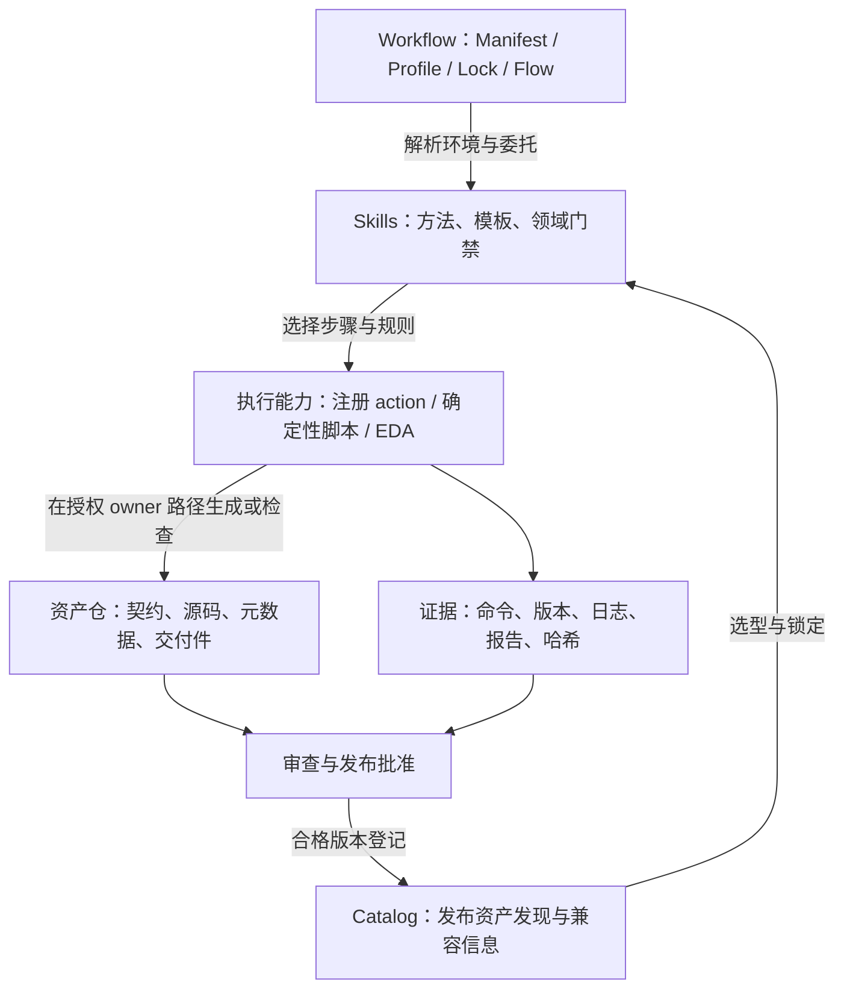
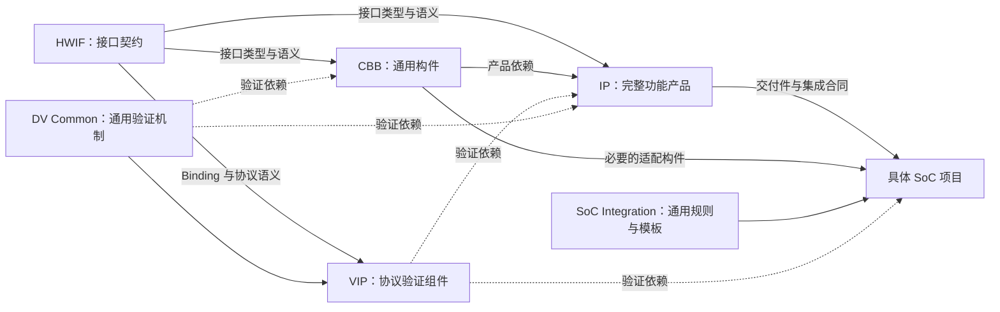

# Workflow 与资产生态

本文解释当前工作区的协作架构，不替代各仓 Schema、索引或 Skill 的研发合同。配置核对基线：2026-09-10；工作区可能含未提交修改，本文不是发布基线证明。

## 三个层次

Workflow 是控制面：管理独立 Git 仓、Manifest/Profile/Lock、执行入口与工作区证据。Skills 定义研发方法和领域门禁；资产仓保存可版本化的事实、实现与交付物。确定性脚本、注册 action 和 EDA 工具承担具体执行。

图中是职责与信息流，不是仓库 clone 顺序，也不表示 CLI 已能自动完成所有发布动作。
私有 tools/skills 不应成为公开交付件消费者必须读取的研发源码；公开交付应说明其实际构建依赖与复现条件。

## 六类核心资产怎样配合

这是代表性消费关系，省略部分连线；完整机器依赖以 [Manifest](../../manifests/default.yaml) 为准。
其中 `dependencies.product / verification / tooling / discovery / context` 区分产品、验证、工具、发现与上下文依赖，不能把它们全部当成可综合 RTL 依赖。

| 问题 | 应由谁回答 | 不应混入的职责 |
|---|---|---|
| 接口信号、方向、时序语义、Profile 是否兼容？ | HWIF | 协议激励、具体桥接逻辑、SoC 谁连谁 |
| 如何记录超时、比较事务、收集运行结果？ | DV Common | AXI 专属规则、具体 DUT RAL、项目测试 |
| 如何产生合法/非法协议事务并证明 Checker 有效？ | VIP | 被测 IP 的 RTL 实现 |
| 如何复用仲裁、FIFO、CDC、位宽/协议适配？ | CBB | 产品 CSR、安全策略、芯片地址分配 |
| 该功能怎样独立集成、配置、验证和发布？ | IP | 在 IP 仓复制已有通用 CBB RTL |
| 谁实例化谁、地址/IRQ/时钟/电源如何分配？ | SoC 项目，消费 SoC Integration 规则 | 把客户配置或产品 Top 放入公共通用仓 |

例如“计时功能”：通用计数核可属于 CBB，带软件寄存器和中断语义的定时器属于 IP，实例基址与 IRQ 编号属于 SoC 项目。分类依据是契约和复用边界，不是 RTL 行数；不是每个简单模块都必须单独建 CBB。

## 控制面不是源码总仓

`repos/` 下十个仓均有独立 Git 历史，父仓整体忽略该目录。父仓提交不包含子仓修改；跨仓变更必须分别评审和提交。

| 对象 | 维护什么 | 不保证什么 |
|---|---|---|
| Manifest | 仓库位置、分支意图、依赖与 Profile | 当前实际 checkout 的精确发布版本 |
| Workspace Lock | 解析后的 SHA 与环境信息 | dirty 工作树内容已被提交或可复现 |
| Flow | stage DAG、输入、注册 action、write_scope | 内部 RTL/验证步骤已执行 |
| Skill | 方法、前置条件、产物 owner 与质量要求 | 安装后自动成为已注册 Flow provider |
| 仓内 registry | 规划/实现/版本/路径索引 | 目录存在即代表 qualified 或 released |
| Catalog | 跨仓发布资产发现与兼容信息 | 替代资产自身源码、证据或研发规划 |

完整所有权规则见 [ownership.md](ownership.md)，实际不一致项见 [当前限制](current-state.md)。

## 阅读下一步

- 查具体仓库和 Skill：[仓库与套件对照](repositories-and-skills.md)。
- 看从变更到消费的过程：[跨仓交付流程](lifecycle.md)。
- 执行日常命令：[操作手册](operations.md)。
