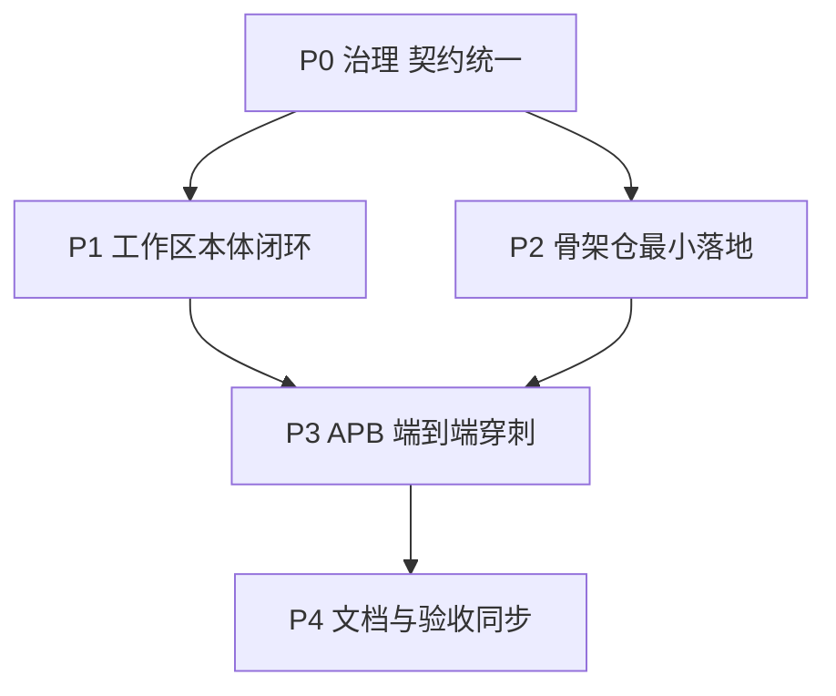

# AIXSILICON 多仓协同优化规划（综合版）

> 依据：[`plan.md`](plan.md)（Workflow 总规划 V0.1）、[`docs/optimization-plan.md`](../archived/optimization-plan.md)（工程化优化）、
> 各资产仓 plan（HWIF / CBB / DV Common / VIP / Tool / Skill）与 README 现状综合整理。
> 目标：以 `aixsilicon_workflow` 为执行主体，先消除跨仓契约冲突，再补齐工作区本体能力，最后打通首条 APB 穿刺链路。

---

## 1. 现状结论

| 仓库 | plan 状态 | 实际建设状态 | 关键问题 |
|---|---|---|---|
| [`aixsilicon_workflow`](plan.md) | V0.1 总规划 | 阶段0/1 基本达成，阶段2 进行中 | runner 动作未实现，release/bundle 部分桩，workflows 占位 |
| [`aixsilicon_hwif_repo`](../../repos/aixsilicon_hwif_repo/plan.md) | V1.0 | 57 接口族建成，工具链落地 | 6 件确定性工具仍在仓内 `tools/`，与 tool_repo 边界冲突 |
| [`aixsilicon_cbb_repo`](../../repos/aixsilicon_cbb_repo/cbb_repo_plan.md) | V1.0 + 清单 | 骨架就绪，内容续增 | VLNV 用 `company:cbb` 占位；引用独立 `cbb-catalog`/`cbb-tech` 仓 |
| [`aixsilicon_ip_repo`](../../repos/aixsilicon_ip_repo/README.md) | 无 plan | 用 `ipkg` 建仓，registry 就绪 | VLNV 用 `boyangwang1991-design:ip`；发布机制与 workflow `aix release` 未对齐 |
| [`aixsilicon_dv_common`](../../repos/aixsilicon_dv_common/plan.md) | V1.0 | P0 底座完成，12/12 测试通过 | 仓名缺 `_repo` 后缀；引用已否决的 `eda-flow`/`eda-rules` 仓 |
| [`aixsilicon_vip_repo`](../../repos/aixsilicon_vip_repo/plan.md) | V1.0 | 规划为主，骨架 | 同上引用幽灵仓；VLNV `aix:vip` 与 hwif/dv 一致 |
| [`aixsilicon_tool_repo`](../../repos/aixsilicon_tool_repo/tool_repo_plan.md) | V0.1（详尽） | 仅 README | CLI `aix tool` 与 workflow `aix` 入口冲突风险；P0 五包未建 |
| [`aixsilicon_catalog_repo`](../../repos/aixsilicon_catalog_repo/README.md) | 仅 README | 骨架 | 资产条目 Schema 未定义 |
| [`aixsilicon_soc_integration`](../../repos/aixsilicon_soc_integration/README.md) | 仅 README | 骨架 | 仓名缺 `_repo` 后缀；通用 SoC Schema 未定义 |
| [`aixsilicon_skill_repo`](../../repos/aixsilicon_skill_repo/skill_repo_plan.md) | V1.0 | 仅 README | 16 个 P0 skill 未落地 |

**核心判断**：`aixsilicon_workflow` 的控制面骨架已经可用，但三类问题制约其成为真正的多仓控制面——

1. **跨仓契约不一致**（VLNV 命名、仓库命名、成熟度词汇、Tool 归属、幽灵仓引用）；
2. **工作区本体能力未闭环**（runner 动作、release/bundle、reusable workflows、退出码）；
3. **四个骨架仓内容空置**（tool/catalog/soc-integration/skill），导致 `aix wf run` 无动作可调、Catalog 无资产可索引、Skill 无契约可写。

---

## 2. 目标架构与责任链

五类稳定契约（对应 [`plan.md`](plan.md:1939) §34）保持不变：Workspace / Dependency / Execution / Collaboration / Evidence。

---

## 3. 发现的跨仓契约冲突与处置

### 3.1 VLNV 命名空间碎片化

| 来源 | 当前写法 | 统一后 |
|---|---|---|
| workflow / hwif / dv / vip plan | `aix:*` | `aixsilicon:*` |
| ip_repo [`ipkg.yaml`](../../repos/aixsilicon_ip_repo/ipkg.yaml:18) | `boyangwang1991-design:ip:*` | `aixsilicon:ip:*` |
| cbb [`cbb_repo_plan.md`](../../repos/aixsilicon_cbb_repo/cbb_repo_plan.md:425) | `company:cbb:*`（占位） | `aixsilicon:cbb:*` |

**决策**：全组织统一采用 `aixsilicon` vendor 前缀（`aix` 过短且有歧义，ADR-0003）。
CLI 二进制名保持 `aix`（作为 `aixsilicon` 命令工具的唯一短入口），命名空间/标识一律使用完整 `aixsilicon`。
GitHub 组织名 `boyangwang1991-design` 仅作为 remote URL 与私有 overlay 的物理归属，不进入 VLNV 语义。

### 3.2 仓库命名后缀不一致

`aixsilicon_dv_common` 与 `aixsilicon_soc_integration` 缺 `_repo` 后缀，其余 7 仓均为 `aixsilicon_*_repo`。
[`plan.md`](plan.md:36) 与 [`ownership-map.yaml`](../../ownership-map.yaml:23) 内部也混用两种写法。

**决策（待确认）**：
- 方案 A：GitHub 重命名两仓为 `aixsilicon_dv_common_repo` / `aixsilicon_soc_integration_repo`（GitHub 自动重定向旧 URL），并同步 manifest/lock/ownership-map/文档。推荐，但需要一次迁移窗口。
- 方案 B：保持现状，在 [`manifests/default.yaml`](../../manifests/default.yaml:58) 与 ownership-map 中固化“无后缀”为正式名，并在 plan.md 中修正引用。零迁移，但命名长期不齐。

### 3.3 成熟度/质量词汇不统一

各仓各用一套：workflow `G0–G7`；hwif `draft/reviewed/qualified/proven`；dv-common `Draft…Qualified`；cbb `E0–E5`；vip `V0–V4`；tool `experimental…production`；skill `experimental/pilot/stable`。

**决策**：Catalog 层只暴露统一外部成熟度（`draft → qualified → proven → deprecated`），各仓内部子状态映射到该外部尺度；workflow 的 `G0–G7` 继续作为跨仓质量 Gate 顺序。

### 3.4 幽灵仓引用

[`aixsilicon_dv_common/plan.md`](../../repos/aixsilicon_dv_common/plan.md:120) 与 [`aixsilicon_vip_repo/plan.md`](../../repos/aixsilicon_vip_repo/plan.md:57) 引用 `eda-flow`、`eda-rules`、`hw-models`；
[`cbb_repo_plan.md`](../../repos/aixsilicon_cbb_repo/cbb_repo_plan.md:449) 引用独立 `cbb-catalog`、`cbb-tech-<node>`。
但 workflow [`plan.md`](plan.md:239) §4.7 已明确否决 `eda_flow_repo`/`eda_rule_repo`，且采用单一 `aixsilicon_catalog_repo` 与 `aixsilicon_techlib_repo`。

**处置**：在 workflow 侧新增 ADR 明确映射——
- `eda-flow` 职责 → workflow（DAG/Gate）＋ tool（result adapter）；
- `eda-rules` 职责 → workflow `policies/`；
- `hw-models` → 待建 `aixsilicon_techlib_repo`/`aixsilicon_model_repo`（P1/P2），IP 强绑定模型暂随 IP 仓；
- `cbb-catalog` → `aixsilicon_catalog_repo`；
- `cbb-tech-<node>` → 私有 overlay 仓。

并同步修订 dv-common / vip / cbb 三个 plan 的引用章节。

### 3.5 Tool 归属与迁移路径

hwif 仓内 [`tools/`](../../repos/aixsilicon_hwif_repo/todo.md:40) 已有 6 件确定性工具（contract_validate / sv_consistency_check / view_generate / compatibility_check / impact_analysis / package_release），
与 tool_repo 规划的 `aix-hwif-gen` 等重叠。

**边界规则**：
- 资产仓 `tools/` 仅保留**仓库自维护脚本**（测试、CI、文档生成）；
- 面向多仓复用的**产品级确定性工具**迁入 `aixsilicon_tool_repo`；
- 迁移路径：先由 workflow 的 action 注册表同时支持“本仓脚本”与“`aix tool` 委托”，待 tool_repo P0 五包落地后切换到 `aix tool`，旧脚本进入 deprecated 窗口。

### 3.6 CLI 入口冲突

[`pyproject.toml`](../../pyproject.toml:38) 已注册 `aix = aixworkflow.cli:main`；tool_repo 规划 `aix tool <domain>`。
两个包若同时注册 `aix` 会产生入口冲突。

**决策**：保留 `aix` 为唯一总入口（workflow 提供），tool_repo 通过插件组 `aixsilicon.commands` 暴露 `aix tool` 域；未安装 tool_repo 时 `aix tool` 明确提示 `OPTIONAL_UNAVAILABLE`。这与 manifest 中 skill 的 `OPTIONAL_UNAVAILABLE` 语义一致。

### 3.7 退出码契约

workflow [`errors.py`](../../src/aixworkflow/errors.py) 已定义错误类，但 runner 目前一律 `exit_code=1`；tool_repo 定义了 `0 / 10–19 / 20–29 / 30–39 / 40–49 / 50–59 / 60–69` 分段。

**决策**：workflow 采纳 tool_repo 的退出码分段，并在 `errors.py` 与 runner 中映射：设计失败（20–29）与环境失败（30–39）必须可区分，对应 [`plan.md`](plan.md:1626) §25 的要求。

---

## 4. 工作区本体优化（当前项目）

围绕 [`docs/optimization-plan.md`](../archived/optimization-plan.md) 已完成的 S1–S4 结构重构，继续推进剩余闭环：

1. **runner 标准 action 集**：在 [`runner.py`](../../src/aixworkflow/runner.py:27) 的 `ActionRegistry` 中注册
   `workspace.resolve` / `fusesoc.target` / `hwif.compatibility-check` / `eda.regression` / `evidence.index` / `release.package`，
   实现为对 `aix tool`（未装时对仓内脚本）的委托，并记录工具版本与 Result。
2. **impact.py 规则化**：移除 [`impact.py`](../../src/aixworkflow/impact.py:39) 中硬编码的 `gate_map`，
   改为读取 [`policies/dependency-policy.yaml`](../../policies/dependency-policy.yaml) 的 gate 映射。
3. **release/bundle 补齐**：`aix release prepare/publish` 幂等 + dirty/override 阻断；`aix bundle create` 从模板生成并校验状态机。
4. **reusable workflows 真实化**：将 5 个 `.github/workflows/reusable-*.yml` 与 `integration-baseline.yml`、`change-bundle.yml` 从 `echo` 占位替换为真实命令，并固定 Tag `v0.1` 引用。
5. **pre-commit 落地**：执行 `pre-commit install`，CI 中把 [`guard_runtime_paths.py`](../../scripts/hooks/guard_runtime_paths.py) 的 `|| true` 改为硬失败。
6. **FuseSoC 实跑**：安装 fusesoc 2.4，验证 [`fusesoc.py`](../../src/aixworkflow/fusesoc.py) 生成的 VLNV 索引能发现 9 仓全部 core，修正发现的冲突/遮蔽。
7. **工具版本锁**：扩展 [`workspace-lock.schema.json`](../../schemas/workspace-lock.schema.json)，增加 `tools:` 段记录 tool_repo 包版本与 hash。

---

## 5. 骨架仓最小落地与首条穿刺

- **tool_repo P0 五包**：`aix-tool-core`（Result/Diagnostic/Artifact）+ `aix-schema` + `aix-hwif-gen` + `aix-reg-tool` + `aix-core-tool`，足以跑通 IP 闭环。
- **catalog_repo**：资产条目 Schema V0.1 + 首批 IP/HWIF/DV Common 条目。
- **soc_integration_repo**：通用 SoC 配置 Schema 边界 + 最小 Golden 示例。
- **skill_repo**：canonical `ip-development-suite`（21 子 skill、G0–G5、canonical 模型驱动、UVM 1.2、8 个 eval）。
- **ip_repo**：补齐 plan.md，registry 对齐 `aixsilicon:ip:*` 与 catalog 条目。
- **APB 穿刺**：HWIF `apb` → SystemRDL/PeakRDL RAL → IP RTL → APB VIP → DV Common → Evidence → Catalog 条目，一次验证六类契约。

---

## 6. 关键决策点（需要 Owner 确认）

| # | 决策 | 选项 | 建议 |
|---|---|---|---|
| D1 | VLNV 统一 `aixsilicon:*` | 统一 / 保留组织名 | 统一 |
| D2 | 两仓是否重命名加 `_repo` | A 重命名 / B 固化现状 | A（重命名，GitHub 自动重定向） |
| D3 | 成熟度对外统一 | 单一尺度 / 各仓自治+映射 | 映射到统一外部尺度 |
| D4 | CLI 单一 `aix` 入口 + 插件组 | 单入口 / 双入口 | 单入口 |
| D5 | hwif 六件工具迁入 tool_repo | 迁移 / 保留 | 分阶段迁移 |

---

## 7. 执行顺序

顺序理由：先冻结契约（D1–D5），避免在错误命名/边界上继续堆代码；随后 workflow 本体与骨架仓可并行推进；两者在 APB 穿刺处汇合，最终统一同步文档与验收。
