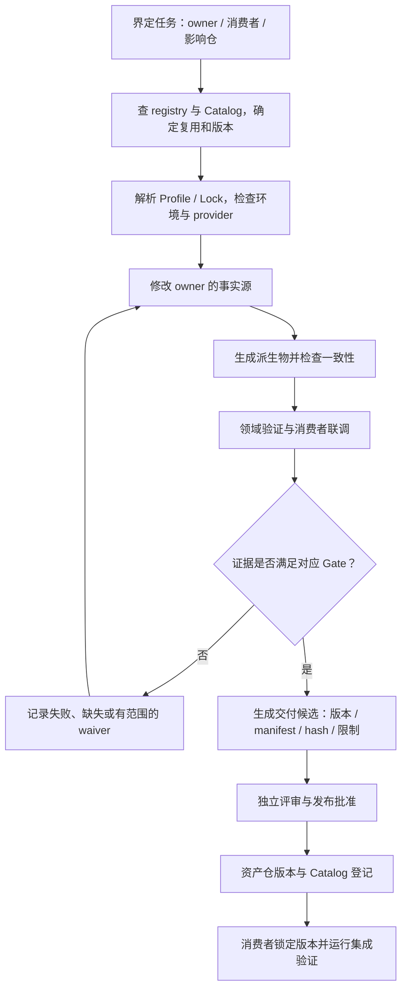

# 跨仓开发、验证与交付

本文描述交接点，不复制各 Skill 的完整阶段规范。工作区可用、代码存在、测试通过、认证通过、发布完成是不同状态。

## 从需求到消费

箭头表示工程责任链，不承诺 `aix wf run` 自动完成每一步。提交、推送、远端发布必须有相应授权。

## 当前三条标准 Flow

| Flow 文件 | 必需领域 action | 核心领域输入 | 方法 owner |
|---|---|---|---|
| [ip-development](../../workflows/ip-development.yaml) | `skill.ip.design` | `ip_name` | IP suite |
| [cbb-development](../../workflows/cbb-development.yaml) | `skill.cbb.design` | `cbb_vlnv` | CBB suite |
| [soc-integration](../../workflows/soc-integration.yaml) | `skill.soc.integration` | `soc_project` | SoC suite |

共同骨架为 `resolve → workspace-prepare → 领域委托 → evidence`，共同输入还包括 `profile`、`mode`、`tool_profile`。
三条 Flow 均声明 `lock_required: true`。准备阶段复用 `workspace.resolve`，不能仅凭阶段名称认定已创建隔离 worktree 或新项目仓。
HWIF、VIP、DV Common 当前没有同名标准 Flow YAML；通过对应套件/仓内检查入口工作，不臆造 `aix wf run vip-development`。

领域 action 为 required；未注册 provider 时 preflight 应阻断。只有 stage 显式 `optional: true` 才允许该 stage 因能力不可用而跳过。
领域 Gate 的可选性、Waiver 与 stage 的 optional 是不同机制，不能混用。

## 典型协作案例：带 APB 配置接口的功能 IP

1. IP owner 先描述外部功能、CSR 行为、中断与错误语义；查重后明确哪些只是通用机制。
2. 从 HWIF 选择匹配的 APB 契约/Profile；缺少的接口能力先回 HWIF owner 评估兼容性，不在 IP/VIP 中私自改信号语义。
3. 仲裁、缓冲或 CDC 机制优先消费 CBB；没有合适实现时，先确定复用价值，再在 CBB 域开发和验证。
4. IP 环境消费 DV Common 的通用运行/比较机制以及可用 VIP 的协议激励/检查；VIP 自验证与 IP 功能验证分别留证。尚未 qualified 的 VIP 不得被描述为认证依赖。
5. 按 IP suite 从设计文档生成模型，维护 SystemRDL，执行 RTL/验证/追踪/质量检查，输出候选包和集成指南。
6. SoC 项目锁定 IP 版本，分配基址/IRQ/时钟复位，检查连接、Tie-off、CDC/RDC 和启动软件视图；产品配置不写入公共 SoC Integration 仓。

这是方法示例，不声明上述所有资产当前已认证可用。实际资产状态查看各仓 registry、质量报告与版本锁。

## 入库交接不能省略的检查

| 交接 | 必查内容 |
|---|---|
| HWIF → CBB/IP/VIP | 契约版本、角色/Profile/Binding、参数兼容；不兼容必须显式失败或选有证据的 Adapter |
| CBB suite → CBB repo | 索引 ID 与资产 VLNV 分开；registry 与 `cbb.yaml` name/version 一致；`stage --dry-run` 先检查，导入不自动升级状态 |
| IP suite → IP repo | 按 `registry.path` 恢复存量工程；新工程根 `.core`、`ip-package.yaml` 与索引身份一致；修改索引生成源而非只改派生 registry |
| VIP suite → VIP repo | Profile、HWIF 依赖、Self Test、覆盖率、Mutation、Qualification 与包清单一致；不以目录存在认定准入 |
| IP/CBB → SoC | 版本与哈希锁定、支持参数范围、时钟复位/错误模型、限制与 waiver；消费者需要重新做系统上下文验证 |

当前 IP 打包器区分 `_candidate` 与 formal；formal 检查干净且已提交源码，并只读重算质量证据，拒绝旧质量结论与当前输入不一致的包。已有同名输出不会自动覆盖。打包不等同 registry 状态提升、Git tag、push 或 Catalog 发布。

## Gate 编号只在域内有意义

| 领域 | 当前套件 Gate | 关键区别 |
|---|---|---|
| HWIF | G0–G5 | 契约、多视图、一致性、兼容、Core 与打包 |
| CBB | G0–G8 | Intake、契约、架构、静态、功能、配置空间、PPA、Qualification、Release |
| IP | G0–G5 | LRS、HLD、LLD/Register Freeze、RTL、Verification、Release Ready |
| VIP | G0–G6 | Requirement、Architecture、Code、Self-Verification、Coverage、Qualification、Release |
| SoC | G1–G8 | 需求架构、资源连接、IP 准入、集成 RTL、静态、动态、追踪质量、发布 |

上表是阅读索引，详细判定以 [各套件](repositories-and-skills.md) 为准。Flow 的 G0/G1 不等于 IP/SoC 全域门禁通过。
CBB 成熟度 `E0–E5` 与 PPA 证据等级 `PPA-E0–PPA-E3` 是不同维度；一次综合结果不能代替功能认证。

## 变更传播与证据

跨仓变更先列影响仓、兼容性变化、依赖版本和合入顺序，各仓独立评审；联合验证用同一组明确版本。
上游契约、参数或设计源改变后，重新生成受影响视图，再重跑消费者测试和 trace/指纹，最后重新评估质量。
`aix wf test --affected` 提供影响分析，不代表已经运行硬件回归；图不完整时扩大验证范围。

每份质量结论至少可追到资产身份、源码/输入版本、工具/配置、命令、退出状态、日志/报告与哈希。
缺工具与许可证记录 blocked/not-run；有 waiver 时写清 owner、范围、替代证据与失效条件，不能简单改为 pass。
公开证据要脱敏，不包含 PDK、许可证路径、凭据或客户数据。
