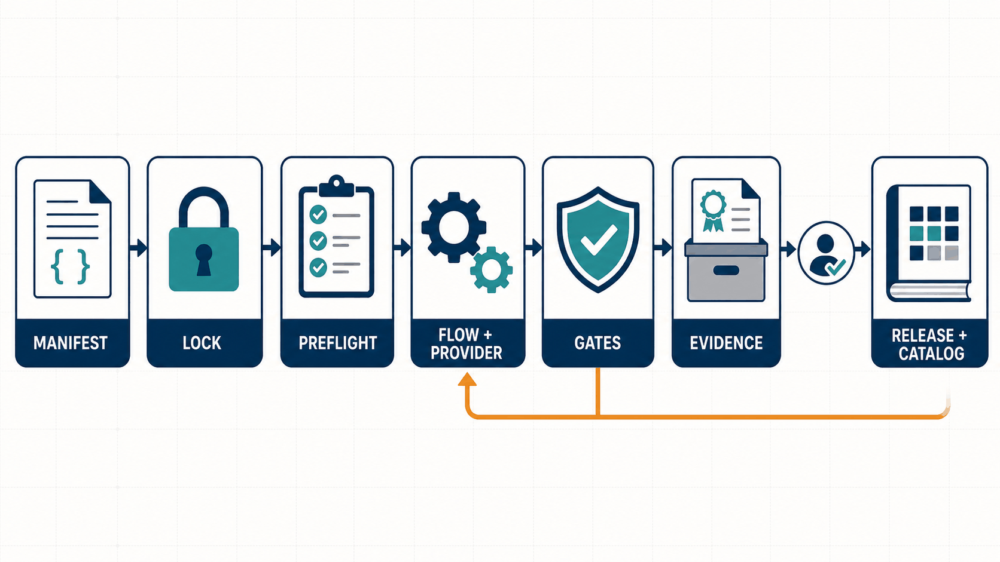

# 发布与基线治理



概念图展示目标发布闭环：配置先被解析和锁定，能力预检后才执行 Flow；Gate 失败返回执行层修正，只有 Evidence 完整并经人工批准后才能进入 Release 与 Catalog。图片不表示这些能力当前均已实现，实施状态以 [`../progress.md`](../progress.md) 为准。

## 发布子流程

```text
候选版本选择
→ Clean/Locked 环境确认
→ IP Qualification（G0~G6）
→ 文档/RTM/Manifest/SBOM 检查
→ 版本与 CHANGELOG 检查
→ 人工批准并判定 Release Readiness（G7）
→ 对应 IP 仓 Tag/Release
→ Catalog 更新 PR
→ Release Bundle 留证
```

## 发布 Gate（Release Readiness，G7）

- SemVer 与变更类型一致；
- CHANGELOG、文档、SBOM 和许可证完整；
- 所有仓库 clean 且固定 SHA；
- 无本地 override；
- 受保护环境人工批准完成；
- Catalog 更新内容已生成并 Review。

## 版本策略

- 每个资产仓独立使用 SemVer（HWIF 按 Contract 兼容性、VIP 按协议能力、IP 按交付兼容性等）；
- 可发布 `aix-workspace-bundle` 兼容组合，只包含 Lockfile、兼容矩阵、Tool Profile、Qualification Evidence 索引、Release Notes；
- Bundle 不重新打包所有源码，也不改变各仓 Release。

## Baseline 更新

```text
候选依赖版本
→ 解析候选 Lock
→ 全量兼容检查
→ 代表性回归
→ PR Review
→ 更新 baseline.lock.yaml
→ 发布 Bundle（里程碑时）
```

## 三类锁文件

| 类型 | 是否入库 | 用途 |
|---|---|---:|
| `baseline.lock.yaml` | 是 | 团队默认集成基线，受 PR 和 CI 保护 |
| `releases/*.lock.yaml` | 是 | 正式 Bundle/项目里程碑，不允许原地修改 |
| `.aix/local.lock.yaml` | 否 | 开发者当前解析结果，可包含本地分支 |

## 幂等与并发

- 发布动作必须幂等，可检测“已发布”而不是重复创建；
- 并发 Release 使用互斥组（GitHub Actions `concurrency`），防止同一资产重复发布；
- 发布需要 protected environment 人工批准；
- Fork PR 不得获得组织 Secret。

## 结果与证据体系

每次执行的标准目录：

```text
reports/<run-id>/
├── run_manifest.yaml
├── workspace_lock.yaml
├── evidence_index.yaml
├── status.json
├── summary.md
├── stages/
├── logs/
├── reports/
└── artifacts/
```

Run Manifest 必须记录：Run ID、correlation ID 和触发来源；Workflow 名称与版本；Manifest digest 和完整 resolved Lock；所有仓库 SHA、dirty 状态和 override；所有输入参数；工具/容器/EDA 版本；随机种子；各 Stage 命令摘要、开始/结束时间和退出码；Gate 结论、Failure Signature；Artifact Hash 和存储引用；人工批准记录。

Evidence 分级：

| 等级 | 用途 | 保存策略 |
|---|---|---|
| E0 本地开发 | 快速调试 | 本地、短期、可清理 |
| E1 PR 验证 | Code Review | CI Artifact，按组织周期保留 |
| E2 Qualification | 资产合格 | 与候选版本关联，不可静默覆盖 |
| E3 Release/Signoff | 正式交付 | Manifest、Hash、SBOM、RTM 和批准完整留存 |

正式证据需要发布时，由命令将经过筛选的 Evidence 打包到 Release 存储或对应资产仓的发布记录中，不能直接把整个运行目录提交到 Workflow Repo。

## Release Bundle 留证

- Release Bundle 记录所有最终 SHA 和对应 Release；
- Bundle 文件不保存访问 Token；
- 发布动作幂等，可检测“已发布”而不是重复创建；
- 同一起 Run 中固定 Manifest、Lock、工具 Profile 和环境摘要，保证重跑可关联原 Run ID。

## 统一成熟度

Gate 描述一次执行是否满足条件；成熟度描述资产能否被项目消费，两者通过 Evidence 关联但不能互换。

| 外部成熟度 | 含义 | Catalog/项目策略 |
|---|---|---|
| `draft` | 需求/语义讨论中或代码为实验 | 禁止正式项目依赖 |
| `qualified` | 完成规定 Gate，契约冻结 | 允许正式项目使用 |
| `proven` | 至少两个独立真实项目/场景验证 | Catalog 默认推荐 |
| `deprecated` | 已有替代并进入迁移窗口 | 禁止新项目使用 |

各仓可保留内部子状态，但 Catalog 只记录上述外部尺度：

| 仓域 | 内部示例 | 外部映射原则 |
|---|---|---|
| hwif | draft/reviewed/qualified/proven/deprecated | reviewed 是 qualified 前置，不直接对外发布 |
| dv-common | Draft/Experimental/Candidate/Qualified/Deprecated/Retired | Candidate/Qualified → qualified；Retired → deprecated |
| cbb | E0 Concept～E5 Proven | E0/E1 → draft；E2/E3 → qualified；E4/E5 → proven |
| vip | V0 Prototype～V4 Proven | V0 → draft；V1～V3 → qualified；V4 → proven |
| tools | experimental/preview/qualified/production/deprecated/retired | preview 前为 draft；production 可在真实复用后升 proven |
| skills | experimental/pilot/stable/deprecated/retired | 不参与确定性 Gate；仅描述辅助能力成熟度 |

成熟度升级必须带 Release Manifest、质量报告或项目复用 Evidence；禁止无证据从 `draft` 直接声明 `qualified`。
