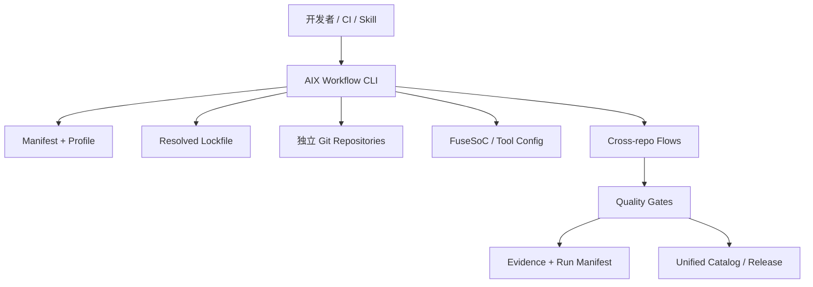
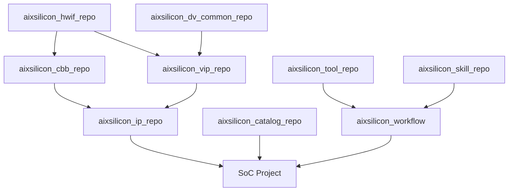

# AIXSILICON Workflow Repository 完整规划

> 文档状态：规划基线 V0.1  
> 日期：2026-08-13  
> 适用范围：IP 设计、IP 验证、SoC 集成、多仓协同、Skill Suite 执行与资产发布

---

## 1. 建设结论

`aixsilicon_workflow` 应定位为 AIXSILICON 硬件工程资产体系的“多仓工作区控制面”，而不是新的源码汇总仓、镜像仓或最终 SoC 工程仓。

它统一解决六类问题：

1. 按清单把多个 Git 仓库下载到固定目录；
2. 让每个子仓继续保持独立 Git 历史、分支、PR、Tag 和 Release；
3. 用 Manifest 与 Lockfile描述“需要哪些仓库”和“本次实际用了哪个提交”；
4. 自动生成 FuseSoC libraries、工具配置与开发态本地覆盖；
5. 执行跨仓依赖检查、影响分析、联合验证与发布协调；
6. 为 Skill Suite 提供统一、可发现、可复现、可留证的执行环境。

推荐技术形态：

> **Manifest 驱动的多仓工作区 + 独立 Git Clone + 统一 Python CLI + FuseSoC 聚合配置 + Change Bundle + GitHub Actions 协调层**

默认不采用 Git Submodule。子仓统一克隆到 `repos/`，而 `repos/` 被父仓 `.gitignore` 完整忽略；父仓只版本化 Manifest、Lockfile、Schema、流程定义、公共 CI、脚本和文档。

---

## 2. 为什么需要独立 Workflow Repo

现有仓库分别解决了“资产本身是什么”。所有公共平台仓统一使用`aixsilicon_`前缀：

| 仓库 | 主要职责 |
|---|---|
| `aixsilicon_ip_repo` | IP RTL、CSR、IP级文档、IP级验证资产与交付定义 |
| `aixsilicon_hwif_repo` | YAML接口契约、SV类型/interface/flat-port视图、接口兼容性信息 |
| `aixsilicon_dv_common_repo` | 协议无关的UVM基础设施、运行服务、RAL公共机制、结果Schema |
| `aixsilicon_vip_repo` | 协议事务、Agent、BFM、Monitor、Checker、Coverage与协议Sequence |
| `aixsilicon_skill_repo` | RTL Coding、UVM Verification、IP Release、SoC Integration等核心Skill；私有 |

但仍缺少一个仓库回答以下问题：

- 新成员如何一次得到完整、正确的开发环境？
- 哪些版本的 HWIF、DV Common、VIP 和 IP 可以一起使用？
- 本地正在开发的 HWIF 如何临时让 VIP 和 IP 使用？
- 一次跨仓功能修改涉及哪些分支、PR和合并顺序？
- 某个 IP 发布前应执行哪些跨仓验证？
- Skill 应从哪里找到输入、输出到哪里、使用哪一版工具和依赖？
- SoC 项目如何重建某个历史集成基线？

`aixsilicon_workflow` 就是这些问题的统一答案。

---

## 3. 仓库边界

### 3.1 本仓库负责

- 多仓 Manifest、Profile、Lockfile 与 Schema；
- clone、fetch、sync、checkout、status、doctor、foreach 等工作区命令；
- 本地仓库目录布局和 `.gitignore` 保护；
- FuseSoC `fusesoc.conf`、core roots、聚合 target 的生成；
- 跨仓依赖图、兼容性检查和影响分析；
- 跨仓 Change Bundle 与联合验证；
- IP开发、验证、集成、发布等工作流定义；
- 组织级可复用 GitHub Actions workflow/action；
- 工具链 Profile、容器/环境定义及版本锁定；
- 统一输出目录、Run Manifest、Evidence Index；
- Release Train和Unified Catalog更新协调；
- Skill执行入口和权限边界。

### 3.2 本仓库不负责

- 不保存 IP、VIP、HWIF、DV Common 的正式源码副本；
- 不替代各资产仓库的 Issue、PR、Review、Tag 和 Release；
- 不成为最终产品 SoC Top 的事实源；
- 不保存具体 IP 的 SystemRDL、RTL、UVM环境和设计文档；
- 不把所有 EDA 脚本无边界地塞入本仓；
- 不绕过资产仓自身的质量 Gate；
- 不自动替用户提交、推送、打Tag或发布；
- 不在 Lockfile、日志或报告中保存凭据；
- 不允许 AI 直接决定未知接口、版本兼容性或 Signoff 结论。

### 3.3 与 Catalog 的边界

`Workflow` 与 `Unified Catalog` 不是同一个概念：

| 对象 | 回答的问题 |
|---|---|
| Unified Catalog | 已发布了哪些可复用资产，版本、VLNV、成熟度和兼容性是什么 |
| Workspace Manifest | 当前工作区需要克隆哪些 Git 仓库，放在哪里，使用何种开发分支或版本策略 |
| Workspace Lockfile | 本次实际解析到了哪些 Git SHA、VLNV、工具版本和生成器版本 |
| Change Bundle | 本次跨仓变更由哪些分支/PR组成，验证和合并顺序是什么 |
| Release Manifest | 某个正式发布包含什么内容，证据、SBOM、Hash和签名是什么 |

Workflow 可以消费和更新 Catalog，但不能让本地开发 Manifest 取代发布 Catalog。

### 3.4 开源与私有边界

整体采用“公共工程底座开源、核心AI方法与项目资产私有”的双层模式：

| 内容 | 默认属性 | 原因 |
|---|---|---|
| HWIF、CBB、公共IP、VIP、DV Common | 开源 | 形成可复用硬件与验证生态 |
| Workflow、Tool、Catalog、通用SoC Integration框架 | 开源 | 让工程链条可复现、可贡献 |
| `aixsilicon_skill_repo` | **私有** | 保存核心Prompt、方法论、Agent编排和组织知识 |
| 具体商业芯片SoC项目仓 | **私有** | 包含产品配置、未公开IP和项目进度 |
| 未公开IP/CBB/VIP | **私有或私有Overlay** | 受商业、客户和出口约束 |
| Foundry/PDK/Memory Macro适配 | **私有** | 工艺NDA和授权限制 |
| 商业EDA配置、License、路径 | **私有** | 许可证及内部基础设施信息 |
| 项目Waiver、Signoff例外、缺陷数据 | **私有** | 可能暴露设计和质量信息 |

因此，“除Skill外其他仓库开源”应理解为：**AIXSILICON平台的通用基线仓开源；任何受NDA、产品、Foundry或许可证约束的内容，通过私有项目仓/Overlay接入。**

公共Workflow必须在没有私有Skill的情况下也能运行确定性基础流程。私有Skill是能力增强层，而不能成为开源仓完成构建、测试和发布验证的隐藏必需依赖。

---

## 4. 完整仓库生态查漏补缺

### 4.1 推荐的完整仓库清单

| 仓库 | 定位 | 开放性 | 建设优先级 |
|---|---|---:|---:|
| `aixsilicon_hwif_repo` | 接口语义契约与HDL多视图 | 开源 | 已有/P0 |
| `aixsilicon_cbb_repo` | 可参数化公共逻辑构件与PPA实现 | 开源 | **新增/P0** |
| `aixsilicon_ip_repo` | 可独立集成和发布的完整IP | 开源基线 | 已有/P0 |
| `aixsilicon_dv_common_repo` | 协议无关验证公共底座 | 开源 | 已有/P0 |
| `aixsilicon_vip_repo` | 协议与系统验证组件 | 开源 | 已有/P0 |
| `aixsilicon_tool_repo` | 确定性生成、检查、转换、打包工具 | 开源基线 | **新增/P0** |
| `aixsilicon_catalog_repo` | 已发布资产索引、兼容矩阵和成熟度 | 开源 | **新增/P0** |
| `aixsilicon_soc_integration_repo` | 通用SoC集成Schema、模板、规则和参考配置 | 开源 | **新增/P0** |
| `aixsilicon_workflow` | 多仓工作区、流程DAG、Gate、Evidence与发布协调 | 开源 | 本规划/P0 |
| `aixsilicon_skill_repo` | AI辅助研发Skill Suite与核心方法论 | **私有** | 已有/P0 |
| `aixsilicon_techlib_repo` | Generic/FPGA工艺抽象与公开适配 | 开源基线 | 新增/P1 |
| `aixsilicon_model_repo` | 跨IP共享参考模型、存储/外设模型、DPI适配 | 开源 | 按需/P1 |
| `aixsilicon_sw_repo` | BSP、Boot、HAL、驱动、SoC Smoke Firmware | 开源基线 | 新增/P1 |
| `aixsilicon_reference_soc_repo` | 可运行的最小SoC与FPGA参考工程 | 开源 | 新增/P2 |

另有两类不属于公共仓库体系、但Workflow必须支持的私有仓：

- `chip_<project>_soc_repo`：某颗芯片的SoC YAML SSOT、IP实例、地址、中断、CRG、Power、Top和项目证据；
- `<domain>_private_overlay_repo`：私有IP、工艺宏、商业EDA Profile、项目规则和Waiver。

### 4.2 必须补齐：`aixsilicon_cbb_repo`

CBB不能继续隐含在IP Repo中。IP与CBB在生命周期、验证方法和PPA目标上不同：

| 维度 | CBB | IP |
|---|---|---|
| 粒度 | FIFO、CDC、仲裁、位宽转换、ECC等构件 | DMA、PIC、X2X、UART等完整功能单元 |
| 集成方式 | 被其他CBB/IP直接依赖 | 作为SoC可独立实例化单元 |
| CSR/中断 | 通常没有 | 通常存在或具有系统可见行为 |
| 验证重点 | 参数空间、形式属性、边界条件、等价性 | 功能场景、寄存器、协议、性能和系统行为 |
| PPA | 核心发布属性，应按参数/工艺画像 | 以配置和系统目标为主 |
| 版本影响 | 影响大量下游资产 | 影响集成该IP的项目 |

推荐首批CBB：同步器、异步FIFO、同步FIFO、Round-robin Arbiter、Priority Encoder、Skid Buffer、Ready/Valid Slice、Pulse/Level转换、位宽转换、ECC/Parity、Clock/Reset辅助构件。

### 4.3 必须补齐：`aixsilicon_tool_repo`

Tool Repo保存“确定性执行能力”，解决过去脚本散落在IP、Skill和Workflow中的问题。

推荐内容：

```text
aixsilicon_tool_repo/
├── packages/
│   ├── aix-schema/            # YAML/JSON Schema校验与迁移
│   ├── aix-hwif-gen/          # Contract → SV package/interface/flat wrapper
│   ├── aix-reg-gen/           # SystemRDL/PeakRDL封装与一致性检查
│   ├── aix-core-gen/          # FuseSoC Core生成/校验
│   ├── aix-socgen/            # Top/地址/中断/CRG/互联配置生成
│   ├── aix-connect-check/      # Connectivity与接口兼容检查
│   ├── aix-dv-gen/             # RAL、TB骨架、testlist等确定性派生
│   ├── aix-ppa-bench/          # CBB/IP参数化PPA Sweep与归一化
│   ├── aix-rtm/                # 需求追踪与Evidence索引
│   ├── aix-package/            # Manifest/SBOM/Release包
│   └── aix-report/             # EDA报告归一化
├── fusesoc_generators/
├── schemas/
├── adapters/
├── tests/
└── examples/
```

Tool Repo与其他仓库的边界：

- Tool保存“怎么确定性生成/检查”，不保存某个IP的事实；
- Workflow保存“先运行什么、后运行什么、什么算通过”；
- Skill保存“如何由AI理解、生成、解释和选择流程”；
- HWIF/IP/CBB/SoC项目仓保存SSOT和正式生成物；
- EDA工具二进制、许可证和内部服务器地址不进入开源Tool Repo；
- 每个Tool独立SemVer、测试和CLI契约，Workflow通过版本锁调用。

### 4.4 必须补齐：`aixsilicon_catalog_repo`

Catalog从Workflow Repo独立出来更合适，因为它是所有消费者共享的“发布资产目录”，生命周期不同于流程代码。

Catalog至少索引：

```text
IP / CBB / VIP / HWIF / DV Common / Techlib / Model / Tool / Workflow / Reference SoC
```

每项包含：VLNV或Package ID、Git URL、Release Tag、Commit SHA、SemVer、依赖、兼容矩阵、成熟度、许可证、Owner、质量摘要和Evidence引用。

### 4.5 必须补齐：`aixsilicon_soc_integration_repo`

该仓保存通用SoC集成领域资产，而非具体产品Top：

- SoC、Subsystem、IP Instance、Address Map、Interrupt、Clock/Reset、Power Domain Schema；
- 端口连接、Tied-off、Default Slave、Timeout、CDC/RDC等集成规则；
- 总线、PIC、CRG、域隔离等集成模板；
- SoC配置分域拆分规范；
- SoCGen输入输出契约；
- 集成级Assertion与Connectivity规则定义；
- 最小示例配置和Golden输出；
- 集成签核Checklist。

生成器实现归`aixsilicon_tool_repo`，流程DAG归`aixsilicon_workflow`，具体芯片配置归私有`chip_<project>_soc_repo`。

### 4.6 建议补齐：Techlib、Model与Software

`aixsilicon_techlib_repo`解决CBB/IP的工艺可移植性：

- 开源部分：generic RTL、FPGA映射、ICG/SRAM/ROM/同步器抽象wrapper；
- 私有Overlay：Foundry cell、Memory compiler输出、PDK名称映射和Signoff模型。

`aixsilicon_model_repo`只存放真正跨多个IP共享的模型。与某个IP强绑定的Golden Model应跟随IP仓版本，避免模型与RTL兼容关系失控。

`aixsilicon_sw_repo`为SoC集成提供Boot/Smoke所必需的软件侧资产；CSR Header、地址表、IRQ编号和Device Tree应从SystemRDL/SoC YAML确定性生成。

### 4.7 暂不单独建仓的内容

| 候选仓 | 当前处理方式 |
|---|---|
| `aixsilicon_eda_flow_repo` | 通用Flow放Workflow；确定性适配器放Tool；私有EDA Profile放Overlay |
| `aixsilicon_rule_repo` | 公共Policy放Workflow/Soc Integration；项目Waiver留在项目私仓 |
| `aixsilicon_doc_repo` | 文档跟随所属资产；跨仓门户由Catalog/AIXSILICON平台生成 |
| `aixsilicon_formal_repo` | 协议属性归VIP，CBB属性归CBB，公共Runner归Tool/Workflow |
| `aixsilicon_coverage_repo` | 协议Coverage归VIP，IP Coverage归IP，公共机制归DV Common |
| `aixsilicon_generated_repo` | 禁止建立；生成物必须跟随SSOT、Manifest和Owner |

### 4.8 三种核心能力的责任公式

整个体系应坚持：

> **Skill决定“如何理解与辅助” → Workflow决定“按什么顺序执行和判定” → Tool负责“确定性生成与检查” → Asset Repo保存“事实、源码和正式交付” → Catalog负责“发布发现与兼容选择”。**

---

## 5. 总体架构



架构分为六层：

| 层 | 内容 | 主要输出 |
|---|---|---|
| L0 工作区层 | 目录、clone、sync、状态、缓存 | 本地一致工作区 |
| L1 配置层 | Manifest、Profile、Lock、Override | 可解析依赖基线 |
| L2 资产发现层 | FuseSoC roots、VLNV、Catalog | 可构建资产图 |
| L3 流程编排层 | develop、verify、integrate、release | 标准化任务DAG |
| L4 质量与证据层 | Gate、RTM、报告、Hash、SBOM | 结构化判定证据 |
| L5 协作与发布层 | PR、Change Bundle、Release Train | 可审计多仓协作 |

---

## 6. 仓库组织方案选型

### 6.1 推荐：Manifest + 独立 Clone

推荐理由：

- 子仓就是普通Git仓库，可直接使用原有分支、commit、push和PR；
- 父仓不跟踪子仓内容，也不需要为每次子仓提交更新指针；
- Manifest可描述开发分支，Lockfile可记录不可变SHA；
- 可以只同步特定Profile，例如仅IP开发或仅VIP开发；
- 适合构建影响分析、依赖拓扑和Release Train；
- 与FuseSoC多Core Library模型自然匹配。

Google `repo` 的 Manifest 机制证明了“版本化清单管理多个独立仓库”的可行性；但AIXSILICON一期建议使用更贴合现有YAML SSOT体系的轻量自研CLI，而不是直接引入XML Manifest和完整 `repo` 命令语义。参考：[repo Manifest Format](https://gerrit.googlesource.com/git-repo/+/HEAD/docs/manifest-format.md)。

### 6.2 为什么不默认使用Submodule

Git Submodule可以让子仓保留独立历史，并让父仓记录一个确定提交，因此适合“产品基线引用固定依赖”。但它会把子仓指针变化变成父仓变化，开发者容易遇到 detached HEAD、指针更新遗漏、递归操作和PR噪声。

本项目需要频繁在多个基础仓之间开发和联调，因此不把Submodule作为日常工作区默认方案。官方语义参见：[Git Submodule Documentation](https://git-scm.com/docs/git-submodule)。

### 6.3 不推荐的其他方案

| 方案 | 结论 | 原因 |
|---|---|---|
| 把所有仓库复制到Workflow并提交 | 禁止 | 形成双事实源、历史重复、发布边界消失 |
| Git Subtree | 不推荐 | 上游同步和历史处理复杂，不适合高频双向协作 |
| 仅靠Shell脚本clone main | 不足 | 无Schema、无版本锁、无依赖图、不可复现 |
| 只依赖FuseSoC远程下载 | 不足 | 适合消费发布Core，不适合多仓源码开发和PR协同 |
| 所有资产改成Monorepo | 当前不采用 | 破坏已经形成的资产责任、授权与发布边界 |

---

## 7. 推荐目录结构

```text
aixsilicon_workflow/
├── README.md
├── LICENSE
├── CHANGELOG.md
├── pyproject.toml
├── .gitignore
├── .editorconfig
├── .pre-commit-config.yaml
│
├── manifests/
│   ├── default.yaml
│   ├── minimal.yaml
│   ├── ip-dev.yaml
│   ├── dv-dev.yaml
│   ├── soc-integration.yaml
│   └── release.yaml
├── locks/
│   ├── baseline.lock.yaml
│   └── releases/
│       └── aix-bundle-1.0.0.lock.yaml
├── overrides/
│   └── README.md
├── schemas/
│   ├── workspace-manifest.schema.json
│   ├── workspace-lock.schema.json
│   ├── change-bundle.schema.json
│   ├── flow.schema.json
│   ├── tool-profile.schema.json
│   └── evidence-index.schema.json
│
├── workflows/
│   ├── ip-development.yaml
│   ├── vip-development.yaml
│   ├── hwif-change.yaml
│   ├── ip-verification.yaml
│   ├── soc-integration.yaml
│   ├── cross-repo-qualification.yaml
│   └── release-train.yaml
├── changesets/
│   ├── README.md
│   └── examples/
├── policies/
│   ├── dependency-policy.yaml
│   ├── compatibility-policy.yaml
│   ├── branch-policy.yaml
│   ├── release-policy.yaml
│   ├── evidence-policy.yaml
│   └── security-policy.yaml
├── toolchains/
│   ├── open-source.yaml
│   ├── blue-zone.yaml
│   ├── red-zone.yaml
│   └── containers/
├── templates/
│   ├── repo-metadata.yaml
│   ├── change-bundle.yaml
│   ├── release-manifest.yaml
│   ├── pull-request.md
│   └── reports/
│
├── src/aixworkflow/
│   ├── cli.py
│   ├── manifest.py
│   ├── resolver.py
│   ├── gitops.py
│   ├── graph.py
│   ├── impact.py
│   ├── fusesoc.py
│   ├── runner.py
│   ├── evidence.py
│   ├── github.py
│   ├── release.py
│   └── safety.py
├── tests/
│   ├── unit/
│   ├── integration/
│   ├── fixtures/
│   └── golden/
├── docs/
│   ├── getting-started.md
│   ├── manifest.md
│   ├── collaboration.md
│   ├── release.md
│   ├── troubleshooting.md
│   └── adr/
├── .github/
│   ├── actions/
│   └── workflows/
│
├── repos/                  # 完整忽略；运行时克隆的独立Git仓
├── build/                  # 完整忽略；统一构建输出
├── reports/                # 完整忽略；本地报告
├── cache/                  # 完整忽略；下载与EDA缓存
└── .aix/                   # 完整忽略；本地状态、生成配置、凭据引用
```

`repos/`、`build/`、`reports/`、`cache/`和`.aix/`都是运行时目录。正式证据需要发布时，由命令将经过筛选的Evidence打包到Release存储或对应资产仓的发布记录中，不能直接把整个运行目录提交到Workflow Repo。

---

## 8. `.gitignore`与防误提交设计

### 8.1 推荐规则

```gitignore
# Independent repositories managed by aix workflow
/repos/

# Generated workspace state
/.aix/
/build/
/reports/
/cache/

# Generated tool configurations
/generated/
/fusesoc.conf
/edalize_work_root/

# Logs and temporary files
*.log
*.jou
*.wlf
*.vcd
*.fsdb
*.shm
*.tmp

# Python
__pycache__/
*.py[cod]
.venv/
.pytest_cache/

# IDE and local overrides
.vscode/
.idea/
workspace.local.yaml
overrides/local.yaml
```

### 8.2 仅靠`.gitignore`不够

`.gitignore`只能防止普通 `git add`，不能阻止 `git add -f`，也不能阻止错误脚本复制文件。因此增加三层保护：

1. `pre-commit`：拒绝父仓Index中出现 `repos/`、`build/`、`cache/`路径；
2. CI Guard：检查Workflow Repo提交树中不存在子仓源码、嵌套`.git`和大体积EDA产物；
3. CLI Safety：所有Git命令必须明确使用 `git -C <resolved_repo_path>`，禁止依赖当前目录猜测仓库。

### 8.3 高风险命令保护

工作区根目录禁止执行递归的：

- `git clean -ffdx`；
- `rm -rf repos/*`；
- 对所有仓库无确认执行 `reset --hard`；
- 自动丢弃dirty tree；
- 自动force-push；
- 自动删除本地分支。

`aix wf clean`默认只清理由工具生成且在状态数据库中登记的构建目录；删除仓库必须使用显式的 `aix repo remove <id>`，并在dirty或存在未推送提交时拒绝执行。

---

## 9. Workspace Manifest设计

### 9.1 Manifest回答什么

Manifest描述期望工作区，不记录本地瞬时状态：

- 仓库逻辑ID；
- Git URL和remote；
- checkout路径；
- 默认branch/tag/range；
- 所属Profile和Group；
- owner与权限级别；
- 仓库类型；
- FuseSoC core roots；
- 仓库级依赖；
- required/optional属性；
- shallow、LFS、sparse checkout策略；
- 工具和Skill暴露入口。

### 9.2 Manifest示例

```yaml
schema_version: aix.workspace/v1

workspace:
  name: aixsilicon
  default_profile: ip-dev
  repos_root: repos
  generated_root: .aix/generated

remotes:
  origin:
    base_url: git@github.com:aixsilicon

repositories:
  - id: hwif
    type: hw-interface
    path: repos/aixsilicon_hwif_repo
    remote: origin
    repo: aixsilicon_hwif_repo.git
    revision:
      branch: main
    groups: [base, design, dv, soc]
    required: true
    owner: hw-platform
    fusesoc_roots: [.] 
    exports:
      - interface-contracts
      - fusesoc-cores

  - id: dv-common
    type: dv-common
    path: repos/aixsilicon_dv_common_repo
    remote: origin
    repo: aixsilicon_dv_common_repo.git
    revision:
      branch: main
    groups: [base, dv]
    required: true
    owner: dv-platform
    fusesoc_roots: [.] 

  - id: vip
    type: vip
    path: repos/aixsilicon_vip_repo
    remote: origin
    repo: aixsilicon_vip_repo.git
    revision:
      branch: main
    groups: [dv, ip, soc]
    depends_on: [hwif, dv-common]
    owner: dv-platform
    fusesoc_roots: [.] 

  - id: cbb
    type: cbb
    path: repos/aixsilicon_cbb_repo
    remote: origin
    repo: aixsilicon_cbb_repo.git
    revision:
      branch: main
    groups: [design, cbb, ip, soc]
    depends_on: [hwif]
    owner: hw-platform
    fusesoc_roots: [.]

  - id: ip
    type: ip
    path: repos/aixsilicon_ip_repo
    remote: origin
    repo: aixsilicon_ip_repo.git
    revision:
      branch: main
    groups: [ip, soc]
    depends_on: [hwif, cbb]
    owner: ip-platform
    fusesoc_roots: [.] 

  - id: tools
    type: tool
    path: repos/aixsilicon_tool_repo
    remote: origin
    repo: aixsilicon_tool_repo.git
    revision:
      branch: main
    groups: [base, tools]
    owner: engineering-platform

  - id: catalog
    type: catalog
    path: repos/aixsilicon_catalog_repo
    remote: origin
    repo: aixsilicon_catalog_repo.git
    revision:
      branch: main
    groups: [base, catalog]
    owner: release-platform

  - id: soc-integration
    type: soc-integration
    path: repos/aixsilicon_soc_integration_repo
    remote: origin
    repo: aixsilicon_soc_integration_repo.git
    revision:
      branch: main
    groups: [soc]
    depends_on: [hwif, cbb, ip, catalog, tools]
    owner: soc-platform

  - id: skills
    type: skill
    path: repos/aixsilicon_skill_repo
    remote: origin
    repo: aixsilicon_skill_repo.git
    revision:
      branch: main
    groups: [skills]
    visibility: private
    required: false
    owner: ai-engineering

profiles:
  minimal:
    include_groups: [base]
  ip-dev:
    include_groups: [base, design, cbb, ip, dv, tools, catalog, skills]
  cbb-dev:
    include_groups: [base, design, cbb, dv, tools, catalog, skills]
  dv-dev:
    include_groups: [base, dv, tools, catalog, skills]
  soc-integration:
    include_groups: [base, design, cbb, dv, ip, soc, tools, catalog, skills]
  all:
    include_groups: ['*']
```

### 9.3 Manifest规则

- `id`在组织内稳定，路径可调整但需迁移说明；
- `path`必须位于配置的`repos_root`下，禁止绝对路径和`..`逃逸；
- URL必须来自批准remote或明确allowlist；
- 每个仓库必须声明owner、type、default branch和许可证策略；
- `depends_on`必须形成有向无环图；
- Manifest中的branch用于开发便利，正式基线必须由Lockfile固定SHA；
- 凭据只由SSH Agent、Git credential helper或CI Secret提供，不进入YAML；
- 本地私有覆盖只能进入被忽略的`overrides/local.yaml`。
- `visibility: private`且`required: false`的Skill仓在无权限时应明确显示`OPTIONAL_UNAVAILABLE`，公共确定性Flow继续运行；需要Skill的增强Flow则给出权限前置条件，不得静默降级为另一套结果。

---

## 10. Lockfile设计

### 10.1 Lockfile用途

Lockfile是可复现性的核心。它记录Manifest解析后的不可变状态：

- 每个仓库的canonical URL；
- resolved commit SHA；
- branch/tag来源；
- tree hash与dirty状态；
- Catalog commit；
- 关键VLNV与版本；
- FuseSoC、Python、生成器及工具Profile版本；
- Manifest digest；
- 生成时间与生成者类型；
- 解析策略版本。

### 10.2 示例

```yaml
schema_version: aix.workspace-lock/v1
workspace: aixsilicon
profile: soc-integration
manifest_digest: sha256:...
catalog:
  revision: 4fa2...

repositories:
  hwif:
    url: git@github.com:aixsilicon/aixsilicon_hwif_repo.git
    resolved_from: main
    commit: 81e4...
    tree: c941...
    dirty: false
  dv-common:
    url: git@github.com:aixsilicon/aixsilicon_dv_common_repo.git
    resolved_from: v1.2.0
    commit: 29ab...
    dirty: false
  vip:
    url: git@github.com:aixsilicon/aixsilicon_vip_repo.git
    resolved_from: release/1.x
    commit: 3361...
    dirty: false

toolchain:
  profile: blue-zone-2026.08
  fusesoc: 2.4.x
  python: '3.12'
```

### 10.3 三类锁文件

| 类型 | 是否入库 | 用途 |
|---|---:|---|
| `baseline.lock.yaml` | 是 | 团队默认集成基线，受PR和CI保护 |
| `releases/*.lock.yaml` | 是 | 正式Bundle/项目里程碑，不允许原地修改 |
| `.aix/local.lock.yaml` | 否 | 开发者当前解析结果，可包含本地分支 |

更新正式Lockfile必须经过完整跨仓资格验证，不能因为执行了一次`sync`就自动覆盖。

---

## 11. Local Override设计

开发者经常需要“VIP暂时依赖尚未合入的HWIF分支”。这不应修改公共Manifest。

```yaml
schema_version: aix.workspace-override/v1
repositories:
  hwif:
    revision:
      branch: feature/axi-user-contract
  vip:
    revision:
      branch: feature/axi-user-support
```

规则：

- override默认只在本地生效且被`.gitignore`忽略；
- CLI状态页必须显著显示“NON-BASELINE / OVERRIDDEN”；
- Evidence和Run Manifest必须记录实际SHA，不能只记录分支名；
- Release Gate默认拒绝存在local override；
- 需要团队共享的跨仓变更改用Change Bundle，而不是提交个人override。

---

## 12. 仓库依赖关系

### 12.1 推荐依赖方向



说明：

- `aixsilicon_hwif_repo`应尽量位于设计依赖底部；
- `aixsilicon_dv_common_repo`不依赖具体VIP和具体IP；
- `aixsilicon_vip_repo`依赖HWIF与DV Common；
- CBB实现依赖HWIF，CBB验证可依赖必要的VIP/DV Common；
- IP实现依赖HWIF和CBB，IP验证target可依赖VIP和DV Common；
- Tool是确定性执行依赖，但不成为RTL逻辑依赖；
- 私有Skill是辅助方法，不成为开源构建和RTL编译的必需依赖；
- Workflow消费各仓元数据并组织执行，不应被资产仓的RTL依赖；
- 具体SoC项目可以消费Workflow发布的基线，但SoC项目事实仍归SoC项目仓。

### 12.2 CBB仓的正式接入

`aixsilicon_cbb_repo`正式注册为`type: cbb`，其依赖方向为：

```text
aixsilicon_hwif_repo → aixsilicon_cbb_repo → aixsilicon_ip_repo / SoC Integration
```

Bridge、CDC、位宽转换、协议适配等实现归CBB；接口契约仍归HWIF，协议验证仍归VIP。

### 12.3 依赖检查

Workflow至少执行：

- 仓库级依赖DAG无环检查；
- FuseSoC VLNV依赖闭包检查；
- Manifest、Catalog和Core文件版本一致性检查；
- 接口Contract/Profile兼容性检查；
- 禁止未声明的跨仓相对路径引用；
- 禁止IP通过源码路径直接引用VIP内部文件；
- 禁止Skill把生成物写入错误owner仓；
- 禁止正式基线使用dirty tree或不可达commit。

FuseSoC原生支持配置多个Core Library，Workflow应通过生成`fusesoc.conf`或统一传递core roots把各仓组合起来，而不是复制Core文件。参考：[FuseSoC Core Libraries](https://fusesoc.readthedocs.io/en/stable/user/package_manager/)。

---

## 13. 统一CLI规划

CLI建议命名为`aix`，工作区命令域为`aix wf`。

### 13.1 初始化和同步

```bash
aix wf init --profile ip-dev
aix wf sync
aix wf sync --repo hwif
aix wf sync --profile soc-integration
aix wf sync --lock locks/releases/aix-bundle-1.0.0.lock.yaml
aix wf lock --output .aix/local.lock.yaml
```

行为要求：

- 第一次执行自动创建`repos/`和本地状态目录；
- clone已存在时验证remote，而不是盲目覆盖；
- dirty tree时不自动checkout或reset；
- commit不可达时给出明确仓库、remote和revision；
- 支持并行fetch，但输出按仓库聚合；
- 网络失败后允许安全重试；
- 输出resolved SHA和是否偏离baseline。

### 13.2 查看状态

```bash
aix wf status
aix wf status --dirty
aix wf doctor
aix wf graph
aix wf diff --against locks/baseline.lock.yaml
```

统一状态至少显示：

| 字段 | 含义 |
|---|---|
| Repo | 逻辑仓库ID |
| Branch | 当前分支或detached状态 |
| HEAD | 短SHA |
| Baseline | 与锁定SHA的ahead/behind/diverged |
| Dirty | staged/unstaged/untracked |
| Remote | 与remote的同步状态 |
| Profile | 当前是否启用 |
| Compatibility | 依赖兼容性判定 |

### 13.3 单仓Git操作

```bash
aix repo status vip
aix repo diff vip
aix repo shell vip
aix repo branch vip feature/apb-wait-state
aix repo commit vip -m "feat(apb): support wait-state coverage"
aix repo push vip
```

实现原则：

- `aix repo`只是安全的路径定位和检查包装，不重新发明Git；
- commit只作用于指定子仓；
- 父Workflow Repo不会因子仓commit产生待提交内容；
- push前显示目标remote、branch和commits；
- 默认禁止force push；
- 多仓批量commit不作为常规能力；
- 用户也可直接`cd repos/aixsilicon_vip_repo`使用原生Git。

### 13.4 批量只读与验证命令

```bash
aix wf foreach -- git status --short
aix wf fetch --all
aix wf test --affected
aix wf verify --flow ip-verification --ip axi_bridge
aix wf evidence show <run-id>
```

`foreach`默认只允许只读命令。若要运行可能修改仓库的命令，必须增加显式`--allow-write`，并逐仓记录执行结果。

---

## 14. FuseSoC聚合方式

### 14.1 自动生成配置

Workflow根据启用Profile生成：

```text
.aix/generated/fusesoc.conf
.aix/generated/core-roots.txt
.aix/generated/vlnv-index.json
.aix/generated/dependency-graph.json
```

示意配置：

```ini
[main]
build_root = build/fusesoc
cache_root = cache/fusesoc
cores_root = repos/aixsilicon_hwif_repo repos/aixsilicon_dv_common_repo repos/aixsilicon_vip_repo repos/aixsilicon_cbb_repo repos/aixsilicon_ip_repo repos/aixsilicon_techlib_repo
```

### 14.2 两种解析模式

| 模式 | 用途 | 规则 |
|---|---|---|
| `workspace` | 日常跨仓开发 | 本地clone优先，记录实际SHA，允许显式override |
| `release` | CI、项目基线、发布 | 只使用Lockfile/Catalog固定版本，禁止dirty和local override |

### 14.3 禁止隐式遮蔽

多个Core root出现相同VLNV时，Workflow必须报错或要求显式选择，不能依赖目录扫描顺序静默覆盖。对同一VLNV的开发版本覆盖，应在Override中显式记录来源，并写入Run Manifest。

### 14.4 聚合Target

Workflow可提供组织级逻辑target，例如：

```text
wf:lint
wf:unit
wf:smoke
wf:regression
wf:compatibility
wf:ip-qualification
wf:soc-integration
wf:release
```

这些不是新的FuseSoC资产VLNV，而是由Flow解析为一组仓库内已有target、脚本和Gate。FuseSoC继续负责Core、fileset、target、依赖和EDA入口；复杂回归调度、影响分析和发布判定归Workflow。

---

## 15. Workflow定义模型

### 15.1 Flow YAML示例

```yaml
schema_version: aix.flow/v1
name: ip-qualification
description: IP发布前联合资格验证

inputs:
  - ip_vlnv
  - tool_profile

preconditions:
  clean_workspace: true
  lock_required: true
  forbid_local_override: true

stages:
  - id: resolve
    uses: workspace.resolve
  - id: contract
    needs: [resolve]
    uses: hwif.compatibility-check
  - id: lint
    needs: [resolve]
    uses: fusesoc.target
    with: {target: lint}
  - id: unit
    needs: [contract, lint]
    uses: fusesoc.target
    with: {target: unit_sim}
  - id: regression
    needs: [unit]
    uses: eda.regression
  - id: package
    needs: [regression]
    uses: release.package
  - id: evidence
    needs: [contract, lint, unit, regression, package]
    uses: evidence.index
```

### 15.2 Flow执行原则

- YAML描述DAG、输入、前置条件和证据出口；
- Python Runner确定性执行，不让大模型直接解释为Shell；
- 每个Stage声明读写范围、超时、重试和退出码；
- 默认fail-fast，但Evidence收集必须在失败后执行；
- 同一Run中固定Manifest、Lock、工具Profile和环境摘要；
- 重跑要关联原Run ID并说明重跑范围；
- 缓存只加速，不得改变判定语义；
- Gate结果必须结构化，不能只依赖日志关键词。

---

## 16. 三类目标Workflow与支撑子流程

Workflow最终必须完整支撑三条主线：

1. 芯片IP设计验证Workflow；
2. 芯片CBB设计验证Workflow；
3. 芯片SoC集成Workflow。

HWIF、VIP、DV Common、Tool和Release不是另外五条孤立主线，而是三条主线共同调用的支撑子流程。

### 16.1 IP设计验证Workflow

```text
ORDR/需求输入
→ 项目初始化与资产检索
→ LRS/HLD/LLD与YAML事实
→ HWIF/CSR契约
→ RTL与FuseSoC Core
→ 静态检查
→ UVM环境/Reference Model/Testplan
→ 仿真回归与Coverage
→ 综合/PPA与约束检查
→ RTM/Evidence/Qualification
→ Release与Catalog
```

| 阶段 | 主要输入 | 主要动作 | Owner仓/输出 | 关键Gate |
|---|---|---|---|---|
| 初始化 | ORDR、目标Profile | 从Catalog选择依赖，建立IP骨架 | `aixsilicon_ip_repo` | 依赖可解析 |
| 规格 | 需求与约束 | Skill辅助形成LRS/HLD/LLD；Schema固化事实 | IP Repo | 文档/Metadata/RTM一致 |
| 接口 | HLD、接口需求 | 选择或扩展HWIF；定义Clock/Reset/IRQ/Power语义 | HWIF + IP Repo | Compatibility |
| CSR | 寄存器需求 | SystemRDL为SSOT，工具派生RTL/RAL/Header/Doc | IP Repo | 多视图一致 |
| RTL | LLD、CBB依赖 | Skill辅助编码，FuseSoC管理fileset/target | IP Repo | Lint/CDC基础检查 |
| 验证 | Testplan、VIP、DV Common | 生成IP专用Env/Scoreboard/Testcase并回归 | IP Repo | 功能与Coverage出口 |
| 实现评估 | RTL、约束、Tech Profile | 综合、时序、面积、功耗基线 | IP Repo Evidence | PPA目标与异常检查 |
| 资格发布 | 固定Lock | 全量Gate、SBOM、RTM、Manifest、人工批准 | IP Release + Catalog | G0～G7 |

关键规则：

- 若缺少接口，先在`aixsilicon_hwif_repo`走接口变更子流程；
- 若缺少通用构件，优先在`aixsilicon_cbb_repo`建设，不在IP内复制；
- 若缺少协议验证能力，先在`aixsilicon_vip_repo`补齐或声明商业VIP适配；
- 通用验证机制来自`aixsilicon_dv_common_repo`，IP Repo只保存IP专用环境与Testplan；
- Skill生成的文件必须按ownership map写入对应仓和目录；
- 发布前使用固定Lockfile在clean环境重新运行资格验证。

建议标准命令：

```bash
aix wf run ip-design --ip <name>
aix wf run ip-verify --ip <vlnv> --level smoke
aix wf run ip-verify --ip <vlnv> --level regression
aix wf run ip-qualify --ip <vlnv> --lock <candidate.lock.yaml>
aix release prepare --asset <ip-vlnv>
```

### 16.2 CBB设计验证Workflow

```text
CBB需求/使用场景
→ 参数与行为契约
→ HWIF选择
→ 多实现架构规划
→ RTL/形式属性
→ 参数空间验证
→ Lint/CDC/RDC/Equivalence
→ 综合与PPA Sweep
→ 推荐Profile与选型规则
→ Qualification/Release/Catalog
```

| 阶段 | 重点 | 输出 | 关键Gate |
|---|---|---|---|
| 需求与分类 | 功能、延迟、吞吐、CDC、复位、错误行为 | CBB Requirement/Metadata | 边界明确、无IP级职责混入 |
| 参数契约 | 合法范围、组合约束、默认值 | Parameter Schema | 非法组合可拒绝 |
| 微架构 | 高性能/小面积/低功耗实现策略 | Architecture Profile | 行为等价假设明确 |
| RTL与属性 | 参数化RTL、SVA、必要wrapper | CBB Core | Lint/Compile/Formal |
| 参数验证 | 边界点、Pairwise、随机参数、异常输入 | Regression Matrix | 关键参数空间覆盖 |
| 跨域检查 | CDC/RDC结构、Reset释放、MTBF假设 | CDC/RDC Evidence | 无未解释违规 |
| 等价检查 | 不同实现/流水级/优化版本 | Equivalence Evidence | 功能等价或差异声明 |
| PPA表征 | 工艺/频率/宽度/深度Sweep | PPA Dataset/Model | 数据有效性与可复现 |
| 发布 | 固定源码、Profile、测试和PPA数据 | CBB Release + Catalog | Qualified |

CBB Workflow相较IP Workflow必须增加：

- 参数合法域Schema，而不仅是RTL parameter列表；
- 参数组合覆盖和边界自动生成；
- 多实现Profile，例如`area_opt/perf_opt/low_power`；
- 形式验证或高强度随机验证；
- PPA Sweep、归一化方法和推荐规则；
- Generic RTL、FPGA和ASIC Techlib实现的一致性检查；
- 下游影响分析，因为CBB变更可能影响大量IP。

建议标准命令：

```bash
aix wf run cbb-design --cbb <name>
aix wf run cbb-verify --cbb <vlnv> --param-set boundary
aix wf run cbb-formal --cbb <vlnv>
aix wf run cbb-ppa --cbb <vlnv> --profile <tech-profile>
aix wf run cbb-qualify --cbb <vlnv> --lock <candidate.lock.yaml>
```

### 16.3 SoC集成Workflow

```text
SoC ORDR/架构与项目约束
→ 创建私有SoC项目仓
→ 解析Catalog与兼容资产
→ 冻结Workspace Lock
→ IP实例/参数/地址/中断SSOT
→ Bus/Clock/Reset/Power/Safety配置
→ 确定性生成Top与软件视图
→ 结构/连接/协议/CDC/RDC检查
→ 编译、仿真、Boot与系统Smoke
→ 综合/时序/功耗/集成Signoff
→ SoC Baseline与Evidence
```

| 阶段 | 主要事实 | 主要消费者/输出 | 关键Gate |
|---|---|---|---|
| 资产选型 | IP/CBB版本、成熟度、Profile | Catalog Resolution Report | Qualified且兼容 |
| 实例配置 | instance、parameter、domain | SoC YAML SSOT | Schema/参数合法 |
| 地址空间 | region、base、size、权限 | Interconnect/CSR map/Header | overlap/alignment/access |
| 中断 | source、trigger、target、safety | PIC/CLIC/安全岛配置 | ID唯一、跨域合法 |
| Clock/Reset | source、frequency、reset tree | CRG连接与约束 | CDC/RDC语义完整 |
| Power/Safety | domain、isolation、retention | Power intent适配、Safety连接 | 域边界合法 |
| Top生成 | 以上SSOT | RTL Top、FuseSoC Top Core | 可重复生成、无手改漂移 |
| 软件派生 | CSR/地址/IRQ | Header、DTS、BSP、Boot配置 | HW/SW一致 |
| 集成验证 | VIP/System VIP/固件 | Connectivity、Boot、Smoke | 编译与场景通过 |
| 基线 | 全部事实与证据 | Lock、Release Manifest、RTM | 可复现、可审计 |

仓库落点：

- 通用Schema、规则、模板和Golden示例：`aixsilicon_soc_integration_repo`；
- TopGen、AddressGen、IRQGen、CRGGen、Connectivity Checker：`aixsilicon_tool_repo`；
- 流程DAG、Gate、Evidence和多仓同步：`aixsilicon_workflow`；
- AI辅助规格拆分、配置生成和问题解释：私有`aixsilicon_skill_repo`；
- 具体芯片的YAML SSOT、生成Top、项目约束和Waiver：私有`chip_<project>_soc_repo`；
- Boot/HAL/Smoke firmware公共基线：`aixsilicon_sw_repo`。

建议标准命令：

```bash
aix wf init --profile soc-integration
aix wf run soc-resolve --project <soc-project>
aix wf run soc-generate --project <soc-project>
aix wf run soc-check --project <soc-project>
aix wf run soc-smoke --project <soc-project>
aix wf run soc-baseline --project <soc-project> --lock <candidate.lock.yaml>
```

### 16.4 三条主线共用的HWIF变更子流程

```text
Contract变更
→ Schema/语义检查
→ 多视图重新生成
→ SemVer影响判定
→ 受影响VIP编译/协议测试
→ 受影响CBB/IP编译与测试
→ SoC消费者影响分析
→ 兼容矩阵更新
→ HWIF发布
→ 下游依赖升级PR
```

Breaking change不得通过一个跨仓“大提交”掩盖。应先发布新的HWIF major版本，再让VIP、CBB、IP和SoC项目显式迁移；旧版本按Deprecated窗口继续保留。

### 16.5 三条主线共用的VIP/DV Common子流程

```text
公共API或协议能力变更
→ Unit Test
→ Simulator Matrix
→ Self-check / Negative Test
→ Reference DUT / Cross Model
→ 代表性CBB/IP回归
→ SoC系统场景抽检
→ Coverage与性能基线
→ Qualified Release
```

### 16.6 三条主线共用的发布子流程

```text
候选版本选择
→ Clean/Locked环境确认
→ IP Qualification
→ 文档/RTM/Manifest/SBOM检查
→ 版本与CHANGELOG检查
→ 人工批准
→ 对应IP仓Tag/Release
→ Catalog更新PR
→ Release Bundle留证
```

该子流程对IP、CBB、VIP、HWIF、DV Common、Tool和Workflow自身均适用，仅质量矩阵不同。

GitHub支持通过`workflow_call`复用工作流，也支持`workflow_dispatch`和外部事件触发；建议资产仓保留薄入口，调用Workflow Repo中版本锁定的可复用工作流。参考：[GitHub reusable workflow syntax](https://docs.github.com/actions/using-workflows/workflow-syntax-for-github-actions#onworkflow_call)、[GitHub workflow events](https://docs.github.com/actions/using-workflows/events-that-trigger-workflows)。

---

## 17. Change Bundle：跨仓协作核心

### 17.1 为什么需要Change Bundle

一个功能可能同时涉及：

- HWIF新增字段；
- VIP新增transaction和coverage；
- IP实现新增端口和逻辑；
- Skill模板新增生成规则；
- Workflow新增联合Gate。

Git无法原生提供跨多个仓库的原子commit。Change Bundle用于建立这些独立变更的逻辑关系，但不伪造“跨仓原子提交”。

### 17.2 示例

```yaml
schema_version: aix.change-bundle/v1
id: CHG-2026-0042
title: AXI USER sideband端到端支持
owner: wang-boyang
status: validating

repositories:
  hwif:
    branch: feature/axi-user-contract
    base: main
    pr: 128
    merge_order: 1
  vip:
    branch: feature/axi-user-vip
    base: main
    pr: 207
    depends_on: [hwif]
    merge_order: 2
  ip:
    branch: feature/x2x-axi-user
    base: main
    pr: 381
    depends_on: [hwif, vip]
    merge_order: 3

validation:
  profile: ip-dev
  flow: cross-repo-qualification
  required_targets:
    - aix:vip:axi:unit
    - aix:ip:x2x:regression

release_plan:
  hwif: 2.0.0
  vip: 1.4.0
  ip: 1.1.0
```

### 17.3 Bundle状态机

```text
draft → ready → validating → review → merge-ready → merged → released → closed
                         ↘ blocked
```

### 17.4 合并规则

- 各仓必须独立Review和通过本仓CI；
- Bundle CI拉取所有PR HEAD做联合测试；
- 按依赖顺序合并；
- 上游合并后，下游必须rebase/merge并用上游真实SHA重测；
- 合并不具备分布式事务语义，失败时通过停止后续合并和修复PR恢复；
- Release Bundle记录所有最终SHA和对应Release；
- Bundle文件不保存访问Token。

---

## 18. 影响分析

### 18.1 输入

- Git diff与changed files；
- Manifest仓库依赖图；
- FuseSoC Core dependency graph；
- HWIF contract消费者索引；
- VIP binding关系；
- Test-to-Requirement和Test-to-Core映射；
- 历史失败与Flaky标签。

### 18.2 输出

```yaml
change:
  repository: hwif
  paths: [interfaces/axi/contract.yaml]
affected:
  direct:
    - aix:vip:axi
    - aix:cbb:axi_width_converter
  transitive:
    - aix:ip:x2x
required_gates:
  - hwif-schema
  - hwif-generated-diff
  - axi-vip-unit
  - x2x-smoke
recommended_gates:
  - x2x-regression
```

### 18.3 保守原则

- 影响图不完整时扩大测试范围，不静默缩小；
- 无法解析动态脚本依赖时标为`UNKNOWN`；
- Release Gate不能仅依赖文件路径规则；
- AI可辅助解释影响原因，但确定性规则决定最低必测集合。

---

## 19. GitHub协作架构

### 19.1 两层CI

| 层级 | 所在仓库 | 职责 |
|---|---|---|
| Repo CI | 每个资产仓 | 本仓Lint、Unit、Schema、文档、包检查 |
| Integration CI | Workflow Repo | 多仓checkout、兼容性、代表性回归、Bundle和Release Train |

### 19.2 Reusable Workflow策略

Workflow Repo提供版本化公共工作流：

```text
.github/workflows/reusable-fusesoc-lint.yml
.github/workflows/reusable-unit-sim.yml
.github/workflows/reusable-schema-check.yml
.github/workflows/reusable-release-gate.yml
.github/workflows/integration-baseline.yml
.github/workflows/change-bundle.yml
```

资产仓只保留薄调用：

```yaml
jobs:
  qualification:
    uses: aixsilicon/aixsilicon_workflow/.github/workflows/reusable-unit-sim.yml@v1
    with:
      repo_type: vip
      target: unit_sim
    secrets: inherit
```

公共Workflow引用必须固定Release Tag或Commit SHA，不能长期引用`main`。私有仓共享Actions时需评估日志和访问边界；GitHub官方也提醒，对私有仓开放Reusable Workflow会使外部协作者间接访问相关日志。参考：[Sharing actions and workflows from a private repository](https://docs.github.com/actions/creating-actions/sharing-actions-and-workflows-from-your-private-repository)。

### 19.3 跨仓触发

推荐优先级：

1. 资产仓PR自身完成后，通过API触发Workflow Repo的`workflow_dispatch`；
2. Change Bundle PR变更时由Workflow Repo主动checkout指定PR refs；
3. 正式Release发布后发送受控`repository_dispatch`更新Catalog和下游兼容CI；
4. Nightly由Workflow Repo定时解析最新合格版本，发现漂移但不自动改baseline。

禁止形成“仓A触发仓B、仓B又触发仓A”的事件环。所有事件携带`correlation_id`、source repo、source SHA和depth，编排层拒绝超过允许深度的递归事件。

### 19.4 权限

- 默认`contents: read`；
- 只在发布Job中临时授予`contents: write`；
- PR检查不持有发布Token；
- 跨仓Token使用GitHub App或组织批准的短期凭据；
- 环境Secret按blue-zone/red-zone和项目隔离；
- 发布需要protected environment人工批准；
- Fork PR不得获得组织Secret。

---

## 20. Skill Repo协同

### 20.1 Skill调用契约

每个Skill通过声明式Metadata告诉Workflow：

- 输入资产类型；
- 输出资产owner仓与允许路径；
- 前置Gate；
- 依赖的工具和Core；
- 是否允许修改文件；
- 人工确认点；
- 结果Schema；
- 后续消费者。

```yaml
skill:
  id: aix.ip.release
  version: 1.0.0
  inputs:
    repo: ip
    ip_vlnv: required
    candidate_version: required
  writes:
    - repo: ip
      paths: [metadata, docs, release]
    - repo: workflow
      paths: [changesets]
  gates:
    - ip-qualification
    - release-policy
  approval:
    required_before: [commit, tag, publish, catalog-update]
```

### 20.2 AI与确定性工具边界

- AI负责需求理解、内容生成、变更解释、失败归因建议和流程推荐；
- YAML SSOT固化接口、配置、版本、依赖和发布事实；
- 脚本负责Schema校验、生成、Git操作、影响计算和证据整理；
- FuseSoC负责Core、fileset、target、依赖与EDA入口；
- EDA工具和确定性Checker给出质量判定；
- 事实未知时写`TBD`并阻断相应Gate，不允许AI猜测通过。

### 20.3 写入保护

Workflow建立`ownership-map.yaml`：

| 资产 | Owner仓 | Skill可否直接写 |
|---|---|---|
| Interface Contract | `aixsilicon_hwif_repo` | 生成草案可以，提交需人工确认 |
| CBB代码/属性/PPA配置 | `aixsilicon_cbb_repo` | 可写指定CBB目录，不能自动commit |
| VIP代码 | `aixsilicon_vip_repo` | 可写工作树，不能自动commit |
| DV Common组件 | `aixsilicon_dv_common_repo` | 可写工作树，不能自动commit |
| IP RTL/SystemRDL/文档 | `aixsilicon_ip_repo` | 可写指定IP目录 |
| Tool实现 | `aixsilicon_tool_repo` | 仅Tool开发流程可写 |
| SoC通用Schema/模板 | `aixsilicon_soc_integration_repo` | 仅通用集成能力开发可写 |
| 具体SoC配置/Top | `chip_<project>_soc_repo` | 仅该项目Workflow可写 |
| Skill实现 | `aixsilicon_skill_repo` | 仅Skill开发流程可写；私有 |
| Manifest/Flow/Policy | `aixsilicon_workflow` | 仅Workflow维护流程可写 |

---

## 21. 结果与证据体系

### 21.1 每次执行的标准目录

```text
reports/<run-id>/
├── run_manifest.yaml
├── workspace_lock.yaml
├── evidence_index.yaml
├── status.json
├── summary.md
├── stages/
├── logs/
├── reports/
└── artifacts/
```

### 21.2 Run Manifest必须记录

- Run ID、correlation ID和触发来源；
- Workflow名称与版本；
- Manifest digest和完整resolved Lock；
- 所有仓库SHA、dirty状态和override；
- 所有输入参数；
- 工具/容器/EDA版本；
- 随机种子；
- 各Stage命令摘要、开始/结束时间和退出码；
- Gate结论、Failure Signature；
- Artifact Hash和存储引用；
- 人工批准记录。

### 21.3 Evidence分级

| 等级 | 用途 | 保存策略 |
|---|---|---|
| E0 本地开发 | 快速调试 | 本地、短期、可清理 |
| E1 PR验证 | Code Review | CI Artifact，按组织周期保留 |
| E2 Qualification | 资产合格 | 与候选版本关联，不可静默覆盖 |
| E3 Release/Signoff | 正式交付 | Manifest、Hash、SBOM、RTM和批准完整留存 |

---

## 22. 工具链与环境Profile

### 22.1 Profile内容

```yaml
schema_version: aix.tool-profile/v1
name: blue-zone-2026.08
host:
  os: linux
python:
  version: '3.12'
tools:
  fusesoc: 2.4.x
  verilator: pinned
  verilator_lint: enabled
commercial:
  vcs:
    enabled: true
    version: approved
environment:
  required_variables:
    - AIX_EDA_LICENSE_PROFILE
```

### 22.2 环境隔离

- 开源工具流程可提供容器镜像；
- 商业EDA环境通常由受控Runner/module加载，不把许可证写入镜像；
- blue-zone与red-zone使用相同Schema和Flow语义，但具体工具路径与网络策略分离；
- CI只记录工具版本和Profile ID，不回显敏感环境变量；
- 生成器版本必须锁定，不能只锁RTL仓库。

---

## 23. 分支、版本与基线治理

### 23.1 仓库独立版本

每个资产仓继续独立使用SemVer：

- HWIF：按Contract兼容性决定major/minor/patch；
- DV Common：按公共API兼容性；
- VIP：按协议能力、API和行为兼容性；
- IP：按功能、接口和交付兼容性；
- Skill：按输入输出契约和工作流语义；
- Workflow：按Manifest/CLI/Flow Schema兼容性。

### 23.2 Workspace Bundle版本

除独立版本外，可发布一个AIXSILICON兼容组合：

```text
aix-workspace-bundle 1.0.0
```

Bundle只包含：

- Lockfile；
- 兼容矩阵；
- Tool Profile；
- Qualification Evidence索引；
- Release Notes。

Bundle不重新打包所有源码，也不改变各仓Release。

### 23.3 Baseline更新

```text
候选依赖版本
→ 解析候选Lock
→ 全量兼容检查
→ 代表性APB/IP/X2X/PIC回归
→ PR Review
→ 更新baseline.lock.yaml
→ 发布Bundle（里程碑时）
```

---

## 24. 质量Gate

### G0：Repository Hygiene

- Manifest Schema通过；
- 仓库路径无逃逸；
- `.gitignore`保护通过；
- 无子仓源码进入父仓；
- 无Secret和大文件误提交。

### G1：Workspace Resolution

- 所有required仓可访问；
- remote与URL一致；
- revision解析唯一；
- Lock SHA可达；
- dirty/override状态符合当前模式。

### G2：Dependency Integrity

- 仓库依赖DAG无环；
- FuseSoC依赖闭包完整；
- VLNV无未授权冲突；
- Catalog和Core Metadata一致。

### G3：Contract Compatibility

- HWIF Contract Schema通过；
- Interface Profile和Capability兼容；
- VIP binding版本匹配；
- 不存在静默截位、跨时钟直连等禁用行为。

### G4：Build and Unit

- 受影响Core Lint通过；
- 编译和Unit Test通过；
- 生成物可复现检查通过；
- 多Simulator最低矩阵通过。

### G5：Cross-repo Qualification

- 代表性IP/VIP联合测试通过；
- Reset Epoch、RAL、Scoreboard等公共语义一致；
- 影响分析要求的测试无缺失；
- Flaky和已知失败按政策处理。

### G6：Evidence Completeness

- Run Manifest、Lock、日志、报告和Artifact索引完整；
- Failure Signature结构化；
- RTM与需求/测试关联有效；
- Hash、工具版本和随机种子可追溯。

### G7：Release Readiness

- SemVer与变更类型一致；
- CHANGELOG、文档、SBOM和许可证完整；
- 所有仓库clean且固定SHA；
- 无本地override；
- 受保护环境批准完成；
- Catalog更新内容已生成并Review。

---

## 25. 安全与可靠性要求

- 所有外部仓库URL使用allowlist；
- clone后验证canonical remote；
- 发布Tag建议签名并记录校验信息；
- 第三方依赖生成SBOM和许可证清单；
- 禁止执行Manifest中任意Shell字符串；
- Flow中的`uses`只能引用注册过的Action；
- 参数通过结构化接口传递，避免Shell注入；
- 日志自动脱敏；
- Artifact设置大小、类型和保留策略；
- 并发Release使用互斥组，防止同一资产重复发布；
- 网络/EDA失败与设计失败使用不同退出码；
- 发布动作必须幂等，可检测“已发布”而不是重复创建。

GitHub Actions默认允许多个Run并行；Release和Baseline更新需设置明确的`concurrency`分组。参考：[GitHub Actions concurrency](https://docs.github.com/actions/writing-workflows/choosing-what-your-workflow-does/control-the-concurrency-of-workflows-and-jobs)。

---

## 26. CLI最小API清单

### Workspace

| 命令 | 作用 | P级 |
|---|---|---:|
| `aix wf init` | 初始化工作区 | P0 |
| `aix wf sync` | clone/fetch/checkout | P0 |
| `aix wf status` | 汇总各仓状态 | P0 |
| `aix wf doctor` | 环境与依赖诊断 | P0 |
| `aix wf lock` | 生成resolved lock | P0 |
| `aix wf diff` | 与baseline比较 | P0 |
| `aix wf graph` | 输出依赖图 | P1 |
| `aix wf clean` | 安全清理生成目录 | P1 |
| `aix wf foreach` | 受控批量命令 | P1 |

### Repository

| 命令 | 作用 | P级 |
|---|---|---:|
| `aix repo status` | 指定仓状态 | P0 |
| `aix repo shell` | 进入指定仓环境 | P0 |
| `aix repo branch` | 创建工作分支 | P0 |
| `aix repo commit` | 指定仓提交 | P0 |
| `aix repo push` | 指定仓推送 | P0 |
| `aix repo pr` | 创建/查看PR | P1 |
| `aix repo release` | 调用受控发布流程 | P2 |

### Flow与Bundle

| 命令 | 作用 | P级 |
|---|---|---:|
| `aix wf run <flow>` | 执行标准Flow | P0 |
| `aix wf test --affected` | 影响驱动验证 | P1 |
| `aix bundle create` | 建立跨仓Change Bundle | P1 |
| `aix bundle validate` | 联合验证 | P1 |
| `aix bundle status` | 汇总PR和Gate | P1 |
| `aix release prepare` | 准备Release材料 | P2 |
| `aix release publish` | 经批准后发布 | P2 |

---

## 27. 测试策略

### 27.1 CLI单元测试

- Manifest include/merge/override；
- URL和路径安全；
- revision解析；
- dirty/ahead/behind/diverged检测；
- Lock稳定序列化；
- DAG与环检测；
- Git命令参数转义；
- exit code映射；
- Evidence Schema。

### 27.2 集成测试

使用本地临时Git仓Fixture测试：

- 初次clone；
- 已存在仓库sync；
- remote错误；
- dirty tree保护；
- detached HEAD；
- commit不可达；
- 多仓并行fetch；
- 单仓commit不污染父仓；
- override与release模式冲突；
- 中断后恢复；
- Lock重建一致性。

### 27.3 端到端测试

一期固定三个代表性场景：

1. APB寄存器IP：验证HWIF、SystemRDL/RAL、APB VIP、DV Common和IP联合闭环；
2. X2X/AXI Bridge：验证宽度、Outstanding、异步时钟和跨仓影响分析；
3. PIC：验证中断Contract、VIP故障注入、功能安全证据与SoC集成。

---

## 28. 实施路线图

### 阶段0：边界与ADR冻结，2周

交付：

- 仓库定位、非目标和ownership map；
- ADR：Manifest方案而非Submodule；
- Manifest/Lock/Override/Flow Schema草案；
- 仓库URL、Owner、default branch盘点；
- 开发区与CI权限方案。

出口：现有仓库及新增CBB、Tool、Catalog、SoC Integration仓的责任和依赖方向经Owner确认。

### 阶段1：Workspace MVP，3～4周

交付：

- 标准目录与`.gitignore`；
- `init/sync/status/doctor/lock`；
- `ip-dev/dv-dev/soc-integration` Profile；
- dirty tree和remote安全保护；
- CLI单元/集成测试；
- Getting Started。

出口：新环境可用一条命令按Profile获得全部所需仓库，任一子仓可独立commit，父仓保持clean；无私有Skill权限时公共基础流程仍可运行。

### 阶段2：FuseSoC与基础跨仓验证，4～6周

交付：

- 生成FuseSoC配置和VLNV索引；
- Core dependency graph；
- `wf run`执行器；
- APB穿刺流程；
- Run Manifest和Evidence Index；
- GitHub reusable lint/unit workflow。

出口：固定Lock可在CI中重建APB IP验证闭环。

### 阶段3：Change Bundle与影响分析，4～6周

交付：

- Change Bundle Schema、CLI和状态汇总；
- PR refs联合checkout；
- HWIF→VIP→IP影响规则；
- affected tests；
- X2X跨仓穿刺；
- 防递归触发和correlation ID。

出口：一个涉及三个仓库的功能可独立提交、联合验证并按顺序合并。

### 阶段4：发布协调与Catalog，4～6周

交付：

- Release Policy与protected environment；
- IP Release Skill接入；
- Release Manifest/SBOM/RTM完整性检查；
- Catalog更新PR；
- Baseline升级与Bundle Release；
- 并发、幂等和失败恢复。

出口：IP候选版本可在固定基线下资格验证，经人工批准发布并更新Catalog。

### 阶段5：SoC集成与规模化，6～8周

交付：

- SoC项目Profile；
- 地址、中断、CRG、Power域连接检查接口；
- PIC穿刺；
- blue-zone/red-zone工具Profile；
- AIXSILICON项目座舱接入；
- 指标、容量和运营机制。

出口：SoC项目可锁定一套完整资产基线，并重建对应集成结果和证据。

### 总周期建议

- 3人精简团队：约5～6个月形成可用主干；
- 4～5人推荐团队：约4～5个月完成阶段0～4，随后持续扩展SoC流程；
- 不建议一期同时自研通用CI平台、制品库和完整Git托管功能，应复用GitHub与现有EDA基础设施。

---

## 29. 人员分工建议

| 角色 | 主要职责 | 建议投入 |
|---|---|---:|
| Workflow架构/Owner | 边界、Schema、版本、发布治理 | 1 |
| Python/DevOps工程师 | CLI、Git操作、CI、安全与Evidence | 1～2 |
| FuseSoC/RTL集成工程师 | Core解析、依赖图、IP穿刺 | 1 |
| DV工程师 | VIP/DV Common流程、回归与Coverage | 1 |
| SoC/功能安全专家 | SoC规则、PIC穿刺、Signoff口径 | 兼职 |
| Skill工程师 | Skill契约、生成路径、人工确认点 | 兼职 |

Repo Owner仍对本仓质量和Release负责；Workflow Owner不替代各仓Owner。

---

## 30. 首批TODO List

### P0：0～2周，必须先完成

- [ ] 冻结`aixsilicon_workflow`职责、非目标和ADR；
- [ ] 确认全部P0仓库的真实URL、default branch、owner、开放性和访问权限；
- [ ] 将CBB从IP责任域中正式分离，初始化`aixsilicon_cbb_repo`；
- [ ] 初始化`aixsilicon_tool_repo`并迁移散落的确定性脚本；
- [ ] 初始化`aixsilicon_catalog_repo`并定义首版资产条目Schema；
- [ ] 初始化`aixsilicon_soc_integration_repo`并定义SoC配置Schema边界；
- [ ] 固化全部仓库使用`aixsilicon_`前缀，更新Git URL与文档引用；
- [ ] 定义Manifest、Lock和Local Override Schema V0.1；
- [ ] 定义标准目录与`.gitignore`；
- [ ] 建立ownership map；
- [ ] 建立仓库依赖DAG；
- [ ] 定义P0 CLI错误码和安全策略；
- [ ] 建立最小Python包和测试框架；
- [ ] 建立README Quick Start。

### P0：2～6周，Workspace MVP

- [ ] 实现`aix wf init/sync/status/doctor/lock`；
- [ ] 实现`aix repo status/shell/branch/commit/push`；
- [ ] 实现remote、dirty、unpublished commit保护；
- [ ] 支持`minimal/ip-dev/cbb-dev/dv-dev/soc-integration` Profile；
- [ ] 生成`.aix/generated/fusesoc.conf`；
- [ ] 验证所有Core可被FuseSoC发现；
- [ ] 完成临时Git仓Fixture测试；
- [ ] 验证子仓commit不会改变Workflow父仓状态；
- [ ] 输出本地Lock和状态表；
- [ ] 完成新成员从零初始化演练。

### P1：首个季度

- [ ] 实现Flow DAG执行器；
- [ ] 统一Run Manifest、Evidence Index和Failure Signature；
- [ ] 建立FuseSoC依赖图与VLNV冲突检查；
- [ ] 建立HWIF Compatibility Check接入；
- [ ] 完成APB寄存器IP端到端穿刺；
- [ ] 完成FIFO或Arbiter CBB的参数空间验证与PPA穿刺；
- [ ] 发布公共GitHub reusable workflows V1；
- [ ] 实现Change Bundle Schema与CLI；
- [ ] 支持PR ref联合checkout与测试；
- [ ] 实现基础影响分析；
- [ ] 完成X2X三仓联合变更穿刺。

### P2：两个季度

- [ ] 接入IP Release Skill；
- [ ] 接入CBB Design/Verification/Release Skills；
- [ ] 接入SoC Integration Skill并保持私有Skill可选依赖边界；
- [ ] 建立Catalog更新PR自动生成；
- [ ] 建立baseline升级和Workspace Bundle Release；
- [ ] 完成Release并发、幂等和回滚策略；
- [ ] 接入SBOM、许可证、Hash和签名；
- [ ] 完成PIC/功能安全集成穿刺；
- [ ] 接入AIXSILICON项目座舱；
- [ ] 建立blue-zone/red-zone双环境Profile；
- [ ] 建立Nightly兼容性矩阵和漂移报告；
- [ ] 建立运营指标和季度淘汰/升级机制。

---

## 31. 一期验收标准

一期不是以“脚本数量”验收，而以以下可操作结果验收：

1. 新成员clone Workflow Repo后，一条命令能按Profile下载全部所需仓库；
2. 所有子仓位于`repos/`并被父仓可靠忽略；
3. 可在任一子仓独立建分支、commit和push，父仓不出现子仓内容或指针变化；
4. dirty tree、错误remote、不可达SHA和local override能被识别；
5. 可生成完整FuseSoC配置并发现HWIF、DV Common、VIP和IP Core；
6. Lockfile可在另一台CI Runner重建相同仓库SHA和工具Profile；
7. APB代表性IP能完成跨仓Lint、编译、仿真和Evidence输出；
8. Change Bundle能描述至少一个HWIF+VIP+IP联合变更；
9. 联合CI能拉取各仓PR HEAD并产生结构化结论；
10. 发布动作前存在人工确认，且不能从dirty/override环境发布；
11. 失败Run可定位到仓库、SHA、Stage、工具和Failure Signature；
12. README、协作规范和故障处理文档足以让非开发者使用。

---

## 32. 主要风险与控制

| 风险 | 表现 | 控制措施 |
|---|---|---|
| Workflow变成超级仓库 | 开始复制RTL和文档 | ownership map + CI路径Guard |
| Manifest与Catalog重复 | 两边都维护资产事实 | Manifest管仓库布局，Catalog管发布资产 |
| 只锁Git不锁工具 | 同SHA构建结果变化 | Tool Profile与生成器一并锁定 |
| 多仓“自动提交”失控 | 错仓提交或批量push | 单仓显式命令、人工确认、禁止默认批量写 |
| 跨仓触发循环 | Actions相互触发 | correlation ID、depth、中心编排 |
| Local Override进入发布 | 发布不可复现 | Release Gate强制禁止 |
| 影响分析漏测 | 下游回归未运行 | 未知依赖按扩大范围处理 |
| Lock频繁冲突 | 多人更新baseline | 单独Baseline PR、并发锁、Release Train |
| 私有仓权限过大 | CI Token横向访问 | GitHub App、最小权限、环境隔离 |
| EDA产物撑爆仓库 | 日志/波形被提交 | ignore、pre-commit、Artifact保留策略 |
| Skill越权修改 | 一次生成污染多仓 | 写入白名单、dry-run、diff确认 |

---

## 33. 推荐的第一条穿刺路径

建议不要先做完整的Release Train，而是按以下顺序穿刺：

```text
Workspace init/sync
→ 生成FuseSoC配置
→ 发现APB HWIF + APB VIP + DV Common + APB寄存器IP
→ 执行Lint/Unit/Smoke
→ 输出Run Manifest与Lock
→ 在IP仓做一次独立commit
→ 验证父仓无变化
→ 建立一个HWIF+VIP+IP Change Bundle
→ 联合CI拉取三个PR分支验证
```

这个场景能一次验证：仓库下载、隔离提交、依赖解析、FuseSoC聚合、跨仓验证、Evidence和Change Bundle，覆盖Workflow Repo一期最核心的价值。

---

## 34. 最终推荐

`aixsilicon_workflow`的核心不应是“提供很多Shell快捷命令”，而应建立五个稳定契约：

1. **Workspace Contract**：哪些仓库、放在哪里、如何安全同步；
2. **Dependency Contract**：仓库、VLNV、接口与工具如何依赖；
3. **Execution Contract**：每条Flow的输入、Stage、Gate和输出；
4. **Collaboration Contract**：跨仓变更如何关联、验证、合并和发布；
5. **Evidence Contract**：任何结论如何被版本、工具、日志和报告重建。

最终形成的工程主线是：

> **Manifest定义工作区 → Lockfile冻结版本 → 独立Git仓承载资产 → FuseSoC构建设计依赖 → Workflow执行跨仓Gate → Skill辅助生成与编排 → Evidence证明结果 → Catalog发布合格资产。**

这能保持各个资产仓的独立性，又让它们从“彼此相邻的仓库”升级为“可以协同开发、联合验证、独立发布、整体复现的工程体系”，最终完整支撑IP设计验证、CBB设计验证和SoC集成三条主Workflow。
